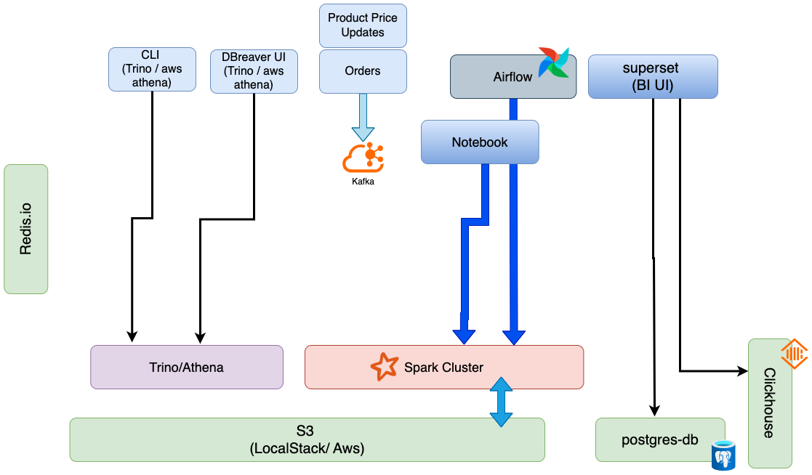
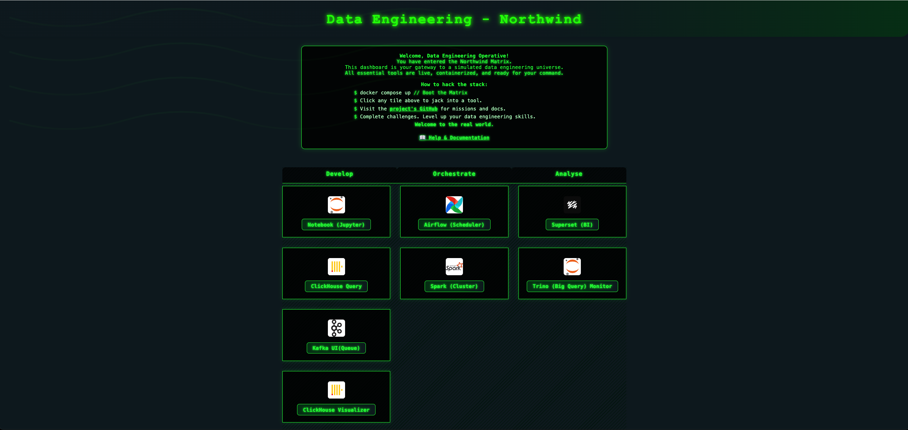

# Databrick Local Simulator


A ready-to-use, containerized Data Engineering learning environment inspired by real-world data pipelines. This project brings together popular open-source tools—such as Airflow, Spark, Kafka, ClickHouse, Superset, Trino, Jupyter, and LocalStack—using Docker Compose for seamless orchestration and hands-on practice.

## Key Features

- **All-in-one Data Engineering Stack:** Pre-configured services for orchestration, processing, analytics, and cloud simulation.
- **Beginner-Friendly Dashboard:** A modern web UI to access and explore each tool, with clear instructions and documentation links.
- **Realistic Data Pipelines:** Sample data, ETL scripts, and workflow DAGs to simulate end-to-end data engineering scenarios.
- **Local AWS Simulation:** Use LocalStack to practice S3 operations and integrate with other services.
- **SQL Analytics & Visualization:** Query data with Trino and visualize insights in Superset.
- **Notebook Development:** Experiment and document your work in Jupyter.

---
## Architecture & Components

<p align="center">
  
</p>

## Quick Start

1. **Clone the repository**
   ```sh
   git clone https://github.com/maarthala/databrick-local-simulator.git
   ```
2. **Start the stack:**  
   ```sh
   # containes docker compose yaml files
   sh env-up.sh
   ```
3. **Open the dashboard:**  



Visit [http://localhost:8000](http://localhost:8000) to access all tools.
Wait for above dashboard page to display.  


To shut down the environment:
```sh
sh env-down.sh
```

> **Note:** When you bring down the stack, all data stored in services like Postgres, ClickHouse, and S3 will be deleted. Only files in the `/stack/code` directory (such as Jupyter notebooks and Airflow DAGs) are persisted across restarts.

To completely clean up Docker resources (including unused images, containers, and volumes):
```sh
docker system prune -a --volumes
```
> **Warning:** This command will remove all unused Docker data on your system, not just for this project.

---

## Included Services

| Tool/Service   | Purpose                | Default URL/Port         | Credentials (if any)      |
|---------------|------------------------|--------------------------|---------------------------|
| Airflow        | Workflow Orchestration | http://localhost:8001    | airflow / airflow         |
| Spark          | Distributed Processing | http://localhost:8002    | N/A                       |
| Kafka UI       | Messaging/Streaming    | http://localhost:8003    | admin / admin             |
| Superset       | BI & Visualization     | http://localhost:8004    | admin / admin             |
| ClickHouse     | OLAP Database          | http://localhost:8005    | default / default         |
| Trino          | SQL Query Engine       | http://localhost:8007    | N/A                       |
| Jupyter        | Notebooks              | http://localhost:8008    | Token: 123456             |
| LocalStack     | AWS Cloud Simulation   | http://localhost:4566    | N/A                       |

See the full port mapping and credentials table below for more details.

---

## Docker Container Port Mapping Table

| Container Name   | Host Port(s)      | Container Port(s)   | Service / Notes        | Credentials (user/pass)    |
|------------------|-------------------|---------------------|------------------------|----------------------------|
| home(nginx)      | 8000              | 80                  | Home Url               | N/A                        |
| airflow          | 8001              | 8080                | Airflow API Server     | airflow / airflow          |
| spark-master     | 8002, 7077        | 8080, 7077          | Spark Master           | N/A                        |
| kafka-ui         | 8003              | 8080                | Kafka UI               | admin / admin              |
| superset         | 8004              | 8088                | Superset               | admin / admin              |
| tabix            | 8005              | 80                  | Tabix                  | N/A                        |
| clickhouse-ui    | 8006              | 8080                | Clickhouse UI          | default / default          |
| trino            | 8007              | 8080                | Trino                  | N/A                        |
| jupyter          | 8008              | 8888                | Jupyter                | Token: 123456              |
| kafka            | 9092, 29092       | 9092, 29092         | Kafka                  | N/A                        |
| clickhouse       | 8123, 9000        | 8123, 9000          | Clickhouse             | default / default / default|
| localstack       | 4566              | 4566                | LocalStack             | N/A                        |
| postgres         | 5432              | 5432                | Postgres               | postgres / postgres        |
| redis            |                   | 6379                | Redis                  | N/A                        |

**Note:**  
- Host ports are shown as published on the host (e.g., `0.0.0.0:8088->8088/tcp` means host port 8088 maps to container port 8088).
- Some containers do not expose ports to the host.
- For containers with multiple ports, all mapped ports are listed.
- Use `docker ps` to see the current mappings.

---

## Service Usage & Examples

### LocalStack: Working with S3 Buckets

You can use the AWS CLI to interact with LocalStack's S3 service just like AWS.

- **Create a New Bucket**
  ```sh
  aws --endpoint-url=http://localhost:4566 s3 mb s3://my-test-bucket
  ```
- **List Buckets**
  ```sh
  aws --endpoint-url=http://localhost:4566 s3 ls
  ```
- **Upload a File to a Bucket**
  ```sh
  aws --endpoint-url=http://localhost:4566 s3 cp testfile.txt s3://my-test-bucket/
  ```
- **Download a File from a Bucket**
  ```sh
  aws --endpoint-url=http://localhost:4566 s3 cp s3://my-test-bucket/testfile.txt downloaded.txt
  ```

You can also use the LocalStack Cloud UI at [https://app.localstack.cloud/](https://app.localstack.cloud/) to view and manage your local S3 buckets.

A demo bucket named `demo-bucket` has already been created, containing two sample Parquet files. You can inspect these files from the command line using `parquet-tools`:

```sh
parquet-tools show --endpoint-url=http://localhost:4566 s3://demo-bucket/northwind/orders.parquet
```

---

### Querying S3 Data with Trino (Athena-like Queries)

To query S3 data in a way similar to AWS Athena, use Trino, which is available at [http://localhost:8007](http://localhost:8007).

- **Running Queries with Trino CLI**
  ```sh
  ./trino --server localhost:8007 --catalog hive --schema default
  ```
  This connects to the `hive` catalog and the `default` schema, allowing you to query data stored in S3 via LocalStack.

---

### Superset

Superset comes pre-configured with connections to both ClickHouse and Hive (via Trino), so you can start exploring and visualizing your data right away.

- **Login:**  
  Username: `admin`  
  Password: `admin`

**Getting Started:**
1. **Create Datasets:**  
   - Navigate to **Data** > **Datasets** in the Superset UI.
   - Click **+ Dataset** and select either the ClickHouse or Hive (Trino) database.
   - Choose a schema and table, then save the dataset.
2. **Explore Data:**  
   - Use the **Explore** feature to build charts and dashboards from your datasets.
   - Leverage Superset’s SQL Lab for ad-hoc queries.
3. **Documentation:**  
   - Refer to the [Superset documentation](https://superset.apache.org/docs/intro) for advanced features and tips.

Start building insightful dashboards and visualizations with your data!

---

### Airflow

A default connection to the Spark cluster is pre-configured:

```
spark://spark-master:7077
```

To add additional Spark connections, run:

```sh
docker exec -it airflow-apiserver airflow connections add 'spark_default_' --conn-type 'spark' --conn-host 'spark://spark-master' --conn-port 7077
```

A sample DAG is included that demonstrates integration with Spark, Hive, and S3. This DAG reads data from an S3 folder, creates a Hive metastore table, and makes it accessible via Trino or Superset.

To run the DAG, use the Airflow UI or trigger it from the CLI.

---

### Jupyter

Jupyter is pre-configured with a sample notebook that demonstrates integration with Spark, Hive, and S3—similar to the Airflow example. You can find this notebook in the `Work` directory within the Jupyter interface.

To get started:
1. Launch Jupyter from the dashboard at [http://localhost:8008](http://localhost:8008) (use token `123456` if prompted).
2. Open the sample notebook in the `Work` directory.
3. Run the cells to verify your environment and explore end-to-end data engineering workflows.

This notebook serves as both a quick environment check and a hands-on learning resource.

---

### ClickHouse

You can interact with ClickHouse using the command line client or through Superset for analytics and visualization.

- **Command Line Access:**
  ```sh
  docker exec -it clickhouse clickhouse-client --user=default --password=default --database=default
  ```
- **Superset Access:**
  - ClickHouse is pre-configured as a database in Superset.
  - Create datasets and explore tables directly from the Superset UI.

Refer to the [ClickHouse documentation](https://clickhouse.com/docs/en/) for advanced usage and SQL reference.

---

## Northwind Data Engineering Challenges

A set of hands-on, real-world challenges is provided to help you practice and demonstrate your data engineering skills using this environment. Each challenge is based on typical business requirements at Northwind Corp, leveraging the streaming, batch, and analytics capabilities of the stack.

**See [`Tasks.md`](./Tasks.md) for the full list of challenges and requirements.**

---

## Learning & Practice

- Follow the dashboard instructions to complete data engineering challenges.
- Use the provided sample data and scripts to build, orchestrate, and analyze pipelines.
- Refer to the [Help & Documentation](https://github.com/maarthala/databrick-local-simulator#readme) for setup, usage, and troubleshooting.

---

