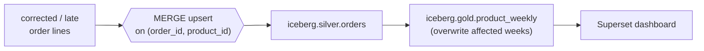

# Capstone 2 (medium)

## Concept
Capstone 1 was a clean, rebuild-every-run metric. Real pipelines are messier: orders get
**corrected or re-sent** (a fixed price, a late arrival for an earlier day). Blindly appending
double-counts; rebuilding everything wastes compute. The professional answer is a **`MERGE`**
(upsert) into Silver, plus rebuilding **only the affected partitions** of Gold.

This capstone builds a governed **product-performance data product** — weekly product revenue that
stays correct under corrected/late orders, with per-user RBAC, idempotent scheduling, and a
Superset dashboard. This is the shape of a real production mart.



## Lab
Recall the grain: `iceberg.silver.orders` is **one row per order line** — key `(order_id,
product_id)` — already enriched with `product_name`, `category`, `quantity`, `unit_price`,
`line_amount`, `order_date` (Unit 4). A corrected or re-sent line shares that key, which is exactly
what `MERGE` keys on. Confirm the grain is clean:

```sql
SELECT order_id, product_id, COUNT(*) AS n
FROM iceberg.silver.orders
GROUP BY order_id, product_id
HAVING COUNT(*) > 1;      -- should return nothing
```

## Challenge
**Project brief — build the governed `product_weekly` data product.**

Deliver a weekly-grain product revenue mart that stays correct under corrected/late order lines,
governed by least-privilege grants, scheduled idempotently, and surfaced in Superset.

### Requirements
1. **Silver upsert (correctness).** Fold each incoming batch of order lines into
   `iceberg.silver.orders` with a `MERGE` keyed on `(order_id, product_id)` — a corrected line
   updates in place; a new one inserts. No duplicates, ever.
2. **Gold weekly mart.** Build `iceberg.gold.product_weekly` at grain **(iso_week, product_name)**
   with columns `iso_week` (e.g. `2026-W36`), `product_name`, `category`, `revenue`, `units`.
3. **Idempotency.** Recompute only the weeks touched by the batch and **overwrite just those
   partitions**, so a re-run is byte-identical and a late line corrects only its week.
4. **RBAC (least privilege).** In Unity Catalog, **engineer** works in `silver`; **analyst**
   (analyst) gets `SELECT` on **`gold` only**. Define both; note where enforcement lives.
5. **Airflow.** Schedule it (`@weekly`, or a weekly rollup task on the `@daily` DAG),
   `catchup=False`, idempotent re-runs.
6. **Superset.** A **Product Performance** dashboard reading `gold.product_weekly`: weekly revenue
   trend, top categories, and a week filter.

### Acceptance criteria
- `iceberg.silver.orders` has **exactly one row per `(order_id, product_id)`** after any number of
  re-runs.
- Injecting a **corrected line** and re-running updates that week's `revenue`/`units` in
  `gold.product_weekly` with **no duplicate `(iso_week, product_name)` rows**.
- Re-triggering the same run produces an identical mart (idempotent).
- The analyst grant on `gold` and the engineer grant on `silver` are defined in UC.
- The dashboard renders from Gold only.

### Hints
- `MERGE INTO … ON t.order_id=s.order_id AND t.product_id=s.product_id WHEN MATCHED THEN UPDATE
  SET * WHEN NOT MATCHED THEN INSERT *` is the whole trick — the [2.6](../unit2/merge.md) /
  [4.3](../unit4/transform-silver.md) skill applied to a data product.
- Derive `iso_week` with `concat(year(order_date), '-W', lpad(weekofyear(order_date), 2, '0'))`.
- Iceberg's **`writeTo(...).overwritePartitions()`** replaces exactly the partitions present in
  your DataFrame — recompute the touched weeks, write them, and only those partitions change.

??? note "Solution outline"

    **1 — Silver as an upsert (handles corrected / late lines):**

        # a cleaned batch of order lines (same schema as silver.orders), keyed (order_id, product_id)
        batch.createOrReplaceTempView("incoming")
        spark.sql("""
          MERGE INTO iceberg.silver.orders t
          USING incoming s
          ON  t.order_id = s.order_id AND t.product_id = s.product_id
          WHEN MATCHED THEN UPDATE SET *      -- corrected/late line overwrites the row
          WHEN NOT MATCHED THEN INSERT *
        """)

    Re-sent lines share the key, so `MERGE` corrects them in place — that's what guarantees "one
    row per (order_id, product_id)" no matter how often you re-run.

    **2 — Gold weekly mart, overwrite only affected weeks:**

        from pyspark.sql import functions as F

        weekly = (
            spark.table("iceberg.silver.orders")
            .where(F.col("status") == "delivered")
            .withColumn("iso_week",
                F.concat(F.year("order_date"), F.lit("-W"),
                         F.lpad(F.weekofyear("order_date"), 2, "0")))
            .groupBy("iso_week", "product_name", "category")
            .agg(F.sum("line_amount").alias("revenue"),
                 F.sum("quantity").alias("units"))
        )

        # first run creates the partitioned table…
        weekly.writeTo("iceberg.gold.product_weekly").using("iceberg") \
              .partitionedBy("iso_week").createOrReplace()

        # …subsequent runs recompute touched weeks and overwrite just those partitions:
        # weekly_affected.writeTo("iceberg.gold.product_weekly").overwritePartitions()

    `overwritePartitions()` rewrites only the ISO weeks present in the DataFrame — a late line for
    `2026-W35` recomputes only that week. Same input → same partition contents (idempotent), no
    duplicate `(iso_week, product_name)` rows.

    **3 — RBAC, two blast radii (Unity Catalog, from Unit 6; per-user in UC OSS):**

        # engineer works in silver
        uc --server $UC --auth_token "$ADMIN" permission create --securable_type schema \
          --name shopflow.silver --privilege "USE SCHEMA" --principal engineer@dev-epireum.com
        # analyst reads gold only — least privilege
        uc --server $UC --auth_token "$ADMIN" permission create --securable_type schema \
          --name shopflow.gold --privilege SELECT --principal analyst@dev-epireum.com

    This defines the least-privilege policy. On managed **Databricks Unity Catalog** the engines
    enforce it automatically (and you'd grant **groups**, not users); on this OSS stack it records
    the intent — see the honest note in [6.2](../unit6/rbac.md). (UC OSS has no roles/groups.)

    **4 — Airflow, idempotent + no catchup:**

        with DAG(dag_id="shopflow_product_weekly", schedule="@weekly",
                 catchup=False, start_date=pendulum.datetime(2026, 1, 1, tz="UTC")) as dag:
            silver = BashOperator(task_id="silver", bash_command=spark_job("build_silver.py"))
            product_weekly = BashOperator(task_id="product_weekly",
                                          bash_command=spark_job("build_product_weekly.py"))
            silver >> product_weekly

    `catchup=False` avoids a backfill stampede; both jobs are idempotent (MERGE + overwrite
    partitions), so re-running any week is safe.

    **5 — Superset (Gold only):** Dataset on `gold.product_weekly` → Line (SUM(revenue) by
    `iso_week`), Bar (revenue by `category`), a week filter. Dashboard "ShopFlow — Product
    Performance".

    **Prove late-data handling:** note a week's revenue, MERGE a corrected line for that week into
    Silver, re-run `product_weekly`, and confirm the week's revenue changed with **no** duplicate
    `(iso_week, product_name)` rows.

!!! tip "🎯 The same data-product patterns on Azure, Databricks, Snowflake & Fabric"
    **What you just did:** a governed `product_weekly` data product that stays correct under
    corrected/late data — a Silver `MERGE` upsert, partition-overwrite of affected weeks, two-user
    least-privilege grants, idempotent scheduling, and a Gold-only dashboard.

    - **Upsert (the crux):** your `MERGE INTO … WHEN MATCHED/NOT MATCHED` is **Delta `MERGE`**
      verbatim on **Databricks/Fabric**; in ADF it's a Mapping Data Flow **Alter Row (upsert)**.
    - **Affected-partition overwrite:** Iceberg `overwritePartitions()` ↔ Delta **`replaceWhere`**.
    - **Govern:** engineer-Silver / analyst-Gold is the same **Unity Catalog `GRANT`** (groups on
      Databricks) / role `GRANT` (Snowflake) / Purview + Entra (Fabric).
    - **Schedule + reprocess:** the `catchup=False` DAG → **Databricks Workflows** / **ADF
      Tumbling-Window** for bounded, idempotent backfills.
    - **Snowflake:** `MERGE INTO` (often via **Streams**) upserts Silver, **Dynamic Tables** rebuild
      affected weeks, roles `GRANT` the two blast radii, **Snowsight**/Power BI charts Gold.

    Idempotency, late data, and least privilege are the DE judgment every vendor assumes you have.

## You can now…
- Handle corrected / late order lines with a `MERGE` upsert keyed on the natural key
- Build an idempotent Gold mart that overwrites only affected partitions
- Design a governed data product: least-privilege grants, safe scheduling, and BI over Gold
