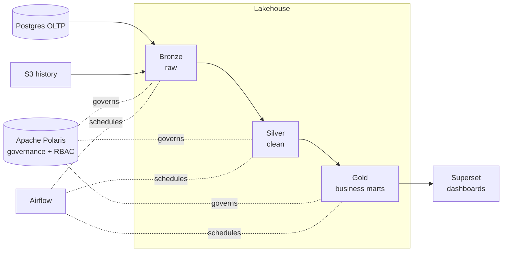

# Data Engineering — hands-on with a governed lakehouse

Learn Data Engineering the way it's actually practiced: by **building a real data
pipeline** for a fictional e-commerce company, **ShopFlow**, on a lakehouse you run
yourself — object storage, a governed catalog, Spark, SQL, orchestration, and BI.

By the end you'll have built this, end to end:

## Start here

-   📦 **Meet ShopFlow**

    ---

    The company, its data, and the questions the pipeline has to answer.

    [The scenario →](scenario.md)

-   🚀 **Get the stack running**

    ---

    You're reading this *on* the stack — but here's how to bring it up yourself.

    [Prerequisites & setup →](setup/prerequisites.md)

-   🗺️ **See how it's wired**

    ---

    The tools, how data moves, and the deployment map.

    [Stack architecture →](unit0/architecture.md)

-   ▶️ **Begin the course**

    ---

    Start with the foundations — what DE is and the lakehouse idea.

    [Unit 1 →](unit1/what-is-de.md)

## The path

1. **[The ShopFlow scenario](scenario.md)** — the company and its data
2. **[Architecture](unit0/architecture.md)** — the tools, the [schema](unit0/schema.md), and the [full stack](unit0/stack.md)
3. **Foundations → SQL → Python → Spark → Orchestration → Governance → BI** — the seven units
4. **Two capstone projects** to prove it all
5. **[Bridge to the platforms](platforms/rosetta.md)** — your OSS ⇄ cloud dictionary

Stuck at any point? The **[Help & community](help.md)** page has our Discord.

## How each lesson works

Every lesson follows the same rhythm:

1. **Concept** — the idea and why it matters
2. **Lab** — copy-runnable steps on your own stack
3. **Challenge** — you solve a variation (solutions provided, hidden — try first!)
4. **You can now…** — the concrete skills you've gained

## Why open-source first (your cloud rehearsal)

We learn on a **free, open-source stack on purpose.** Every concept — ingestion,
Iceberg tables, Spark transforms, SQL, orchestration, catalog governance, BI — is the
*same* on the cloud platforms; only the buttons and the bill change. So you practice
here for **$0**, then re-implement the very same ShopFlow pipeline on **Azure Data
Factory**, **Databricks**, **Fabric**, and **Snowflake** already fluent — spending
cloud money on the managed layer, not on relearning the basics.

!!! abstract "🎯 This maps 1:1 to the cloud platforms"
    Most lessons end with a box titled **"This runs unchanged on Azure, Databricks,
    Snowflake & Fabric"** — mapping the *exact activity* you just did to the feature that
    does it on each platform (e.g. *this MERGE = ADF Data Flow "Alter Row" = Databricks
    `MERGE INTO` = Snowflake `MERGE`*).

    The governance model here (**Apache Polaris** — Iceberg-native, maps to **Snowflake
    Open Catalog**) is *identical in shape* to Databricks **Unity Catalog** (catalog →
    schema → table with RBAC), and **Medallion** (Bronze/Silver/Gold) is Databricks'
    own terminology — so parts of this course are already Databricks & Snowflake, verbatim.

## Prerequisites

Basic SQL helps but isn't required. No prior Spark, cloud, or DE experience needed.
The stack you're reading this on is already running — get oriented with the
**[stack architecture](unit0/architecture.md)** before the first unit.
