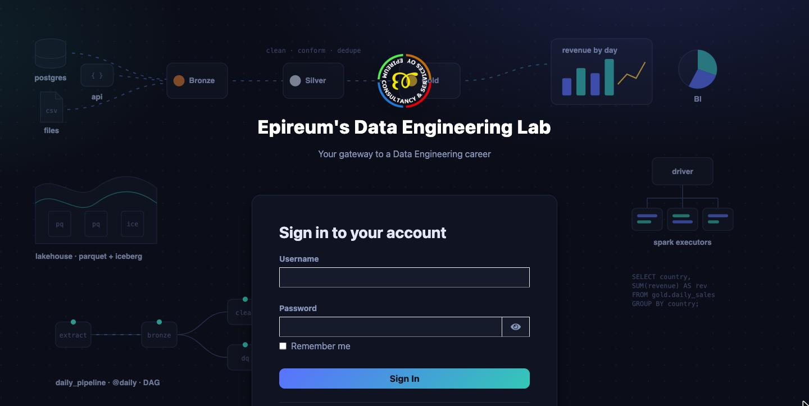
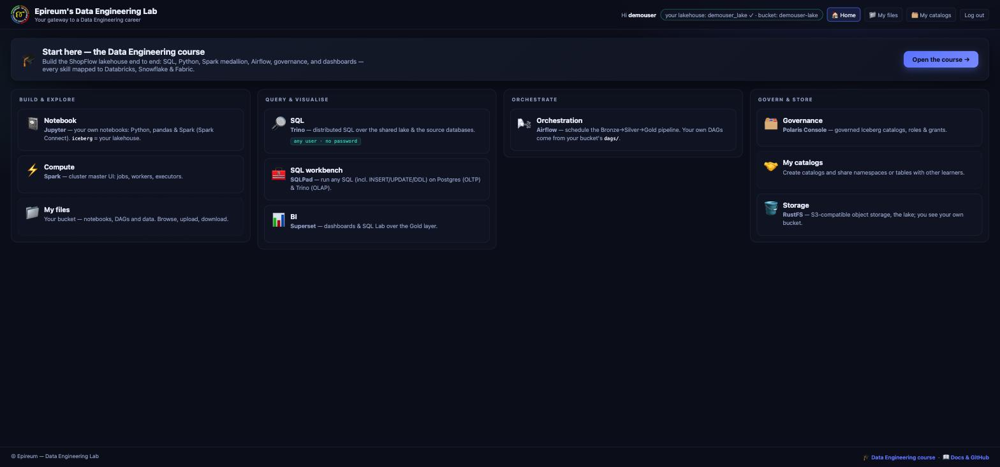
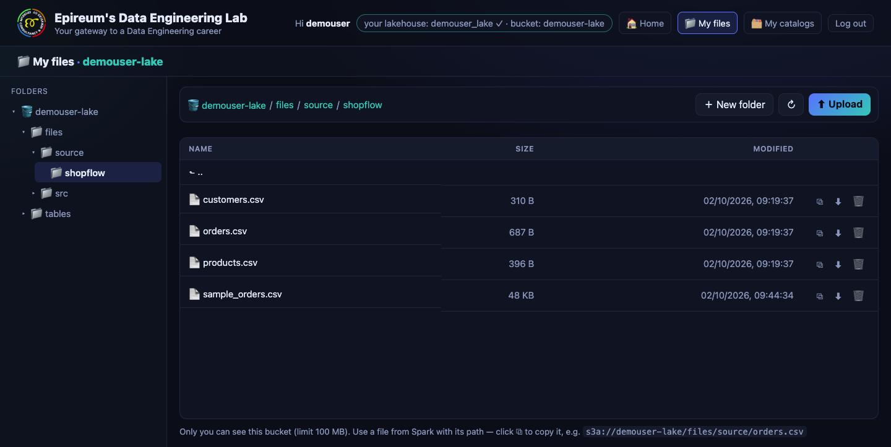
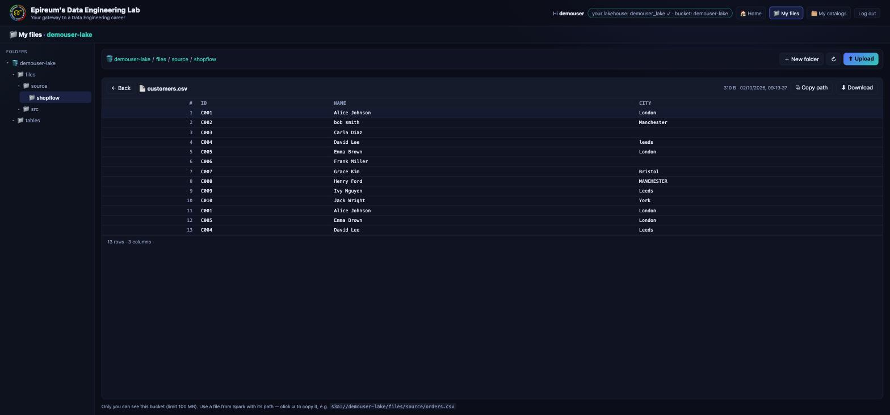
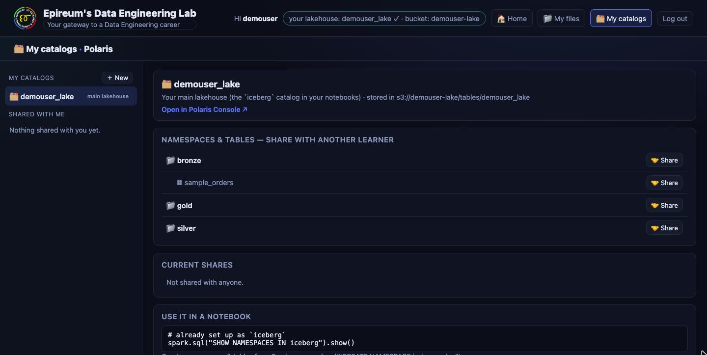

# Epireum's Data Engineering Lab

**A complete data platform on your laptop.**

**Epireum's Data Engineering Lab** is a real, company-style data platform — object storage, a
governed lakehouse, Spark, SQL, orchestration and BI — that runs on your own machine with one
command. Clone it, sign in, and you're working the way a data engineer works at a real company:
your own workspace, shared company data, and everything behind one login.

[⬇ Get the lab (GitHub)](https://github.com/maarthala/databrick-local-simulator){ .md-button .md-button--primary }
[▶ Start the course](setup/prerequisites.md){ .md-button }
[📚 Course overview](course.md){ .md-button }
[💬 Join the Discord](https://discord.gg/2B5mTgGjM){ .md-button }

## Highlights — learn it here, use it on Fabric, Databricks & Snowflake

Cloud platforms charge by the hour, and their free tiers run out before you've really learned
anything. This lab gives you the **same building blocks** — a lakehouse, Spark, SQL warehouses,
pipelines, governance and BI — on your own machine, free and with no time limit. Learn the
concepts properly here, then walk into **Microsoft Fabric, Databricks or Snowflake** already knowing
*why* things work, not just which button to press.

<div class="grid cards" markdown>

-   🚀 **Upskill for the cloud platforms**

    ---

    Every lesson ends with how the same thing works on **Databricks, Snowflake, Fabric** and Azure.
    Medallion, Delta/Iceberg tables, catalogs and grants, notebooks, jobs and dashboards — you
    practise the ideas those platforms are built on.

-   🧮 **Practise SQL like at work — OLTP and OLAP**

    ---

    **OLTP**: query real operational databases (PostgreSQL — the ShopFlow shop and AdventureWorks),
    read-only like production, in **SQLPad**. **OLAP**: run big joins, window functions and CTEs
    over the lakehouse with **Trino**, and write your own tables there with `INSERT` / `UPDATE` /
    `MERGE`. Each SQL lesson shows the **T-SQL** (Fabric
    Warehouse / Synapse), Spark SQL and Snowflake version too.

-   🧊 **A governed lakehouse**

    ---

    Apache Iceberg tables in object storage, governed by **Apache Polaris** — catalogs, schemas,
    grants and sharing: the same model as the Databricks catalog and Snowflake roles.

-   🏢 **Works like a company platform**

    ---

    One sign-in for every tool, your own workspace, shared company data, and roles — members
    and a `manager` who administers everyone. The same shape you'll meet at work.

-   ⚡ **The tools teams actually use**

    ---

    **Spark** in **Jupyter**, **Trino** for SQL, **Airflow** for pipelines, **Superset** for
    dashboards, **SQLPad** for quick SQL — wired together, nothing to configure.

-   💸 **Free, open source, offline**

    ---

    Runs on Docker on your laptop (or Kubernetes for a class). No cloud account, no credit card,
    no surprise bill — break things and start again for free.

</div>

### Same skills, different logo

What you use here, and what it's called on the platforms you're aiming for:

| You practise here | Microsoft Fabric | Databricks | Snowflake |
|---|---|---|---|
| Object storage + **Iceberg** tables | **OneLake** + Delta tables | cloud storage + **Delta Lake** | managed storage, Iceberg tables |
| **Polaris** catalogs, grants, sharing | Fabric workspace roles + OneLake security, Purview | the **Databricks catalog** | databases, schemas, **RBAC roles** |
| Jupyter + **Spark** | Fabric **notebooks** (Spark) | Databricks **notebooks** | **Snowpark** |
| **Trino** — analytical SQL (OLAP) | **SQL analytics endpoint / Warehouse** (T-SQL) | **SQL Warehouse** | virtual **Warehouse** |
| **PostgreSQL** + SQLPad — operational SQL (OLTP) | **SQL database** in Fabric (T-SQL) | **Lakebase** (Postgres) | **Hybrid tables** |
| **Airflow** DAGs | **Data Factory** pipelines | **Workflows / Jobs** | **Tasks** |
| **Superset** dashboards | **Power BI** | AI/BI **dashboards** | **Snowsight** |
| Bronze → Silver → Gold | medallion on OneLake | medallion (their term) | raw → staging → marts |

The full map, with what's *different* on managed platforms, is in
[10.1 OSS ⇄ Databricks / Snowflake / Fabric / Azure](platforms/rosetta.md).

## A quick tour

### 1 · One sign-in for everything
Every tool — Jupyter, Airflow, Superset, SQLPad, the Polaris Console and the storage console —
uses the same **lab account**. On your laptop, sign in as `demouser` / `demouser` (every course
example is written for it), or **Register** your own.



### 2 · The home page — your platform at a glance
After signing in you land on the lab home: the tools grouped the way a data team thinks about
them — **Build & explore** (notebooks, Spark, SQL), **Pipelines** (Airflow), **Visualize**
(Superset) and **Lakehouse** (your files, catalogs and storage). The header shows who you are and
your own lakehouse and bucket.



### 3 · My files — your own bucket
Your code and data live in **your own bucket**, laid out like a Microsoft Fabric lakehouse:
`files/src` (notebooks and DAGs — synced with Jupyter and picked up by Airflow), `files/source`
(raw files to ingest) and `tables/` (your lakehouse tables). Upload, download, and copy a file's
path straight into Spark.



Click any file to **view it in place** — CSVs as a table, notebooks cell by cell, code as text:



### 4 · My catalogs — your lakehouse, and sharing
Your lakehouse is a governed **Polaris catalog** with `bronze` / `silver` / `gold` namespaces
and a sample table ready to query. Create more catalogs, and **share** a namespace or a single
table — read or write — with a teammate. Polaris enforces it on every query
([6.1](unit6/polaris.md)).



## Who is it for?

<div class="grid cards" markdown>

-   👤 **Individuals**

    ---

    - **Career-changers and students** — learn data engineering end to end, hands-on, for free.
    - **Analysts and developers moving into DE** — go from SQL to Spark, pipelines and governance.
    - **Engineers preparing for Databricks, Snowflake or Fabric** — learn the concepts on open
      source first; every lesson shows the cloud equivalent.
    - **Interview prep and portfolio** — build a real medallion pipeline and dashboard you can
      show and explain.

-   👥 **Teams**

    ---

    - **Trainers and bootcamps** — run a class on Kubernetes: every member gets their own
      workspace, and the `manager` account sees and supports everyone.
    - **Companies onboarding data engineers** — a safe sandbox with the same shape as your
      production platform.
    - **Platform and data teams** — prototype governance, sharing and pipeline patterns
      before you build them in the cloud.
    - **Study groups** — share tables with each other and review each other's pipelines.

</div>

## What's inside

| Layer | Tool | What you do with it |
|---|---|---|
| Accounts | **Keycloak** | one sign-in for every tool; member and manager roles |
| Storage | **S3-compatible object storage** (RustFS) | your bucket — raw files, code and table data |
| Catalog & governance | **Apache Polaris** (Iceberg REST) | your lakehouse, grants, sharing, credential vending |
| Notebooks & compute | **Jupyter** + **Spark** (Spark Connect) | Python, pandas and Spark — Bronze → Silver → Gold |
| SQL | **Trino** · **SQLPad** | distributed SQL over the lake and the source databases |
| Orchestration | **Apache Airflow** | schedule your pipelines — DAGs straight from your bucket |
| BI | **Apache Superset** | dashboards over your Gold tables |
| Sources | **PostgreSQL** | ShopFlow (the course's online shop) and AdventureWorks |

## Get it running

You need Docker with **8 GB** of memory (12–16 GB is comfortable) and about **25 GB** of disk.

```bash
git clone https://github.com/maarthala/databrick-local-simulator.git
cd databrick-local-simulator/local
cp .env.example .env
make init      # first run only: downloads Spark/Iceberg jars
make up        # builds and starts the whole lab
```

Then open **<http://localhost:8000>** and sign in as `demouser` / `demouser`. The full walkthrough
— including what to do if something doesn't start — is in [0.2 Bring up the stack](setup/deploy.md).

## Stuck? Get help on Discord

Join our **Discord** to get help with setup or a lesson, share what you built, and meet other
learners and data engineers. When you ask, include which lesson or tool, what you ran, and the
error — it gets you an answer faster.

[💬 Join the Discord → discord.gg/2B5mTgGjM](https://discord.gg/2B5mTgGjM){ .md-button .md-button--primary }
