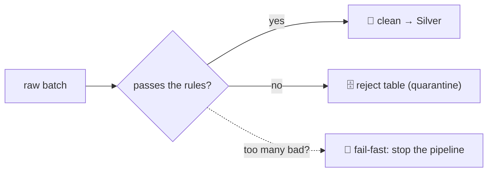

# 8.4 Data quality checks and quarantine

## Concept
Raw data lies. A feed will hand you a missing country, a negative amount, a duplicated key —
and if you promote that straight into Silver, every downstream number inherits the rot. **Data
quality** is the habit of *checking data against expectations before you trust it*. The place to
check is the boundary between layers: **Bronze → Silver** ([4.3](../unit4/transform-silver.md)).
Bronze is a faithful copy of the raw feed (warts and all); the gate to Silver is where you decide
what's actually good enough to build on.

An **expectation** is a rule your data should satisfy — "country must be present", "amount must
be positive". You encode each rule as a **`filter`** condition, then split the batch in two: the
rows that pass, and the rows that don't. What you do with the failures is a design choice, and
there are two classic strategies:



- **Quarantine / isolate** — send the bad rows to a **reject table** and let the good rows flow
  on. Nothing is silently dropped: good data still lands, and you keep the rejects to inspect,
  count, and (once you understand them) fix and reprocess. This is the default — it maximizes the
  data that keeps moving.
- **Fail-fast** — if *too much* of the batch is broken, don't promote a half-built table at all;
  **stop the pipeline** and page a human. A 2% reject rate is normal noise; a 60% reject rate
  usually means the upstream feed changed shape, and quietly loading the 40% would be worse than
  loading nothing.

Both strategies lean on one Spark **action**: **`count()`**. Most DataFrame operations are *lazy*
(they just build a recipe); `count()` forces the recipe to run and returns a number — which is
exactly what you need to *measure* quality and decide.

## Lab
Assume the `spark` session (Spark Connect) and the `iceberg` catalog from Unit 4.

### 1 · Encode the rules and split the batch
We start with a tiny raw batch that has two deliberately bad rows — one with a missing `country`,
one with a negative `amount` — so we can watch the split happen:

```python
# a raw batch with two bad rows: a missing country and a negative amount
src = spark.createDataFrame(
    [(1,'US',100.0), (2,None,50.0), (3,'UK',-5.0), (4,'IN',20.0)],
    ['id','country','amount'])

# the rules: country must be present, amount must be positive
bad  = src.filter("country IS NULL OR amount <= 0")
good = src.filter("country IS NOT NULL AND amount > 0")
print("passed:", good.count(), " quarantined:", bad.count())
```

**Read it step by step:**

- **`spark.createDataFrame([...], ['id','country','amount'])`** — builds a small DataFrame from
  Python literals so we control exactly which rows are bad. Row `2` has `None` for `country` (a
  **NULL** — see [2.5](../unit2/conditional.md)); row `3` has a negative `amount`. Rows `1` and
  `4` are clean.
- **`bad = src.filter("country IS NULL OR amount <= 0")`** — **`filter`** keeps only the rows that
  match a condition; here the condition is the *negation* of our expectations, so `bad` collects
  the rejects. We pass the rule as a **SQL string** — Spark accepts a SQL predicate directly,
  which reads like the business rule it encodes. `OR` means a row is bad if **either** check fails.
  NULL handling matters: `country IS NULL` is how you test for a missing value (you can't use
  `= NULL`; see [conditional logic](../unit2/conditional.md)).
- **`good = src.filter("country IS NOT NULL AND amount > 0")`** — the complement: a row is good
  only when it passes **every** rule (`AND`). Keeping `good` and `bad` as two explicit, mutually
  exclusive filters makes the intent obvious and guarantees no row lands in both.
- **`print("passed:", good.count(), " quarantined:", bad.count())`** — **`count()`** is an
  **action**: it runs each filter and returns a row count. Everything before this was lazy; this
  line is where Spark actually does the work. You'll see `passed: 2  quarantined: 2`.

!!! info "Why the rules live in a `filter`, not in your head"
    An expectation is only real when it's **executable**. Writing `amount > 0` as a `filter`
    turns "amounts should be positive" from a comment into a check the engine enforces every run,
    on every row — and produces a *countable* set of violations you can monitor over time.

### 2 · Land the clean rows, quarantine the rejects
Now persist the split. Good rows become a clean Silver-bound table; bad rows go to their own
**reject table** so they're preserved for inspection instead of thrown away:

```python
spark.sql("CREATE SCHEMA IF NOT EXISTS iceberg.recipes")
good.writeTo("iceberg.recipes.orders_clean").using("iceberg").createOrReplace()
bad.writeTo("iceberg.recipes.orders_reject").using("iceberg").createOrReplace()
```

**Read it step by step:**

- **`spark.sql("CREATE SCHEMA IF NOT EXISTS iceberg.recipes")`** — make the `recipes` namespace
  inside the `iceberg` catalog if it doesn't exist, so our two tables have a home. `IF NOT EXISTS`
  keeps the cell safe to re-run.
- **`good.writeTo("iceberg.recipes.orders_clean").using("iceberg").createOrReplace()`** — persist
  the passing rows as an **Iceberg** table (the governed lakehouse format from
  [4.3](../unit4/transform-silver.md)). **`createOrReplace`** is *idempotent* — re-running the
  notebook rebuilds the table cleanly instead of appending duplicates.
- **`bad.writeTo("iceberg.recipes.orders_reject").using("iceberg").createOrReplace()`** — the same
  write, aimed at a separate **reject table**. This is the whole quarantine idea in one line: the
  bad rows aren't discarded, they're *isolated* somewhere you can query them, spot patterns, fix
  the source, and reprocess later. Good data flowed on regardless.

!!! tip "The reject table is a feature, not a graveyard"
    A quarantine table you never look at is just a slow leak. Query it: `SELECT * FROM
    iceberg.recipes.orders_reject`. In production you'd alert on its size, review the top failure
    reasons, and — once the upstream bug is fixed — reprocess the rescued rows back into Silver.

### 3 · Add a fail-fast gate
Isolating a few bad rows is fine. But if the batch is *mostly* broken, promoting the small good
remainder can be worse than doing nothing. A **fail-fast gate** measures the reject rate and
**stops the pipeline** when it crosses a threshold:

```python
reject_rate = bad.count() / src.count()
assert reject_rate < 0.75, f"Too many bad rows ({reject_rate:.0%}) — stopping the pipeline"
print(f"reject rate {reject_rate:.0%} within tolerance — promoting to Silver")
```

**Read it step by step:**

- **`reject_rate = bad.count() / src.count()`** — two `count()` **actions** give the fraction of
  the batch that failed. Here it's `2 / 4 = 0.5` — a **50%** reject rate.
- **`assert reject_rate < 0.75, "…"`** — plain Python: **`assert`** raises an
  `AssertionError` (with your message) *unless* the condition holds. This is the gate. With the
  threshold at `0.75`, a 50% reject rate passes — the pipeline continues. Tighten the bar to,
  say, `assert reject_rate < 0.25` and this same batch would **stop** the run, because 50% now
  exceeds tolerance. That's the fail-fast lever: you choose how much brokenness is tolerable.
- **`print(f"reject rate {reject_rate:.0%} within tolerance — promoting to Silver")`** — only
  reached if the assert passed, so it's your "green light" to promote the clean table onward.

!!! info "Quarantine *and* fail-fast — not either/or"
    The two strategies compose. In a real job you **quarantine every batch** (so good rows always
    flow and rejects are always preserved), *and* wrap a **fail-fast assert** around it as a
    circuit-breaker for the day the feed goes badly wrong. Quarantine handles the normal trickle
    of bad rows; fail-fast handles the catastrophe.

## Challenge
Harden the gate with three upgrades:

1. **Tag each reject with the *reason* it failed** — instead of one undifferentiated `bad`
   table, add a `reason` column (`"missing_country"`, `"non_positive_amount"`, …) so you can
   count failures by cause.
2. **Referential integrity** — add a rule that each row's `country` must exist in a small
   `dim_country` reference set; reject rows whose country is unknown.
3. **A row-count-delta check** — compare today's clean row count against yesterday's and
   **fail-fast** if the volume dropped by more than 50% (a classic "the feed is half-empty"
   alarm).

??? note "Solution"
    ```python
    from pyspark.sql import functions as F

    # 1 · tag each reject with a reason (a row can fail more than one rule)
    tagged = src.withColumn(
        "reason",
        F.concat_ws(",",
            F.when(F.col("country").isNull(), F.lit("missing_country")),
            F.when(F.col("amount") <= 0,      F.lit("non_positive_amount")),
        ),
    )
    rejects = tagged.filter("reason <> ''")
    rejects.groupBy("reason").count().show()          # failures by cause

    # 2 · referential integrity: country must exist in dim_country
    dim_country = spark.createDataFrame([('US',),('UK',),('IN',)], ['country'])
    known = [r.country for r in dim_country.collect()]
    ref_bad = good.filter(~F.col("country").isin(known))   # e.g. would catch 'DE'
    print("unknown-country rejects:", ref_bad.count())

    # 3 · row-count-delta fail-fast vs yesterday
    today = good.count()
    yesterday = spark.table("iceberg.recipes.orders_clean").count()  # last good run
    assert today >= 0.5 * yesterday, \
        f"Volume dropped {1 - today/yesterday:.0%} vs yesterday — feed may be broken"
    ```
    **Read it step by step:**

    - **`F.when(cond, F.lit("..."))`** returns the label when a rule fails, else `NULL`;
      **`F.concat_ws(",", ...)`** joins the non-NULL labels, so a row failing two rules gets
      `"missing_country,non_positive_amount"`. **`filter("reason <> ''")`** keeps only rows with
      at least one failure, and **`groupBy("reason").count()`** gives failures *by cause* — the
      report that tells you *which* rule is firing most.
    - **Referential integrity**: collect the valid keys from `dim_country`, then
      **`~F.col("country").isin(known)`** rejects any row whose country isn't in the reference set
      (`~` = "not"). This is how you catch a value that's *present and positive* but still invalid.
    - **Row-count-delta**: compare today's clean count to the last good run's; the **`assert`**
      fails fast if volume more than halved — the same circuit-breaker pattern as the Lab, but
      guarding *quantity* instead of *quality*.

!!! tip "🎯 The same idea on Databricks, Azure Data Factory & Fabric"
    **What you just did:** encoded expectations as filters, quarantined violations into a reject
    table, and added a fail-fast gate on the reject rate — the standard Bronze→Silver quality step.

    - **Azure Databricks** — **Delta Live Tables** make this declarative: attach **`EXPECT`**
      expectations to a table and set the action — **`ON VIOLATION DROP ROW`** (quarantine-style
      drop) or **`FAIL UPDATE`** (fail-fast). DLT tracks pass/fail counts for you.
    - **Azure Data Factory** — the Mapping Data Flow **Assert** transformation encodes each
      expectation; failing rows route to a separate sink (your reject table) or error the run.
    - **Microsoft Fabric** — the same DLT-style expectations in Fabric Spark, plus notebook-based
      quality tooling like **Great Expectations** for richer rule suites and data docs.

    Check-before-you-promote is a cross-platform convention — only the syntax changes.

## Key terms, at a glance
| Term | Plain meaning |
|---|---|
| **Data quality** | Checking data against expectations before you trust it |
| **Expectation / rule** | A condition data should satisfy (e.g. `amount > 0`), written as a `filter` |
| **Quarantine / reject table** | Isolate bad rows into their own table; good rows still flow |
| **Fail-fast** | Stop the pipeline when too much of a batch is broken |
| **Reject rate** | Fraction of a batch that failed the rules (`bad / total`) |
| **`filter`** | Keep only rows matching a condition — used to split good vs bad |
| **`IS NULL` / `IS NOT NULL`** | Test for a missing value ([2.5](../unit2/conditional.md)) |
| **`count()`** | An **action** — runs the recipe and returns a row count |
| **Action vs lazy** | Most ops build a recipe; an action forces it to run |
| **`assert`** | Plain Python — raise unless a condition holds; the fail-fast gate |
| **Referential integrity** | A key must exist in a reference/dimension table |
| **`writeTo` … `createOrReplace`** | Persist a DataFrame as an Iceberg table, idempotently |

## You can now…
- Encode data-quality expectations as `filter` rules and split a batch into good vs bad
- Quarantine rejects into a reject table so good data keeps flowing and bad rows stay inspectable
- Add a fail-fast `assert` gate on the reject rate to stop a pipeline when a feed goes wrong
