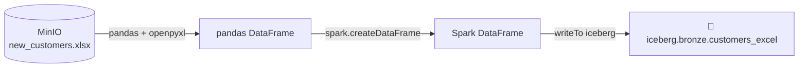

# 8.1 Ingest an Excel file from object storage

## Concept
Not every source is a database or a Parquet file. The real world runs on **spreadsheets** —
a finance export, a partner's customer list, a hand-maintained mapping table. Sooner or later
someone drops an `.xlsx` in a bucket and asks you to get it into the lakehouse. This recipe lands
one as a **Bronze** table (raw, as-received — see [4.2](../unit4/read-bronze.md)).

The catch: **Spark can't read Excel natively.** There's no `spark.read.excel(...)` on this stack —
`.xlsx` is a zipped bundle of XML, not a columnar data format Spark understands. The clean,
dependency-light way is a two-step hop:



**pandas** *can* read Excel — via the **openpyxl** engine — so you read the file into a **pandas
DataFrame**, convert that to a **Spark DataFrame**, then land it in Bronze with the exact write
pattern from Unit 4. Excel files are small (they open in a spreadsheet, after all), so pulling one
through pandas on the driver is perfectly fine — you're not streaming a billion rows.

!!! info "Why the pandas detour is the right call here"
    Spark shines on *big, splittable* file formats (Parquet, CSV, JSON) it can read in parallel
    across the cluster. Excel is neither big nor splittable — it's a single-author office file. So
    instead of fighting Spark, you let **pandas + openpyxl** do the one thing they're great at
    (parsing `.xlsx`), then hand the tidy result to Spark for the part *it's* great at: storing it
    as a governed lakehouse table other engines can query.

### Reaching object storage from pandas
Spark uses `s3a://…` to reach MinIO. pandas uses a different door: the **s3fs** library, which
teaches pandas to open `s3://…` URLs. You pass it the MinIO credentials and endpoint through a
`storage_options` dict, and pandas hands that straight to s3fs. Same bucket, same object — just a
different client on the driver side.

## Lab
Run this in a **Jupyter notebook** (it talks to the cluster over **Spark Connect**). Three cells.

### Cell A — connect + config
```python
import pandas as pd
from pyspark.sql import SparkSession
spark = SparkSession.builder.getOrCreate()

# MinIO S3 credentials for pandas (s3fs handles s3:// URLs). Inside the stack MinIO is http://minio:9000.
storage = {"key": "minioadmin", "secret": "minioadmin",
           "client_kwargs": {"endpoint_url": "http://minio:9000"}}
xlsx = "s3://demo-bucket/uploads/new_customers.xlsx"
```

**Read it step by step:**

- **`import pandas as pd`** — pandas is the single-machine DataFrame library that *can* parse
  Excel. `pd` is the conventional alias.
- **`SparkSession.builder.getOrCreate()`** — grab (or create) your handle to the Spark cluster.
  Over Spark Connect this attaches to the running cluster; the object named `spark` is how you talk
  to it, exactly as in [4.1](../unit4/fundamentals.md).
- **`storage = {…}`** — the credentials + endpoint pandas needs to reach MinIO. **`key`** /
  **`secret`** are the MinIO access keys; **`client_kwargs.endpoint_url`** points at MinIO's
  in-stack address, `http://minio:9000` (not AWS's real S3). This dict is what makes `s3://…`
  URLs resolvable from the driver.
- **`xlsx = "s3://…"`** — the object-storage path to the spreadsheet, as an `s3://` URL (the door
  **s3fs** opens — Spark's own reads use `s3a://` instead).

*Produces:* no data yet — just the `spark` handle, the `storage` creds, and the target path.

!!! note "Needs `openpyxl` + `s3fs` — already baked in"
    Reading `.xlsx` from `s3://` needs two libraries on the **driver**: **openpyxl** (pandas'
    engine for parsing Excel) and **s3fs** (so pandas can open `s3://` URLs). Both are already
    installed in this stack's **Jupyter image**, so there's nothing to `pip install` — the cells
    below just work.

### Cell B — create a sample Excel upload (setup)
So the lab is self-contained, first *write* a small spreadsheet into the bucket. In real life this
file would already be there — someone uploaded it — so treat this cell as the "someone" who did:

```python
pd.DataFrame({"customer_id": [9001, 9002, 9003],
              "full_name": ["Ada Byte", "Ravi Kumar", "Mei Chen"],
              "country": ["UK", "IN", "SG"]}
             ).to_excel(xlsx, index=False, storage_options=storage)
```

**Read it step by step:**

- **`pd.DataFrame({…})`** — build a pandas DataFrame from a dict of columns: three customers with
  an id, a name, and a country.
- **`.to_excel(xlsx, …)`** — write that DataFrame out as an `.xlsx` file **straight to object
  storage** at the `s3://` path. pandas uses openpyxl to encode the workbook.
- **`index=False`** — don't write pandas' auto row-index as an extra column; you only want your
  three real columns.
- **`storage_options=storage`** — hand pandas the MinIO creds/endpoint so it can reach the bucket
  (this is where s3fs kicks in).

*Produces:* an Excel file `new_customers.xlsx` sitting in `demo-bucket/uploads/` — the source
you'll ingest next.

### Cell C — read the Excel and land it in the lakehouse
Now the actual recipe: read the workbook back, convert to Spark, and write it into Bronze:

```python
# 1) read the Excel file straight from object storage (openpyxl reads .xlsx)
pdf = pd.read_excel(xlsx, storage_options=storage)
print(pdf)

# 2) hand it to Spark and land it in the lakehouse as a Bronze table
sdf = spark.createDataFrame(pdf)
sdf.writeTo("iceberg.bronze.customers_excel").using("iceberg").createOrReplace()
spark.sql("SELECT count(*) FROM iceberg.bronze.customers_excel").show()
```

**Read it step by step:**

- **`pd.read_excel(xlsx, storage_options=storage)`** — the heart of it: read the `.xlsx` from
  object storage into a **pandas DataFrame** (`pdf`). openpyxl parses the workbook; `storage_options`
  gets pandas to the file over s3fs. With no `sheet_name`, it reads the **first sheet**.
- **`print(pdf)`** — eyeball the three rows pandas parsed, so you know what you're about to land.
- **`spark.createDataFrame(pdf)`** — convert the pandas DataFrame into a **Spark DataFrame**
  (`sdf`). This is the bridge from the single-machine world to the cluster: Spark infers the schema
  from pandas' columns and dtypes and takes ownership of the data.
- **`sdf.writeTo("iceberg.bronze.customers_excel").using("iceberg").createOrReplace()`** — the Unit 4
  write pattern: target the three-part name `iceberg.bronze.customers_excel` (`iceberg` catalog →
  `bronze` schema → table), store it as an **Iceberg** table, and **create-or-fully-replace** it.
  Because it's the shared catalog, Trino can read it immediately.
- **`spark.sql("SELECT count(*) …").show()`** — confirm the rows actually landed by counting them
  in the new Bronze table.

*Produces:* `iceberg.bronze.customers_excel` — a raw Bronze table holding the three spreadsheet
rows, ready for Silver cleaning later. Grain: one row per customer, exactly as in the sheet.

!!! tip "Multi-sheet workbooks"
    A workbook can have many tabs. **`pd.read_excel`** picks the sheet with the **`sheet_name`**
    argument:

    - `pd.read_excel(xlsx, sheet_name="Sheet1")` — read **one** named sheet (or pass an integer
      index, e.g. `sheet_name=0` for the first).
    - `pd.read_excel(xlsx, sheet_name=None)` — read **all** sheets, returned as a **dict** of
      `{sheet_name: DataFrame}` you can loop over — handy for landing each tab as its own Bronze
      table.

## Challenge
Your partner sends a workbook `s3://demo-bucket/uploads/partners.xlsx` with several tabs. You only
care about the **`accounts`** sheet, and of its columns you only want **`account_id`** and
**`region`**. Read *just that sheet*, keep *only those two columns*, and land the result as
`iceberg.bronze.partner_accounts`.

!!! tip "Two arguments and a column selection"
    Point **`pd.read_excel`** at the right tab with **`sheet_name="accounts"`**, then narrow the
    pandas DataFrame to the two columns you want with a **column list** — `pdf[["account_id",
    "region"]]` — *before* handing it to Spark. Then it's the same `createDataFrame` →
    `writeTo(...).createOrReplace()` you already know.

??? note "Solution"
    ```python
    # read only the 'accounts' sheet, then keep only the two columns we need
    pdf = pd.read_excel("s3://demo-bucket/uploads/partners.xlsx",
                        sheet_name="accounts",
                        storage_options=storage)
    pdf = pdf[["account_id", "region"]]

    # convert and land in Bronze
    sdf = spark.createDataFrame(pdf)
    sdf.writeTo("iceberg.bronze.partner_accounts").using("iceberg").createOrReplace()
    spark.sql("SELECT count(*) FROM iceberg.bronze.partner_accounts").show()
    ```
    **Read it step by step:**

    - **`sheet_name="accounts"`** — read only that one tab instead of the default first sheet.
    - **`pdf[["account_id", "region"]]`** — select just those two columns (a **column projection**)
      while still in pandas, dropping everything else before it ever reaches Spark.
    - **`createDataFrame` → `writeTo(...).using("iceberg").createOrReplace()`** — the same land-it
      pattern, targeting a new Bronze table `iceberg.bronze.partner_accounts`.

!!! tip "🎯 The same recipe on Azure Data Factory, Databricks & Fabric"
    **What you just did:** read an Excel file out of object storage and landed it as a Bronze
    lakehouse table.

    - **Azure Data Factory** — a **Copy activity** with an **Excel dataset** pointed at Blob/ADLS,
      copying into a table — no code.
    - **Azure Databricks** — the same **pandas** read in a notebook (or the **spark-excel**
      library for a native Spark read), then write Bronze the same way (Delta there; Iceberg here).
    - **Microsoft Fabric** — **Dataflows Gen2** (Power Query reads `.xlsx` natively) or a
      **Lakehouse notebook**, landing into a Lakehouse table.

    Only the object-store path changes (`abfss://` / `s3://` instead of MinIO); the "parse Excel
    with pandas, land as a table" shape is identical everywhere.

## Key terms, at a glance
| Term | Plain meaning |
|---|---|
| **pandas DataFrame** | Single-machine, in-memory table — can parse Excel; lives on the driver |
| **openpyxl** | The engine pandas uses to read/write `.xlsx` files |
| **s3fs** | Library that lets pandas open `s3://…` object-storage URLs |
| **`storage_options`** | Dict of MinIO creds + endpoint pandas passes to s3fs |
| **`pd.read_excel`** | Read a spreadsheet into a pandas DataFrame |
| **`sheet_name`** | Which tab(s) to read — a name, an index, or `None` for all sheets |
| **`spark.createDataFrame(pdf)`** | Convert a pandas DataFrame into a Spark DataFrame |
| **Spark DataFrame** | Cluster-side, lazily-computed distributed table |
| **`writeTo(...).using("iceberg").createOrReplace()`** | Create, or fully replace, a Bronze Iceberg table |
| **Bronze** | Raw, as-received copy of a source — land it, don't transform |
| **Column projection** | Keep only the columns you need (`pdf[["a","b"]]`) |

## You can now…
- Read an `.xlsx` file from object storage with pandas + openpyxl over s3fs
- Convert a pandas DataFrame to a Spark DataFrame with `spark.createDataFrame`
- Land it as an `iceberg.bronze.*` table Trino can read immediately
- Pick a single sheet, or all sheets, from a multi-tab workbook
