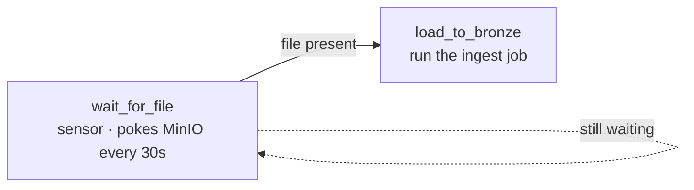

# 8.2 Run a pipeline when a file arrives (event trigger)

## Concept
In [Unit 5](../unit5/basics.md) you learned to run a pipeline **on a schedule** — "every day at
06:00". But a lot of real work isn't clock-driven, it's **event-driven**: a partner drops a file,
and *that arrival* is the signal to run. You don't know *when* the file lands, only that when it
does, you want to ingest it. Polling a clock is the wrong tool; you want to run **when a file
arrives**.

Airflow's answer is a **sensor**. A **sensor** is just a special task that **waits for a condition
to become true**, and only then lets the tasks downstream of it run. Until the condition is met, the
sensor keeps checking; once it's met, it succeeds and the arrow (`>>`) fires the next task — exactly
the dependency wiring you already know from [Unit 5.1](../unit5/basics.md).

Two words carry this whole recipe:

- **Sensor** — a task whose job is to *wait*. It succeeds the moment its condition is true, which
  releases everything downstream. Think of it as a gate that only opens once the file is really there.
- **Poke** — a single *check* of that condition. A sensor "pokes" over and over on an interval until
  the answer is yes (or it gives up). Here the check is a Python function that asks MinIO
  "does this object exist yet?"



Our stack has no cloud storage, but it *does* have **MinIO** — an S3-compatible object store (see
the [architecture](../unit0/architecture.md)). A file "arriving" means an object appearing under a
bucket + key, e.g. `demo-bucket/uploads/new_customers.xlsx`. So our sensor's condition is simply:
*does that object exist in MinIO yet?* We answer it with **boto3**, the AWS SDK for Python, pointed
at MinIO instead of AWS.

## Lab

### 1 · Drop the DAG in the dags folder
Just like every DAG in [Unit 5](../unit5/basics.md), this is one Python file in the **dags folder**
(`code/airflow/dags/` in the compose stack, git-synced on Kubernetes). Author it in JupyterLab's
file browser (<http://localhost:8008>) as `code/airflow/dags/ingest_on_file_arrival.py`.

Read the whole thing first — it's a two-task pipeline, a sensor that waits then a task that runs —
and then we'll walk it piece by piece.

```python
from airflow.sdk import DAG
from airflow.sensors.python import PythonSensor
from airflow.providers.standard.operators.bash import BashOperator
import boto3, pendulum

def _minio():
    return boto3.client("s3", endpoint_url="http://minio:9000",
                        aws_access_key_id="minioadmin", aws_secret_access_key="minioadmin")

def file_has_landed(bucket, key):
    resp = _minio().list_objects_v2(Bucket=bucket, Prefix=key)
    return resp.get("KeyCount", 0) > 0

with DAG(dag_id="ingest_on_file_arrival",
         schedule="*/5 * * * *", start_date=pendulum.datetime(2024, 1, 1), catchup=False) as dag:
    wait = PythonSensor(
        task_id="wait_for_file", python_callable=file_has_landed,
        op_kwargs={"bucket": "demo-bucket", "key": "uploads/new_customers.xlsx"},
        mode="reschedule", poke_interval=30, timeout=600)
    load = BashOperator(
        task_id="load_to_bronze",
        bash_command="echo 'file present -> run the Spark ingest job here'")
    wait >> load
```

**Read it step by step:**

- **`from airflow.sensors.python import PythonSensor`** — imports the sensor we'll use. A
  `PythonSensor` runs a Python function on each poke and treats its return value as the condition:
  **`True` = condition met (stop waiting)**, `False` = not yet, poke again later.
- **`import boto3`** — the AWS SDK for Python. It speaks the S3 API, and MinIO *is* S3-compatible, so
  the same client that talks to AWS talks to our local MinIO.
- **`def _minio(): return boto3.client("s3", endpoint_url="http://minio:9000", …)`** — builds an S3
  client, but pointed at MinIO. Three things make it MinIO instead of AWS:
    - **`endpoint_url="http://minio:9000"`** — talk to the `minio` service on the stack's network
      (port 9000 is MinIO's S3 API), not to `s3.amazonaws.com`.
    - **`aws_access_key_id` / `aws_secret_access_key`** — MinIO's dev credentials (`minioadmin` /
      `minioadmin`). Real AWS would use IAM keys; MinIO ships with these for local use.
- **`def file_has_landed(bucket, key): …`** — **this is the poke function** — the condition the
  sensor checks each time. `list_objects_v2(Bucket=…, Prefix=key)` asks MinIO to list objects whose
  name starts with `key`. The response's **`KeyCount`** is how many matched. **`> 0` means the file
  is there** → return `True` and the sensor is satisfied; `0` means "not yet" → return `False` and it
  pokes again.
- **`with DAG(dag_id="ingest_on_file_arrival", schedule="*/5 * * * *", …)`** — same DAG definition as
  Unit 5. The cron `*/5 * * * *` starts a fresh **DAG run** every 5 minutes; each run's sensor then
  waits (up to its `timeout`) for the file. `start_date` and `catchup=False` behave exactly as in
  [5.1](../unit5/basics.md) — don't backfill history, just go forward.
- **`wait = PythonSensor(task_id="wait_for_file", python_callable=file_has_landed, …)`** — creates
  the sensor task. `python_callable` is the function to run on each poke; the rest configures *how* it
  waits:
    - **`op_kwargs={"bucket": "demo-bucket", "key": "uploads/new_customers.xlsx"}`** — the arguments
      passed into `file_has_landed` on every poke. This is *what* we're waiting for.
    - **`poke_interval=30`** — **how often to check**: poke every 30 seconds.
    - **`timeout=600`** — **when to give up**: if the file hasn't shown up after 600 s (10 min), the
      sensor **fails** instead of waiting forever. Always set a timeout — a sensor with no timeout can
      hang a run indefinitely.
    - **`mode="reschedule"`** — the crucial one (see the box below).
- **`load = BashOperator(task_id="load_to_bronze", …)`** — the task that runs *once the file is
  there*. Here it just echoes a message; in a real pipeline this is where you'd submit the Spark
  ingest job that reads the file into your Bronze layer ([Unit 4](../unit4/fundamentals.md)).
- **`wait >> load`** — the same dependency wiring from [5.1](../unit5/basics.md): **`load` will not
  start until `wait` succeeds**. Since `wait` only succeeds when the file has landed, `load` runs
  **exactly when the file arrives**. That one arrow is the whole event-trigger.

!!! note "`mode=\"reschedule\"` — free the worker slot between checks"
    A sensor can wait two ways. In the default **`poke`** mode the task **holds its worker slot the
    whole time it's waiting** — even while asleep between pokes it occupies a slot. Ten sensors
    waiting 10 minutes each = ten slots tied up doing nothing. In **`reschedule`** mode the sensor
    **releases the slot between pokes**: it checks, and if the condition isn't met it goes back to
    sleep *without occupying a worker*, then Airflow re-runs it at the next `poke_interval`. For
    anything that might wait minutes or hours — like a file that hasn't arrived — **`reschedule` is
    what keeps your cluster from starving**. Use `poke` only for very short waits (a few seconds).

!!! note "There's a provider-native sensor too — `S3KeySensor`"
    Airflow ships a purpose-built sensor for exactly this: **`S3KeySensor`** (from
    `airflow.providers.amazon.aws.sensors.s3`). It does the same "wait for an object" job with less
    code — but it needs an **AWS/S3 connection** configured (an Airflow *Connection* pointing at
    MinIO's endpoint and credentials) before it'll run. We use a `PythonSensor` + **boto3** here so
    the recipe is **self-contained** — no connection setup, the endpoint and keys are right in the
    code. In a real deployment you'd usually configure the connection once and use `S3KeySensor`.

### 2 · Watch it wait, then make the file arrive
DAGs are rescanned every ~30 s, so give `ingest_on_file_arrival` a moment to appear in the DAGs list,
then toggle it **on**. In the Airflow UI (<http://localhost:8001>, `airflow`/`airflow`):

1. Open **Grid** for `ingest_on_file_arrival`. The **wait_for_file** square goes **yellow** — it's
   running (in `reschedule` mode it'll flip between running and "up for reschedule" between pokes).
2. In the **MinIO console** (<http://localhost:9001>, `minioadmin`/`minioadmin`), open (or create)
   the **`demo-bucket`** bucket and **upload any file named `new_customers.xlsx` under an
   `uploads/` prefix**. That's the "file arriving".
3. On the sensor's **next poke** (within 30 s), `file_has_landed` returns `True`, **wait_for_file**
   turns **green**, and **load_to_bronze** fires — you'll see its echo in the **Logs**.

Everything happens in the **browser**: author in JupyterLab, drop the file in the MinIO console,
watch it flip green in the Airflow UI. No container shell needed.

!!! tip "Test the poke function directly"
    The poke is just a Python function, so you can sanity-check it in a JupyterLab cell before wiring
    the DAG: call `file_has_landed("demo-bucket", "uploads/new_customers.xlsx")` and confirm it
    returns `False` before you upload and `True` after. Testing the condition in isolation is much
    faster than triggering whole DAG runs.

## Challenge
Right now the sensor waits for **one exact key**. Change it to watch a **prefix (a folder)** instead
— fire when *any* object lands under `uploads/` — and pass the **actual key that was detected** to
`load_to_bronze` so the downstream task knows *which* file to load. You'll need two changes: make the
poke return the found key (not just `True`) via **XCom**, and have the sensor's condition succeed on
any match under the prefix.

!!! tip "What you need"
    A `PythonSensor` treats a **truthy** return as "condition met" — so returning a non-empty **key
    string** works as both "yes, found it" *and* the value to hand downstream. Airflow pushes a
    sensor's return value to **XCom** under the key `return_value`, and the next task can pull it with
    a template like `{{ ti.xcom_pull(task_ids='wait_for_file') }}`.

??? note "Solution sketch"
    ```python
    def first_file_under(prefix):
        resp = _minio().list_objects_v2(Bucket="demo-bucket", Prefix=prefix)
        contents = resp.get("Contents", [])
        return contents[0]["Key"] if contents else False   # truthy key = met + value

    with DAG(dag_id="ingest_on_file_arrival",
             schedule="*/5 * * * *", start_date=pendulum.datetime(2024, 1, 1),
             catchup=False) as dag:
        wait = PythonSensor(
            task_id="wait_for_file", python_callable=first_file_under,
            op_kwargs={"prefix": "uploads/"},
            mode="reschedule", poke_interval=30, timeout=600)
        load = BashOperator(
            task_id="load_to_bronze",
            bash_command="echo 'loading {{ ti.xcom_pull(task_ids=\"wait_for_file\") }}'")
        wait >> load
    ```

    **Read it step by step:**

    - **`Prefix="uploads/"`** — listing by the folder prefix matches *any* object under `uploads/`,
      not one exact name.
    - **`return contents[0]["Key"] if contents else False`** — if anything matched, return its **key
      string** (truthy → sensor succeeds *and* the value lands in XCom); if nothing matched, return
      **`False`** → poke again. Reusing the return value as both signal and payload is the trick.
    - **`{{ ti.xcom_pull(task_ids="wait_for_file") }}`** — the downstream task **pulls** the sensor's
      return value from XCom, so `load_to_bronze` now echoes the *actual* file that triggered it. Swap
      the echo for your Spark submit and pass that key in as the input path.

!!! tip "🎯 The same event trigger on Azure Data Factory, Databricks & Fabric"
    **What you just did:** ran a pipeline **when a file landed in object storage**, using a sensor
    that pokes storage and releases downstream on arrival.

    - **Azure Data Factory** — this is ADF's **storage-event trigger**: run a pipeline the moment a
      blob is created in a container (event-grid based, no polling). ADF also has
      **tumbling-window** triggers for time-sliced runs.
    - **Azure Databricks** — **Auto Loader** (incrementally ingests new files as they arrive),
      **file-arrival triggers**, and **Jobs file triggers** do exactly this.
    - **Microsoft Fabric** — **Data Factory in Fabric** pipeline triggers fire on the same
      file/blob-arrival events.

    The concept is identical everywhere — *wait for a file, then run* — and **Airflow itself runs
    managed** on all of them (ADF Managed Airflow, MWAA, Cloud Composer), so this exact sensor DAG
    ports almost unchanged.

## Key terms, at a glance
| Term | Plain meaning |
|---|---|
| **Event trigger** | Run a pipeline *when something happens* (a file arrives) vs on a clock |
| **Sensor** | A task that **waits** for a condition, then releases downstream tasks |
| **Poke** | One check of the sensor's condition; it pokes repeatedly until true |
| **`python_callable`** | The function a `PythonSensor` runs each poke — truthy = condition met |
| **`poke_interval`** | How often to check (seconds between pokes) |
| **`timeout`** | Give up (fail the sensor) after this many seconds of waiting |
| **`mode="reschedule"`** | Release the worker slot between pokes (vs `poke` = hold it) — scales |
| **boto3** | AWS SDK for Python; talks S3, so it talks to S3-compatible **MinIO** |
| **`endpoint_url`** | Point the S3 client at MinIO (`http://minio:9000`) instead of AWS |
| **`list_objects_v2` / `KeyCount`** | List objects by prefix / how many matched (`>0` = present) |
| **`S3KeySensor`** | Provider-native "wait for an object" sensor; needs an AWS/S3 connection |
| **XCom** | How tasks pass small values between each other (e.g. the detected key) |
| **`>>`** | "then" — sensor succeeds → downstream runs; the whole event-trigger wiring |

## You can now…
- Explain what a **sensor** is and how a **poke** function turns "did the file arrive?" into a task
- Build a self-contained file-arrival trigger with `PythonSensor` + **boto3** against MinIO
- Tune `poke_interval` and `timeout`, and know why **`mode="reschedule"`** matters at scale
- Wire `wait >> load` so the ingest job runs **exactly when the file lands**
- Recognize this as ADF storage-event triggers / Databricks Auto Loader / Fabric pipeline triggers,
  and know `S3KeySensor` is the provider-native alternative
