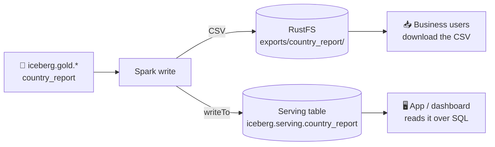

# 8.5 Reverse-ETL: publish the Gold layer out

## Concept
Everything so far pulled data **into** the lakehouse — Bronze ingest, Silver cleaning, Gold marts.
**Reverse-ETL** runs the arrow the other way: it takes a curated **Gold** table and pushes it
*back out* to wherever the business actually consumes it — a file drop someone downloads, an
operational app's database, or a SaaS tool (a CRM, a marketing platform). The lakehouse computes
the answer once; reverse-ETL delivers that answer to the systems people already live in.

A destination you write to is called a **sink** (the mirror of a *source*, which you read from).
This recipe publishes one small Gold-style report to two sinks: a CSV file drop, and a **serving
table** an app reads.


```mermaid
flowchart LR
  G["🥇 iceberg.gold.*<br/>country_report"] --> RE[Spark write]
  RE -->|CSV| S3[(RustFS<br/>exports/country_report/)]
  RE -->|writeTo| ST[(Serving table<br/>iceberg.serving.country_report)]
  S3 --> BU[📥 Business users<br/>download the CSV]
  ST --> APP[🖥️ App / dashboard<br/>reads it over SQL]
```

**Why Gold is what you publish:** the same rule from [Unit 7.1](../unit7/dashboards.md) — you serve
the **small, safe, business-ready** Gold layer, never raw Bronze/Silver. Gold is already the
finished metric (revenue by country), so there's nothing left to explain to whoever receives it.

!!! info "Reverse-ETL is just ETL with the arrow reversed"
    Ordinary **ETL** moves data *from* operational systems *into* your warehouse/lakehouse.
    **Reverse-ETL** moves curated data *out of* the lakehouse *back into* operational systems. Same
    machinery (`spark.write`), opposite direction.

## Lab
Assume the `spark` session from [4.1](../unit4/fundamentals.md) — the object named `spark` is your
handle to the cluster. We'll build a tiny Gold report, then publish it to two sinks.

### Cell A — a small Gold report
In real life you'd `spark.read` an existing mart (`iceberg.gold.daily_sales`, `country_report`, …).
To keep the recipe self-contained we hand-build a three-row stand-in:

```python
# a Gold report — in real life you'd read iceberg.gold.daily_sales etc.
report = spark.createDataFrame(
    [('US', 3940000), ('UK', 2510000), ('DE', 1330000)],
    ['country', 'revenue'])
```

**Read it step by step:**

- **`spark.createDataFrame([...], [...])`** — build a **DataFrame** directly from Python values. The
  first argument is the rows (a list of tuples), the second is the column names.
- **`[('US', 3940000), …]`** — three rows: one per country, with its total revenue. This is exactly
  the *shape* a real Gold mart has — pre-aggregated, one row per business entity.
- **`['country', 'revenue']`** — names the two columns. `country` is a category (a **dimension**),
  `revenue` is the number (a **metric**).

*Produces:* `report`, a 3-row DataFrame. Grain (what one row means): one country and its revenue.

### Cell B — publish as a downloadable CSV in object storage
The first sink is a **file drop**: write the report as a **CSV** into RustFS, where a business user
can grab it from the bucket (or a link) and open it in Excel — no lakehouse access required.

```python
(report.coalesce(1).write.mode("overwrite").option("header", True)
       .csv("s3a://demouser-lake/files/exports/country_report/"))
```

**Read it step by step:**

- **`report.coalesce(1)`** — collapse the DataFrame to a **single partition** so Spark writes **one**
  output file instead of many `part-00000`, `part-00001`, … pieces. A business user wants *one* CSV
  to download, not a folder of fragments. (Spark is parallel by default, so each partition normally
  writes its own file — `coalesce(1)` funnels them together first.)
- **`.write`** — the entry point for *writing* a DataFrame out (the counterpart to `spark.read`).
- **`.mode("overwrite")`** — if the target folder already has an export, **replace** it. Re-running
  the cell always leaves exactly one fresh export (**idempotent**). The alternative, `"append"`,
  would *add* another file alongside the old ones — see the Challenge.
- **`.option("header", True)`** — write the column names (`country,revenue`) as the first line, so
  the CSV is self-describing when someone opens it.
- **`.csv("s3a://demouser-lake/files/exports/country_report/")`** — the *action*: write **CSV** files to
  that path. `s3a://` is Spark's connector for S3-compatible object storage (here, RustFS — inside the stack it's reached at `http://storage:9000`). Note the
  path is a **folder** — Spark writes the single part-file *inside* it.

*Produces:* one CSV file under `s3a://demouser-lake/files/exports/country_report/`, with a header row and
one line per country — ready to hand to anyone.

!!! note "Why a folder, not a file"
    Even with `coalesce(1)`, Spark writes to a **directory** (`country_report/`) containing one
    `part-*.csv` plus small `_SUCCESS`/commit markers — that's just how distributed writers work.
    Business users are usually handed a link to that single part-file, or a tiny downstream step
    renames it to `country_report.csv`. The `coalesce(1)` is what guarantees there's only *one*
    part-file to point at.

### Cell C — a serving table the app reads
The second sink is a table an application or dashboard reads directly over SQL: a small
**serving table** in its own namespace, holding just what the consumer needs.

```python
spark.sql("CREATE NAMESPACE IF NOT EXISTS iceberg.serving")
report.writeTo("iceberg.serving.country_report").createOrReplace()
```

**Read it step by step:**

- **`CREATE NAMESPACE IF NOT EXISTS iceberg.serving`**: a separate namespace (schema) in your own
  lakehouse for tables you publish to consumers, apart from your working `bronze`/`silver`/`gold`.
- **`report.writeTo("iceberg.serving.country_report")`**: the target table. Readers get a stable
  name to point their app at, whatever you change in your pipeline behind it.
- **`.createOrReplace()`**: replaces the table's contents each run, so re-running always leaves
  exactly one fresh copy (**idempotent**). `.append()` would *add* rows instead (the Challenge does
  this).

*Produces:* `iceberg.serving.country_report` with three rows. An app or dashboard reads it with
plain SQL, for example in SQLPad: `SELECT * FROM demouser_lake.serving.country_report`.

!!! warning "Why not straight into the shop's Postgres?"
    Classic reverse-ETL often writes into an operational app's database over JDBC (the mirror of
    the JDBC *read* in [Unit 4.2](../unit4/read-bronze.md)): `report.write.format("jdbc")…save()`.
    But ShopFlow's Postgres is our **production** database, and data engineers only get a
    **read-only** login there (try it: the write fails with *cannot execute CREATE TABLE in a
    read-only transaction*). In a real company the app team creates a dedicated table and a
    separate service account that may write only to it, and the pipeline uses that account, never
    a personal login.

!!! tip "Publish as Excel, not just CSV"
    Some recipients want a real `.xlsx`, not a CSV. Since Gold reports are small, pull the DataFrame
    to **pandas** on the driver and let it write the workbook — the reverse of the
    [Excel ingest recipe](excel.md):

    ```python
    import os
    report.toPandas().to_excel(
        "s3://demouser-lake/files/exports/report.xlsx", index=False,
        storage_options={"key": os.environ["AWS_ACCESS_KEY_ID"],          # your own key
                         "secret": os.environ["AWS_SECRET_ACCESS_KEY"],
                         "client_kwargs": {"endpoint_url": "http://storage:9000"}})
    ```

    **`report.toPandas()`** collects the small result into a pandas DataFrame; **`.to_excel(...)`**
    writes a formatted `.xlsx`; **`storage_options={...}`** hands pandas your own storage key and
    endpoint so it can write straight to object storage. `index=False` drops pandas' row numbers.

## Challenge
The report is published fresh each run today (`overwrite`). Make it a **daily history** instead:
stamp each run with its date and **append** to a history table,
`iceberg.serving.country_report_history`, so it accumulates one batch per day. As a stretch, also write the CSV **partitioned by country** so each country gets its own
folder of exports.

!!! tip "The idea: append, don't overwrite"
    `overwrite` keeps only the latest snapshot; `append` *adds* rows, building history. Add a `run_date`
    column so you can tell the batches apart, then switch the write mode. For the CSV, **`partitionBy`**
    splits the output into one folder per value — the same trick you used for date-partitioned Parquet
    in [4.2](../unit4/read-bronze.md).

??? note "Solution"
    ```python
    from pyspark.sql import functions as F

    # stamp each run with today's date
    dated = report.withColumn("run_date", F.current_date())

    # (1) append daily history into its own table instead of overwriting
    hist = "iceberg.serving.country_report_history"
    if spark.catalog.tableExists(hist):
        dated.writeTo(hist).append()
    else:
        dated.writeTo(hist).create()

    # (2) write CSV partitioned by country — one folder per country
    (report.write.mode("overwrite").option("header", True)
        .partitionBy("country")
        .csv("s3a://demouser-lake/files/exports/country_report_by_country/"))
    ```
    **Read it step by step:**

    - **`.withColumn("run_date", F.current_date())`** — add a `run_date` column set to today's date,
      so each daily batch is distinguishable once they pile up in the same table.
    - **`.append()`** — *add* the new rows instead of replacing them (the first run creates the
      table). Run it three days running and you get three dated batches — a growing history. It's a
      **separate table** because the history has an extra `run_date` column — its own shape.
    - **`.partitionBy("country")`** — split the CSV output into one folder per country
      (`country=US/`, `country=UK/`, `country=DE/`). A consumer who only wants one country reads
      just that folder. Note there's no `coalesce(1)` here — partitioning *is* the split you want.

    Append builds an audit trail; overwrite keeps only "now". Pick append when downstream needs the
    daily history, overwrite when it only ever wants the latest snapshot.

!!! tip "🎯 The same reverse-ETL on Azure Data Factory, Databricks & Fabric"
    **What you just did:** published a Gold table out to two sinks — a CSV file drop and a
    serving table — over the same `spark.write` you'd use anywhere.

    - **Azure Data Factory** — a **Copy activity** with your Gold table as source and a **SQL /
      Blob sink** as destination; the "sink" concept is ADF's own word for it.
    - **Azure Databricks** — `df.write` to **JDBC** or files runs unchanged; or expose Gold to
      external consumers with **Delta Sharing** (no copy at all).
    - **Microsoft Fabric** — a **Data Factory copy** into the destination, or **Data Activator** to
      trigger an action when a Gold metric crosses a threshold.
    - **Dedicated tools** — **Census** and **Hightouch** are purpose-built reverse-ETL products that
      sync warehouse tables into SaaS apps (Salesforce, HubSpot) without you writing the pipe.

    Different logos, identical shape: read the governed **Gold** layer, write it out to a **sink**.

## Key terms, at a glance
| Term | Plain meaning |
|---|---|
| **Reverse-ETL** | Push curated Gold *back out* to where it's consumed (file, app DB, SaaS) |
| **Sink** | A destination you write to — the mirror of a *source* |
| **`.write`** | Entry point for writing a DataFrame out (counterpart to `spark.read`) |
| **`coalesce(1)`** | Collapse to one partition → one output file, not many part-files |
| **`.mode("overwrite")`** | Replace the target's contents each run (idempotent) |
| **`.mode("append")`** | Add rows to what's already there — builds history |
| **Serving table** | A small published table with a stable name that apps / dashboards read |
| **JDBC write** | `write.format("jdbc")` into an app database, with a service account that may write there |
| **`partitionBy(col)`** | Split output into one folder per value of that column |
| **Why publish Gold** | Small, safe, business-ready — never publish Bronze/Silver |

## You can now…
- Explain reverse-ETL — pushing curated Gold back out to a sink (file, app database, SaaS)
- Publish a Gold report as a single downloadable CSV in object storage with `coalesce(1)`
- Publish a Gold table as a serving table, and explain why pipelines don't write to production with personal logins
- Choose `overwrite` vs `append`, and partition the output by column for per-value file drops
