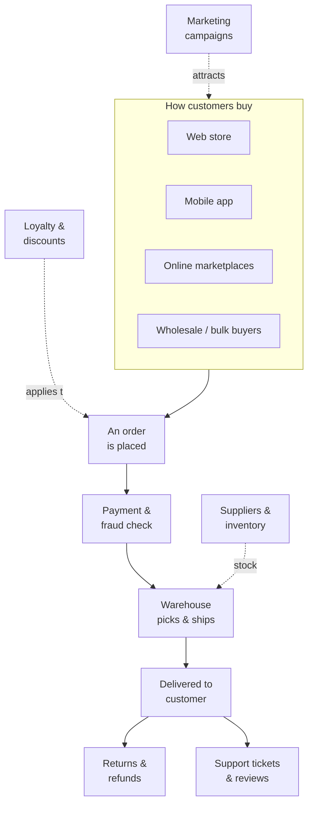

# The ShopFlow scenario

Everything in this course is built around one fictional company, **ShopFlow**.
Before we touch a single tool, you need to understand the *business* — because in
real data engineering the technology is never the point. The point is answering
questions the business is losing money by not being able to answer.

Read this page as if it were your first week on the job. By the end you should be
able to explain, in plain language, **what ShopFlow does, how it makes money, and
why it is currently flying blind.**

## Who ShopFlow is

ShopFlow is a mid-sized online retailer. It started six years ago as one founder
selling a single product category from a spare room. Today it is a real company:

- **~2 million customers** across **several countries**, ordering in **different
  currencies**.
- A catalog of **tens of thousands of products** across many categories, with
  prices, costs, and descriptions that change constantly.
- **Thousands of orders every day**, spiking hard during promotions and holidays.
- A team of ~150 people spread across **Merchandising, Marketing, Operations &
  Fulfilment, Finance, and Customer Support.**

It is profitable, growing, and — like almost every company at this stage —
**held together by spreadsheets, gut feel, and heroic individuals.**

## How the business actually works

ShopFlow is not just "a website with a buy button." Money and goods move through a
web of moving parts, and *every one of them produces data*:

The business has grown in ways that make it genuinely complicated:

- **Multiple sales channels.** Customers buy through the web store, the mobile app,
  third-party **marketplaces**, and a growing **wholesale** arm — and the *same
  customer* often uses more than one.
- **Promotions and loyalty.** Discount codes, seasonal sales, and a loyalty program
  mean the price a customer *pays* is rarely the price on the shelf.
- **Returns and refunds.** A meaningful share of orders come back. A "sale" isn't
  really revenue until the return window has passed.
- **Inventory and suppliers.** Products are bought from suppliers at a cost, held in
  stock, and can sell out. Margin — not just revenue — is what keeps the lights on.
- **Payments and fraud.** Multiple payment methods, failed payments, chargebacks,
  and fraud that quietly eats into profit.
- **Customer support.** Tickets, complaints, and reviews that hint at problems long
  before they show up in the sales numbers.
- **Marketing spend.** Money poured into campaigns across many channels — with only
  a fuzzy sense of which ones actually bring back *profitable* customers.
- **A constant stream of live activity.** Long before anyone clicks "buy," customers
  generate a nonstop flow of **events** — searches, page and product views, items
  added to (and abandoned in) carts, payment attempts — happening every second,
  around the clock. Most of this never becomes an order, yet it's some of the most
  valuable signal the business has.

## The problem

**ShopFlow is data-rich and insight-poor.**

Every part of the business above throws off data, but it lands in different places,
in different shapes, owned by different teams — and *nobody can see the whole
picture.* The consequences are concrete and they cost real money:

- **Nobody agrees on the numbers.** Ask three people "how much did we sell last
  month?" and you get three different answers, because Finance, Marketing, and
  Operations each pull from a different source and define "a sale" differently
  (Do refunds count? Which currency? Gross or net of discount?).
- **Answers arrive too late to matter.** A simple question like *"which products are
  trending this week?"* takes an analyst two days of manual spreadsheet stitching —
  by which point the trend has moved on.
- **Decisions are made on gut feel.** Marketing keeps spending on channels without
  knowing which ones deliver customers who *stay and buy again* rather than order
  once and vanish.
- **Problems are found too late.** A supplier quietly raises a cost, or a product's
  return rate spikes, and it silently erodes margin for weeks before anyone notices.
- **The founders' spreadsheets don't scale.** The manual reports that worked at
  10 orders a day break down at thousands — and the one analyst who understands them
  is a single point of failure.

In short: the business is being run on **yesterday's guesses instead of a shared,
trustworthy view of reality.**

## The questions the business needs answered

ShopFlow's leaders don't want "a data platform." They want dependable answers to
questions like these — the same answer, every time, no matter who asks:

| Team | The question they keep asking |
|---|---|
| Leadership | How much did we *really* sell yesterday / last month — net of discounts and returns? |
| Finance | What's our **profit margin** by product and category, once cost and refunds are counted? |
| Merchandising | Which products are **trending or dying**, and what's about to go out of stock? |
| Marketing | Which **campaigns and channels** bring back customers who buy *again*? |
| Customer / CRM | Who are our **most valuable customers**, and which good ones are slipping away? |
| Operations | Where are orders getting **stuck, delayed, or returned**, and why? |

Notice that every one of these needs data from **more than one part of the
business** stitched together — sales *and* costs, orders *and* returns, marketing
spend *and* repeat purchases. That stitching, done reliably and repeatably, is the
job you're here to learn.

## Some decisions can't wait until tomorrow

Everything above is about knowing *what happened* — yesterday, last week, last month.
Get that right and ShopFlow already runs far better than it does today.

But a second kind of question is completely different: **what is happening *right
now*, and can we act on it in the moment?** For these, an answer that arrives tomorrow
is worth nothing — the moment is gone. The value of the answer *decays by the second*:

- **Fraud at the instant of checkout.** A suspicious payment has to be approved or
  blocked in **seconds**, before the order is packed and shipped. A fraud report the
  next morning is useless — the goods have already left the building.
- **Overselling during a flash sale.** In a big promotion a hot item can sell out in
  **minutes**. If the "in stock" number lags even a little, ShopFlow keeps taking
  orders it can't fulfil — cancellations, refunds, angry customers, and marketplace
  penalties.
- **Winning back an abandoned cart.** A shopper fills a cart, then hesitates. A gentle
  nudge **within minutes** — while they're still interested — recovers a sale that is
  gone for good by tomorrow.
- **A live pulse on the big days.** On Black Friday, leadership can't wait for a
  next-morning report. They need a **live** view — orders per minute, revenue, whether
  checkout is failing — to react *while it's still happening*.
- **"Trending right now."** What's hot **this hour** should shape what the homepage
  features and what Merchandising pushes — not yesterday's winners.

These are the **in-the-moment questions**:

| Team | The in-the-moment question | Why it can't wait |
|---|---|---|
| Payments / Risk | Is *this* checkout fraudulent? | Decide in seconds, before it ships |
| Merchandising | Is this item about to sell out? | Stop overselling mid-promotion |
| Marketing | Did this shopper just abandon a full cart? | Nudge within minutes, or lose the sale |
| Leadership | What's happening on the site *right now*? | React during the peak, not after it |
| Operations | Is checkout or payment failing this minute? | Every minute down is lost revenue |

So ShopFlow really has **two speeds of decision**: the *daily, trustworthy picture*
(how the business is really doing) **and** the *live, in-the-moment reactions* (act now
or lose the moment). A complete data platform has to serve both.

## What "solved" looks like

Success for ShopFlow isn't a fancy dashboard. It's these two things together:

> **One trustworthy source of truth** that any team can rely on to get the *same,
> correct answer* to the daily questions — automatically kept up to date, so decisions
> are made on what's true *today*, not on last week's guess.
>
> **…and a live pulse** that turns the stream of activity into answers *within seconds*,
> so ShopFlow can act while it still matters — block the fraud, save the cart, stop the
> overselling.

That's the mission. Every lesson in this course adds one more piece toward it, using
ShopFlow's real messiness — multiple channels, returns, price changes, late-arriving
data, and a round-the-clock stream of live events — as the raw material.

Keep this business picture in your head. Whenever a lesson introduces something new,
ask yourself: **which of ShopFlow's questions does this help answer?**
