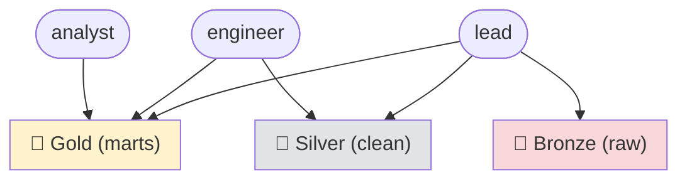

# Personas & roles

You **don't create users** in this course. Instead you *act as* one of three fixed **personas** that
already exist in the stack. Each persona is a real login (in Keycloak) mapped to a real set of
permissions (in Unity Catalog) — so when you sign in as one, you see exactly what that role is
allowed to see. That's the whole point: you *experience* governance from inside a role, the way a
real teammate would.

!!! tip "Username = role, on purpose"
    In a real company people have names and get permissions through their *role*. Here we make the
    login **be** the role (`analyst`, `engineer`, `lead`) so it's always obvious who you are and what
    you can do. Each one still has a human display name in the UI (Ava, Eddie, Lena) so it feels
    like a real directory.

## The three personas

| Login | Password | Display name | Role | Can do |
|---|---|---|---|---|
| `analyst` | `analyst` | Ava Analyst | Analyst / BI | **Read the 🥇 Gold layer** — the finished, business-ready marts. Nothing else. |
| `engineer` | `engineer` | Eddie Engineer | Data Engineer | **Build in 🥈 Silver** (read/write/create tables) and **read Gold**. Cannot touch raw Bronze. |
| `lead` | `lead` | Lena Lead | Data Lead / Owner | **Full access to every layer** — Bronze, Silver, Gold. The owner who can also grant to others. |

The password is the same as the username for every persona.



This is the **medallion access policy** — least privilege by layer. An analyst can't see half-cleaned
Silver or raw Bronze; an engineer can build Silver but can't rummage in raw Bronze; only the lead
sees everything. You'll define and inspect these exact grants in [Unit 6.2 — RBAC](../unit6/rbac.md).

## How to "become" a persona

The personas are **Unity Catalog / Keycloak** identities — use them wherever the stack asks *who you
are* for governance:

- **Unity Catalog Web UI** — open <http://localhost:3000>, click **Continue with Keycloak**, and sign
  in as `analyst` / `engineer` / `lead`. The catalog tree you see is scoped to that persona's grants.
- **`uc` CLI** — get a token for a persona and run commands as them:

    ```bash
    T=$(common/uc-cli/login.sh analyst)     # or engineer / lead — password defaults to the username
    uc --server http://localhost:8081 --auth_token "$T" catalog list
    ```

!!! warning "You need the `keycloak` hosts entry first"
    Signing in as any persona redirects through Keycloak, so `keycloak` must resolve on your machine
    — see [Prerequisites → the hosts entry](prerequisites.md#2-the-keycloak-hosts-entry-required).

## These are *not* personas — they're platform/ops accounts

The other logins around the stack are **service accounts** for running the platform, not learner
roles. Don't confuse them with the personas above:

| Account | Where | What it is |
|---|---|---|
| `admin` / `admin` | Keycloak console (master realm) | Identity-platform admin — manages Keycloak itself |
| UC **bootstrap token** | inside the `unity-catalog` container | The metastore owner used *once* by the operator to create catalogs & seed grants |
| `admin` / `admin` | Superset | BI tool admin (Superset has its own users) |
| `airflow` / `airflow` | Airflow | Orchestrator admin |
| token `123456` | Jupyter | Notebook access |
| `minioadmin` / `minioadmin` | MinIO | Object-store root |

The personas (`analyst`/`engineer`/`lead`) are the ones that carry a **data-access role**; the table
above is just how you open each tool.

## Where the personas are defined (for the curious)

- **Identity** — the three users live in the Keycloak realm import:
  `local/configs/keycloak/de-stack-realm.json` (and the identical k8s copy). Change them there.
- **Permissions** — the Unity Catalog grants are applied by the operator's seed script
  `common/uc-cli/seed-governance.sh` (compose, via `make uc-seed`) or the ansible seed on k8s.

!!! note "On the cloud, this is users + groups"
    On Databricks/Snowflake you'd typically create *people* and attach them to **groups**
    (`analysts`, `engineers`) that hold the grants. UC OSS here has no groups, so grants are
    per-user — but the mental model (identity → role → grants → least privilege) is identical.

## You can now…
- Name the three personas, their passwords, and what each is allowed to read/write
- Sign in as a persona in the Unity Catalog UI or with the `uc` CLI
- Tell a **data-access persona** apart from a **platform/ops service account**
