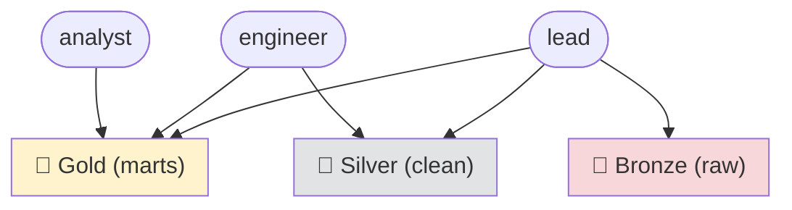

# 0.3.1 Personas & roles (governance demos)

Day to day you work as **yourself** — your [lab account](workspace.md), with your own lakehouse.
For the governance lessons the stack also has three fixed **personas**. Each persona is a real
**Polaris principal** (a login with a client ID + secret) mapped to a real set of **grants** on the
course's **shared lake** — so when you sign in as one, you see exactly what that role is allowed to
see. That's the point: you *experience* governance from inside a role, the way a real teammate
would. (Creating your *own* users is Unit 6.2.)

!!! tip "Username = role, on purpose"
    In a real company people have names and get permissions through their *role*. Here we make the
    login **be** the role (`analyst`, `engineer`, `lead`) so it's always obvious who you are and what
    you can do.

## The three personas

| Login (Client ID) | Secret | Role | Can do |
|---|---|---|---|
| `analyst` | `analyst` | Analyst / BI | **Read the 🥇 Gold layer** — the finished, business-ready marts. Nothing else. |
| `engineer` | `engineer` | Data Engineer | **Build in 🥈 Silver** (read/write/create tables) and **read Gold**. Cannot touch raw Bronze. |
| `lead` | `lead` | Data Lead / Owner | **Full access to every layer** — Bronze, Silver, Gold. The owner who can also grant to others. |

The secret is the same as the login for every persona.

```mermaid
flowchart TB
  subgraph L["🥉 Bronze (raw)"]
  end
  subgraph S["🥈 Silver (clean)"]
  end
  subgraph G["🥇 Gold (marts)"]
  end
  A([analyst]) --> G
  E([engineer]) --> S
  E --> G
  D([lead]) --> L
  D --> S
  D --> G
  style G fill:#fff3cd
  style S fill:#e2e3e5
  style L fill:#f8d7da
```

This is the **medallion access policy** — least privilege by layer. An analyst can't see half-cleaned
Silver or raw Bronze; an engineer can build Silver but can't rummage in raw Bronze; only the lead
sees everything. You'll build these exact grants as the Polaris admin in
[6.2](../unit6/polaris-admin.md) and [6.4](../unit6/grant-and-query.md).

## How to "become" a persona

Sign in with the persona's **Client ID + Secret** wherever the stack asks *who you are*:

- **Polaris Console** — open <http://localhost:8189/login?local=1> (k8s:
  `http://polaris-console.de.lan/login?local=1` — the `?local=1` shows the Client ID / Secret form
  instead of signing you in with your lab account), enter the **Client ID** and **Client Secret**
  (e.g. `analyst` / `analyst`), and sign in. The catalog tree you see is scoped to that persona's
  grants.
- **An engine (Trino / Spark)** — point it at the governed catalog with the same client ID/secret;
  it reads/writes only what that persona is allowed.

No identity server involved — the principal authenticates to Polaris directly (your lab account
goes through Keycloak instead).

## These are *not* personas — they're platform/ops accounts

The other logins around the stack are your **lab account** (every tool) and a few **service
accounts** for running the platform. Don't confuse them with the personas above:

| Account | Where | What it is |
|---|---|---|
| `root` / `s3cr3t` | Polaris (Console or API) | Catalog **admin** — creates catalogs, users, roles & grants |
| your lab account | every tool (single sign-on) | you — your own Jupyter, lakehouse and bucket; instructors are admins |
| `admin` / `admin` | Keycloak admin console | manages lab accounts (realm `de-lab`) |
| `minioadmin` / `minioadmin` | RustFS (object store) | Object-store root — used by the platform's own jobs |

The personas (`analyst`/`engineer`/`lead`) are the ones that carry a **data-access role**; the table
above is just how you open each tool.

## Where the personas are defined (for the curious)

Both identity *and* permissions come from one operator seed script,
`common/polaris/seed-polaris.sh` (compose: `make polaris-seed`; k8s: run inside the polaris pod). It
creates the three principals, pins their logins (client ID = secret = name), and applies the graded
grants. Change the personas or their access there — it's idempotent and safe to re-run.

!!! note "On the cloud, this is users + groups + an IdP"
    On Databricks/Snowflake you'd create *people*, attach them to **groups** (`analysts`,
    `engineers`) that hold the grants, and log in via an identity provider (SSO/MFA). The lab does
    that for *you* (Keycloak → your lab account); the personas skip the IdP and give each role a
    direct principal login — simpler for demos, and the mental model (identity → role → grants →
    least privilege) is identical.

## You can now…
- Name the three personas, their logins, and what each is allowed to read/write
- Sign in as a persona in the **Polaris Console** (or an engine) with its client ID/secret
- Tell a **data-access persona** apart from a **platform/ops service account**
