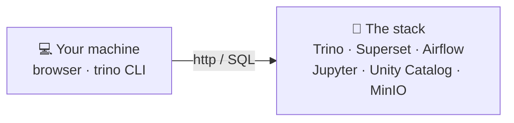

# Prerequisites & setup

This course is **hands-on**: you drive a running data platform from **your own machine** — a
browser and a couple of command-line tools. You never open a shell *inside* a container; you use
each tool the way you would in a real job: through its web UI or its client.

!!! info "The golden rule — you are a *user* of the stack, not its operator"
    Every tool below runs as a service (in Docker locally, or on Kubernetes). Your job is to
    **connect to it** — open a URL, or point a client at a port. You will never be asked to
    `docker exec`, `kubectl exec`, or `ssh` into anything. If a step ever tells you to "run this
    inside the container", it's the wrong course.



## What you need

| # | Thing | Required? | Why |
|---|---|---|---|
| 1 | A modern **web browser** | ✅ Always | Every tool (Superset, Airflow, Jupyter, Unity Catalog, MinIO) is a web UI |
| 2 | The **`keycloak` hosts entry** | ✅ Always | Single sign-on — without it, Unity Catalog & Keycloak logins fail |
| 3 | The **Trino CLI** | ⭐ Recommended | The fastest way to run the SQL in [Unit 2](../unit2/intro.md) (or use Superset SQL Lab instead) |
| 4 | **Docker Desktop** + Git | ⚙️ Only if *you* run the stack | Needed to bring the platform up on your own laptop |

Items 1–3 are all a learner needs when the stack is provided for you (a shared server, or an
instructor's machine). Item 4 is only for running the whole thing yourself.

---

## 1. A web browser

Any recent Chrome, Edge, Firefox, or Safari. That's the entire requirement for Superset, Airflow,
Jupyter, the Unity Catalog UI, MinIO, and this course site. Bookmark the landing page — it links to
everything:

- **Local (Docker):** [http://localhost:8000](http://localhost:8000)
- **Kubernetes:** `http://home.de.lan`

---

## 2. The `keycloak` hosts entry (required)

The stack uses **Keycloak** for single sign-on. For security, Keycloak issues its login URLs under
one fixed name — `keycloak:8080` — and **both** your browser **and** the Unity Catalog server must
resolve that name to the *same* place. On the server side Docker/Kubernetes handles it; on your side
you add one line to your **hosts file** so `keycloak` points at your local machine.

!!! warning "Skip this and two things break"
    Logging into **Unity Catalog** (`localhost:3000`) and opening the **Keycloak** console both
    redirect to `http://keycloak:8080/…`. Without the hosts entry your browser can't resolve
    `keycloak` and the page fails to load.

=== "macOS / Linux"

    The hosts file is `/etc/hosts`. Add the line (needs your admin password):

    ```bash
    echo "127.0.0.1 keycloak" | sudo tee -a /etc/hosts
    ```

    Verify:

    ```bash
    getent hosts keycloak 2>/dev/null || ping -c1 keycloak
    ```

=== "Windows"

    The hosts file is `C:\Windows\System32\drivers\etc\hosts` and editing it requires
    **Administrator** rights.

    1. Press **Start**, type **Notepad**, right-click it → **Run as administrator**.
    2. **File → Open**, paste `C:\Windows\System32\drivers\etc\hosts`
       (set the file-type filter to *All Files* so it shows up).
    3. Add this line at the end and **Save**:

    ```
    127.0.0.1 keycloak
    ```

    Verify in PowerShell:

    ```powershell
    Resolve-DnsName keycloak
    ```

!!! note "On Kubernetes it's the `*.de.lan` wildcard instead"
    The k8s deployment uses hostnames like `auth.de.lan`, `trino.de.lan`, `superset.de.lan`. Your
    cluster admin points `*.de.lan` at the ingress (via DNS or a single wildcard hosts entry) — the
    same idea, one entry for all services.

---

## 3. The Trino CLI (recommended)

[Unit 2](../unit2/intro.md) runs SQL against the lakehouse. You have two ways to do it — pick either:

- **Trino CLI** — a small command-line client you install once (this section), or
- **Superset SQL Lab** — nothing to install, just the browser at `http://localhost:8004`
  (**SQL → SQL Lab**). If you'd rather not install anything, use this and skip ahead.

The Trino CLI is a single self-contained program. Once installed you connect with:

```bash
# Local (Docker)
trino --server http://localhost:8007

# Kubernetes
trino --server https://trino.de.lan
```

You'll get a `trino>` prompt — type SQL, end each statement with `;`, quit with `quit;`.

=== "macOS"

    Homebrew installs the client (and pulls in Java automatically):

    ```bash
    brew install trino
    trino --version
    ```

=== "Windows"

    The Trino CLI is a Java program, so install a Java runtime first, then the client.

    **Option A — Scoop** (easiest if you have [Scoop](https://scoop.sh)):

    ```powershell
    scoop install temurin-jre    # Java runtime
    scoop install trino-cli
    trino --version
    ```

    **Option B — the executable JAR** (no package manager):

    1. Install a Java runtime — e.g. [Adoptium Temurin JRE 17+](https://adoptium.net)
       (or `winget install EclipseAdoptium.Temurin.17.JRE`). Check with `java -version`.
    2. Download `trino-cli-<version>-executable.jar` from the
       [Trino releases](https://trino.io/download.html).
    3. Run it (from the folder you downloaded it to):

    ```powershell
    java -jar trino-cli-*-executable.jar --server http://localhost:8007
    ```

    !!! tip "Prefer a GUI on Windows?"
        [DBeaver](https://dbeaver.io) (free) has a built-in Trino driver — **New Connection →
        Trino**, host `localhost`, port `8007`, no password. Or just use **Superset SQL Lab** in
        the browser. Either avoids the Java setup entirely.

=== "Linux"

    The CLI is a Java program. Install a JRE, then grab the client JAR:

    ```bash
    # Debian/Ubuntu example — any JRE 17+ works
    sudo apt-get install -y default-jre

    # download the self-contained client and make it runnable
    curl -Lo trino https://repo1.maven.org/maven2/io/trino/trino-cli/latest/trino-cli-latest-executable.jar
    chmod +x trino
    ./trino --server http://localhost:8007
    ```

    (Move `trino` somewhere on your `PATH`, e.g. `/usr/local/bin`, to call it from anywhere.)

!!! note "Java version"
    The Trino CLI needs a reasonably recent Java (JRE **17+** is a safe choice). `brew install trino`
    and Scoop handle this for you; for the raw JAR, install a JRE first and confirm with
    `java -version`.

---

## 4. Running the stack yourself (only if it isn't provided)

If someone already runs the platform for you, skip this — you just need items 1–3 and their URLs.
To run it on your **own** laptop, you need Docker and the repo.

=== "macOS"

    1. Install [**Docker Desktop for Mac**](https://www.docker.com/products/docker-desktop/)
       (Apple Silicon or Intel). Give it plenty of memory in **Settings → Resources**
       (see the note below).
    2. Install **Git** (`brew install git`, or it ships with the Xcode command-line tools).

=== "Windows"

    1. Install [**Docker Desktop for Windows**](https://www.docker.com/products/docker-desktop/)
       — it uses the **WSL 2** backend, which Docker Desktop can set up for you.
    2. Install [**Git for Windows**](https://git-scm.com/download/win).
    3. Do the clone/edit inside your **WSL 2** home (e.g. `\\wsl$\Ubuntu\home\you`) — it's far
       faster than the Windows filesystem and avoids CRLF line-ending surprises in shell scripts.

=== "Linux"

    1. Install **Docker Engine** + the **Compose plugin**
       ([docs.docker.com/engine/install](https://docs.docker.com/engine/install/)).
    2. Add yourself to the `docker` group so you don't need `sudo`:
       `sudo usermod -aG docker $USER` (then log out/in).
    3. Install **Git** (`sudo apt-get install -y git`).

!!! warning "This stack is memory-hungry"
    You're running ~a dozen services (Spark, Trino, Superset, Airflow, Keycloak, Postgres, …).
    Give Docker at least **8 GB** of RAM — **12–16 GB** is comfortable. On Docker Desktop set this
    in **Settings → Resources → Memory**. Too little and containers get killed (`exit 137`).

With Docker and Git installed, follow **[Bring up the stack](deploy.md)** for the exact `make`
commands (Docker Compose) or the Ansible steps (Kubernetes).

---

## Verify your setup

Run through this checklist once — if all four pass, you're ready for Unit 1.

1. **Landing page loads** — open [http://localhost:8000](http://localhost:8000). You should see the
   ShopFlow tiles.
2. **`keycloak` resolves** — `getent hosts keycloak` (mac/linux) or `Resolve-DnsName keycloak`
   (Windows) returns `127.0.0.1`.
3. **Unity Catalog login works** — open `http://localhost:3000` → **Continue with Keycloak** →
   `analyst` / `analyst`. You land in the catalog UI (this proves the hosts entry).
4. **SQL works** — either in the Trino CLI or Superset SQL Lab:

    ```sql
    SELECT 'ready!' AS status;
    SELECT count(*) FROM shopflow.public.orders;   -- expect 40000
    ```

---

## Access cheat-sheet

Everything in the stack, its URL, and how to sign in. (On Kubernetes swap `localhost:<port>` for the
`*.de.lan` host shown on the landing page.)

| Service | Local URL | Login |
|---|---|---|
| Landing page | [http://localhost:8000](http://localhost:8000) | — |
| Training course | http://localhost:8000/training/ | — |
| Jupyter (notebooks) | http://localhost:8008 | token `123456` |
| Spark master UI | http://localhost:8002 | — |
| Trino | http://localhost:8007/ui/ (CLI: `:8007`) | any username, no password |
| Superset (BI) | http://localhost:8004 | `admin` / `admin` |
| Airflow | http://localhost:8001 | `airflow` / `airflow` |
| Unity Catalog UI | http://localhost:3000 | `analyst` / `analyst` (via Keycloak) |
| Keycloak (SSO) | http://keycloak:8080 | `admin` / `admin` |
| MinIO console (S3) | http://localhost:9001 | `minioadmin` / `minioadmin` |

## You can now…
- Set up your machine to use the stack (browser, hosts entry, Trino CLI) on macOS, Windows, or Linux
- Explain why the `keycloak` hosts entry is required for single sign-on
- Run the whole platform yourself with Docker, if it isn't already provided
- Prove your setup works with the four-step verification checklist
