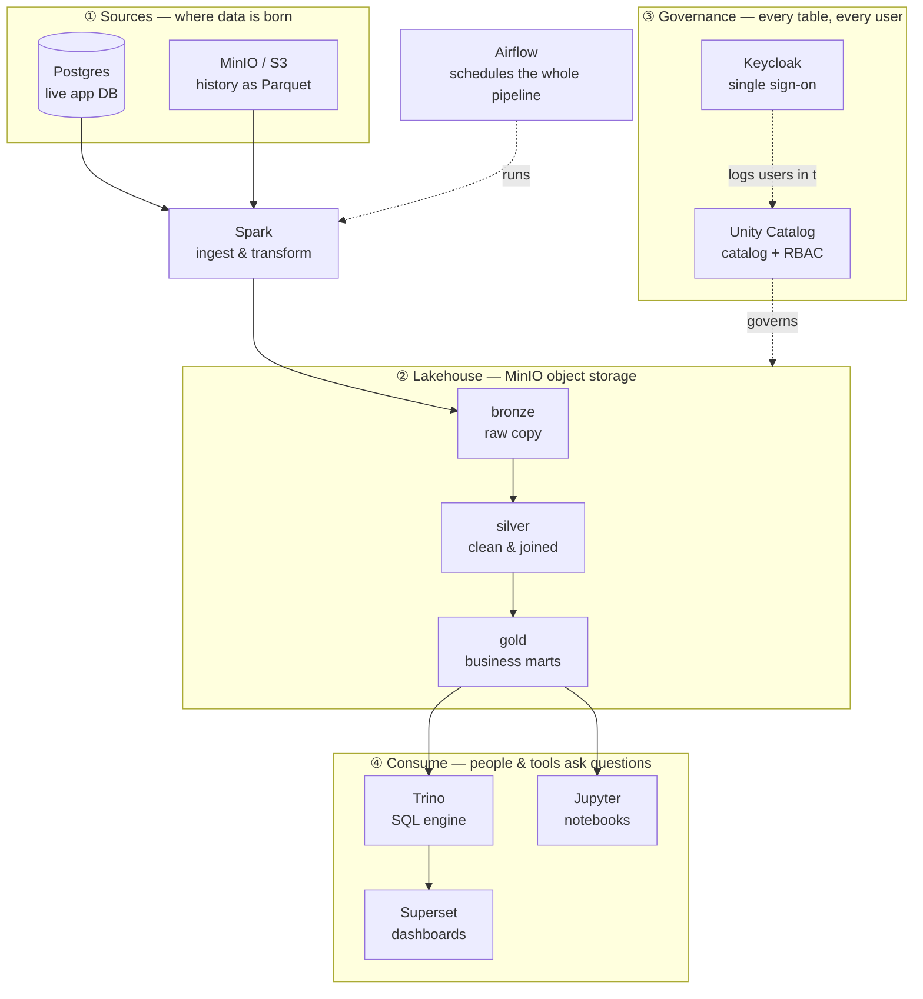

# 0 · Technical architecture

You've met the **business** ([the ShopFlow scenario](../scenario.md)) and the questions
it needs answered. This page is the **machine that answers them** — the tools in the
stack and, more importantly, **how data moves through them** from raw source to a
dashboard someone actually trusts.

!!! note "You're already inside it"
    You're reading this page *because the stack is already running* — this
    documentation is served by the same stack. So there's nothing to "install"
    here. Your job is to understand the pieces and follow the data.

## The big picture — how data moves

Read it top to bottom: raw data on the left of ①, refined step by step through ②,
policed the whole way by ③, and finally turned into answers in ④ — with **Airflow**
running the pipeline on a schedule so it stays current.

## Follow the data, step by step

1. **Sources (①).** Two kinds of raw data feed the platform: the **live Postgres
   database** (today's orders, customers, products) and **years of history** sitting
   in **MinIO** object storage as Parquet files.
2. **Ingest & transform with Spark.** **Spark** reads both sources and writes them
   into the lakehouse, refining the data in three passes (the Medallion pattern):
   **Bronze** (a raw copy), **Silver** (cleaned, typed, deduplicated, joined), and
   **Gold** (the aggregated business marts that answer ShopFlow's questions).
3. **Store in the lakehouse (②).** All three layers live as tables in **MinIO** — one
   cheap object store holding raw files *and* analytics-ready tables. That's the whole
   idea of a lakehouse.
4. **Govern everything (③).** **Unity Catalog** is the single catalog of every table
   and who may touch it; **Keycloak** proves who each user is (single sign-on). Together
   they enforce that analysts read Gold while engineers write Silver — the *same*
   rules no matter which tool does the asking.
5. **Consume (④).** The Gold layer is where value is extracted: **Trino** runs SQL over
   it, **Superset** turns that into dashboards, and **Jupyter** lets you explore with
   Spark. Each user only sees what they're granted.
6. **Orchestrate.** **Airflow** ties it together — it runs ingestion and the
   Bronze→Silver→Gold jobs on a schedule, so the answers reflect *today*, automatically.

## The components (what each tool is, and where to reach it)

| # | Tool | Its job in the flow | Local URL | Login |
|---|---|---|---|---|
| ① | **Postgres** | The live application database — a data *source* | (internal) | — |
| ① / ② | **MinIO** | S3-compatible object storage: raw history *and* the lakehouse tables | http://localhost:9001 | minioadmin / minioadmin |
| ② | **Spark** | Ingests sources and builds Bronze→Silver→Gold | http://localhost:8002 | — |
| ② | **Iceberg REST** | The lake's table catalog that Trino reads through | (internal) | — |
| ③ | **Unity Catalog** | Governs every table + per-user access (RBAC) | http://localhost:3000 | analyst / analyst |
| ③ | **Keycloak** | Single sign-on — proves who each user is | http://keycloak:8080 | admin / admin |
| ④ | **Trino** | Distributed SQL engine over the lakehouse | http://localhost:8007/ui/ | any user, no password |
| ④ | **Superset** | BI dashboards on the Gold layer | http://localhost:8004 | admin / admin |
| ④ | **Jupyter** | Notebooks (Spark) for exploration & labs | http://localhost:8008 | token `123456` |
| — | **Airflow** | Orchestrates the whole pipeline on a schedule | http://localhost:8001 | airflow / airflow |

*(On Kubernetes the URLs are `http://<tool>.de.lan` instead of `localhost` — the roles
are identical.)*

## Why it's built this way

Notice the shape: **cheap storage in the middle, many engines around it, one catalog
governing all of them.** That separation — storage decoupled from compute, governed
by a single catalog — is exactly how the big cloud platforms are built. Learning it
here means you already understand the architecture you'll meet on Databricks, Fabric,
and Snowflake later; only the logos change.

## You can now…
- Name every component in the stack and say what it does
- **Trace a single record** from a Postgres row all the way to a Superset chart
- Explain *where* data is stored, *what* moves it, and *who* is allowed to see it
