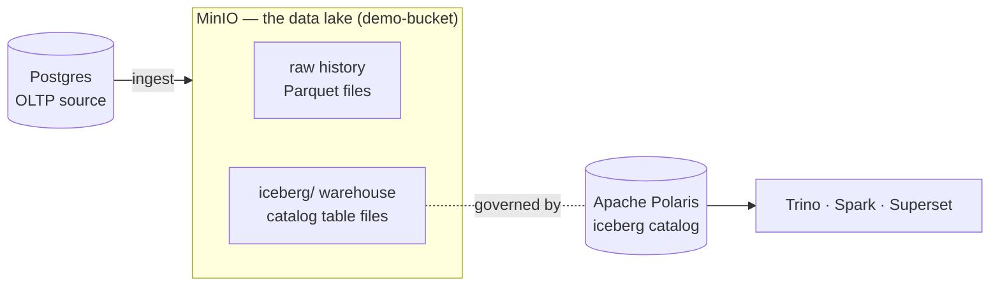

# 0.8 · Data in the stack — what's where

Before you start querying, know **what data exists and where it lives**. The stack holds data in
three places, each with a different job:



## 1. Postgres — the source database (OLTP)

The **live application database**, as ShopFlow's app would have it. This is the *source* your
pipeline ingests from.

- **Database:** `shopflow`
- **12 tables** (the ShopFlow schema — see [0.6](schema.md) for columns):

| Table | Rows | What |
|---|---|---|
| `customers` | 6,000 | who buys |
| `products` | 200 | what's sold |
| `orders` | 40,000 | orders placed |
| `order_items` | 100,000 | line items per order |
| `suppliers` | 20 | who supplies products |
| `inventory` | 200 | stock per product |
| `promotions`, `payments`, `returns`, `reviews`, `marketing_campaigns`, `support_tickets` | — | supporting tables |

**Reach it:** Trino catalog **`shopflow`** → `shopflow.public.orders` (SQL), or from a notebook via
JDBC. Example: `SELECT count(*) FROM shopflow.public.orders` → 40000.

!!! note "Other Postgres databases are platform plumbing"
    Postgres also hosts `airflow`, `superset`, `metastore`, `polarisdb`, `ucdb`, `hue` — these are
    **metastores for the tools**, not learner data. Only `shopflow` is your source data.

## 2. MinIO — the data lake (object storage)

S3-compatible storage. Browse it at the **MinIO console** (<http://localhost:9001>,
`minioadmin`/`minioadmin`). Two buckets matter:

- **`demo-bucket`** — the lake. Key paths:
  - **`shopflow/history/orders/`** — **raw historical orders** as Parquet, partitioned by `dt=`
    (~11.7k rows). Read directly: `s3a://demo-bucket/shopflow/history/orders`. This is the
    "years of history" source, alongside live Postgres.
  - **`iceberg/`** — the **warehouse** where the catalog's table files physically live (Bronze/
    Silver/Gold Parquet + Iceberg metadata). You normally read these *through the catalog*, not by
    path.
  - other prefixes (`polaris/`, `warehouse/`, `lakehouse/`, `hive/`, …) are warehouse/scratch dirs.
- **`clickstream-bucket`** — a second bucket for streaming/clickstream exercises.

**Reach it:** `spark.read.parquet("s3a://demo-bucket/…")` in a notebook ([3.9](../unit3/upload-register.md)),
or the MinIO console to browse/upload.

## 3. The `iceberg` catalog — governed lakehouse tables

The **medallion tables** your pipeline builds, registered in the **Apache Polaris** catalog and
addressed as **`iceberg.<namespace>.<table>`**. The files sit in MinIO (`demo-bucket/iceberg/…`);
the catalog makes them governed, shared tables.

| Namespace | Holds | Example tables |
|---|---|---|
| `iceberg.bronze` | raw copy of the source | `customers`, `products`, `orders`, `order_items` |
| `iceberg.silver` | cleaned, typed, joined | `orders` |
| `iceberg.gold` | business marts (aggregated) | `daily_sales`, `top_products`, `customer_ltv` |

These appear **after the pipeline runs** (Units 4–5 build them). List what's there any time:

```sql
%%sql
SHOW NAMESPACES IN iceberg
```
```sql
%%sql
SHOW TABLES IN iceberg.gold
```

**Reach it:** SQL (`%%sql` / Trino), Spark (`spark.table("iceberg.gold.daily_sales")`), Superset
dashboards, and the Polaris Console — one governed copy, every engine.

## The whole picture

| Where | What | How you read it |
|---|---|---|
| **Postgres** (`shopflow`) | live OLTP source — 12 tables | Trino `shopflow.*`, JDBC |
| **MinIO** `demo-bucket/shopflow/history` | raw history (Parquet) | `s3a://…` in Spark |
| **MinIO** `demo-bucket/iceberg` | catalog table files | via the catalog (not by path) |
| **`iceberg` catalog** (Polaris) | Bronze/Silver/Gold tables | `%%sql`, Spark, Trino, Superset |

**The flow:** raw data starts in **Postgres** (live) and **MinIO history** (Parquet) → the pipeline
ingests and refines it into **Bronze → Silver → Gold** tables in the **`iceberg` catalog** → engines
read the Gold tables for analytics.

## You can now…
- Name the **three** places data lives (Postgres, MinIO lake, iceberg catalog) and what each holds
- Tell **source** data (Postgres, raw history) from **refined** data (Bronze/Silver/Gold tables)
- Pick the right access path for each — Trino `shopflow.*`, `s3a://…`, or `iceberg.<ns>.<table>`
