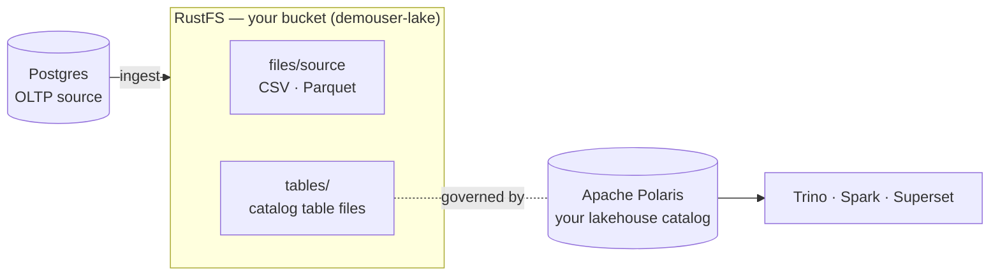

# 0.8 · Data in the stack — what's where

Before you start querying, know **what data exists and where it lives**. The stack holds data in
three places, each with a different job:


```mermaid
flowchart LR
  PG[(Postgres<br/>OLTP source)] -->|ingest| LAKE
  subgraph LAKE["RustFS — your bucket (demouser-lake)"]
    RAW[files/source<br/>CSV · Parquet]
    ICE[tables/<br/>catalog table files]
  end
  ICE -. governed by .- POL[(Apache Polaris<br/>your lakehouse catalog)]
  POL --> ENG[Trino · Spark · Superset]
```

## 1. Postgres — the source database (OLTP)

The **live application database**, as ShopFlow's app would have it. This is the *source* your
pipeline ingests from.

- **Database:** `shopflow`
- **12 tables** (the ShopFlow schema — see [0.6](schema.md) for columns):

| Table | Rows | What |
|---|---|---|
| `customers` | 6,000 | who buys |
| `products` | 200 | what's sold |
| `orders` | 40,000 | orders placed |
| `order_items` | 100,000 | line items per order |
| `suppliers` | 20 | who supplies products |
| `inventory` | 200 | stock per product |
| `promotions`, `payments`, `returns`, `reviews`, `marketing_campaigns`, `support_tickets` | — | supporting tables |

**Reach it:** Trino catalog **`shopflow`** → `shopflow.public.orders` (SQL), or from a notebook via
JDBC. Example: `SELECT count(*) FROM shopflow.public.orders` → 40000.

!!! note "Other Postgres databases are platform plumbing"
    Postgres also hosts `airflow`, `superset`, `metastore`, `polarisdb`, `ucdb`, `hue` — these are
    **metastores for the tools**, not learner data. Only `shopflow` is your source data.

## 2. RustFS — the data lake (object storage)

S3-compatible storage (RustFS — inside the stack it's reached at `http://storage:9000`). Two
kinds of bucket:

- **Your bucket, `demouser-lake`** (own account: `<username>-lake`, 100 MB) — laid out like an
  Azure / Fabric lakehouse:
  - **`files/source/shopflow/`** — practice files to ingest: `customers.csv`, `orders.csv`,
    `products.csv` (small and messy) and `sample_orders.csv`; lesson [4.2](../unit4/read-bronze.md)
    exports the raw order **history** (Parquet, partitioned by `dt=`) here too.
  - **`files/src/notebooks/`** and **`files/src/dags/`** — Jupyter's `notebooks/` and `dags/`
    folders, kept in sync (DAGs → Airflow).
  - **`tables/`** — where your catalogs keep their table files (`tables/demouser_lake/<namespace>/…`).
    You read these *through the catalog*, not by path.
- **`demo-bucket`** — the course's **shared** lake (its tables live under `warehouse/`). Instructors
  only in the console; you read it through the `shared` catalog (next section).

**Reach it:** `spark.read.csv("s3a://demouser-lake/files/source/…")` in a notebook, **📁 My files**
on the landing page (browse, preview, upload), or the **RustFS console**
(<http://localhost:9001/rustfs/console/>, sign in with your lab account — you see only your own
bucket).

## 3. Catalogs — governed lakehouse tables

Tables are registered in the **Apache Polaris** catalog service. You work with two catalogs:

| Catalog | In a notebook | In Trino / SQLPad / Superset | What it is |
|---|---|---|---|
| **Your lakehouse** | `iceberg` | `demouser_lake` | yours — starts with empty `bronze` / `silver` / `gold` plus `bronze.sample_orders`; **you** build the medallion here |
| **The course lake** | `shared` | `iceberg` | ready-made ShopFlow tables, read-only |

| Namespace | Holds | Example tables |
|---|---|---|
| `bronze` | raw copy of the source | `customers`, `products`, `orders`, `order_items` |
| `silver` | cleaned, typed, joined | `orders` |
| `gold` | business marts (aggregated) | `daily_sales`, `top_products`, `customer_ltv` |

The course lake has all of these from day one; your lakehouse gets them as you work through
Units 4–5. List what's there any time:

```sql
%%sql
SHOW TABLES IN iceberg.bronze
```
```sql
%%sql
SHOW TABLES IN shared.gold
```

**Reach it:** SQL (`%%sql` / Trino), Spark (`spark.table("iceberg.gold.daily_sales")`), Superset
dashboards, and the Polaris Console — one governed copy, every engine.

## The whole picture

| Where | What | How you read it |
|---|---|---|
| **Postgres** (`shopflow`) | live OLTP source — 12 tables | Trino `shopflow.*`, JDBC |
| **RustFS** `demouser-lake/files/source` | practice files + raw history you export | `s3a://…` in Spark, My files |
| **RustFS** `demouser-lake/tables` | your catalog's table files | via the catalog (not by path) |
| **Your lakehouse** (Polaris) | *your* Bronze/Silver/Gold tables | `iceberg.*` in notebooks, `demouser_lake.*` in Trino |
| **Course lake** (Polaris) | ready-made ShopFlow tables | `shared.*` in notebooks, `iceberg.*` in Trino |

**The flow:** raw data starts in **Postgres** (live) and **files** in your bucket → your pipeline
ingests and refines it into **Bronze → Silver → Gold** tables in **your lakehouse** → engines read
the Gold tables for analytics.

## You can now…
- Name the **three** places data lives (Postgres, your RustFS bucket, the catalogs) and what each holds
- Tell **source** data (Postgres, raw history) from **refined** data (Bronze/Silver/Gold tables)
- Pick the right access path for each — Trino `shopflow.*`, `s3a://…`, `iceberg.*` / `shared.*` in notebooks
