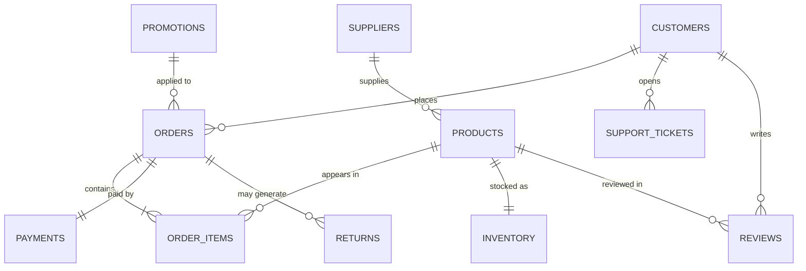

# 0.1 · The ShopFlow database schema

The [scenario](../scenario.md) told you *what* the business is. This page shows you
the **shape of its data** — the source-system schema you'll ingest from. Everything
in the course starts here: you can't build trustworthy Gold tables until you know
exactly what the raw data looks like.

ShopFlow's data is born in two very different places:

1. **The operational database (Postgres)** — the live application's relational tables.
   This is *state*: the current customers, products, orders, payments, and so on.
2. **The event stream (clickstream)** — a round-the-clock flow of *things happening*
   (searches, views, cart actions). This is *activity*, not state, and it never stops.

!!! note "What the starter data actually contains"
    The data generator seeds **all 12 relational tables** below with realistic,
    foreign-key-consistent data — the four **core** tables (`customers`, `products`,
    `orders`, `order_items`) plus every **supporting** table (`suppliers`, `inventory`,
    `payments`, `returns`, `promotions`, `marketing_campaigns`, `support_tickets`,
    `reviews`). Payments, returns and reviews are generated *from* the real orders, so
    margins, refunds, fraud scores and ratings all join up correctly. The one thing
    that is **not** a Postgres table is the **event stream** (clickstream) — that's
    covered as a streaming source later in the course.

## How the tables relate

Read the crow's-foot marks as: one customer places **many** orders; each order
contains **one or more** line items; each product can appear in **many** line items;
and so on. This is a classic **normalized OLTP** design — data split into many small
tables with no duplication, ideal for fast transactions but awkward for analytics
(which is exactly why we later stitch it back together in Silver and Gold).

---

## Core tables

### `customers` — who buys
| Column | Type | Description |
|---|---|---|
| `customer_id` | INT **PK** | Unique id for the customer |
| `full_name` | TEXT | Display name |
| `email` | TEXT (unique) | Login / contact email; a natural business key |
| `country` | TEXT | Billing country — drives currency, tax, shipping |
| `signup_date` | DATE | When they joined — the start of their lifetime |
| `loyalty_tier` | TEXT | `none` / `silver` / `gold` — loyalty status |
| `marketing_opt_in` | BOOLEAN | May we send them campaigns? |

### `products` — what's sold
| Column | Type | Description |
|---|---|---|
| `product_id` | INT **PK** | Unique id for the product |
| `name` | TEXT | Product name |
| `category` | TEXT | Grouping (Electronics, Furniture, …) |
| `price` | NUMERIC(10,2) | **Current** list price — changes over time |
| `cost` | NUMERIC(10,2) | What ShopFlow pays the supplier — **needed for margin** |
| `supplier_id` | INT **FK → suppliers** | Who supplies this product |
| `updated_at` | TIMESTAMP | Last time this row changed (price/cost edits) |

!!! tip "Why `price` lives in two places"
    `products.price` is *today's* price. But an order placed last month was paid at
    *that* month's price — so `order_items.unit_price` captures the price **at the
    moment of sale**. Confusing the two is one of the most common analytics bugs.

### `orders` — a purchase (the header)
| Column | Type | Description |
|---|---|---|
| `order_id` | INT **PK** | Unique id for the order |
| `customer_id` | INT **FK → customers** | Who placed it |
| `channel` | TEXT | `web` / `app` / `marketplace` / `wholesale` — where it came from |
| `order_ts` | TIMESTAMP | Exact time the order was placed |
| `status` | TEXT | `placed` / `shipped` / `delivered` / `cancelled` |
| `currency` | TEXT | Currency the order was priced in (`USD`, `GBP`, …) |
| `promo_id` | INT **FK → promotions** (nullable) | Discount applied, if any |

### `order_items` — the lines within an order
| Column | Type | Description |
|---|---|---|
| `order_id` | INT **FK → orders** | Which order this line belongs to |
| `product_id` | INT **FK → products** | Which product |
| `quantity` | INT | How many units |
| `unit_price` | NUMERIC(10,2) | Price **captured at order time** (not today's price) |

*Primary key: (`order_id`, `product_id`) — a product appears at most once per order.*
This is the **grain** of the data: one row per product per order. Almost every sales
metric ShopFlow cares about is built by aggregating this table.

---

## Supporting tables (the fuller business — also seeded)

### `suppliers` — who ShopFlow buys from
| Column | Type | Description |
|---|---|---|
| `supplier_id` | INT **PK** | Unique id |
| `name` | TEXT | Supplier name |
| `country` | TEXT | Where they ship from |
| `lead_time_days` | INT | Typical days from reorder to restock |

### `inventory` — current stock on hand
| Column | Type | Description |
|---|---|---|
| `product_id` | INT **PK / FK → products** | The product |
| `warehouse` | TEXT | Which warehouse holds it |
| `quantity_on_hand` | INT | Units available **right now** |
| `reorder_level` | INT | Below this, reorder from the supplier |
| `updated_at` | TIMESTAMP | Last stock change — moves fast during sales |

### `payments` — the money for an order
| Column | Type | Description |
|---|---|---|
| `payment_id` | INT **PK** | Unique id |
| `order_id` | INT **FK → orders** | Order being paid for |
| `method` | TEXT | `card` / `paypal` / `bank_transfer` … |
| `amount` | NUMERIC(10,2) | Amount charged |
| `currency` | TEXT | Currency charged in |
| `status` | TEXT | `approved` / `declined` / `refunded` |
| `fraud_score` | NUMERIC(3,2) | Risk score 0–1 assigned at checkout |
| `paid_ts` | TIMESTAMP | When payment was processed |

### `returns` — goods coming back
| Column | Type | Description |
|---|---|---|
| `return_id` | INT **PK** | Unique id |
| `order_id` | INT **FK → orders** | Original order |
| `product_id` | INT **FK → products** | Item returned |
| `quantity` | INT | Units returned |
| `reason` | TEXT | `damaged` / `wrong_item` / `changed_mind` … |
| `refund_amount` | NUMERIC(10,2) | Money refunded |
| `return_ts` | TIMESTAMP | When the return was logged |
| `status` | TEXT | `requested` / `received` / `refunded` |

### `promotions` — discount campaigns
| Column | Type | Description |
|---|---|---|
| `promo_id` | INT **PK** | Unique id |
| `code` | TEXT | Discount code customers enter |
| `description` | TEXT | Human-readable name |
| `discount_type` | TEXT | `percent` or `fixed` |
| `discount_value` | NUMERIC(10,2) | 15 (%) or 5.00 (fixed) |
| `starts_on` / `ends_on` | DATE | Active window |

### `marketing_campaigns` — spend to attract customers
| Column | Type | Description |
|---|---|---|
| `campaign_id` | INT **PK** | Unique id |
| `name` | TEXT | Campaign name |
| `channel` | TEXT | `search` / `social` / `email` / `display` |
| `spend` | NUMERIC(12,2) | Money spent |
| `starts_on` / `ends_on` | DATE | Campaign window |

*No foreign key to orders — marketing is tied back to sales by **channel and date**,
which is exactly the kind of fuzzy join analytics has to handle.*

### `support_tickets` — customer service
| Column | Type | Description |
|---|---|---|
| `ticket_id` | INT **PK** | Unique id |
| `customer_id` | INT **FK → customers** | Who raised it |
| `order_id` | INT **FK → orders** (nullable) | Related order, if any |
| `subject` | TEXT | What it's about |
| `status` | TEXT | `open` / `pending` / `resolved` |
| `opened_ts` | TIMESTAMP | When opened |
| `resolved_ts` | TIMESTAMP (nullable) | When closed |
| `csat_score` | INT (nullable) | Satisfaction 1–5 after resolution |

### `reviews` — product ratings
| Column | Type | Description |
|---|---|---|
| `review_id` | INT **PK** | Unique id |
| `customer_id` | INT **FK → customers** | Reviewer |
| `product_id` | INT **FK → products** | Product reviewed |
| `rating` | INT | 1–5 stars |
| `body` | TEXT | Free-text review |
| `created_ts` | TIMESTAMP | When posted |

---

## The event stream (clickstream)

This is **not** a Postgres table — it's the live flow of activity from the web store
and app, arriving continuously. Most events never turn into an order, but together
they're the richest signal ShopFlow has (see *"decisions that can't wait"* in the
[scenario](../scenario.md#some-decisions-cant-wait-until-tomorrow)).

Each event is a self-contained record:

| Field | Type | Description |
|---|---|---|
| `event_id` | STRING | Unique id for this event |
| `event_ts` | TIMESTAMP | When it happened (to the millisecond) |
| `session_id` | STRING | The browsing session it belongs to |
| `customer_id` | INT (nullable) | Known customer, or null if not logged in yet |
| `event_type` | STRING | `page_view` / `search` / `add_to_cart` / `remove_from_cart` / `checkout_start` / `payment_attempt` |
| `product_id` | INT (nullable) | Product involved, when relevant |
| `channel` | STRING | `web` or `app` |
| `search_term` | STRING (nullable) | The query, for `search` events |
| `payload` | JSON | Any extra event-specific detail |

Two properties make streams different from tables, and both are things you'll learn to
handle:

- **Unbounded** — there is no "all the events"; they keep coming forever.
- **Out-of-order & late** — a phone goes through a tunnel and its events arrive minutes
  later, timestamped in the past. Real-time processing has to cope with that.

---

## How the schema maps to the business questions

| Business question (from the scenario) | Tables it needs |
|---|---|
| How much did we *really* sell, net of returns? | `orders` + `order_items` + `returns` |
| What's our **profit margin**? | `order_items.unit_price` − `products.cost` |
| Which products are about to **sell out**? | `inventory` (+ recent `order_items`) |
| Which **channels/campaigns** bring profitable customers? | `marketing_campaigns` + `orders.channel` + repeat `orders` |
| Who are our **best customers**? | `customers` + `orders` + `order_items` − `returns` |
| Is *this* checkout **fraudulent**? | `payments.fraud_score` + live `event` stream |

Every one of these needs **several tables joined together** — which is precisely the
work of the Silver and Gold layers you'll build next.

## You can now…
- Read ShopFlow's schema and explain what each table and key column means
- Tell the difference between **state** (the OLTP tables) and **activity** (the stream)
- Explain why `unit_price` is captured on the order and `price` lives on the product
- Point to the exact tables behind each business question
