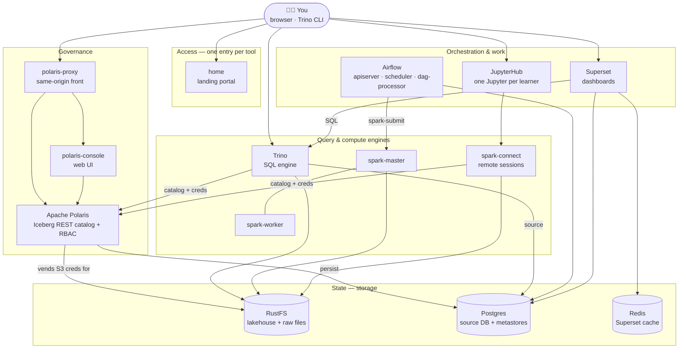

# 0.7 Stack architecture

Unit **0** showed *how data flows*. This page is the **deployment map**: every service
that runs, what it's for, how the pieces are wired, where state lives, and how the
same stack runs on **Docker Compose** (one machine) and **Kubernetes** (a cluster).

## The whole stack at a glance

```mermaid
flowchart TB
  USER([👩‍💻 You<br/>browser · Trino CLI])

  subgraph EDGE["Access — one entry per tool"]
    HOME[home<br/>landing portal]
  end

  subgraph GOV["Governance"]
    PX[polaris-proxy<br/>same-origin front]
    PC[polaris-console<br/>web UI]
    POL[Apache Polaris<br/>Iceberg REST catalog + RBAC]
    PX --> PC
    PX --> POL
    PC --> POL
  end

  subgraph ENG["Query & compute engines"]
    TR[Trino<br/>SQL engine]
    SM[spark-master] --- SW[spark-worker]
    SC[spark-connect<br/>remote sessions]
  end

  subgraph ORCH["Orchestration & work"]
    AF[Airflow<br/>apiserver · scheduler · dag-processor]
    JUP[JupyterHub<br/>one Jupyter per learner]
    SUP[Superset<br/>dashboards]
  end

  subgraph DATA["State — storage"]
    MIN[(RustFS<br/>lakehouse + raw files)]
    PGS[(Postgres<br/>source DB + metastores)]
    RDS[(Redis<br/>Superset cache)]
  end

  USER --> HOME
  USER --> TR & SUP & JUP & PX

  TR -->|catalog + creds| POL
  SC -->|catalog + creds| POL
  AF -->|spark-submit| SM
  JUP --> SC
  SUP -->|SQL| TR

  POL -->|persist| PGS
  POL -->|vends S3 creds for| MIN
  TR --> MIN
  SM --> MIN
  SC --> MIN
  TR -->|source| PGS
  AF --> PGS
  SUP --> PGS & RDS
```

Everything points at **two stores** (RustFS for tables, Postgres for the source + metadata),
with **Polaris** as the single catalog that every engine consults before touching a table.

## Components

### Storage — where state lives
| Service | What it is | Holds |
|---|---|---|
| **RustFS** | S3-compatible object store — the lakehouse (in-stack name `storage:9000`) | shared Iceberg tables + raw history (`demo-bucket/…`), and each learner's bucket `<user>-lake` (their lakehouse, notebooks, DAGs; 100 MB) |
| **Postgres** | One relational DB serving several roles | the **`shopflow`** source OLTP data; **metastores** for Polaris (`polarisdb`), Keycloak, Airflow, Superset |
| **Redis** | In-memory store | **Superset's** cache & async query results (Airflow uses LocalExecutor — no broker needed) |

### Governance — one catalog for all engines
| Service | What it is |
|---|---|
| **Apache Polaris** | The Iceberg **REST catalog** + **RBAC**. Engines ask it "does this principal may read/write this table?", and it **vends short-lived storage credentials** for the ones allowed. Accepts Polaris client id/secret logins *and* lab-account (Keycloak) tokens. Metadata persists to Postgres (`polarisdb`). |
| **polaris-console** | The catalog's **web UI** (a single-page app) — browse catalogs/namespaces/tables, manage principals, roles, and grants. |
| **polaris-proxy** | A tiny nginx front that serves the Console at `/` and proxies the API at `/api` on **one origin** (`:8189`), so the browser makes no cross-origin calls. *(On k8s the ingress does this same-origin routing instead.)* |
| **polaris-bootstrap** | A **one-shot** job that creates Polaris's schema + realm in Postgres on first start. Runs once, then exits. |

### Accounts & your workspace
| Service | What it is |
|---|---|
| **Keycloak** | The **lab accounts** (realm `de-lab`): registration, sign-in and single sign-on for every tool. Groups `learners` / `managers` decide the role inside each tool. |
| **oauth2-proxy** | Puts the home portal behind the lab-account login. |
| **home-api** | The home portal's backend: on your first sign-in it creates **your** lakehouse, bucket and SQLPad user; serves **My files** and **My catalogs**. |
| **JupyterHub** | Starts **one Jupyter per learner** (its own container / pod and work volume) with `iceberg` = that learner's lakehouse; mirrors `notebooks/` and `dags/` to `files/src/` in their bucket. |

### Engines — SQL and Spark
| Service | What it is |
|---|---|
| **Trino** | Distributed **SQL engine**. Catalogs: **`iceberg`** (→ Polaris, the lakehouse), **`shopflow`** (→ Postgres source), `system`. Connects to Polaris as admin — it's the broad-access engine for the SQL units. |
| **spark-master** | Standalone Spark **cluster manager** — schedules jobs onto workers. |
| **spark-worker** | The **executor** — runs the actual Spark tasks. |
| **spark-connect** | A long-running **Spark Connect** server so notebooks/clients get a remote Spark session without bundling Spark themselves. |

### Orchestration & work
| Service | What it is |
|---|---|
| **Airflow** | **Schedules** the pipeline (the `shopflow_medallion` DAG runs Bronze→Silver→Gold via `spark-submit`). Three processes: **apiserver** (UI/API), **scheduler**, **dag-processor**. Metadata in Postgres; **LocalExecutor**. On k8s, DAGs + shared `src/` arrive by **git-sync**. |
| **Jupyter** | **Notebooks** for exploration and the Spark labs — wired to Spark Connect and the `iceberg` catalog. |
| **Superset** | **BI dashboards** on the Gold layer — queries via Trino, caches in Redis, stores its own metadata in Postgres. |
| **home** | The **landing portal** (nginx) — one page linking every UI. Start here. |

## Access & ports

On **Compose** each tool publishes a `localhost` port; on **Kubernetes** each is an
ingress host `http://<tool>.de.lan`. Same services, same logins — one **lab account** (Keycloak
single sign-on, register on the home portal) for every tool; see [0.3](../setup/workspace.md).

| Tool | Compose URL | k8s host | Login |
|---|---|---|---|
| Home portal | http://localhost:8000 | `de.lan` | lab account (Register / sign in) · My files · My catalogs |
| Keycloak (accounts) | http://localhost:8180 | `auth.de.lan` | admin console `admin` / `admin` |
| Polaris Console | http://localhost:8189 | `polaris-console.de.lan` | lab account · `/login?local=1`: `root` / `s3cr3t` or a persona |
| Polaris API | http://localhost:8185 | `polaris.de.lan` | client id/secret |
| Trino | http://localhost:8007/ui/ | `trino.de.lan` | any user, no password |
| Superset | http://localhost:8004 | `superset.de.lan` | lab account |
| SQLPad | http://localhost:8003 | `sqlpad.de.lan` | lab account |
| Jupyter (JupyterHub) | http://localhost:8008 | `jupyter.de.lan` | your lab account (own Jupyter + own lakehouse) |
| Airflow | http://localhost:8001 | `airflow.de.lan` | lab account (DAGs also from your bucket's `files/src/dags/`) |
| RustFS console (object store) | http://localhost:9001/rustfs/console/ | `storage.de.lan/rustfs/console/` | lab account (your own bucket) · root `admin` / `admin123` |
| Spark master UI | http://localhost:8002 | `spark.de.lan` | — |

!!! warning "On a team stack these admin logins are private"
    The admin passwords above are the defaults of **your own laptop stack**, where you are the admin.
    On a shared team stack (Kubernetes) every admin and service password is a random value in
    the cluster's `de-stack-secrets` — only your **platform manager** has them. Learners sign in
    with their own lab account, and use PostgreSQL as `learner` / `learner`.

Internal wiring uses service names on a shared network: `polaris:8181`, `storage:9000`,
`postgres:5432`, `spark://spark-master:7077`, `sc://spark-connect:15002`.

## Persistence

State survives restarts; only a deliberate teardown wipes it.

- **RustFS volume** — all lakehouse tables + raw files + every learner's bucket.
- **Postgres volume** — source data + every metastore (incl. Polaris' `polarisdb`, so the
  catalog, principals, and grants persist).
- **Each learner's Jupyter work volume** (and the Hub's own small database), Spark working dirs,
  and Superset's home.

On Compose these are named Docker volumes; on k8s they're PersistentVolumeClaims
(`microk8s-hostpath`). `make down` (Compose) removes volumes — use `stop` to keep data.

## Compose vs. Kubernetes

| | **Docker Compose** | **Kubernetes** (MicroK8s) |
|---|---|---|
| Unit | containers on the `sparknet` network | pods in namespace `de-stack` |
| Reach a UI | `localhost:<port>` | nginx **ingress** at `*.de.lan` |
| Code/DAGs | bind-mounted from `local/code` | **git-sync** of the shared repo (DAGs + `src/`) |
| Images | built/pulled locally | imported to the node (`microk8s images import`) |
| Config | compose files + `configs/` | Helm chart `de-stack` (values + templates) |
| Postgres | a stack container | in-cluster Postgres |

Pick the tab that matches your setup on the [deploy page](../setup/deploy.md) — the
lakehouse, the catalog, and the lessons are identical either way.

## What's intentionally *not* running

The stack is trimmed to the **governed lakehouse** set. These are present in the repo
but disabled by default (re-enable if a lesson needs them):

- **An alternative catalog** — evaluated earlier; **paused** in favour of Polaris (revisit later).
- **Keycloak** — an external SSO/identity server; **dropped** for training (principals log in with a client id/secret; an IdP is the production path).
- **iceberg-rest** — the earlier ungoverned catalog; **folded into Polaris** (one catalog now).
- **Kafka / Kafka-Connect / Kafka-UI, ClickHouse, Hive Metastore, Hue** — not needed for this course's batch/lakehouse focus.

## You can now…
- Name **every service** in the stack and what it's responsible for
- Explain how engines reach data: **catalog via Polaris**, **bytes via RustFS**, gated by **grants**
- Say **where state lives** (RustFS + Postgres) and what survives a restart
- Describe how the **same stack** maps from Docker Compose to Kubernetes
