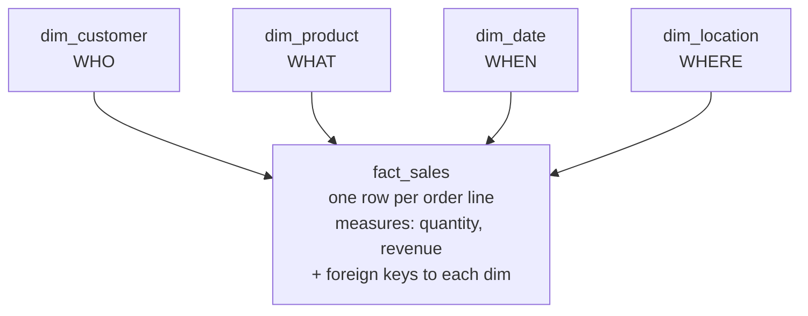

# 1.5 Dimensional modeling: facts & dimensions

## Why this unit exists
Picture a Monday-morning request from your head of sales:

> *"Show me **revenue** and **units sold**, broken down **by product category**, **by month**, for
> customers in the **west region** — and let me drill from category into individual products."*

That one sentence is the whole of analytics in miniature: **one number** (revenue) looked at
**through several lenses** (category, month, region). Dimensional modeling is the way we shape data
so questions like this are *trivial* to answer — a single, predictable query instead of a
twelve-table archaeology dig. This unit explains **what** the model is, and, more importantly,
**why** it takes the shape it does.

## First, the real problem: OLTP is built for the opposite job
The ShopFlow app database (the source, an **OLTP** system) is designed to *run the business*: place
an order, take a payment, update an address. To do that safely it is **normalized** (3rd normal
form) — every fact of life is stored **exactly once**, split across many small tables, linked by
keys. That's perfect for **writes**: no duplication to keep in sync, a changed address updates *one*
row.

But it makes **analytics** painful. To answer the sales request above you'd join `orders` →
`order_items` → `products` → `categories` → `customers` → `regions` → a calendar… a dozen tables,
carefully, without double-counting, every single time. Normalization optimizes the thing analytics
doesn't do (writes) and fights the thing analytics *is* (large read-only aggregations over history).

**OLTP and OLAP are two different jobs**, and they want two different shapes:

| | **OLTP** (the app / source) | **OLAP** (analytics / the warehouse) |
|---|---|---|
| Purpose | *run* the business — transactions | *understand* the business — analysis |
| Typical query | "fetch / update **this one** order" | "sum revenue across **millions** of orders" |
| Reads vs writes | many tiny reads **and writes** | few **huge, read-only** scans |
| Rows touched per query | a handful | millions |
| Optimized for | **write** safety, no redundancy | **read** speed, simple queries |
| Data shape | **normalized** (many small tables) | **denormalized** (few wide tables — a star) |
| Freshness | live, to-the-second | batch, "as of last load" — and **keeps history** |
| Example here | ShopFlow app DB (Postgres) | `iceberg.gold.*` marts (Trino/Spark/Superset) |

Dimensional modeling is simply **the read-optimized shape** — the one you build in
[Gold](medallion.md) so the OLAP job is easy.

## The core idea
Ralph Kimball's insight (1990s, still the industry standard) is deceptively simple:

> **Numbers go in *facts*. Context goes in *dimensions*.**

Separate the *measurements of what happened* from the *descriptions of the things involved*. Put a
single **fact table** in the middle and surround it with **dimension tables**. That shape — a fact
at the center, dimensions radiating out like points of a star — is the **star schema**.



Read a question against it and the mapping is direct: **the measure** you want is in the fact
(*revenue*), and every **"by …"** is a dimension (*by category, by month, by region*).

## Why a *fact* table is called a "fact"
A **fact** is something that is **true because it happened**: *an order line for 2 units at ₹499
was sold on 2024-03-15 to customer #7*. It's a **record of a business event** — and events are
**immutable history**. You never go back and edit "that sale happened"; you only ever record **new**
events. That single idea explains everything about how fact tables look and behave:

- **They hold measures** — the *numbers* the event produced (quantity, amount, revenue). Measures
  are what you `SUM`/`COUNT`/`AVG`.
- **They hold foreign keys** — thin links to the dimensions (which customer, product, date), and
  little else.
- **They are append-only and ever-growing** — new events insert; old ones don't change. This is why
  a fact table is **tall and narrow**: *millions/billions of rows, very few columns.*
- **Each row is one event at one grain** (see below).

> **Rule of thumb:** if you `SUM()`/`COUNT()`/`AVG()` a column, it's a **measure** → it belongs in
> the fact. In ShopFlow, `order_items` (one row per sale line) is the fact; `quantity` and
> `unit_price` are its measures.

## Why a *dimension* table is called a "dimension"
The word is literal — it comes from **geometry**. Each dimension is an **independent axis** along
which you can vary a measurement. "Revenue" is just a number; but revenue *by product*, *by time*,
*by region* — each **"by X"** is an **axis of analysis**. Picture the data as a **cube**: product
along one edge, time along another, region along a third, and every little cell holds the measure
for that combination. That mental picture is the **OLAP cube**, and it's exactly what a star schema
implements — the **dimensions are the edges, the fact holds the cells.**

```
                 revenue in each cell
      time ─────────────────────────▶
   region                              A dimension table just
    │   ┌───┬───┬───┬───┐             enumerates the values
    │   │   │ ₹ │   │   │             along ONE edge (every
    ▼   ├───┼───┼───┼───┤             product / date / region)
        │   │   │ ₹ │   │             plus DESCRIPTIVE columns
        └───┴───┴───┴───┘             you filter & group by.
             product ▲ (into the page)
```

A **dimension table** is the catalog of one axis: one row per **thing** (one customer, one product,
one day) with lots of **descriptive attributes** — `customers.country`, `products.category`,
`date.month`, `date.is_weekend`. Those attributes are the labels you **filter by** and **group by**.
Because there are relatively few things but many ways to describe them, dimensions are **short and
wide**: *few rows, many columns.*

Everyday OLAP verbs are just moves on that cube — and each maps to plain SQL:

| Cube operation | What it means | In SQL |
|---|---|---|
| **Slice** | fix one dimension to a single value | `WHERE region = 'west'` |
| **Dice** | pick a sub-range on several dimensions | `WHERE region IN (…) AND month BETWEEN …` |
| **Roll-up** | aggregate *up* a hierarchy (day → month → year) | `GROUP BY year` |
| **Drill-down** | the reverse — go to finer detail | `GROUP BY year, month, day` |
| **Pivot** | swap which dimension is on which axis | move a column between `SELECT`/`GROUP BY` |

## The two roles, side by side
Every analytical table is **one or the other** — and knowing which is your first modeling decision.

| | **Fact table** | **Dimension table** |
|---|---|---|
| Holds | **measurements** of business **events** | **descriptive context** about **things** |
| Answers | *how much / how many* | *by what / who / where / when* |
| Columns | numeric **measures** + **foreign keys** to dims | **attributes** (mostly text) for filter & group |
| Grain | one **event** (an order line, a payment) | one **thing** (a customer, a product, a day) |
| Shape | **tall & narrow** — millions of rows, few cols | **short & wide** — few rows, many descriptive cols |
| Lifecycle | mostly **inserts** (new events) | mostly **updates** (a customer moves city) |
| ShopFlow example | `order_items`, `payments` | `customers`, `products`, a date dimension |

## Grain — decide it first, before anything else
The **grain** is the answer to *"what does one fact row represent?"* — and it is the **single most
important decision** in the whole model, because everything else follows from it: which dimensions
apply, and what each measure *means*.

For ShopFlow sales the grain is **one order line**. So `order_items` is the fact, with measures
`quantity` and `unit_price` (and a derived `line_revenue = quantity * unit_price`). Choose it
**explicitly and first** — "one row per order line," not "sales data."

!!! danger "Get the grain wrong and every total is wrong"
    Mixing grains is *the* classic bug. Join a one-row-per-**order** table to a
    one-row-per-**line** table and an order-level number (like `orders.total`) gets **counted once
    per line** — the **fan-out** trap from [2.5](../unit2/conditional.md) /
    [2.9](../unit2/adventureworks-challenge.md). **One fact table = one grain. Never mix.** If you
    need order-level *and* line-level facts, that's **two** fact tables.

## Measures aren't all equal — additivity
How you're allowed to add a measure up depends on its nature. Getting this wrong produces numbers
that look fine and are quietly nonsense.

- **Additive** — sums across *every* dimension (revenue, quantity). The easy, ideal case.
- **Semi-additive** — sums across some dimensions but **not time** (an account balance, inventory
  on hand). You don't add Monday's balance to Tuesday's — you take the *latest*, or an average.
- **Non-additive** — ratios and percentages (margin %, conversion rate). **Never sum these.** Store
  the *components* (numerator and denominator) as additive measures and compute the ratio **at query
  time**: `sum(profit) / sum(revenue)`, not `avg(margin_pct)`.

## Dimensions in depth: surrogate keys, the date dimension, hierarchies

### Surrogate keys
Give each dimension row a stable integer primary key **of your own making** (`customer_sk`),
separate from the source's natural/business key (`customer_id` from the app). Why bother? It
**decouples** Gold from source quirks (re-used IDs, format changes), keeps joins **fast** (integer
compares), and — crucially — is what lets you keep **history**.

*Example — one real customer, two versions after they move city:*

| customer_sk | customer_id | name | city   | valid_from | valid_to   | is_current |
|:-----------:|:-----------:|------|--------|------------|------------|:----------:|
| **41**      | C-7         | Ada  | Delhi  | 2023-01-01 | 2024-06-30 | false      |
| **88**      | C-7         | Ada  | Mumbai | 2024-07-01 | 9999-12-31 | true       |

Same **natural** key `C-7`, two **surrogate** keys. A sale from **March 2024** stores
`customer_sk = 41`, so it forever joins to *Delhi*; a sale from **August** stores `88` → *Mumbai*.
The surrogate key is what makes *"revenue by the city the customer lived in **at the time**"*
possible — see [SCD2](../recipes/scd2.md). With only the natural key `C-7` you could store just
*one* city, and that history would be lost the moment Ada moved.

### The date dimension
The one dimension **every** star needs: one row per day, with the calendar **pre-computed** so date
questions become plain `GROUP BY`s — no date arithmetic scattered through every query, and one
shared definition of "Q1", "weekend", and "holiday".

*Example rows:*

| date_sk  | date       | year | quarter | month | month_name | day_of_week | is_weekend | is_holiday |
|:--------:|------------|:----:|:-------:|:-----:|------------|-------------|:----------:|:----------:|
| 20240315 | 2024-03-15 | 2024 | Q1      | 3     | March      | Fri         | false      | false      |
| 20240316 | 2024-03-16 | 2024 | Q1      | 3     | March      | Sat         | true       | false      |

The fact stores the integer `date_sk` (e.g. `20240315`). "Sales by quarter" is then trivial:

```sql
SELECT d.year, d.quarter, sum(f.line_revenue) AS revenue
FROM   fact_sales f
JOIN   dim_date   d ON d.date_sk = f.date_sk
GROUP  BY d.year, d.quarter
ORDER  BY d.year, d.quarter;
```

…instead of re-deriving the calendar in *every* query (`EXTRACT(QUARTER FROM order_date)`, custom
fiscal periods, weekend `CASE`s, holiday lookups). Compute it **once** in the dimension, reuse it
everywhere.

### Hierarchies
Dimensions carry natural roll-up paths — **day → month → quarter → year**, or **product →
subcategory → category**. Store **every level as its own column** so moving up or down the hierarchy
is a one-line `GROUP BY` change — no joins, no re-modeling.

*Example — `dim_product` with its hierarchy flattened onto each row:*

| product_sk | product_id | product_name | subcategory   | category | brand  |
|:----------:|:----------:|--------------|---------------|----------|--------|
| 42         | P-100      | Trail Runner | Running Shoes | Footwear | Terra  |
| 57         | P-205      | City Slip-On | Casual Shoes  | Footwear | Terra  |
| 63         | P-330      | Rain Jacket  | Outerwear     | Apparel  | Nimbus |

**Roll-up** (coarser) and **drill-down** (finer) are the *same* query with a different `GROUP BY`:

```sql
-- roll-up: revenue by CATEGORY (Footwear, Apparel, …)
SELECT p.category, sum(f.line_revenue) AS revenue
FROM   fact_sales f JOIN dim_product p ON p.product_sk = f.product_sk
GROUP  BY p.category;

-- drill-down: same measure, finer grain — category → subcategory → product
SELECT p.category, p.subcategory, p.product_name, sum(f.line_revenue) AS revenue
FROM   fact_sales f JOIN dim_product p ON p.product_sk = f.product_sk
GROUP  BY p.category, p.subcategory, p.product_name;
```

!!! note "Star vs snowflake"
    A **star** keeps each dimension **flat and denormalized** (category lives as a column right on
    `dim_product`). A **snowflake** re-normalizes dimensions into sub-tables (`dim_product` → 
    `dim_category`). Stars win for analytics: fewer joins, simpler queries, and small flat
    dimensions **broadcast** cheaply. Prefer the star unless a dimension is genuinely huge or shared
    in a way that forces normalization.

## Why denormalizing into a star pays off
Trading the OLTP model's tidy non-redundancy for a few wide tables buys you:

- **Simple, uniform queries** — every question is "the fact + a handful of dimension joins," always
  the same shape. Analysts and BI tools don't need to know the source's internals.
- **Speed** — the fact is narrow (fast to scan); dimensions are small enough to **broadcast** to
  every worker (the [broadcast join](../unit4/spark-architecture.md) — small dims shipped to the big
  fact, no shuffle). Columnar storage + partitioning ([4.4](../unit4/spark-sql-gold.md)) then prune
  most of the fact away.
- **Business-friendly** — [Superset](../unit7/dashboards.md) and every BI tool are *built* to point
  at a star; drag a measure onto a chart, split by a dimension, done.
- **One version of the truth** — a **conformed dimension** (a single `dim_customer` reused by the
  sales fact, the returns fact, the support fact) means "customer" means the *same thing* in every
  report, so numbers **reconcile** across the business.

## Dimensional integrity — and why it's critical
**Referential integrity** = every foreign key in a fact **resolves to a real row** in its
dimension. No orphans. This sounds like housekeeping; it's actually the line between a report you can
**trust** and one that's quietly, invisibly **wrong**.

**What goes wrong without it** — say an `order_items` row references a `product_id` that isn't in
`products`:

- With an **`INNER JOIN`** (the usual fact→dim join) that line is **silently dropped** — its revenue
  **vanishes** from every product report. Totals come out too *low* and **nothing errors**.
- With a **`LEFT JOIN`** the product attributes come back **`NULL`** — revenue lands in an ugly
  "(null)" bucket and category totals don't tie out.

Either way, **one orphaned key can make a dashboard wrong and no one notices.** So integrity is
*guarded*, not assumed:

- **Load dimensions before facts.** A fact should never reference a dimension row that doesn't exist
  yet.
- **Never leave a foreign key `NULL`.** Point missing/unknown keys at a dedicated **"Unknown" member**
  (a surrogate key like `-1`, `name = 'Unknown'`) so facts never orphan **and the total still adds
  up** — the mystery revenue is *visibly* attributed to "Unknown" instead of disappearing.
- **Handle late-arriving dimensions** — if a fact arrives before its dimension row, stage it against
  the Unknown member and re-point it once the dimension lands.
- **Keep history with SCD** — a [slowly changing dimension (Type 2)](../recipes/scd2.md) keeps old
  versions of a row, so a fact joins to the dimension **as it was at event time** (the customer's
  city *when they ordered*, not today's). This is why surrogate keys matter.
- **Validate it** — a fact-to-dimension orphan check should return **0**, run as a data-quality gate:

    ```sql
    -- Any order line whose product_id has no matching product? (want: 0)
    SELECT count(*) AS orphan_lines
    FROM shopflow.public.order_items oi
    LEFT JOIN shopflow.public.products p ON p.product_id = oi.product_id
    WHERE p.product_id IS NULL;
    ```

    On ShopFlow this returns `0` (customers→orders too) — the model is clean. Wire it into the
    pipeline so a broken key **fails the build** instead of silently skewing a dashboard.

## In this stack
- **ShopFlow's Gold marts** (`iceberg.gold.daily_sales`, `customer_ltv`, `top_products`) are the
  *aggregated outputs*; the star that feeds them is **fact = `order_items`** (grain: one line) with
  **dims = customer, product, date**.
- You build that star in [Unit 4 (Spark → Gold)](../unit4/spark-sql-gold.md), query it in
  [Unit 2](../unit2/joins-aggregations.md), and visualize it in
  [Superset](../unit7/dashboards.md).
- The [SCD2 recipe](../recipes/scd2.md) shows how to keep dimension history.

## Key terms, at a glance
| Term | Plain meaning |
|---|---|
| **OLTP** | Transaction system that *runs* the business; normalized, write-optimized (the source) |
| **OLAP** | Analytical workload that *understands* the business; denormalized, read-optimized |
| **Star schema** | A central fact table joined to surrounding dimension tables |
| **Fact table** | Measurements of business **events**; measures + foreign keys; one row per event; tall & narrow |
| **Dimension table** | Descriptive context (who/what/where/when) — one axis of analysis; short & wide |
| **Measure** | A numeric value you aggregate (additive / semi-additive / non-additive) |
| **Grain** | What one fact row represents — decide it **first**; one fact = one grain |
| **OLAP cube** | The mental model: measures in cells, dimensions as edges; slice/dice/roll-up/drill-down |
| **Surrogate key** | A stable integer PK you assign to a dimension, separate from the source key |
| **Conformed dimension** | One shared dimension reused by many facts → consistent definitions |
| **Referential integrity** | Every fact foreign key resolves to a real dimension row (no orphans) |
| **Unknown member** | A placeholder dimension row that missing keys point at, so totals still tie |
| **SCD** | Slowly changing dimension — keeps history so facts join to the right version |

## You can now…
- Explain **why** analytics needs a different shape than the app DB — **OLTP vs OLAP**, writes vs
  reads, normalized vs denormalized
- Say **why a fact is a fact** (an immutable record of a business event → measures, append-only,
  tall & narrow) and **why a dimension is a dimension** (an axis of analysis → the OLAP cube)
- Tell a fact from a dimension, and pick the right **grain** before modeling anything
- Classify measures as **additive / semi-additive / non-additive** and aggregate them correctly
- Explain surrogate keys, the date dimension, and star vs snowflake
- Say why **referential integrity** matters — how one orphan key silently breaks a total — and how
  Unknown members, load order, and orphan checks protect it
- Map ShopFlow onto a star (fact `order_items`; dims customer/product/date) feeding the Gold marts

!!! tip "🎯 Dimensional modeling is universal"
    Facts, dimensions, and the star schema are **Kimball** — engine-agnostic. **Databricks**,
    **Snowflake**, and **Microsoft Fabric** all model their Gold/warehouse layer as facts +
    dimensions; the concepts and even most SQL are identical. Only the physical details differ
    (surrogate-key generation, `MERGE` for SCD, clustering/partitioning).
