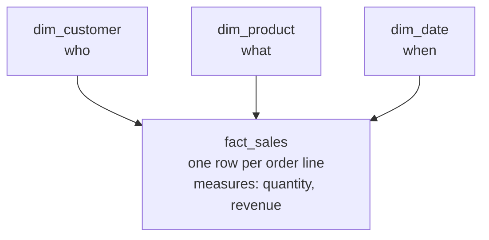

# 1.5 Dimensional modeling: facts & dimensions

## Concept
[Gold](medallion.md) isn't just "aggregated data" — it's usually **modeled** as a **star
schema**: one central **fact table** holding the *measurements*, surrounded by **dimension
tables** holding the *descriptive context*. This is the model that BI tools and analysts expect,
and it's why a well-built Gold layer is both **fast to query** and **easy to reason about**.

The idea (from Ralph Kimball's *dimensional modeling*) is deceptively simple: **numbers go in
facts, context goes in dimensions.**



That shape — a fact in the middle, dimensions radiating out like points of a star — is the
**star schema**.

## The two roles
Every analytical table is one of two things. Knowing which is the first modeling decision you make.

| | **Fact table** | **Dimension table** |
|---|---|---|
| Holds | **measurements** of business events | **descriptive context** |
| Answers | *how much / how many* | *by what / who / where / when* |
| Columns | numeric **measures** + **foreign keys** to dims | **attributes** (mostly text) for filtering & grouping |
| Grain | one **event** (an order line, a payment) | one **thing** (a customer, a product, a day) |
| Shape | **tall & narrow** — millions of rows, few columns | **short & wide** — few rows, many descriptive columns |
| Changes | mostly **inserts** (new events) | mostly **updates** (a customer moves city) |
| ShopFlow example | `order_items` (a sale line), `payments` | `customers`, `products`, a date dimension |

**Rule of thumb:** *if you `SUM()`/`COUNT()`/`AVG()` it, it's a **measure** (fact); if you filter
by it or put it in `GROUP BY`, it's a **dimension attribute**.*

### Grain — decide it first, before anything else
The **grain** is *what one fact row represents*. For ShopFlow sales, the grain is **one order
line** — so `order_items` is the fact, with measures `quantity` and `unit_price` (and derived
`line_revenue = quantity * unit_price`). Everything else follows from the grain: which dimensions
apply, and what a measure means.

!!! danger "Get the grain wrong and every total is wrong"
    Mixing grains is the classic bug — join a one-row-per-order table to a one-row-per-line table
    and an order-level number (like `orders.total`) gets **counted once per line** (the **fan-out**
    trap from [2.5](../unit2/conditional.md) / [2.9](../unit2/adventureworks-challenge.md)). One
    fact table = **one grain**. Never mix.

### Measures aren't all equal
- **Additive** — sum across *every* dimension (revenue, quantity). The easy, ideal case.
- **Semi-additive** — sum across some dimensions but **not time** (an account balance, inventory
  on hand: you don't add Monday's + Tuesday's balance).
- **Non-additive** — ratios/percentages (margin %, conversion rate). **Never sum these** — store
  the *components* (numerator, denominator) as additive measures and compute the ratio at query time.

### Dimensions & surrogate keys
Dimensions carry the attributes you slice by — `customers.country`, `products.category`,
`date.month`. Two conventions matter:

- **Surrogate keys** — give each dimension row a stable integer primary key of *your* making,
  separate from the source's natural/business key (`customer_id` from the app). It decouples Gold
  from source quirks, makes joins fast, and is what lets you keep **history** (below).
- **A date dimension** — the one dimension every star needs. A table with one row per day plus
  `year`, `quarter`, `month`, `day_of_week`, `is_weekend`, `is_holiday` — so "sales by quarter"
  or "weekday vs weekend" is a simple `GROUP BY`, no date arithmetic in every query.

## Why dimensional modeling matters
Source systems (OLTP, like the ShopFlow app DB) are **normalized** (3NF): data split across many
small tables to make *writes* safe and non-redundant. Great for an app, painful for analytics —
answering one business question means joining a dozen tables. Dimensional models **denormalize**
for *reads*:

- **Simple queries** — a star is a fact plus a handful of dimension joins, always the same shape.
- **Fast** — the fact is narrow; dimensions are small enough to **broadcast** to every worker (the
  [broadcast join](../unit4/spark-architecture.md) — small dims, big fact stays put).
- **Business-friendly** — analysts and BI tools ([Superset](../unit7/dashboards.md)) slice and
  dice by dimension attributes without knowing the source's internals.
- **One version of the truth** — a **conformed dimension** (one `dim_customer` shared by the
  sales fact, the returns fact, the support fact) means "customer" means the *same thing*
  everywhere, so numbers reconcile across reports.

## Dimensional integrity — and why it's critical
**Referential integrity** = every foreign key in a fact **resolves to a real row** in its
dimension. No orphans. This sounds like housekeeping; it's actually the difference between a
report you can trust and one that's quietly wrong.

**What goes wrong without it** — say a `order_items` row references a `product_id` that isn't in
`products`:

- With an **`INNER JOIN`** (the usual fact→dim join), that line is **silently dropped** — its
  revenue **vanishes** from every product report. Your totals are too *low* and nothing errors.
- With a **`LEFT JOIN`**, the product attributes come back **`NULL`** — the revenue lands in an
  ugly **"(unknown)"** bucket and category totals don't tie out.

Either way, **a single orphaned key can make a dashboard wrong and no one notices**. That's why
integrity is guarded, not assumed:

- **Load dimensions before facts.** A fact should never reference a dimension row that doesn't
  exist yet.
- **Never leave a foreign key `NULL`.** Point missing/unknown keys at a dedicated **"Unknown"
  member** (a surrogate key like `-1`, `name = 'Unknown'`) so facts never orphan *and* the total
  still adds up — the mystery revenue is visibly attributed to "Unknown" instead of disappearing.
- **Handle late-arriving dimensions** — if the fact arrives before its dimension row, stage it
  against the Unknown member and re-point it once the dimension lands.
- **Keep history with SCD** — a [slowly changing dimension (Type 2)](../recipes/scd2.md) keeps
  old versions of a row so a fact joins to the dimension **as it was at event time** (the
  customer's city *when they ordered*, not today's).
- **Validate it** — a fact-to-dimension orphan check should return **0**:

    ```sql
    -- Any order line whose product_id has no matching product? (want: 0)
    SELECT count(*) AS orphan_lines
    FROM shopflow.public.order_items oi
    LEFT JOIN shopflow.public.products p ON p.product_id = oi.product_id
    WHERE p.product_id IS NULL;
    ```

    On ShopFlow this returns `0` (customers→orders too) — the model is clean. Run it as a
    **data-quality gate** in your pipeline so a broken key fails the build instead of silently
    skewing a dashboard.

## In this stack
- **ShopFlow's Gold marts** (`iceberg.gold.daily_sales`, `customer_ltv`, `top_products`) are the
  *aggregated outputs*; the star that feeds them is **fact = `order_items`** (grain: one line) with
  **dims = customer, product, date**.
- You build that star in [Unit 4 (Spark → Gold)](../unit4/spark-sql-gold.md) and query it in
  [Unit 2](../unit2/joins-aggregations.md); [Superset](../unit7/dashboards.md) dashboards read it.
- The [SCD2 recipe](../recipes/scd2.md) shows how to keep dimension history.

## Key terms, at a glance
| Term | Plain meaning |
|---|---|
| **Star schema** | A central fact table joined to surrounding dimension tables |
| **Fact table** | The measurements of business events; measures + foreign keys; one row per event |
| **Dimension table** | Descriptive context (who/what/where/when) you filter and group by |
| **Grain** | What one fact row represents — decide it first; one fact = one grain |
| **Measure** | A numeric value you aggregate (additive / semi-additive / non-additive) |
| **Surrogate key** | A stable integer PK you assign to a dimension, separate from the source key |
| **Conformed dimension** | One shared dimension reused by many facts → consistent definitions |
| **Referential integrity** | Every fact foreign key resolves to a real dimension row (no orphans) |
| **Unknown member** | A placeholder dimension row missing keys point at, so totals still tie |
| **SCD** | Slowly changing dimension — keeps history so facts join to the right version |

## You can now…
- Tell a **fact** from a **dimension**, and pick the right **grain** before modeling
- Explain why analytics **denormalizes** into a star (simplicity, speed, business-friendliness)
- Classify measures as **additive / semi-additive / non-additive**
- Say why **referential integrity** matters — how one orphan key silently breaks a total — and how
  Unknown members, load order, and orphan checks protect it
- Map ShopFlow onto a star (fact `order_items`; dims customer/product/date) feeding the Gold marts

!!! tip "🎯 Dimensional modeling is universal"
    Facts, dimensions, and the star schema are **Kimball** — engine-agnostic. **Databricks**,
    **Snowflake**, and **Microsoft Fabric** all model their Gold/warehouse layer as facts +
    dimensions; the concepts and even most SQL are identical. Only the physical details differ
    (surrogate-key generation, `MERGE` for SCD, clustering/partitioning).
