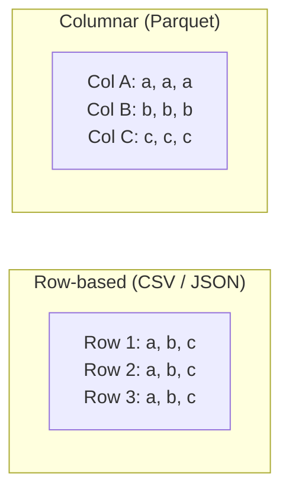
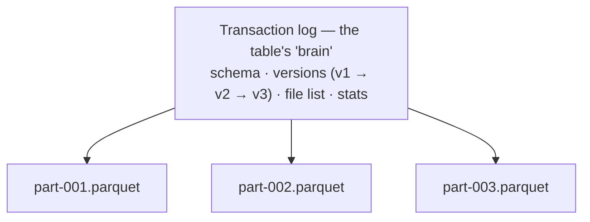

# 1.3 File & table formats

## Concept
In [1.2](lakehouse.md) you learned a lakehouse = **object storage + a table format + a
catalog**. This page zooms into the storage layers. Two very different things both get
called "format" — keep them straight:

- **File format** — how the *bytes of one file* are laid out on disk (CSV, JSON, Parquet).
- **Table format** — how *many files together* are made to behave like one reliable
  **table** (Delta, Iceberg).

The file format decides how efficiently you read raw data; the table format decides
whether you can trust and update it.

## File formats — how bytes sit on disk

### Row-based vs columnar
The single biggest idea here. The *same data* can be stored two ways:

- **Row-based** stores one whole record at a time. Great for OLTP ("give me *this*
  order"), because the whole row is together.
- **Columnar** stores one whole *column* at a time. Great for OLAP ("average the `price`
  column over 50 million rows"), because you read only the columns you need.

### The common file formats
| Format | Layout | Typed? | Compressed? | Best for |
|---|---|---|---|---|
| **CSV** | row | no | no | Tiny data, human eyeballing, interchange |
| **JSON** | row | loosely | no | Nested/semi-structured data, APIs, events |
| **Avro** | row | yes (schema) | yes | Write-heavy / streaming records |
| **Parquet** | **columnar** | yes | yes | **Analytics — the lakehouse default** |

**Parquet** is the workhorse of the lake. Because it's columnar and carries its own
schema + statistics, it gives you three big wins:

- **Projection pushdown** — a query using 2 of 50 columns physically reads only those 2.
- **Better compression** — similar values sit next to each other, so encodings (dictionary,
  run-length) shrink them dramatically → less storage, less I/O.
- **Predicate pushdown / data skipping** — each chunk (row group) stores min/max stats, so
  an engine can *skip* chunks that can't match a filter (e.g. `WHERE country='UK'`).

*ShopFlow:* the historical order exports land as **Parquet** in object storage
(see the [schema](../unit0/schema.md)).

## Table formats — turning files into a table

A folder of Parquet files is **not** a table. It has no way to:

- update or delete a single row, or add data **atomically** (a reader can catch a
  half-finished write);
- know *which* files belong to the table right now (listing a huge folder is slow and racy);
- evolve the schema safely, or answer "what did this look like last week?".

A **table format** fixes all of this by adding a **transaction log / metadata layer** over
the Parquet files. That log records the schema, the exact set of files in each **version
(snapshot)**, and per-file statistics:

Every write appends a new version to the log; the data files themselves are just Parquet.
That one idea unlocks everything a bare lake lacked:

- **ACID transactions** — writes are all-or-nothing; concurrent readers/writers stay consistent.
- **MERGE / update / delete** — change individual rows (corrections, GDPR deletes, CDC).
- **Time travel** — read an older version (`v2`) to reproduce a report or undo a bad load.
- **Schema evolution** — add/rename columns safely over time.
- **Faster reads** — the log's file list + stats mean engines skip work.

### The main table formats
- **Delta Lake** — a JSON transaction log (`_delta_log`) over Parquet; Databricks-native.
  Extras: `OPTIMIZE` (compact small files), `VACUUM` (clean old ones), `MERGE INTO`.
- **Apache Iceberg** — snapshot-based metadata (manifests); fully engine-agnostic, with
  hidden partitioning and strong schema evolution.
- **Apache Hudi** — the third option, focused on streaming upserts.

!!! note "Delta + UniForm = both worlds"
    This course writes **Delta** tables with **UniForm** enabled, which *also* publishes
    Iceberg metadata for the same files. So one physical table is readable as **both**
    Delta (Spark) and Iceberg (Trino) — you don't have to pick a side.

### One more term: partitioning
Big tables are usually **partitioned** — split into subfolders by a column, e.g.
`orders/dt=2024-06-01/…`. A query filtering on that column reads only the matching
folders. Over-partitioning creates the **small-files problem** (millions of tiny files),
which compaction (`OPTIMIZE`) fixes.

## Why it matters for ShopFlow
When the daily simulation sends an **updated** or **late-arriving** order, a plain Parquet
folder can't cleanly change a row — but a Delta/Iceberg table can, with a single
transactional **`MERGE`**. And if last night's Gold report looks wrong, you can
**time-travel** to yesterday's version to see exactly what changed. That capability *is*
the line between a lake and a lakehouse.

!!! abstract "Where these formats live on the cloud"
    - **Azure Databricks** — Delta Lake is native: the same Parquet files underneath, the
      same `MERGE INTO` and time-travel you use here.
    - **Microsoft Fabric** — **OneLake** stores everything as **Delta**; Shortcuts can
      reference Delta/Parquet in place without copying.
    - **Snowflake** — native tables sit on Parquet; **Iceberg tables** add the open-table
      layer with the same snapshot/time-travel/`MERGE` semantics.
    - **Azure Data Factory** — reads/writes both **Parquet** and **Delta** as Copy-activity
      and Data-Flow sources and sinks.

    **Parquet is universal; Delta and Iceberg are the two open table formats** — and you're
    learning both.

## Key terms, at a glance
| Term | Plain meaning |
|---|---|
| **Row vs columnar** | Store a record together vs. store a column together |
| **Parquet** | Compressed, typed, columnar file format — the analytics default |
| **Projection pushdown** | Read only the columns a query needs |
| **Predicate pushdown / data skipping** | Skip file chunks that can't match a filter |
| **Row group** | A chunk of a Parquet file with its own column stats |
| **Table format** | Metadata/log turning files into a reliable table (Delta/Iceberg) |
| **Transaction log** | The record of schema + which files make each version |
| **Snapshot / version** | The table's state at a point in time |
| **Time travel** | Query an older snapshot |
| **Schema evolution** | Change a table's columns safely over time |
| **MERGE / upsert** | Insert-or-update rows in one atomic operation |
| **Partitioning** | Split a table into folders by a column to read less |
| **Compaction (OPTIMIZE)** | Merge many small files into fewer big ones |
| **UniForm** | Delta feature exposing Iceberg metadata for the same files |

## You can now…
- Explain why **columnar Parquet** beats CSV/JSON for analytics (projection, compression, skipping)
- Distinguish a **file format** from a **table format**
- Say what a table format's **transaction log** adds (ACID, MERGE, time travel, schema evolution)
- Name the main table formats (Delta, Iceberg, Hudi) and what **UniForm** gives you
- Explain partitioning and the small-files problem
