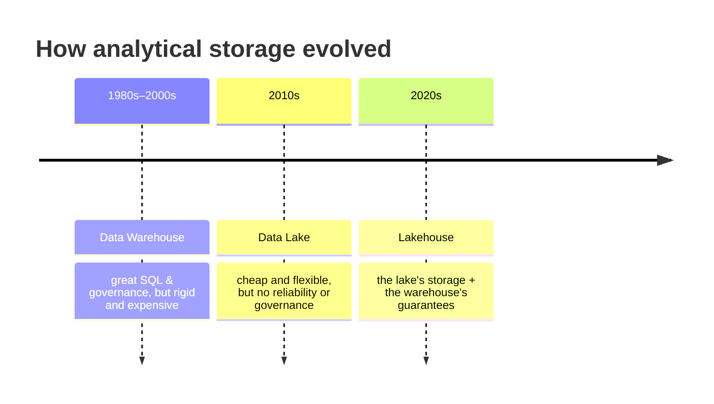
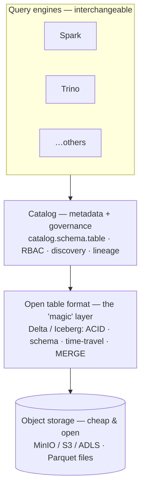

# 1.2 Lake vs Warehouse vs Lakehouse

## Concept
In [1.1](what-is-de.md) you saw that analytics data must live in a **separate OLAP
system**, away from the live app. But *what kind* of system? Three answers evolved over
40 years, each fixing the previous one's biggest pain. Understanding that story is the
fastest way to understand why the **lakehouse** — what you'll build — looks the way it does.

## Data warehouse (the classic)
A specialised database built purely for analytics (Teradata, later Snowflake, BigQuery,
Redshift). You **design a schema first**, then load clean data into it.

- **Strengths:** excellent SQL, fast aggregations, strong governance, reliable — the
  gold standard for BI for decades.
- **Weaknesses:**
    - **Schema-on-write** — data must fit a rigid, pre-defined schema *before* it can be
      loaded. Awkward for messy or changing sources.
    - **Storage and compute are coupled** — you pay for both together, so scaling is
      expensive and inflexible.
    - **Struggles with raw, semi-structured, or unstructured data** (JSON, logs, images)
      and with machine-learning workloads that want raw files, not SQL tables.

## Data lake (the reaction)
The big-data era's answer: dump *everything* cheaply into **object storage** (S3/ADLS/
MinIO) as raw files, decide what it means later.

- **Strengths:**
    - **Dirt cheap and infinitely scalable** — object storage costs pennies per GB.
    - **Any shape of data** — tables, JSON, logs, images, all welcome.
    - **Schema-on-read** — you impose structure only when you query, so ingesting is easy.
    - Storage and compute are **separate** — bring any engine you like.
- **Weaknesses:** on its own a lake is *just files*. No **ACID** transactions, no schema
  enforcement, no easy updates/deletes, no "what changed?", no governance. Without
  discipline it rots into a **data swamp** — a pile of files nobody trusts.

## Lakehouse (the synthesis — what you'll build)
The lakehouse keeps the lake's cheap, open storage **and adds the warehouse's table
guarantees on top**, via three cooperating layers:

1. **Object storage** — the same cheap, open files as a lake (Parquet on MinIO/S3).
2. **An open table format** (Delta or Iceberg) — a thin metadata layer *over* those files
   that turns "a folder of files" into a real **table** with database guarantees. This is
   the piece that makes a lakehouse possible (you go deep on it in [1.3](formats.md)).
3. **A catalog** (Unity Catalog) — the directory of all tables plus **governance**: a
   `catalog.schema.table` namespace, access control, discovery, and lineage.

### What the table format actually buys you
This is the heart of the lakehouse — the features a bare data lake lacks:

- **ACID transactions** — a write either fully happens or not at all; readers never see a
  half-written table, even with many writers at once.
- **Schema enforcement + evolution** — bad-shaped data is rejected, but you can *safely*
  add columns over time.
- **Updates, deletes & MERGE (upserts)** — change individual rows (for GDPR deletes,
  corrections, or CDC) — impossible on plain files.
- **Time travel** — query the table *as it was* yesterday or at version N; reproduce a
  report, or roll back a bad load.
- **Performance** — a transaction log + statistics let engines skip files they don't need,
  so big scans stay fast.

## Comparing the three

| | Warehouse | Lake | **Lakehouse** |
|---|---|---|---|
| Storage cost | high | low | **low** |
| Open file formats | no (proprietary) | yes | **yes** |
| ACID transactions | yes | no | **yes** |
| Handles raw / semi-structured | weak | yes | **yes** |
| Updates / deletes / MERGE | yes | hard | **yes** |
| Time travel | rare | no | **yes** |
| Governance & discovery | strong | weak | **strong** |
| Storage & compute separated | usually no | yes | **yes** |
| Good for BI **and** ML | BI mainly | ML mainly | **both** |

The lakehouse column is essentially "**the best of both**" — which is exactly why the
industry moved to it.

## In this course
ShopFlow's lakehouse maps one-to-one onto the three layers (you saw the tools in the
[technical architecture](../unit0/architecture.md)):

| Layer | ShopFlow uses |
|---|---|
| Object storage | **MinIO** (S3-compatible), holding Parquet files |
| Open table format | **Delta / Iceberg** tables |
| Catalog & governance | **Unity Catalog** (`shopflow` catalog, RBAC) |

One place holds the raw **Bronze** copy *and* the business-ready **Gold** marts — no
separate lake and warehouse, no copying data between them.

!!! abstract "Where the lakehouse pattern lives on the cloud"
    The lakehouse is exactly what the big platforms sell — same three ingredients,
    managed for you:

    - **Azure Databricks** — *is* this pattern, coined the term: Delta tables on cloud
      storage + **Unity Catalog** (the same `catalog.schema.table` namespace and GRANT
      model you'll use here).
    - **Microsoft Fabric** — the **OneLake** Lakehouse item: Delta files in OneLake with a
      SQL analytics endpoint over them.
    - **Snowflake** — started warehouse-first, then added the lake side with **Iceberg
      tables** on your own storage, governed by its Polaris/Horizon catalog.
    - **Azure Data Factory** — not a lakehouse itself; it's a mover that reads/writes over
      **ADLS** (the storage layer) as part of the pattern.

    You're learning the architecture *underneath* all of them — the portable part.

## Key terms, at a glance
| Term | Plain meaning |
|---|---|
| **Object storage** | Cheap, scalable file storage (S3 / ADLS / MinIO) |
| **Schema-on-write** | Data must fit a fixed schema *before* loading (warehouse) |
| **Schema-on-read** | Structure is applied only when you query (lake) |
| **Table format** | Metadata layer (Delta/Iceberg) making files behave as a table |
| **ACID** | All-or-nothing, consistent, isolated, durable writes |
| **Time travel** | Query a table as it was at an earlier version/time |
| **Schema evolution** | Safely change a table's columns over time |
| **MERGE / upsert** | Insert-or-update rows in one operation |
| **Data swamp** | A lake gone bad — files nobody trusts or can find |
| **Catalog** | The directory of tables + who may access them |
| **Storage/compute separation** | Scale (and pay for) storage and compute independently |

## You can now…
- Tell the story of *why* warehouses, then lakes, then lakehouses appeared
- Name the three lakehouse ingredients (object storage + table format + catalog)
- Explain what an open **table format** adds to plain files (ACID, MERGE, time travel…)
- Distinguish schema-on-write from schema-on-read, and coupled vs separated storage/compute
- Map ShopFlow's MinIO + Delta/Iceberg + Unity Catalog onto that pattern
