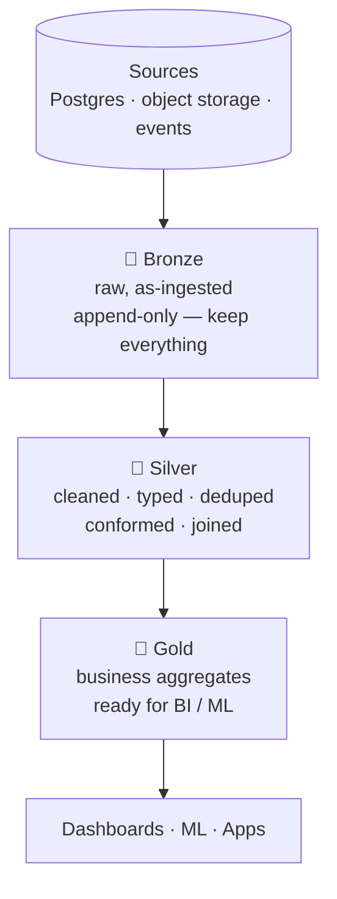

# 1.4 Medallion architecture

## Concept
You now have a lakehouse ([1.2](lakehouse.md)) built on reliable table formats
([1.3](formats.md)). The **Medallion architecture** is *how you organise the tables
inside it*. It splits the pipeline into three quality tiers — **Bronze → Silver → Gold** —
so data gets progressively cleaner, more trustworthy, and more valuable as it flows.

It's the same **ELT** idea from [1.1](what-is-de.md#etl-vs-elt-where-does-the-transform-happen):
load raw first (Bronze), then transform in place (Silver, Gold). This pattern is the
backbone of everything you'll build for ShopFlow.

Think of it as an assembly line: **quality and trust rise** at each step, while the data
gets **smaller and more focused** on answering real questions.

## 🥉 Bronze — raw
An **exact, append-only copy** of the source data, landed with as little change as
possible. You keep *everything* — even bad or duplicate rows — plus a little ingestion
metadata (when it arrived, which file/source it came from).

- **Why keep the mess?** So you can always **reprocess**. If a transform bug is found
  months later, you rebuild Silver/Gold from Bronze without re-fetching from the source.
- **It's your audit trail and replay buffer.**

*ShopFlow:* raw `orders`, `order_items`, `customers`, `products`, `returns`, `payments`
copied from Postgres, the historical Parquet from object storage, and the raw
[event stream](../unit0/schema.md#the-event-stream-clickstream).

## 🥈 Silver — clean & conformed
The **"single source of truth"** layer — where raw becomes reliable. Here you:

- fix **types**, handle **nulls**, drop **duplicates**;
- apply **business keys** and **conform** many sources to one shared model (the schema
  reconciliation from [1.1](what-is-de.md));
- **merge updates and late-arriving records** with `MERGE` (the table-format trick from
  [1.3](formats.md));
- **join** related entities into meaningful, correct-grain tables.

*ShopFlow:* a clean, deduplicated `orders` fact enriched with customer and product
details, with returns and payment status attached — one trustworthy row per order line.

## 🥇 Gold — business-ready
**Aggregated, purpose-built** tables that answer business questions *directly*. Small,
fast, and safe to expose to analysts and dashboards. Gold is often modelled as **marts**
or a **star schema** (fact tables + dimension tables) tuned for a specific audience.

*ShopFlow:* `daily_sales` (net of returns), `top_products`, `customer_ltv`, margin by
category — the exact answers the [scenario](../scenario.md) asked for.

## Why three layers?
| Benefit | What it means |
|---|---|
| **Trust & debuggability** | If Gold looks wrong, trace back through Silver to Bronze to the raw source |
| **Reprocessing** | Keep raw Bronze → rebuild Silver/Gold whenever logic changes, no re-ingest |
| **Separation of concerns** | Each layer has one job; changes stay contained |
| **Access control** | Grant analysts **Gold** only; engineers work in **Silver**; **Bronze** stays restricted (you enforce this in the [Governance unit](../unit6/rbac.md)) |
| **Performance** | Consumers hit small, pre-aggregated Gold, not billions of raw rows |

!!! note "It's a guideline, not a law"
    Three layers is the common default, not a rule. Teams sometimes add a landing zone
    *before* Bronze, or extra Gold marts per team. Use as many tiers as the data's messiness
    justifies — no more.

## Medallion works for streaming too
The same three tiers apply to the [real-time speed](what-is-de.md#two-speeds-batch-and-streaming):
**Bronze** captures the raw event stream as it arrives, **Silver** cleans and sessionises
those events, and **Gold** maintains live aggregates (orders-per-minute, a fraud signal).
Same architecture, running continuously instead of on a schedule.

## How it maps to the rest of the course
| Layer | Built with | Governed by | Units |
|---|---|---|---|
| **Bronze** | ingestion (Spark) | Unity Catalog | [3](../unit4/read-bronze.md), [4](../unit5/basics.md) |
| **Silver** | Spark / SQL transforms | Unity Catalog | [2](../unit2/intro.md), [3](../unit4/transform-silver.md) |
| **Gold** | Spark / SQL aggregates | Unity Catalog | [2](../unit2/intro.md), [3](../unit4/spark-sql-gold.md) |
| **Serve** | Trino + Superset | RBAC on Gold | [5](../unit6/catalogs.md), [6](../unit7/dashboards.md) |

!!! abstract "Where medallion lives on the cloud"
    **Medallion (Bronze/Silver/Gold) is Databricks' own term** — you'll see those exact
    words in their docs. The pattern is recommended everywhere:

    - **Azure Databricks** — build it with Spark/SQL, or declaratively with **Delta Live
      Tables (DLT)** flowing across the three layers.
    - **Snowflake** — the same tiers (often called **raw / staging / marts**), built with
      SQL/Snowpark or declaratively with **Dynamic Tables**.
    - **Microsoft Fabric** — the same medallion on **OneLake**, via Spark notebooks and
      Data Factory pipelines.
    - **Azure Data Factory** — Pipelines move data between the layers (Copy/Data Flow lands
      Bronze, then transforms into Silver and Gold).

    This is one of the most directly transferable ideas in the whole course.

## Key terms, at a glance
| Term | Plain meaning |
|---|---|
| **Medallion** | Organising a lakehouse into Bronze → Silver → Gold quality tiers |
| **Bronze** | Raw, append-only copy of the sources — keep everything |
| **Silver** | Cleaned, deduplicated, conformed, joined — the single source of truth |
| **Gold** | Aggregated, business-ready marts for BI/ML |
| **Single source of truth** | One trusted table everyone agrees on |
| **Conform** | Map many sources onto one shared column model |
| **Grain** | What one row represents (e.g. one order line) |
| **Star schema** | Fact tables + dimension tables, a classic Gold model |
| **Mart** | A focused Gold dataset for one team/subject |
| **Reprocessing / backfill** | Rebuilding later layers from raw Bronze |

## You can now…
- Describe the purpose of **Bronze, Silver, and Gold** and how data changes at each
- Explain why raw data is kept, and how layering enables **trust + reprocessing**
- Connect medallion to **ELT** and to the **table-format** features that make it possible
- See how the same tiers apply to **streaming**
- Anticipate how governance grants differ per layer
