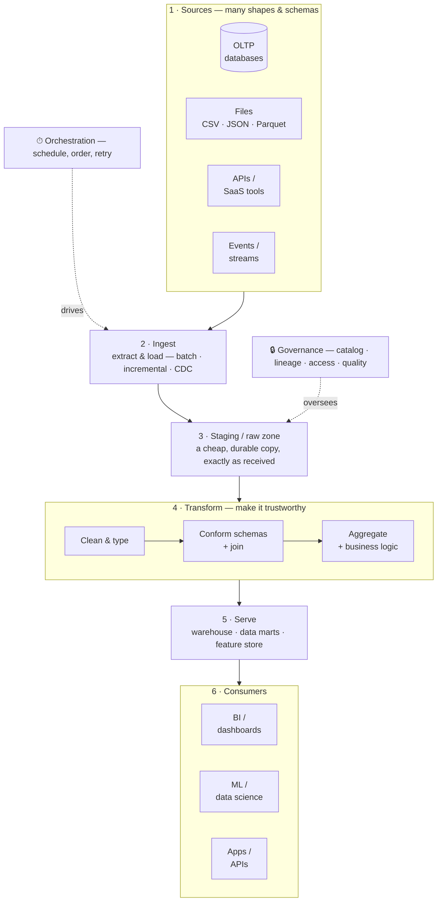

# 1.1 What is Data Engineering?

## Concept
**Data engineering** is the practice of building the systems that move and shape data
so others (analysts, data scientists, apps, executives) can trust and use it. If a
data scientist builds the car, the data engineer builds the roads, fuel, and traffic
system that make driving possible.

A data engineer's job, in five steps:

1. **Ingest** — get data out of source systems (databases, files, APIs, events)
2. **Store** — land it durably and cheaply (object storage / a lakehouse)
3. **Transform** — clean, join, aggregate it into trustworthy, query-ready shapes
4. **Serve** — expose it to BI, ML, and applications
5. **Orchestrate & govern** — schedule it reliably, and control who can see what

For **ShopFlow**, that means turning the raw, messy source tables — `orders`,
`returns`, product `cost`, and the rest of the [database schema](../unit0/schema.md) —
coming out of Postgres and object storage into clean marts like `daily_sales`
(net of returns) that an executive can trust: reliably, every day, with the right
people able to see them. That whole path is the
[technical architecture](../unit0/architecture.md) you saw in the last two pages.

## A general data pipeline, end to end

Almost every data platform — in any company, on any tool — follows the same shape:
pull data from **many different sources**, land it in a **staging area**, **transform**
it into a clean common model, then **serve** it to whoever needs it. Learn this shape
once and you'll recognise it everywhere.

Notice three things this picture makes obvious:

- **Sources disagree.** Each source has its *own* schema, naming, and quality — one
  system calls it `cust_id`, another `customer`, a file has no types at all. A big part
  of the job is **reconciling** them into one consistent model.
- **There's a landing zone in the middle.** You almost never transform data straight
  from the source. You first copy it, untouched, into cheap **staging** storage — so
  you can re-run transforms, audit what arrived, and never hammer the live source twice.
- **Orchestration and governance wrap everything.** They aren't a stage at the end;
  they run *across* the whole flow.

## The five steps, in depth

### 1 · Ingest (a.k.a. extract)
Getting data *out* of a source and into your platform. The main choices:

- **Batch vs streaming** — pull a chunk on a schedule (nightly) vs. consume events
  continuously as they happen.
- **Full vs incremental load** — copy the *entire* table every time (simple, but slow
  and wasteful at scale) vs. copy *only what changed* since last time (efficient, but
  you must track "what's new").
- **CDC (Change Data Capture)** — a smart form of incremental load that reads the
  database's change log to capture every insert/update/delete as it happens.
- **Connectors** — the adapters that speak each source's protocol (JDBC for databases,
  REST for APIs, file readers for object storage).

### 2 · Store
Landing data somewhere **durable and cheap** before (and after) you shape it. Key ideas:

- **Landing / raw / staging zone** — the first stop: an exact, untouched copy of what
  arrived. Keeping it lets you reprocess without re-fetching and gives you an audit trail.
- **Data lake** — cheap object storage (like S3/MinIO) holding files of *any* shape. Very
  cheap, but on its own has no tables, types, or transactions.
- **Data warehouse** — structured, typed, query-optimised storage for analytics. Fast and
  reliable, but historically pricier and less flexible.
- **Lakehouse** — the modern combination: warehouse-style tables (types, ACID, fast
  queries) *on top of* cheap lake storage. **This is what you're building in this course.**

### 3 · Transform
The heart of the craft: turning raw, messy data into something trustworthy. Typical work:

- **Clean** — fix or drop bad rows, handle nulls and duplicates.
- **Type / cast** — turn a text `"42"` into a real number, a string into a real date.
- **Conform schemas** — map each source's columns onto **one shared model** (so `cust_id`,
  `customer`, and `CustomerID` all become one `customer_id`).
- **Deduplicate** — collapse repeated or re-sent records into one.
- **Join & enrich** — stitch related tables together (orders + customers + products).
- **Aggregate & apply business logic** — roll rows up into metrics, encoding the *rules*
  (e.g. "revenue = price × qty, **minus** returns").

### 4 · Serve
Making the finished data usable — the "so what" of the whole pipeline:

- **Data marts** — focused, ready-to-query tables for a team or subject (sales, finance).
- **BI / dashboards** — charts and reports for analysts and executives.
- **ML / feature stores** — clean features for training and scoring models.
- **Apps & APIs** — serving data back into products (recommendations, search).

### 5 · Orchestrate & govern
The two disciplines that make a pipeline *dependable* rather than a pile of scripts:

- **Orchestration** — running the steps in the right **order**, on a **schedule**, with
  **retries** when something fails and **backfills** to reprocess history. Pipelines are
  usually modelled as a **DAG** (directed acyclic graph) of dependent tasks. A good
  pipeline is **idempotent** — re-running it produces the same result, no duplicates.
- **Governance** — knowing *what* data you have (a **catalog**), *where it came from*
  (**lineage**), *who may see it* (**access control / RBAC**), and *whether it's correct*
  (**data quality** checks).

## ETL vs ELT — where does the transform happen?

You'll hear both constantly. The only difference is the **order of the last two letters**:

| | **ETL** (Extract → Transform → Load) | **ELT** (Extract → Load → Transform) |
|---|---|---|
| Order | Transform data *before* loading it in | Load raw data first, transform it *in place* |
| Transform runs on | A separate processing engine | The warehouse/lakehouse's own compute |
| Fits | Classic warehouses, limited storage | Cheap cloud storage + scalable compute |
| Raw copy kept? | Often not | **Yes** — raw is loaded first, then refined |

Modern lakehouses (and this course) are **ELT**: land the raw data cheaply first, then
transform it in successive layers. That's exactly the Medallion pattern you'll meet in
[1.4](medallion.md) — **Bronze** *is* your loaded raw zone; **Silver** and **Gold** are
the transform steps.

## OLTP vs OLAP — the core distinction

Data is *born* in systems built to **run** the business and must be moved to systems
built to **understand** it. These two worlds are optimised for opposite things:

| | **OLTP** (transactional) | **OLAP** (analytical) |
|---|---|---|
| Purpose | **Run** the business (place an order) | **Understand** the business (sales trends) |
| Typical operation | Many tiny reads/writes | A few huge scans & aggregations |
| Data shape | **Normalized** — many small linked tables, no duplication | **Denormalized** — wide tables / star schemas, built for reading |
| Storage layout | **Row**-oriented (grab a whole record fast) | **Column**-oriented (scan one column over millions of rows fast) |
| Consistency | **ACID** transactions, always up-to-the-second | Read-mostly, refreshed in batches |
| Users | Apps & customers | Analysts, BI, executives, ML |
| Example here | ShopFlow **[Postgres](../unit0/schema.md)** | The **lakehouse** (Bronze/Silver/Gold) |

!!! warning "Why not just run reports on the production database?"
    Because a heavy analytical query ("sum every order for the last two years") would
    scan huge amounts of data and **slow down the live app** for real customers — while
    still being slow itself, because the OLTP database is laid out for small transactions,
    not big scans. Data engineering exists largely to move data from the OLTP world into a
    separate OLAP world **without breaking the business** and **without losing trust in
    the data**.

## Two speeds: batch and streaming
ShopFlow needs answers at **two speeds** (you saw both in the
[scenario](../scenario.md#some-decisions-cant-wait-until-tomorrow)):

- **Batch** — process data in chunks on a schedule (e.g., "every night at 2am"). This
  builds the *daily, trustworthy picture* — how the business is really doing. Most data
  engineering lives here, and it's where this course starts.
- **Streaming** — process events continuously as they arrive, so you can *act in the
  moment* — block a fraudulent checkout, rescue an abandoned cart, watch a live pulse on
  the big sales days. This is the
  [event stream](../unit0/schema.md#the-event-stream-clickstream) from the schema page.

Same five steps, same concepts — streaming just runs them continuously instead of on a
timer. The labs teach **batch first** (it's the foundation), then add streaming once the
fundamentals are solid.

!!! abstract "Where these five steps live on the cloud"
    The data engineer's role is identical on every platform — only the tool names change.
    When you move ShopFlow to the cloud later, here's who does each step:

    - **Azure Data Factory** — *ingest* + *orchestrate* (Copy activity, Pipelines, triggers); no BI or governance of its own.
    - **Azure Databricks** — *store / transform / serve* on the same Spark, plus Workflows (orchestrate) and Unity Catalog (govern).
    - **Snowflake** — *store / transform / serve* with SQL + Snowpark, Streams & Tasks (orchestrate), roles (govern); pair with Snowpipe or a tool for *ingest*.
    - **Microsoft Fabric** — all five in one tenant: Data Factory (ingest), Lakehouse/Spark (transform), Power BI (serve), Workspaces + Purview (govern).

    Everything you learn here is the *portable* part; the platforms just add managed
    compute and a bill on top.

## Key terms, at a glance
| Term | Plain meaning |
|---|---|
| **Ingest / extract** | Pull data out of a source into your platform |
| **CDC** | Capture every change (insert/update/delete) from a DB's change log |
| **Incremental load** | Move only what changed since last run, not everything |
| **Staging / raw zone** | The first landing spot — an untouched copy of what arrived |
| **Data lake** | Cheap object storage for files of any shape |
| **Data warehouse** | Structured, typed, query-optimised analytics storage |
| **Lakehouse** | Warehouse-style tables on top of cheap lake storage |
| **Conform / normalize schema** | Map many sources onto one shared column model |
| **Denormalize** | Pre-join data into wide tables built for fast reading |
| **ETL / ELT** | Transform before loading / load raw then transform in place |
| **DAG** | The dependency graph of tasks an orchestrator runs |
| **Idempotent** | Re-running produces the same result (no duplicates) |
| **Lineage** | The record of where each piece of data came from |

## You can now…
- Explain what a data engineer does and the five steps of the job
- Describe a general pipeline: sources → ingest → staging → transform → serve → consume
- Define OLTP vs OLAP and say why analytics runs on a *separate* system
- Explain the difference between ETL and ELT, and between batch and streaming
- Use the core vocabulary — staging, CDC, lakehouse, schema conforming, lineage, DAG
