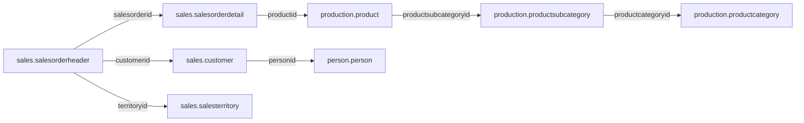

# 2.9 Challenge: AdventureWorks

## Concept
So far you've queried **ShopFlow**, a small teaching dataset. **AdventureWorks** is a much
richer, real-world sample: Microsoft's OLTP database for a fictional bicycle manufacturer,
*Adventure Works Cycles*. It has ~68 tables spread across five business schemas, with the
messy realities of a production system — surrogate keys, lookup tables, history tables, and
many-to-many bridges. It's the classic dataset for **practicing SQL joins, aggregation,
conditional logic, subqueries, window functions, and CTEs** the way you'd meet them on the job.

The tables live in five schemas:

| Schema | What's in it | Tables you'll use most |
|---|---|---|
| `sales` | orders, customers, territories, salespeople | `salesorderheader`, `salesorderdetail`, `customer`, `salesterritory`, `salesperson` |
| `production` | products, categories, inventory | `product`, `productsubcategory`, `productcategory` |
| `person` | people, addresses, contact info | `person`, `address`, `stateprovince` |
| `humanresources` | employees, departments, pay | `employee`, `department`, `employeepayhistory` |
| `purchasing` | vendors, purchase orders | `vendor`, `purchaseorderheader` |

The join backbone you'll lean on:



**Full schema reference** (tables, columns, relationships, diagrams):

- Interactive schema browser → [dataedo.com/samples/html/AdventureWorks](https://dataedo.com/samples/html/AdventureWorks/)
- Microsoft docs → [AdventureWorks install & schema](https://learn.microsoft.com/en-us/sql/samples/adventureworks-install-configure)

## Before you start — two things to know
This is a **Postgres** database exposed through the Trino **`adventureworks`** catalog, so a
couple of things differ from SQL Server / the docs:

1. **Everything is lowercase.** Tables and columns are `salesorderheader`, `firstname`,
   `listprice` — not `SalesOrderHeader` / `FirstName`.
2. **There is no `linetotal` column.** In SQL Server it's a computed column; here you compute
   line revenue yourself: `orderqty * unitprice * (1 - unitpricediscount)`.

**How to run these:**

=== "Trino CLI / Superset SQL Lab"
    Set the catalog + schema once, then reference other schemas as `schema.table`:
    ```sql
    USE adventureworks.sales;
    SELECT COUNT(*) FROM salesorderheader;          -- current schema
    SELECT COUNT(*) FROM production.product;         -- other schema, same catalog
    ```

=== "SQLPad"
    Pick the **Lakehouse — OLAP (Trino/Iceberg)** connection, then fully-qualify with the
    `adventureworks` catalog (it defaults to `iceberg`):
    ```sql
    SELECT COUNT(*) FROM adventureworks.sales.salesorderheader;
    ```

Each challenge lists the **Tables** it uses so you know where to look. Solutions use
**`schema.table`** names throughout — try each one yourself before expanding the solution.

---

## Part A — Warm-up (single table)

### 1. The ten most expensive products 🟢
**Tables:** `production.product`

List the 10 products with the highest list price (`name`, `listprice`), most expensive first.

??? note "Solution"
    ```sql
    SELECT name, listprice
    FROM production.product
    ORDER BY listprice DESC
    LIMIT 10;
    ```

### 2. Premium products 🟢
**Tables:** `production.product`

Show `name`, `color`, and `listprice` for every product priced **over $1,000**, dearest first.

??? note "Solution"
    ```sql
    SELECT name, color, listprice
    FROM production.product
    WHERE listprice > 1000
    ORDER BY listprice DESC;
    ```

### 3. How big is the order book? 🟢
**Tables:** `sales.salesorderheader`

Return the **total number of sales orders** and the **date range** they span (earliest and
latest order date).

??? note "Solution"
    ```sql
    SELECT COUNT(*)                     AS orders,
           MIN(CAST(orderdate AS date)) AS first_order,
           MAX(CAST(orderdate AS date)) AS last_order
    FROM sales.salesorderheader;
    ```

### 4. What colors do products come in? 🟢
**Tables:** `production.product`

List the distinct product colors (ignore products with no color).

??? note "Solution"
    ```sql
    SELECT DISTINCT color
    FROM production.product
    WHERE color IS NOT NULL
    ORDER BY color;
    ```

---

## Part B — Grouping & aggregation

### 5. Products per color 🟡
**Tables:** `production.product`

Count how many products there are of each color, most common first.

??? note "Solution"
    ```sql
    SELECT color, COUNT(*) AS products
    FROM production.product
    WHERE color IS NOT NULL
    GROUP BY color
    ORDER BY products DESC;
    ```

### 6. Popular colors only 🟡
**Tables:** `production.product`

Same as above, but only show colors used by **more than 20** products. (This is what `HAVING`
is for — a filter on the aggregated result.)

??? note "Solution"
    ```sql
    SELECT color, COUNT(*) AS products
    FROM production.product
    WHERE color IS NOT NULL
    GROUP BY color
    HAVING COUNT(*) > 20
    ORDER BY products DESC;
    ```

### 7. Average price by product line 🟡
**Tables:** `production.product`

Show the average list price for each `productline`, rounded to 2 decimals. (Some products have
no product line — they'll group under a `NULL` bucket.)

??? note "Solution"
    ```sql
    SELECT productline, ROUND(AVG(listprice), 2) AS avg_price, COUNT(*) AS products
    FROM production.product
    GROUP BY productline
    ORDER BY avg_price DESC;
    ```

### 8. Orders and revenue by year 🟡
**Tables:** `sales.salesorderheader`

For each calendar year, show the number of orders and the total revenue (`SUM(totaldue)`).

??? note "Solution"
    ```sql
    SELECT EXTRACT(year FROM orderdate) AS yr,
           COUNT(*)                     AS orders,
           ROUND(SUM(totaldue), 2)      AS revenue
    FROM sales.salesorderheader
    GROUP BY EXTRACT(year FROM orderdate)
    ORDER BY yr;
    ```

---

## Part C — Joins

### 9. Product → subcategory → category 🟡
**Tables:** `production.product`, `production.productsubcategory`, `production.productcategory`

For 20 products, show the product `name`, its subcategory name, and its category name.

??? note "Solution"
    ```sql
    SELECT p.name AS product, ps.name AS subcategory, pc.name AS category
    FROM production.product p
    JOIN production.productsubcategory ps ON ps.productsubcategoryid = p.productsubcategoryid
    JOIN production.productcategory   pc ON pc.productcategoryid    = ps.productcategoryid
    ORDER BY category, subcategory, product
    LIMIT 20;
    ```

### 10. Products per category 🟡
**Tables:** `production.product`, `production.productsubcategory`, `production.productcategory`

How many products are in each top-level category?

??? note "Solution"
    ```sql
    SELECT pc.name AS category, COUNT(*) AS products
    FROM production.product p
    JOIN production.productsubcategory ps ON ps.productsubcategoryid = p.productsubcategoryid
    JOIN production.productcategory   pc ON pc.productcategoryid    = ps.productcategoryid
    GROUP BY pc.name
    ORDER BY products DESC;
    ```

### 11. Revenue by product category 🟡
**Tables:** `sales.salesorderdetail`, `production.product`, `production.productsubcategory`, `production.productcategory`

Which category earns the most? Compute line revenue as
`orderqty * unitprice * (1 - unitpricediscount)` and sum it per category.

??? note "Solution"
    ```sql
    SELECT pc.name AS category,
           ROUND(SUM(d.orderqty * d.unitprice * (1 - d.unitpricediscount)), 2) AS revenue
    FROM sales.salesorderdetail d
    JOIN production.product          p  ON p.productid            = d.productid
    JOIN production.productsubcategory ps ON ps.productsubcategoryid = p.productsubcategoryid
    JOIN production.productcategory   pc ON pc.productcategoryid    = ps.productcategoryid
    GROUP BY pc.name
    ORDER BY revenue DESC;
    ```

### 12. Sales by territory 🟡
**Tables:** `sales.salesorderheader`, `sales.salesterritory`

Total revenue per sales territory — show territory `name`, country code, and total `totaldue`.

??? note "Solution"
    ```sql
    SELECT t.name AS territory, t.countryregioncode AS country,
           ROUND(SUM(soh.totaldue), 2) AS revenue
    FROM sales.salesorderheader soh
    JOIN sales.salesterritory   t ON t.territoryid = soh.territoryid
    GROUP BY t.name, t.countryregioncode
    ORDER BY revenue DESC;
    ```

### 13. Top 10 customers by spend (with names) 🟡
**Tables:** `sales.salesorderheader`, `sales.customer`, `person.person`

Who are the biggest individual customers? Join through `customer` to `person` to get names.
(Store customers have no `personid` — the inner join naturally excludes them.)

??? note "Solution"
    ```sql
    SELECT p.firstname || ' ' || p.lastname AS customer,
           COUNT(*)                          AS orders,
           ROUND(SUM(soh.totaldue), 2)       AS total_spend
    FROM sales.salesorderheader soh
    JOIN sales.customer c ON c.customerid       = soh.customerid
    JOIN person.person  p ON p.businessentityid = c.personid
    GROUP BY p.firstname, p.lastname
    ORDER BY total_spend DESC
    LIMIT 10;
    ```

---

## Part D — Window functions

### 14. Rank products by price within their subcategory 🔴
**Tables:** `production.product`, `production.productsubcategory`

Within each subcategory, rank products from most to least expensive, and show only the **top 3**
per subcategory. Window functions can't go in `WHERE`, so compute the rank in a subquery/CTE
first, then filter.

??? note "Solution"
    ```sql
    WITH ranked AS (
      SELECT ps.name AS subcategory, p.name AS product, p.listprice,
             RANK() OVER (PARTITION BY ps.name ORDER BY p.listprice DESC) AS price_rank
      FROM production.product p
      JOIN production.productsubcategory ps ON ps.productsubcategoryid = p.productsubcategoryid
    )
    SELECT subcategory, product, listprice, price_rank
    FROM ranked
    WHERE price_rank <= 3
    ORDER BY subcategory, price_rank;
    ```

### 15. Running monthly revenue 🔴
**Tables:** `sales.salesorderheader`

For the year **2024**, show each month's revenue and a **running (cumulative) total** across
the year.

??? note "Solution"
    ```sql
    WITH monthly AS (
      SELECT DATE_TRUNC('month', orderdate) AS month, SUM(totaldue) AS revenue
      FROM sales.salesorderheader
      WHERE EXTRACT(year FROM orderdate) = 2024
      GROUP BY DATE_TRUNC('month', orderdate)
    )
    SELECT month,
           ROUND(revenue, 2)                                  AS revenue,
           ROUND(SUM(revenue) OVER (ORDER BY month), 2)       AS running_total
    FROM monthly
    ORDER BY month;
    ```

### 16. Each product's share of its category 🔴
**Tables:** `sales.salesorderdetail`, `production.product`, `production.productsubcategory`, `production.productcategory`

For every product, show its revenue **and what percent that is of its whole category's
revenue** — a classic `SUM() OVER (PARTITION BY …)` "part-of-whole" query.

??? note "Solution"
    ```sql
    WITH prod_rev AS (
      SELECT pc.name AS category, p.name AS product,
             SUM(d.orderqty * d.unitprice * (1 - d.unitpricediscount)) AS revenue
      FROM sales.salesorderdetail d
      JOIN production.product          p  ON p.productid            = d.productid
      JOIN production.productsubcategory ps ON ps.productsubcategoryid = p.productsubcategoryid
      JOIN production.productcategory   pc ON pc.productcategoryid    = ps.productcategoryid
      GROUP BY pc.name, p.name
    )
    SELECT category, product,
           ROUND(revenue, 2) AS revenue,
           ROUND(100.0 * revenue / SUM(revenue) OVER (PARTITION BY category), 1) AS pct_of_category
    FROM prod_rev
    ORDER BY category, revenue DESC;
    ```

---

## Part E — CTEs (the `WITH` clause)

A **CTE** (Common Table Expression) names a subquery so you can build a query in readable
steps, and reference the same intermediate result more than once. From here on, every problem
leans on them.

### 17. Above-average customers 🔴
**Tables:** `sales.salesorderheader`

Find the customers whose total spend is **higher than the average customer's total spend**.
Build per-customer totals in a CTE, then compare each to the average *of that CTE*.

??? note "Solution"
    ```sql
    WITH customer_spend AS (
      SELECT customerid, SUM(totaldue) AS spend
      FROM sales.salesorderheader
      GROUP BY customerid
    )
    SELECT customerid, ROUND(spend, 2) AS spend
    FROM customer_spend
    WHERE spend > (SELECT AVG(spend) FROM customer_spend)
    ORDER BY spend DESC
    LIMIT 20;
    ```

### 18. Top 3 products by revenue in each category 🔴
**Tables:** `sales.salesorderdetail`, `production.product`, `production.productsubcategory`, `production.productcategory`

The "top-N per group" pattern: compute revenue per product in one CTE, rank within each
category with `ROW_NUMBER()` in a second CTE, then keep ranks 1–3.

??? note "Solution"
    ```sql
    WITH prod_rev AS (
      SELECT pc.name AS category, p.name AS product,
             SUM(d.orderqty * d.unitprice * (1 - d.unitpricediscount)) AS revenue
      FROM sales.salesorderdetail d
      JOIN production.product          p  ON p.productid            = d.productid
      JOIN production.productsubcategory ps ON ps.productsubcategoryid = p.productsubcategoryid
      JOIN production.productcategory   pc ON pc.productcategoryid    = ps.productcategoryid
      GROUP BY pc.name, p.name
    ),
    ranked AS (
      SELECT category, product, revenue,
             ROW_NUMBER() OVER (PARTITION BY category ORDER BY revenue DESC) AS rn
      FROM prod_rev
    )
    SELECT category, product, ROUND(revenue, 2) AS revenue, rn
    FROM ranked
    WHERE rn <= 3
    ORDER BY category, rn;
    ```

### 19. Year-over-year growth 🔴
**Tables:** `sales.salesorderheader`

Compute revenue per year in a CTE, then use **`LAG()`** to pull the previous year's revenue
onto each row and calculate the growth percentage.

??? note "Solution"
    ```sql
    WITH yearly AS (
      SELECT EXTRACT(year FROM orderdate) AS yr, SUM(totaldue) AS revenue
      FROM sales.salesorderheader
      GROUP BY EXTRACT(year FROM orderdate)
    )
    SELECT yr,
           ROUND(revenue, 2)                          AS revenue,
           ROUND(LAG(revenue) OVER (ORDER BY yr), 2)  AS prev_year,
           ROUND(100.0 * (revenue - LAG(revenue) OVER (ORDER BY yr))
                       / LAG(revenue) OVER (ORDER BY yr), 1) AS yoy_growth_pct
    FROM yearly
    ORDER BY yr;
    ```

### 20. Grand finale — monthly revenue report 🔴
**Tables:** `sales.salesorderheader`

Build a full monthly report: month, revenue, **running total**, and **month-over-month growth
%** — combining a CTE with two different window functions (`SUM() OVER` and `LAG()`).

??? note "Solution"
    ```sql
    WITH monthly AS (
      SELECT DATE_TRUNC('month', orderdate) AS month, SUM(totaldue) AS revenue
      FROM sales.salesorderheader
      GROUP BY DATE_TRUNC('month', orderdate)
    )
    SELECT month,
           ROUND(revenue, 2)                                    AS revenue,
           ROUND(SUM(revenue) OVER (ORDER BY month), 2)         AS running_total,
           ROUND(100.0 * (revenue - LAG(revenue) OVER (ORDER BY month))
                       / LAG(revenue) OVER (ORDER BY month), 1) AS mom_growth_pct
    FROM monthly
    ORDER BY month;
    ```

---

## Part F — Conditional logic & NULLs (`CASE`, `COALESCE`)

`CASE WHEN … THEN … ELSE … END` lets a query make a **decision per row** — bucketing values,
labelling them, or (paired with an aggregate) building **pivot**-style columns. Trino also has
a shorthand `IF(condition, then_value, else_value)` for the simple two-way case, and
**`COALESCE(a, b, …)`** — which returns the first non-`NULL` argument — for supplying defaults
when a column may be missing.

### 21. Bucket products into price tiers 🟡
**Tables:** `production.product`

Label every product **Budget** (< $50), **Mid** ($50–$500), or **Premium** ($500+) — treating
$0 as "No price" — and count how many products fall in each tier.

??? note "Solution"
    ```sql
    SELECT CASE WHEN listprice = 0    THEN 'No price'
                WHEN listprice < 50   THEN 'Budget (<$50)'
                WHEN listprice < 500  THEN 'Mid ($50-$500)'
                ELSE 'Premium ($500+)' END AS price_tier,
           COUNT(*) AS products
    FROM production.product
    GROUP BY 1              -- group by the CASE (column position 1)
    ORDER BY products DESC;
    ```

### 22. Online vs in-store orders per year 🔴
**Tables:** `sales.salesorderheader`

**Conditional aggregation** (a pivot): for each year, put online and in-store orders in
*separate columns*, plus the online revenue. The trick is `SUM(CASE WHEN … THEN … ELSE 0 END)`.

!!! note
    `onlineorderflag` is a flag column that Trino surfaces as text — compare it to `'t'` / `'f'`
    (not `true`/`false`).

??? note "Solution"
    ```sql
    SELECT EXTRACT(year FROM orderdate) AS yr,
           SUM(CASE WHEN onlineorderflag = 't' THEN 1 ELSE 0 END) AS online_orders,
           SUM(CASE WHEN onlineorderflag = 'f' THEN 1 ELSE 0 END) AS instore_orders,
           ROUND(SUM(CASE WHEN onlineorderflag = 't' THEN totaldue ELSE 0 END), 2) AS online_revenue
    FROM sales.salesorderheader
    GROUP BY EXTRACT(year FROM orderdate)
    ORDER BY yr;
    ```

    The same idea with Trino's `IF()` shorthand: `SUM(IF(onlineorderflag = 't', 1, 0))`.

### 23. Segment customers by spend 🔴
**Tables:** `sales.salesorderheader`

Classify each customer as **VIP** (≥ $100k lifetime spend), **Regular** (≥ $10k), or
**Occasional**, then count how many customers and how much revenue sit in each segment. Build
per-customer totals in a CTE, then apply the `CASE`.

??? note "Solution"
    ```sql
    WITH customer_spend AS (
      SELECT customerid, SUM(totaldue) AS spend
      FROM sales.salesorderheader
      GROUP BY customerid
    )
    SELECT CASE WHEN spend >= 100000 THEN 'VIP'
                WHEN spend >= 10000  THEN 'Regular'
                ELSE 'Occasional' END AS segment,
           COUNT(*)             AS customers,
           ROUND(SUM(spend), 2) AS total_spend
    FROM customer_spend
    GROUP BY 1
    ORDER BY total_spend DESC;
    ```

### 24. Build clean display names with COALESCE 🟡
**Tables:** `person.person`

Build a full display name from `firstname`, `middlename`, `lastname`. The catch: `middlename`
is often `NULL`, and in SQL **`NULL || anything = NULL`** — so a naive concatenation blanks the
*entire* name for anyone without a middle name. Use `COALESCE` to substitute a default, and
also show the `title` as `(none)` when it's missing.

??? note "Solution"
    ```sql
    SELECT businessentityid,
           firstname || ' '
             || COALESCE(middlename || ' ', '')   -- middle name + space, or nothing
             || lastname                    AS full_name,
           COALESCE(title, '(none)')        AS title
    FROM person.person
    ORDER BY businessentityid
    LIMIT 20;
    ```

    `COALESCE(middlename || ' ', '')` is the key trick: if `middlename` is `NULL` the inner
    `middlename || ' '` is also `NULL`, so `COALESCE` falls back to the empty string — no gap,
    no wiped-out name.

---

## Part G — Subqueries, outer joins & functions

The last stretch covers the patterns you'll reach for constantly on real data: finding rows
that *don't* match (outer/anti-joins), asking questions with **subqueries** (`EXISTS`, scalar),
**date** and **string** functions, and a couple more window/aggregate tricks.

### 25. Products that have never been sold 🟡
**Tables:** `production.product`, `sales.salesorderdetail`

Find products with **no** order lines. A `LEFT JOIN` keeps every product; the ones with no
match have `NULL` on the detail side — filter for those. (This "**anti-join**" is how you find
missing/orphaned data.)

??? note "Solution"
    ```sql
    SELECT p.productid, p.name
    FROM production.product p
    LEFT JOIN sales.salesorderdetail d ON d.productid = p.productid
    WHERE d.productid IS NULL          -- kept by LEFT JOIN, but no matching order line
    ORDER BY p.name;
    ```

### 26. Find people by name pattern 🟢
**Tables:** `person.person`

List distinct people whose **last name starts with "Sm"** — case-insensitively. Use `LIKE` with
the `%` wildcard, and `UPPER()` so the match ignores case.

??? note "Solution"
    ```sql
    SELECT DISTINCT lastname, firstname
    FROM person.person
    WHERE UPPER(lastname) LIKE 'SM%'   -- % = any trailing characters
    ORDER BY lastname, firstname;
    ```

### 27. Products above the average price 🟡
**Tables:** `production.product`

List products whose list price is **higher than the average list price** of all (priced)
products. The average is computed by a **scalar subquery** in the `WHERE` clause.

??? note "Solution"
    ```sql
    SELECT name, listprice
    FROM production.product
    WHERE listprice > (SELECT AVG(listprice) FROM production.product WHERE listprice > 0)
    ORDER BY listprice DESC
    LIMIT 20;
    ```

### 28. Customers who bought a Mountain bike 🔴
**Tables:** `sales.customer`, `person.person`, `sales.salesorderheader`, `sales.salesorderdetail`, `production.product`, `production.productsubcategory`

Names of customers who have ordered **at least one** product in the `Mountain Bikes`
subcategory. `EXISTS` is perfect here: you only care *whether* a matching order exists, not how
many — and it stops at the first hit.

??? note "Solution"
    ```sql
    SELECT DISTINCT p.firstname || ' ' || p.lastname AS customer
    FROM sales.customer c
    JOIN person.person p ON p.businessentityid = c.personid
    WHERE EXISTS (
      SELECT 1
      FROM sales.salesorderheader soh
      JOIN sales.salesorderdetail   d  ON d.salesorderid       = soh.salesorderid
      JOIN production.product        pr ON pr.productid         = d.productid
      JOIN production.productsubcategory ps ON ps.productsubcategoryid = pr.productsubcategoryid
      WHERE soh.customerid = c.customerid   -- correlates the subquery to the outer customer
        AND ps.name = 'Mountain Bikes'
    )
    ORDER BY customer
    LIMIT 20;
    ```

### 29. Fulfilment time & late shipments 🟡
**Tables:** `sales.salesorderheader`

Per year, show the **average days to ship** (`orderdate` → `shipdate`) and how many orders
shipped **after** their due date. Uses `date_diff` and a date comparison.

!!! note
    In this sample every order ships in exactly 7 days, so `late_orders` comes out 0 — a useful
    reminder to *look at your data*, not just trust the query.

??? note "Solution"
    ```sql
    SELECT EXTRACT(year FROM orderdate) AS yr,
           ROUND(AVG(date_diff('day', orderdate, shipdate)), 1)     AS avg_days_to_ship,
           SUM(CASE WHEN shipdate > duedate THEN 1 ELSE 0 END)      AS late_orders
    FROM sales.salesorderheader
    WHERE shipdate IS NOT NULL
    GROUP BY EXTRACT(year FROM orderdate)
    ORDER BY yr;
    ```

### 30. Territory KPIs 🟡
**Tables:** `sales.salesorderheader`, `sales.salesterritory`

Per territory: number of orders, number of **distinct customers**, and the **average order
value**. `COUNT(*)` counts rows; `COUNT(DISTINCT …)` counts unique entities — know the
difference.

??? note "Solution"
    ```sql
    SELECT t.name AS territory,
           COUNT(*)                          AS orders,
           COUNT(DISTINCT soh.customerid)     AS customers,
           ROUND(SUM(soh.totaldue) / COUNT(*), 2) AS avg_order_value
    FROM sales.salesorderheader soh
    JOIN sales.salesterritory   t ON t.territoryid = soh.territoryid
    GROUP BY t.name
    ORDER BY avg_order_value DESC;
    ```

### 31. Customer spend quartiles 🔴
**Tables:** `sales.salesorderheader`

Split customers into **4 equal-sized groups** by total spend (quartile 1 = top spenders), then
show the size and spend range of each. `NTILE(4)` does the bucketing.

??? note "Solution"
    ```sql
    WITH customer_spend AS (
      SELECT customerid, SUM(totaldue) AS spend
      FROM sales.salesorderheader
      GROUP BY customerid
    ),
    bucketed AS (
      SELECT customerid, spend,
             NTILE(4) OVER (ORDER BY spend DESC) AS quartile
      FROM customer_spend
    )
    SELECT quartile,
           COUNT(*)             AS customers,
           ROUND(MIN(spend), 2) AS min_spend,
           ROUND(MAX(spend), 2) AS max_spend,
           ROUND(SUM(spend), 2) AS total_spend
    FROM bucketed
    GROUP BY quartile
    ORDER BY quartile;
    ```

### 32. Online vs in-store with `FILTER` 🟡
**Tables:** `sales.salesorderheader`

Rebuild the year-by-year online/in-store pivot from challenge 22 — but with the cleaner
**`FILTER (WHERE …)`** clause instead of `SUM(CASE…)`. Same result, more readable.

??? note "Solution"
    ```sql
    SELECT EXTRACT(year FROM orderdate) AS yr,
           COUNT(*) FILTER (WHERE onlineorderflag = 't') AS online_orders,
           COUNT(*) FILTER (WHERE onlineorderflag = 'f') AS instore_orders
    FROM sales.salesorderheader
    GROUP BY EXTRACT(year FROM orderdate)
    ORDER BY yr;
    ```

---

## Part H — Capstone: a long, multi-step CTE

The CTEs so far have been short. Real analytical queries are often **long pipelines** — half a
dozen CTEs, each doing one clear step, feeding the next. This capstone builds a proper
**RFM customer segmentation**, the classic marketing analysis, in one ~40-line query. Take it
slowly: read it *top to bottom*, one CTE at a time, and notice how each stage only depends on
the one above it.

### 33. RFM customer segmentation 🔴🔴
**Tables:** `sales.salesorderheader`

**RFM** scores every customer on three axes and buckets them into actionable segments:

- **R**ecency — how long since their last order (fewer days = better)
- **F**requency — how many orders they've placed (more = better)
- **M**onetary — how much they've spent in total (more = better)

Build it as a pipeline of CTEs:

1. `order_stats` — raw per-customer metrics (order count, total spend, last order date)
2. `reference` — the "as-of" date to measure recency against (the latest order in the data)
3. `rfm_base` — turn *last order date* into *recency in days*
4. `rfm_scores` — score each axis **1–5** with `NTILE(5)` (5 = best)
5. `segmented` — combine the three scores into a business segment with `CASE`
6. final `SELECT` — count customers and average spend per segment

??? note "Solution"
    ```sql
    WITH order_stats AS (                       -- 1. raw per-customer metrics
      SELECT customerid,
             COUNT(*)                     AS frequency,
             SUM(totaldue)                AS monetary,
             MAX(CAST(orderdate AS date)) AS last_order_date
      FROM sales.salesorderheader
      GROUP BY customerid
    ),
    reference AS (                              -- 2. anchor "today" = latest order in the data
      SELECT MAX(CAST(orderdate AS date)) AS as_of_date
      FROM sales.salesorderheader
    ),
    rfm_base AS (                              -- 3. last-order-date -> recency in days
      SELECT o.customerid,
             date_diff('day', o.last_order_date, r.as_of_date) AS recency_days,
             o.frequency,
             o.monetary
      FROM order_stats o
      CROSS JOIN reference r                    -- one-row table, so this just attaches as_of_date
    ),
    rfm_scores AS (                            -- 4. score each axis 1..5 (5 = best) with NTILE
      SELECT customerid, monetary,
             NTILE(5) OVER (ORDER BY recency_days DESC) AS r_score,  -- fewer days -> higher tile
             NTILE(5) OVER (ORDER BY frequency   ASC)  AS f_score,  -- more orders -> higher tile
             NTILE(5) OVER (ORDER BY monetary    ASC)  AS m_score   -- more spend  -> higher tile
      FROM rfm_base
    ),
    segmented AS (                             -- 5. combine the 3 scores into a segment
      SELECT customerid, monetary,
             r_score + f_score + m_score AS rfm_total,
             CASE
               WHEN r_score >= 4 AND f_score >= 4 AND m_score >= 4 THEN 'Champions'
               WHEN f_score >= 4 AND m_score >= 4                  THEN 'Loyal'
               WHEN r_score >= 4                                   THEN 'Recent'
               WHEN r_score <= 2 AND f_score <= 2                  THEN 'At risk / Lost'
               ELSE 'Needs attention'
             END AS segment
      FROM rfm_scores
    )
    SELECT segment,                            -- 6. the report
           COUNT(*)                 AS customers,
           ROUND(AVG(rfm_total), 1) AS avg_rfm_score,
           ROUND(AVG(monetary), 0)  AS avg_lifetime_spend
    FROM segmented
    GROUP BY segment
    ORDER BY customers DESC;
    ```

    **Why it's a pipeline, not one big query:** each CTE has a single job and a name that says
    what it holds, so the logic reads like steps in a recipe. Try commenting out the final
    `SELECT` and running `SELECT * FROM rfm_scores LIMIT 20` to *see* each stage's output — the
    best way to debug (and understand) a long CTE.

---

## You can now…
- Navigate a **real, multi-schema OLTP database** and find the tables you need from a schema
  reference.
- Compute derived measures (**line revenue**) that aren't stored as columns.
- Chain **joins** across the product and sales hierarchies.
- Apply **conditional logic** (`CASE` / `IF`) for bucketing, labelling, and pivot-style
  conditional aggregation, and handle **`NULL`s** with `COALESCE`.
- Use **outer/anti-joins** and **subqueries** (`EXISTS`, scalar) to find matching *and*
  missing rows.
- Reach for **date** (`date_diff`) and **string** (`LIKE`, `UPPER`) functions on real columns.
- Use **window functions** for ranking, running totals, part-of-whole shares, and bucketing
  (`NTILE`).
- Structure complex analytics as readable, multi-step **CTEs** — from the top-N-per-group and
  period-over-period growth patterns up to a full ~40-line **RFM segmentation** pipeline.

Want more? Re-run any Part B–E query broken down **by territory** or **by year**, or port your
favorite one into a Spark notebook ([Unit 4](../unit4/fundamentals.md)) and write the result
back to the lake as a Gold table.
