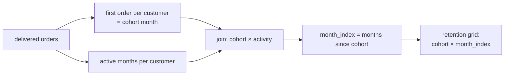

# 2.8 Challenge: cohort report

## Concept
A **cohort analysis** groups customers by *when they first became active* — their
**acquisition cohort** — then tracks how each group behaves over the following months. It's
the single most important retention view an e-commerce business builds, because it answers:
*"Of the customers we acquired in January, how many came back to buy in February, March,
April…?"*

For ShopFlow we define a customer's cohort as the **month of their first delivered order**.
Then, for every later month, we count how many of that cohort placed at least one delivered
order. Expressing the gap as a **month index** (0 = acquisition month, 1 = the next month,
and so on) lets you line every cohort up on the same axis and compare retention curves.

This challenge combines everything from Unit 2: joins, aggregations, window functions, and
chained CTEs. Build it step by step.



## Lab
Set your context and confirm the data is present before you start.

> Run this in the **Trino CLI** or **Superset SQL Lab** (see [2.1](intro.md)). In Superset,
> pick the **shopflow / public** schema and skip the `USE` line below.

```sql
USE shopflow.public;

-- Sanity check: how many delivered orders, over what date range?
SELECT COUNT(*)                       AS delivered_orders,
       MIN(CAST(order_ts AS date))    AS first_day,
       MAX(CAST(order_ts AS date))    AS last_day
FROM orders
WHERE status = 'delivered';
```

Useful Trino building blocks for this challenge:

- Truncate a timestamp to the first of the month: `date_trunc('month', order_ts)`
- Whole months between two dates: `date_diff('month', cohort_month, activity_month)`

## Challenge
Build a **monthly customer cohort retention report**. Requirements:

1. A customer's **cohort month** = the month of their *first delivered order*.
2. For each cohort month and each **month index** (0, 1, 2, … months after acquisition),
   count the number of **distinct customers** from that cohort who placed at least one
   delivered order in that month.
3. Also show the cohort's original size and the **retention rate** (`active / cohort_size`)
   as a percentage.
4. Output columns: `cohort_month`, `cohort_size`, `month_index`, `active_customers`,
   `retention_pct`. Order by `cohort_month`, then `month_index`.

Bonus: filter to `month_index <= 6` for a clean 0–6 month retention curve.

??? note "Solution"
    ```sql
    USE shopflow.public;

    WITH completed AS (                         -- step 1: clean base of delivered orders
      SELECT customer_id,
             date_trunc('month', order_ts) AS activity_month
      FROM orders
      WHERE status = 'delivered'
    ),
    first_order AS (                            -- step 2: each customer's cohort month
      SELECT customer_id,
             MIN(activity_month) AS cohort_month
      FROM completed
      GROUP BY customer_id
    ),
    activity AS (                               -- step 3: distinct active months per customer
      SELECT DISTINCT customer_id, activity_month
      FROM completed
    ),
    cohort_activity AS (                        -- step 4: attach cohort + compute month index
      SELECT f.cohort_month,
             date_diff('month', f.cohort_month, a.activity_month) AS month_index,
             a.customer_id
      FROM first_order AS f
      JOIN activity    AS a ON a.customer_id = f.customer_id
    ),
    cohort_size AS (                            -- step 5: how big was each cohort at month 0
      SELECT cohort_month,
             COUNT(DISTINCT customer_id) AS cohort_size
      FROM first_order
      GROUP BY cohort_month
    ),
    retention AS (                              -- step 6: active customers per (cohort, index)
      SELECT cohort_month,
             month_index,
             COUNT(DISTINCT customer_id) AS active_customers
      FROM cohort_activity
      GROUP BY cohort_month, month_index
    )
    SELECT r.cohort_month,
           s.cohort_size,
           r.month_index,
           r.active_customers,
           ROUND(100.0 * r.active_customers / s.cohort_size, 1) AS retention_pct
    FROM retention   AS r
    JOIN cohort_size AS s ON s.cohort_month = r.cohort_month
    WHERE r.month_index <= 6                    -- bonus: clean 0–6 month window
    ORDER BY r.cohort_month, r.month_index;
    ```

    **How to read it:** at `month_index = 0`, `retention_pct` is always 100% (everyone is
    active in their acquisition month). Each later index shows what fraction of the cohort
    returned — a healthy business sees the curve flatten out rather than fall to zero.

    **Pivot it into a classic triangle** (optional) — turn month indices into columns:

    ```sql
    -- Wrap the query above in a CTE called grid, then:
    SELECT cohort_month, cohort_size,
           MAX(CASE WHEN month_index = 0 THEN retention_pct END) AS m0,
           MAX(CASE WHEN month_index = 1 THEN retention_pct END) AS m1,
           MAX(CASE WHEN month_index = 2 THEN retention_pct END) AS m2,
           MAX(CASE WHEN month_index = 3 THEN retention_pct END) AS m3,
           MAX(CASE WHEN month_index = 4 THEN retention_pct END) AS m4,
           MAX(CASE WHEN month_index = 5 THEN retention_pct END) AS m5,
           MAX(CASE WHEN month_index = 6 THEN retention_pct END) AS m6
    FROM grid
    GROUP BY cohort_month, cohort_size
    ORDER BY cohort_month;
    ```

!!! tip "🎯 This runs unchanged on Azure, Databricks, Snowflake & Fabric"
    **What you just did:** built a full monthly cohort retention report — chained CTEs,
    `COUNT(DISTINCT)`, month-index math, and a `CASE` pivot — as pure SQL.

    - **Azure Databricks** — the exact report runs unchanged on a SQL Warehouse
      (`date_trunc` / `date_diff` are available).
    - **Snowflake** — identical CTE and pivot logic; the date functions shift to
      `DATE_TRUNC('month', …)` and `DATEDIFF('month', …)`.
    - **Microsoft Fabric** — identical CTE/pivot logic in the SQL endpoint; date functions
      become T-SQL (`DATETRUNC` / `DATEDIFF`).
    - **Azure Data Factory** — no equivalent for ad-hoc analytical SQL; you'd run this inside
      a warehouse, or approximate the shape with chained Data Flow stages.

    Cohort/retention reporting is a flagship analytics deliverable — and it's essentially
    portable SQL. Only the date-function *names* differ slightly between engines.

## Key terms, at a glance
| Term | Plain meaning |
|---|---|
| **Cohort** | A group of customers sharing an acquisition month |
| **Month index** | Months elapsed since the cohort's first purchase (0, 1, 2…) |
| **Retention rate** | Active customers ÷ original cohort size, as a % |
| **`date_trunc`** | Round a timestamp down to month/day/etc. |
| **`date_diff`** | Whole units (months) between two dates |
| **`CASE` pivot** | Turn row values into columns (the retention triangle) |

## You can now…
- Assign customers to acquisition cohorts and compute a month index from first purchase
- Build a full cohort retention grid (and pivot it into a triangle) with chained CTEs
- Recognise how the same report maps onto Databricks, Snowflake, Fabric, and Azure
