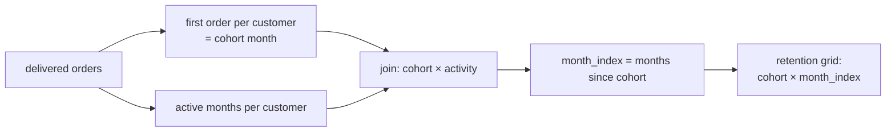

# 2.8 Challenge: cohort report

## Concept
A **cohort analysis** groups customers by *when they first became active* — their
**acquisition cohort** — then tracks how each group behaves over the following months. It's
the single most important retention view an e-commerce business builds, because it answers:
*"Of the customers we acquired in January, how many came back to buy in February, March,
April…?"*

For ShopFlow we define a customer's cohort as the **month of their first delivered order**.
Then, for every later month, we count how many of that cohort placed at least one delivered
order. Expressing the gap as a **month index** (0 = acquisition month, 1 = the next month,
and so on) lets you line every cohort up on the same axis and compare retention curves.

A few plain-language definitions before you start:

- **Cohort** — a group of customers who share something in common. Here they share the *month
  they first bought*. Everyone who placed their first delivered order in January 2024 is one
  cohort; everyone whose first order was in February 2024 is another.
- **Acquisition cohort** — a cohort defined specifically by *when the customer was acquired*
  (their first purchase), as opposed to grouping by country, plan, or product. "Acquisition"
  is just the moment the customer became a customer.
- **Retention** — whether a customer keeps coming back after that first purchase. If 100
  people bought in January and 30 of them bought again in March, the March retention for the
  January cohort is 30 / 100 = **30%**. A business lives or dies on this number: it's far
  cheaper to keep an existing customer than to acquire a new one, so the shape of the
  retention curve tells you how "sticky" the product is.
- **`month_index`** — the number of whole months between a customer's cohort month and the
  month they were active. Month 0 is the acquisition month itself (so retention there is
  always 100% — everyone bought in their own first month by definition). Month 1 is the next
  month, month 2 the one after, and so on. Lining cohorts up by `month_index` instead of by
  calendar date lets you compare a January cohort's "3 months later" directly against a June
  cohort's "3 months later".

This challenge combines everything from Unit 2: joins, aggregations, window functions, and
chained CTEs. Build it step by step.



## Lab
Set your context and confirm the data is present before you start.

> Run this in the **Trino CLI** or **Superset SQL Lab** (see [2.1](intro.md)). In Superset,
> pick the **shopflow / public** schema and skip the `USE` line below.

```sql
USE shopflow.public;

-- Sanity check: how many delivered orders, over what date range?
SELECT COUNT(*)                       AS delivered_orders,
       MIN(CAST(order_ts AS date))    AS first_day,
       MAX(CAST(order_ts AS date))    AS last_day
FROM orders
WHERE status = 'delivered';
```

Useful Trino building blocks for this challenge:

- Truncate a timestamp to the first of the month: `date_trunc('month', order_ts)`
- Whole months between two dates: `date_diff('month', cohort_month, activity_month)`

## Challenge
Build a **monthly customer cohort retention report**. Requirements:

1. A customer's **cohort month** = the month of their *first delivered order*.
2. For each cohort month and each **month index** (0, 1, 2, … months after acquisition),
   count the number of **distinct customers** from that cohort who placed at least one
   delivered order in that month.
3. Also show the cohort's original size and the **retention rate** (`active / cohort_size`)
   as a percentage.
4. Output columns: `cohort_month`, `cohort_size`, `month_index`, `active_customers`,
   `retention_pct`. Order by `cohort_month`, then `month_index`.

Bonus: filter to `month_index <= 6` for a clean 0–6 month retention curve.

??? note "Solution"
    ```sql
    USE shopflow.public;

    WITH completed AS (                         -- step 1: clean base of delivered orders
      SELECT customer_id,
             date_trunc('month', order_ts) AS activity_month
      FROM orders
      WHERE status = 'delivered'
    ),
    first_order AS (                            -- step 2: each customer's cohort month
      SELECT customer_id,
             MIN(activity_month) AS cohort_month
      FROM completed
      GROUP BY customer_id
    ),
    activity AS (                               -- step 3: distinct active months per customer
      SELECT DISTINCT customer_id, activity_month
      FROM completed
    ),
    cohort_activity AS (                        -- step 4: attach cohort + compute month index
      SELECT f.cohort_month,
             date_diff('month', f.cohort_month, a.activity_month) AS month_index,
             a.customer_id
      FROM first_order AS f
      JOIN activity    AS a ON a.customer_id = f.customer_id
    ),
    cohort_size AS (                            -- step 5: how big was each cohort at month 0
      SELECT cohort_month,
             COUNT(DISTINCT customer_id) AS cohort_size
      FROM first_order
      GROUP BY cohort_month
    ),
    retention AS (                              -- step 6: active customers per (cohort, index)
      SELECT cohort_month,
             month_index,
             COUNT(DISTINCT customer_id) AS active_customers
      FROM cohort_activity
      GROUP BY cohort_month, month_index
    )
    SELECT r.cohort_month,
           s.cohort_size,
           r.month_index,
           r.active_customers,
           ROUND(100.0 * r.active_customers / s.cohort_size, 1) AS retention_pct
    FROM retention   AS r
    JOIN cohort_size AS s ON s.cohort_month = r.cohort_month
    WHERE r.month_index <= 6                    -- bonus: clean 0–6 month window
    ORDER BY r.cohort_month, r.month_index;
    ```

    **Walk through the CTE chain step by step.** Each `WITH` block is a named, throw-away
    result the next block can read from — the report is built by stacking six small, readable
    steps instead of one giant query.

    - **`completed`** — the clean base. Keep only `status = 'delivered'` orders, and for each
      one, compute `date_trunc('month', order_ts)` as `activity_month`.
      `date_trunc('month', ts)` rounds a timestamp *down* to the first instant of its month, so
      `2024-03-17 14:22` and `2024-03-02 09:00` both collapse to `2024-03-01`. One row here =
      *one delivered order*, tagged with the month it happened in.
    - **`first_order`** — each customer's cohort month. Group `completed` by `customer_id` and
      take `MIN(activity_month)`. `MIN()` over the months returns the *earliest* one, which is
      exactly the month of the customer's first delivered order. One row here = *one customer*
      with the single value `cohort_month`.
    - **`activity`** — the distinct months in which each customer was active.
      `SELECT DISTINCT customer_id, activity_month` throws away duplicates, so a customer who
      placed three delivered orders in March shows up as a *single* `(customer, March)` row.
      That de-duplication is what makes "active in a month" a yes/no fact rather than an order
      count. One row here = *one customer was active in one month*.
    - **`cohort_activity`** — the join, and where the month index is born. Join `first_order`
      (the cohort month) to `activity` (every active month) `ON a.customer_id = f.customer_id`,
      so each active month now carries the customer's cohort month alongside it. Then compute
      `date_diff('month', f.cohort_month, a.activity_month) AS month_index`.
      `date_diff('month', a, b)` counts the whole months *from* `a` *to* `b`, so a customer
      acquired in January who is active in April gets `month_index = 3`. Their own acquisition
      month gives `date_diff = 0`. One row here = *one customer, active in one month, labelled
      with how many months after acquisition that was*.
    - **`cohort_size`** — how big each cohort was at the start. Group `first_order` by
      `cohort_month` and `COUNT(DISTINCT customer_id)`. Because `first_order` already has one
      row per customer, this is just "how many customers first bought in this month" — the
      denominator for every retention percentage. One row here = *one cohort, with its total
      size*.
    - **`retention`** — the numerator. Group `cohort_activity` by `cohort_month` *and*
      `month_index`, and `COUNT(DISTINCT customer_id)` gives `active_customers` — how many
      distinct people from that cohort were active that many months out. `DISTINCT` matters:
      even though `activity` was already de-duplicated, counting distinct customers here
      guarantees each person is counted once per bucket. One row here = *for one cohort, at one
      month-index, this many customers came back*.

    **The final `SELECT`** joins `retention` (numerator) to `cohort_size` (denominator) on
    `cohort_month`, then computes
    `ROUND(100.0 * r.active_customers / s.cohort_size, 1) AS retention_pct`. The `100.0`
    (a decimal, not `100`) forces floating-point division so you get `30.0`, not an integer
    `0`. `WHERE r.month_index <= 6` trims to the 0–6 month window, and `ORDER BY` lays the grid
    out cohort by cohort, month-index by month-index — the retention grid you set out to build.

    **How to read it:** at `month_index = 0`, `retention_pct` is always 100% (everyone is
    active in their acquisition month). Each later index shows what fraction of the cohort
    returned — a healthy business sees the curve flatten out rather than fall to zero.

    **Pivot it into a classic triangle** (optional) — turn month indices into columns:

    ```sql
    -- Wrap the query above in a CTE called grid, then:
    SELECT cohort_month, cohort_size,
           MAX(CASE WHEN month_index = 0 THEN retention_pct END) AS m0,
           MAX(CASE WHEN month_index = 1 THEN retention_pct END) AS m1,
           MAX(CASE WHEN month_index = 2 THEN retention_pct END) AS m2,
           MAX(CASE WHEN month_index = 3 THEN retention_pct END) AS m3,
           MAX(CASE WHEN month_index = 4 THEN retention_pct END) AS m4,
           MAX(CASE WHEN month_index = 5 THEN retention_pct END) AS m5,
           MAX(CASE WHEN month_index = 6 THEN retention_pct END) AS m6
    FROM grid
    GROUP BY cohort_month, cohort_size
    ORDER BY cohort_month;
    ```

!!! tip "🎯 This runs unchanged on Azure, Databricks, Snowflake & Fabric"
    **What you just did:** built a full monthly cohort retention report — chained CTEs,
    `COUNT(DISTINCT)`, month-index math, and a `CASE` pivot — as pure SQL.

    - **Azure Databricks** — the exact report runs unchanged on a SQL Warehouse
      (`date_trunc` / `date_diff` are available).
    - **Snowflake** — identical CTE and pivot logic; the date functions shift to
      `DATE_TRUNC('month', …)` and `DATEDIFF('month', …)`.
    - **Microsoft Fabric** — identical CTE/pivot logic in the SQL endpoint; date functions
      become T-SQL (`DATETRUNC` / `DATEDIFF`).
    - **Azure Data Factory** — no equivalent for ad-hoc analytical SQL; you'd run this inside
      a warehouse, or approximate the shape with chained Data Flow stages.

    Cohort/retention reporting is a flagship analytics deliverable — and it's essentially
    portable SQL. Only the date-function *names* differ slightly between engines.

## Key terms, at a glance
| Term | Plain meaning |
|---|---|
| **Cohort** | A group of customers sharing an acquisition month |
| **Acquisition cohort** | A cohort defined by *when* customers were first acquired (first purchase) |
| **Month index** | Months elapsed since the cohort's first purchase (0, 1, 2…) |
| **Retention rate** | Active customers ÷ original cohort size, as a % |
| **`date_trunc`** | Round a timestamp down to month/day/etc. |
| **`date_diff`** | Whole units (months) between two dates |
| **`CASE` pivot** | Turn row values into columns (the retention triangle) |

## You can now…
- Assign customers to acquisition cohorts and compute a month index from first purchase
- Build a full cohort retention grid (and pivot it into a triangle) with chained CTEs
- Recognise how the same report maps onto Databricks, Snowflake, Fabric, and Azure
