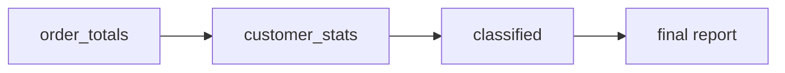

# 2.4 CTEs & complex analytics

## Concept
As analytics get real, a single query grows into a tangle of nested subqueries. A
**Common Table Expression (CTE)** — the `WITH name AS ( … )` form — fixes this by letting
you name intermediate result sets and read the query top to bottom, like steps in a recipe.
You can **chain** CTEs so each builds on the previous, which is how production SQL stays
readable and reviewable.

Think of CTEs as the SQL version of well-named variables. Instead of one 60-line query
nobody can debug, you write:

1. `order_totals` — one row per order, with its value,
2. `customer_stats` — roll up per customer,
3. `classified` — label one-time vs repeat buyers,

…and the final `SELECT` just reads from the last step. Each CTE is independently
understandable and testable.

In this page we build a **repeat-purchase / basket analysis** entirely from chained CTEs —
the same structure you'll reuse when writing the Gold `customer_ltv` table in Unit 4.



### What a CTE actually is
A **CTE (Common Table Expression)** is a temporary, named result set that exists only while
the query runs. You declare it with `WITH name AS ( … )`: the name on the left is a label you
invent, and the `SELECT` inside the parentheses is the query that produces its rows. From that
point on, you can write `FROM name` in later parts of the statement exactly as if `name` were a
real table. Think of it as **SQL's version of a well-named variable** — you compute something
once, give it a clear name, and reuse it by name instead of pasting the same subquery again.

### How chaining CTEs works
You can define **several** CTEs in one `WITH`, separated by commas, and each one is allowed to
read from the ones declared *before* it:

```
WITH step1 AS ( … ),          -- reads real tables
     step2 AS ( … FROM step1 ),  -- reads step1's output
     step3 AS ( … FROM step2 )   -- reads step2's output
SELECT … FROM step3;          -- the final answer reads the last step
```

That's **chaining**: `step1` feeds `step2`, which feeds `step3`, and the closing `SELECT` reads
the last link. You read the whole thing **top to bottom, like steps in a recipe** — each step is
a small, self-contained transformation you can understand (and test) on its own.

!!! info "Why this beats deeply nested subqueries"
    The same logic *can* be written as subqueries nested inside subqueries — a query that reads
    inside-out and grows unreadable fast. Chained CTEs give you the identical result but are:

    - **Readable** — top-to-bottom, each step named after what it does.
    - **Testable** — run just the first CTE's `SELECT` to sanity-check step 1 before building on it.
    - **Reviewable** — a teammate can follow the chain one named step at a time.

    Same answer, far less pain. This is how production analytics SQL is actually written.

!!! note "Grain — what one row *means*"
    As you read each CTE, keep asking: *what does one row of this step represent?* That's the
    **grain**. In the queries below the grain deliberately changes step by step — from one row
    **per order**, to one row **per customer**, to one row **per segment**. Naming the grain of
    each CTE is the fastest way to understand a chain you didn't write.

## Lab
> Run these in the **Trino CLI** or **Superset SQL Lab** (see [2.1](intro.md)). In Superset,
> pick the **shopflow / public** schema and skip the `USE` line below.

```sql
USE shopflow.public;
```

`USE` sets the default catalog + schema so you can write `orders` instead of the full
`shopflow.public.orders` every time.

### 1 · A single CTE for readability
**What it answers:** revenue per product category — the same result you built with plain joins
in [2.2](joins-aggregations.md), but rewritten so the "enriched line revenue" logic is named
**once** and the final `SELECT` reads cleanly. Start with a single CTE to see the shape before
we chain them:

```sql
WITH line_revenue AS (
  SELECT o.order_id,
         o.customer_id,
         CAST(o.order_ts AS date)          AS order_date,
         p.category,
         oi.quantity * oi.unit_price        AS line_revenue
  FROM orders      AS o
  JOIN order_items AS oi ON oi.order_id  = o.order_id
  JOIN products    AS p  ON p.product_id = oi.product_id
  WHERE o.status = 'delivered'
)
SELECT category, SUM(line_revenue) AS revenue
FROM line_revenue
GROUP BY category
ORDER BY revenue DESC;
```

**Read it step by step:**

- **`WITH line_revenue AS ( … )`** — declare one CTE named `line_revenue`. Everything inside the
  parentheses runs first and its output becomes a table you can query below by that name.
- Inside the CTE, the three-table `JOIN` stitches each order to its line items and each item to
  its product (see [2.2](joins-aggregations.md) for how joins match on keys), `WHERE o.status =
  'delivered'` keeps only completed sales, and **`oi.quantity * oi.unit_price AS line_revenue`**
  computes the money for that line. **`CAST(o.order_ts AS date)`** converts the order timestamp
  into a plain calendar date (dropping the time) — we don't use it here, but it shows a CTE can
  prepare columns for later steps.
- **The grain of `line_revenue`** is *one row per delivered line item* — one product on one order.
- **`SELECT category, SUM(line_revenue) … FROM line_revenue`** — the final query reads that named
  result and rolls it up: `GROUP BY category` buckets the line rows by category, `SUM` adds their
  revenue, and `ORDER BY revenue DESC` puts the biggest category first.

!!! note "One CTE already earns its keep"
    Even with a single step, naming the messy join `line_revenue` means the final `SELECT` reads
    like a sentence — *sum line revenue by category*. The reader never has to untangle the joins
    to see the headline. Now we chain more steps on top.

### 2 · Basket analysis — chain two CTEs
**What it answers:** for the top customers, how big is a typical order (items and money), how
many times have they bought, and what's their lifetime value? You can't get there in one hop:
you first need per-order totals, *then* you average those per customer. That's a natural
**two-step chain** — watch how `order_totals` feeds `customer_stats`:

```sql
WITH order_totals AS (              -- step 1: one row per order
  SELECT o.order_id,
         o.customer_id,
         SUM(oi.quantity)                   AS items_in_basket,
         SUM(oi.quantity * oi.unit_price)   AS basket_value
  FROM orders      AS o
  JOIN order_items AS oi ON oi.order_id = o.order_id
  WHERE o.status = 'delivered'
  GROUP BY o.order_id, o.customer_id
),
customer_stats AS (                 -- step 2: one row per customer
  SELECT customer_id,
         COUNT(*)              AS orders,
         AVG(items_in_basket)  AS avg_basket_items,
         AVG(basket_value)     AS avg_basket_value,
         SUM(basket_value)     AS lifetime_value
  FROM order_totals
  GROUP BY customer_id
)
SELECT c.full_name,
       s.orders,
       ROUND(s.avg_basket_items, 1) AS avg_items,
       ROUND(s.avg_basket_value, 2) AS avg_value,
       ROUND(s.lifetime_value, 2)   AS ltv
FROM customer_stats AS s
JOIN customers      AS c ON c.customer_id = s.customer_id
ORDER BY ltv DESC
LIMIT 20;
```

**Read it step by step:**

- **`order_totals` (step 1)** — join orders to their line items and `GROUP BY o.order_id,
  o.customer_id` so each order collapses to a single row. **`SUM(oi.quantity)`** is how many
  items were in that basket; **`SUM(oi.quantity * oi.unit_price)`** is what the basket was worth.
  **Grain: one row per delivered order.** (We keep `customer_id` in the group so the next step
  knows whose order it was.)
- **`customer_stats` (step 2)** — reads *from `order_totals`*, not from the raw tables, and
  `GROUP BY customer_id` rolls those per-order rows up per person. **`COUNT(*)`** counts that
  customer's orders (each `order_totals` row is one order, so counting rows counts orders);
  **`AVG(items_in_basket)`** and **`AVG(basket_value)`** are their *typical* basket; and
  **`SUM(basket_value)`** totals everything they've ever spent — their lifetime value.
  **Grain: one row per customer.**
- **Final `SELECT`** — reads `customer_stats` and joins back to `customers` just to attach the
  human-readable `full_name`. **`ROUND(value, n)`** trims a number to `n` decimal places so the
  report shows `129.5` instead of `129.4736…`. `ORDER BY ltv DESC` + `LIMIT 20` gives the 20
  highest-value customers.

!!! tip "Notice the grain change at each step"
    Raw line items → **one row per order** (`order_totals`) → **one row per customer**
    (`customer_stats`). Each CTE *collapses* the previous grain a level higher. Doing this in one
    query is nearly impossible — you can't average per-order values while still looking at line
    items. Splitting it into named steps is what makes the two-level aggregation straightforward.

### 3 · Repeat-purchase analysis — chain three CTEs
**What it answers:** how does the whole customer base split into **one-time** vs **repeat**
buyers, and how much is each segment worth? This adds a third step — a *labelling* step — on top
of the same order → customer roll-up, then summarises the labels. Read it as three named stages
feeding one final report:

```sql
WITH order_totals AS (
  SELECT o.order_id, o.customer_id,
         CAST(o.order_ts AS date)          AS order_date,
         SUM(oi.quantity * oi.unit_price)  AS basket_value
  FROM orders      AS o
  JOIN order_items AS oi ON oi.order_id = o.order_id
  WHERE o.status = 'delivered'
  GROUP BY o.order_id, o.customer_id, CAST(o.order_ts AS date)
),
customer_stats AS (
  SELECT customer_id,
         COUNT(*)            AS orders,
         MIN(order_date)     AS first_order,
         MAX(order_date)     AS last_order,
         SUM(basket_value)   AS lifetime_value
  FROM order_totals
  GROUP BY customer_id
),
classified AS (
  SELECT *,
         CASE WHEN orders = 1 THEN 'one-time' ELSE 'repeat' END AS segment
  FROM customer_stats
)
SELECT segment,
       COUNT(*)                       AS customers,
       ROUND(AVG(orders), 2)          AS avg_orders,
       ROUND(AVG(lifetime_value), 2)  AS avg_ltv,
       ROUND(SUM(lifetime_value), 2)  AS total_revenue
FROM classified
GROUP BY segment
ORDER BY total_revenue DESC;
```

**Read it step by step:**

- **`order_totals` (step 1)** — same idea as before: one row **per delivered order**, with its
  `basket_value`. This time we also keep **`order_date`** (via `CAST(o.order_ts AS date)`) so the
  next step can find first/last purchase dates. Note the date appears in `GROUP BY` too, because
  anything in `SELECT` that isn't inside an aggregate must be grouped on. **Grain: per order.**
- **`customer_stats` (step 2)** — rolls the orders up **per customer**. **`COUNT(*)`** = how many
  orders they placed; **`MIN(order_date)`** and **`MAX(order_date)`** = their first and most
  recent purchase; **`SUM(basket_value)`** = lifetime value. **Grain: per customer.**
- **`classified` (step 3)** — reads `customer_stats` and adds one derived column with
  **`CASE WHEN orders = 1 THEN 'one-time' ELSE 'repeat' END`**. `CASE WHEN` is SQL's if/else: it
  checks a condition per row and returns a label. **`SELECT *`** carries every column from the
  previous step through unchanged and just tacks the new `segment` label on. **Grain: still one
  row per customer**, now wearing a label.
- **Final `SELECT`** — `GROUP BY segment` collapses all customers into **two rows** (one-time and
  repeat) and reports the counts, averages, and total revenue of each. **Grain: one row per
  segment.**

!!! info "Each CTE is independently testable"
    Building a three-step chain? Don't write all three at once. Write `order_totals`, replace the
    rest with `SELECT * FROM order_totals LIMIT 20`, and check it. Then add `customer_stats` and
    test *that*. Because every CTE is a named query, you can point the final `SELECT` at any step
    to inspect it — the chain never has to be finished to be checked.

!!! tip "CTE vs subquery vs view"
    A CTE is scoped to a single statement — great for readability now. When a transformation
    is reused across many queries, promote it to a **table or view** in the Silver/Gold layer
    (you'll do exactly this in [Unit 4](../unit4/transform-silver.md)). CTEs are your drafting
    tool; Gold tables are the published result.

## Challenge
Using chained CTEs, find the **repeat-customer rate per country**: for each country show
total customers, how many are repeat buyers (2+ delivered orders), and the repeat rate as a
percentage. Sort by repeat rate descending.

!!! tip "How to structure the chain"
    Think in named steps: **step 1** (`per_customer`) counts delivered orders **per customer**;
    **step 2** (`tagged`) joins each customer to their country and flags repeat buyers with a
    `CASE WHEN orders >= 2 THEN 1 ELSE 0 END` (a 1/0 flag you can `SUM`); the **final `SELECT`**
    groups by country. For the percentage, multiply by `100.0` (not `100`) so the division stays
    a decimal instead of rounding to a whole number.

??? note "Solution"
    ```sql
    WITH per_customer AS (
      SELECT o.customer_id,
             COUNT(DISTINCT o.order_id) AS orders
      FROM orders AS o
      WHERE o.status = 'delivered'
      GROUP BY o.customer_id
    ),
    tagged AS (
      SELECT c.country,
             CASE WHEN pc.orders >= 2 THEN 1 ELSE 0 END AS is_repeat
      FROM customers    AS c
      JOIN per_customer AS pc ON pc.customer_id = c.customer_id
    )
    SELECT country,
           COUNT(*)                                    AS customers,
           SUM(is_repeat)                              AS repeat_customers,
           ROUND(100.0 * SUM(is_repeat) / COUNT(*), 1) AS repeat_rate_pct
    FROM tagged
    GROUP BY country
    ORDER BY repeat_rate_pct DESC;
    ```

!!! tip "🎯 This runs unchanged on Azure, Databricks, Snowflake & Fabric"
    **What you just did:** refactored a tangled query into chained `WITH … AS ( … )` CTEs to
    build a multi-step basket / repeat-purchase analysis one readable step at a time.

    - **Azure Databricks** / **Snowflake** — this whole chained-CTE query pastes in and runs
      unchanged; `WITH` is standard ANSI SQL.
    - **Microsoft Fabric** — `WITH` CTEs run unchanged in the SQL endpoint over OneLake Delta.
    - **Azure Data Factory** — the no-code analog is chaining Mapping Data Flow stages
      (Join → Aggregate → Derived Column → Alter Row), one wired into the next.

    CTEs and multi-step analytics are 100% portable — the readable, layered style you
    practiced here is exactly how production SQL is written on every platform.

## Key terms, at a glance
| Term | Plain meaning |
|---|---|
| **CTE (`WITH … AS`)** | A named intermediate result set, scoped to one statement — SQL's version of a well-named variable |
| **`WITH`** | The keyword that opens one or more CTE definitions before the final `SELECT` |
| **Chaining** | Listing CTEs comma-separated so each can read the ones declared before it — steps in a recipe |
| **Grain** | What one row of a step represents (per order, per customer, per segment…) |
| **Subquery** | An inline query nested inside another (reads inside-out; harder to read) |
| **View** | A saved, reusable query promoted to the catalog |
| **`CASE WHEN`** | Conditional if/else logic to derive/label a column (e.g. one-time vs repeat) |
| **`ROUND(x, n)`** | Trim a number to `n` decimal places for readable reports |
| **`CAST(x AS date)`** | Convert a value to another type — here, a timestamp down to a plain date |
| **`SELECT *`** | Carry every column from the previous step through unchanged |

## You can now…
- Refactor nested queries into readable chained CTEs
- Build a multi-step basket / repeat-purchase analysis from named steps
- Recognise when to promote a CTE to a Silver/Gold table or view
