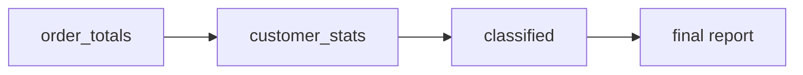

# 2.4 CTEs & complex analytics

## Concept
As analytics get real, a single query grows into a tangle of nested subqueries. A
**Common Table Expression (CTE)** — the `WITH name AS ( … )` form — fixes this by letting
you name intermediate result sets and read the query top to bottom, like steps in a recipe.
You can **chain** CTEs so each builds on the previous, which is how production SQL stays
readable and reviewable.

Think of CTEs as the SQL version of well-named variables. Instead of one 60-line query
nobody can debug, you write:

1. `order_totals` — one row per order, with its value,
2. `customer_stats` — roll up per customer,
3. `classified` — label one-time vs repeat buyers,

…and the final `SELECT` just reads from the last step. Each CTE is independently
understandable and testable.

In this page we build a **repeat-purchase / basket analysis** entirely from chained CTEs —
the same structure you'll reuse when writing the Gold `customer_ltv` table in Unit 4.



## Lab
> Run these in the **Trino CLI** or **Superset SQL Lab** (see [2.1](intro.md)). In Superset,
> pick the **shopflow / public** schema and skip the `USE` line below.

```sql
USE shopflow.public;
```

**A single CTE for readability** — name "enriched line revenue" once, reuse it:

```sql
WITH line_revenue AS (
  SELECT o.order_id,
         o.customer_id,
         CAST(o.order_ts AS date)          AS order_date,
         p.category,
         oi.quantity * oi.unit_price        AS line_revenue
  FROM orders      AS o
  JOIN order_items AS oi ON oi.order_id  = o.order_id
  JOIN products    AS p  ON p.product_id = oi.product_id
  WHERE o.status = 'delivered'
)
SELECT category, SUM(line_revenue) AS revenue
FROM line_revenue
GROUP BY category
ORDER BY revenue DESC;
```

**Basket analysis** — average basket size and value per order, then per customer. Watch
how each CTE feeds the next:

```sql
WITH order_totals AS (              -- step 1: one row per order
  SELECT o.order_id,
         o.customer_id,
         SUM(oi.quantity)                   AS items_in_basket,
         SUM(oi.quantity * oi.unit_price)   AS basket_value
  FROM orders      AS o
  JOIN order_items AS oi ON oi.order_id = o.order_id
  WHERE o.status = 'delivered'
  GROUP BY o.order_id, o.customer_id
),
customer_stats AS (                 -- step 2: one row per customer
  SELECT customer_id,
         COUNT(*)              AS orders,
         AVG(items_in_basket)  AS avg_basket_items,
         AVG(basket_value)     AS avg_basket_value,
         SUM(basket_value)     AS lifetime_value
  FROM order_totals
  GROUP BY customer_id
)
SELECT c.full_name,
       s.orders,
       ROUND(s.avg_basket_items, 1) AS avg_items,
       ROUND(s.avg_basket_value, 2) AS avg_value,
       ROUND(s.lifetime_value, 2)   AS ltv
FROM customer_stats AS s
JOIN customers      AS c ON c.customer_id = s.customer_id
ORDER BY ltv DESC
LIMIT 20;
```

**Repeat-purchase analysis** — classify customers and summarise the whole base:

```sql
WITH order_totals AS (
  SELECT o.order_id, o.customer_id,
         CAST(o.order_ts AS date)          AS order_date,
         SUM(oi.quantity * oi.unit_price)  AS basket_value
  FROM orders      AS o
  JOIN order_items AS oi ON oi.order_id = o.order_id
  WHERE o.status = 'delivered'
  GROUP BY o.order_id, o.customer_id, CAST(o.order_ts AS date)
),
customer_stats AS (
  SELECT customer_id,
         COUNT(*)            AS orders,
         MIN(order_date)     AS first_order,
         MAX(order_date)     AS last_order,
         SUM(basket_value)   AS lifetime_value
  FROM order_totals
  GROUP BY customer_id
),
classified AS (
  SELECT *,
         CASE WHEN orders = 1 THEN 'one-time' ELSE 'repeat' END AS segment
  FROM customer_stats
)
SELECT segment,
       COUNT(*)                       AS customers,
       ROUND(AVG(orders), 2)          AS avg_orders,
       ROUND(AVG(lifetime_value), 2)  AS avg_ltv,
       ROUND(SUM(lifetime_value), 2)  AS total_revenue
FROM classified
GROUP BY segment
ORDER BY total_revenue DESC;
```

!!! tip "CTE vs subquery vs view"
    A CTE is scoped to a single statement — great for readability now. When a transformation
    is reused across many queries, promote it to a **table or view** in the Silver/Gold layer
    (you'll do exactly this in [Unit 4](../unit4/transform-silver.md)). CTEs are your drafting
    tool; Gold tables are the published result.

## Challenge
Using chained CTEs, find the **repeat-customer rate per country**: for each country show
total customers, how many are repeat buyers (2+ delivered orders), and the repeat rate as a
percentage. Sort by repeat rate descending.

??? note "Solution"
    ```sql
    WITH per_customer AS (
      SELECT o.customer_id,
             COUNT(DISTINCT o.order_id) AS orders
      FROM orders AS o
      WHERE o.status = 'delivered'
      GROUP BY o.customer_id
    ),
    tagged AS (
      SELECT c.country,
             CASE WHEN pc.orders >= 2 THEN 1 ELSE 0 END AS is_repeat
      FROM customers    AS c
      JOIN per_customer AS pc ON pc.customer_id = c.customer_id
    )
    SELECT country,
           COUNT(*)                                    AS customers,
           SUM(is_repeat)                              AS repeat_customers,
           ROUND(100.0 * SUM(is_repeat) / COUNT(*), 1) AS repeat_rate_pct
    FROM tagged
    GROUP BY country
    ORDER BY repeat_rate_pct DESC;
    ```

!!! tip "🎯 This runs unchanged on Azure, Databricks, Snowflake & Fabric"
    **What you just did:** refactored a tangled query into chained `WITH … AS ( … )` CTEs to
    build a multi-step basket / repeat-purchase analysis one readable step at a time.

    - **Azure Databricks** / **Snowflake** — this whole chained-CTE query pastes in and runs
      unchanged; `WITH` is standard ANSI SQL.
    - **Microsoft Fabric** — `WITH` CTEs run unchanged in the SQL endpoint over OneLake Delta.
    - **Azure Data Factory** — the no-code analog is chaining Mapping Data Flow stages
      (Join → Aggregate → Derived Column → Alter Row), one wired into the next.

    CTEs and multi-step analytics are 100% portable — the readable, layered style you
    practiced here is exactly how production SQL is written on every platform.

## Key terms, at a glance
| Term | Plain meaning |
|---|---|
| **CTE (`WITH … AS`)** | A named intermediate result set, scoped to one statement |
| **Chained CTEs** | Each CTE builds on the previous — steps in a recipe |
| **Subquery** | An inline query nested inside another (harder to read) |
| **View** | A saved, reusable query promoted to the catalog |
| **`CASE WHEN`** | Conditional logic to derive/label a column (segments) |

## You can now…
- Refactor nested queries into readable chained CTEs
- Build a multi-step basket / repeat-purchase analysis from named steps
- Recognise when to promote a CTE to a Silver/Gold table or view
