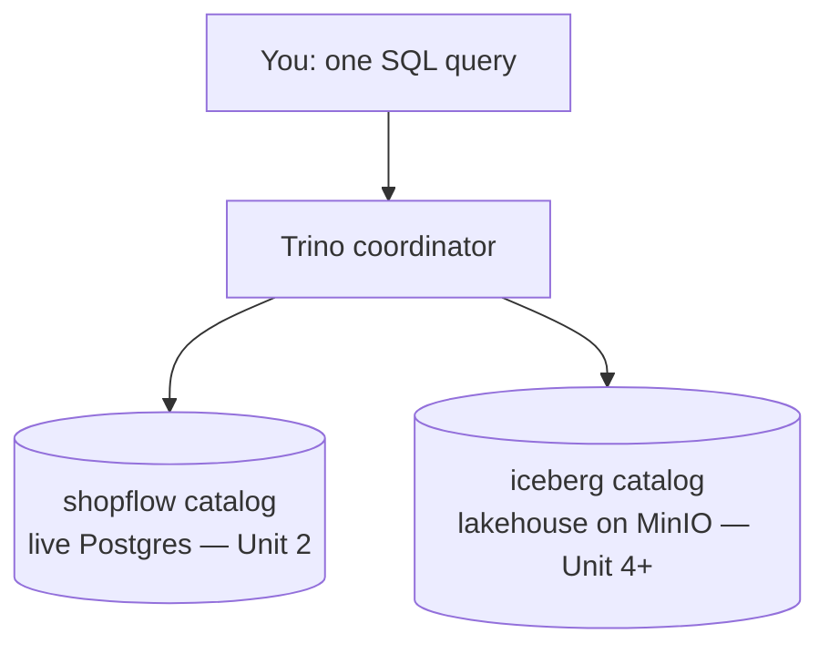

# 2.1 Query the lake with Trino

## Concept
A **distributed SQL engine** lets you run ordinary SQL over data wherever it lives —
files in object storage, or a live database — without moving it first. **Trino** is
exactly that. You send it one SQL query; it figures out where the data is, does the work
(splitting big scans across parallel workers, or pushing filters down into a source
database), and returns one result set. To you it feels like a single database.

Trino doesn't store any data itself — it **connects to other systems and queries them where
they already are**. Each connection is a **catalog**: a named pointer to one data system, with
its own schemas and tables. `SHOW CATALOGS` lists them. On our stack:

| Catalog | Connects to… | Where the bytes physically live | What's inside | You use it |
|---|---|---|---|---|
| **`shopflow`** | the live ShopFlow app database (Postgres) | the Postgres server | the **raw source** tables — `customers`, `products`, `orders`, `order_items` | **now, Unit 2** |
| **`iceberg`** | the lakehouse (via the **Apache Polaris** Iceberg REST catalog) | Parquet files on **MinIO** object storage | the **Bronze / Silver / Gold** tables *you'll build* | from Unit 4 |
| **`system`** | Trino itself | in memory | engine info (nodes, running queries) | rarely |

!!! question "Why is the lakehouse catalog called `iceberg` and not `shopflow`?"
    A catalog is named after the **system it connects to**, not the business:

    - `shopflow` is named after the **Postgres database** it points at (which is called `shopflow`).
    - `iceberg` is named after the **table format** the lakehouse stores its tables in
      (Apache Iceberg — see [1.3](../unit1/formats.md)).

    So your ShopFlow data lives in **two homes at different stages of its life**: raw in the
    `shopflow` catalog (Postgres, right now), and — after you build the pipeline in Unit 4 —
    refined in the `iceberg` catalog (the lakehouse on MinIO). Same business, two places.

!!! info "Do I ever *create* a catalog?"
    Not in SQL. A Trino catalog is a **connection**, set up once by the platform admin (a small
    config file) — `shopflow` and `iceberg` already exist for you (`CREATE CATALOG` isn't a
    Trino command; catalogs are *configuration*, not data). What **you** create lives *inside*
    a catalog:

    - **schemas and tables** in the lakehouse — with Spark in
      [Unit 4](../unit4/read-bronze.md) (`CREATE SCHEMA`, `CREATE TABLE`);
    - governed **schemas and tables** in the **Apache Polaris** catalog — in
      [Unit 6](../unit6/catalogs.md).

So in this unit you'll **explore ShopFlow's raw source with SQL** — the exact
[tables from the schema page](../unit0/schema.md) — *before* building the lakehouse. Every table
has a **three-part name**: `catalog.schema.table` (e.g. `shopflow.public.orders`). To see what's
inside any catalog, use `SHOW SCHEMAS FROM <catalog>` and `SHOW TABLES FROM <catalog>.<schema>`.



!!! note "Same SQL, two homes"
    Everything you write this unit against `shopflow.public.*` will run **unchanged** on
    your `iceberg.silver.*` / `iceberg.gold.*` tables once you build them in Unit 4 — just
    swap the three-part name. SQL is portable across sources; that's the whole point of a
    query engine.

## Lab
The stack is already running (see the [architecture](../unit0/architecture.md)). You'll run
SQL two ways in this course — use whichever you prefer:

**A. The Trino command-line client** — point the `trino` CLI at the server:

```bash
# Local
trino --server http://localhost:8007

# Kubernetes
trino --server http://trino.de.lan
```

You'll get a `trino>` prompt; type SQL and end each statement with `;`. (Don't have the CLI yet?
See [Prerequisites → the Trino CLI](../setup/prerequisites.md#3-the-trino-cli-recommended) for the
one-line install on macOS, Windows, or Linux.)

**B. Superset SQL Lab** — nothing to install, just a browser. Open Superset at
`http://localhost:8004` (local) or `superset.de.lan` (k8s), sign in (`admin` / `admin`), go to
**SQL → SQL Lab**, and pick the **shopflow** database with the **public** schema. Then paste the
queries below (skip the `USE` line — in SQL Lab you choose the schema from the dropdown instead).

!!! note "The `http://localhost:8007/ui/` page is *monitoring*, not a query editor"
    That web UI shows running/finished queries and their stats — handy for seeing the engine
    work, but you write SQL in the CLI or Superset, not there.

### First — confirm it's working
Before anything else, run this smoke test. It checks two things: that the **engine responds**,
and that it can **reach the ShopFlow data**.

```sql
-- 1) Is the engine alive?
SELECT 'Trino is working!' AS status;

-- 2) Can it read ShopFlow? (should return 40000)
SELECT count(*) AS orders FROM shopflow.public.orders;
```

The first query invents a one-row result out of thin air, so it proves *only* that Trino
received your SQL and ran it — the engine is alive. The second actually reaches into the
`shopflow` catalog and counts every row in the `orders` table (`count(*)` = "how many rows?");
getting **40000** back proves Trino can find and read the real data, not just echo text.

Expected result of the second query:

| orders |
|--------|
| 40000  |

If the first query fails, your connection is wrong (check the `--server` URL, or that you're
signed into Superset). If the first works but the second errors, the `shopflow` catalog or its
data isn't available — confirm the stack is fully up and the data has been seeded. Once both
succeed, you're ready.

Discover what Trino can see — the three-part name is built from these:

```sql
-- What data sources are connected?
SHOW CATALOGS;                      -- expect: shopflow, iceberg, system

-- What schemas live in the ShopFlow source?
SHOW SCHEMAS FROM shopflow;         -- the business tables are in 'public'

-- What tables are there?
SHOW TABLES FROM shopflow.public;   -- customers, products, orders, order_items

-- Peek at a table's columns
DESCRIBE shopflow.public.orders;
```

Read these top-down as a drill-in: **`SHOW CATALOGS`** lists every data source Trino is connected
to; **`SHOW SCHEMAS FROM <catalog>`** lists the schemas (groups of tables) inside one of them; and
**`SHOW TABLES FROM <catalog>.<schema>`** lists the tables inside one schema. Stack the answers and
you get the **three-part name** `catalog.schema.table` — e.g. `shopflow` + `public` + `orders` =
`shopflow.public.orders`, the full address of any one table.

Set a default catalog + schema so you can drop the prefix:

```sql
USE shopflow.public;
```

Run your first `SELECT`s against real ShopFlow data (~40,000 orders):

```sql
-- Projection + row limit (always LIMIT while exploring!)
SELECT order_id, customer_id, channel, status, order_ts
FROM orders
LIMIT 10;

-- Filter with WHERE, sort with ORDER BY
SELECT order_id, customer_id, order_ts
FROM orders
WHERE status = 'delivered'          -- a completed sale
  AND channel = 'web'
ORDER BY order_ts DESC
LIMIT 20;
```

!!! tip "ShopFlow order statuses"
    An order's `status` is one of `placed` · `shipped` · `delivered` · `cancelled`.
    Throughout Unit 2 we treat **`delivered`** as a *completed sale* (revenue you can
    count). Get used to filtering on it.

Once you've built the ShopFlow Gold tables (Unit 4), the *exact same* SQL works against the
lakehouse — just change the three-part name:

```sql
-- From Unit 4 onward — the governed lakehouse via the iceberg catalog
SHOW SCHEMAS FROM iceberg;          -- expect: bronze, silver, gold
SELECT * FROM iceberg.gold.daily_sales ORDER BY sales_date DESC LIMIT 14;
```

### Make your own space in the lakehouse
So far you've only **read** data. Before we start *writing* (from [2.6](merge.md) onward), carve out
your own area to experiment in. Remember from the info box above: you can't create a **catalog** in
SQL (that's admin config), but you **can** create your own **schema** inside the existing `iceberg`
catalog, and real tables inside *that* — your personal corner of the lakehouse.

Pick a name and create it (use your own, e.g. `iceberg.ravi_lab`):

```sql
CREATE SCHEMA IF NOT EXISTS iceberg.my_lab;

CREATE TABLE iceberg.my_lab.first_table (
  id     int,
  item   varchar,
  amount double
);

INSERT INTO iceberg.my_lab.first_table VALUES
  (1, 'keyboard', 49.9),
  (2, 'mouse',    19.5);

SELECT * FROM iceberg.my_lab.first_table ORDER BY id;
```

**Read it step by step:**

- **`CREATE SCHEMA … iceberg.my_lab`** — makes a new schema (a named folder for tables) *inside* the
  `iceberg` lakehouse. `IF NOT EXISTS` means "skip if it's already there" — safe to re-run.
- **`CREATE TABLE iceberg.my_lab.first_table (…)`** — defines a real **Iceberg table**: this writes
  table metadata to the catalog, and future rows land as **Parquet files on MinIO** (the object
  storage from [Unit 1.2](../unit1/lakehouse.md)).
- **`INSERT INTO … VALUES …`** — your first **write** to the lakehouse. Each write appends a new
  Parquet file and a new table **snapshot** (the ACID table-format magic from [1.3](../unit1/formats.md)).
- **`SELECT * FROM …`** — reads it straight back with the same three-part name.

!!! success "You just built a datalake"
    That's the whole idea — a lakehouse is **one `iceberg` catalog holding many schemas**, one per
    team or person. In [Unit 4](../unit4/read-bronze.md) you'll build a full **bronze → silver → gold**
    exactly this way (with Spark instead of SQL). Clean up your experiment any time:

    ```sql
    DROP TABLE  iceberg.my_lab.first_table;
    DROP SCHEMA iceberg.my_lab;
    ```

!!! note "Why writing works here without a login"
    On this learning stack, Trino/Spark write to `iceberg` **freely** — the engines aren't wired to
    per-user enforcement, so you can experiment without permission errors. On a
    *governed* platform an admin would `GRANT` you `CREATE` on a schema first — the access model you'll
    meet in [Unit 6](../unit6/rbac.md).

## Challenge
Using only the `orders` table: list the **5 most recent cancelled orders placed on the
`marketplace` channel** — show `order_id`, `customer_id`, and `order_ts`, newest first.

??? note "Solution"
    ```sql
    SELECT order_id, customer_id, order_ts
    FROM shopflow.public.orders
    WHERE status = 'cancelled'
      AND channel = 'marketplace'
    ORDER BY order_ts DESC
    LIMIT 5;
    ```

!!! tip "🎯 This runs unchanged on Azure, Databricks, Snowflake & Fabric"
    **What you just did:** connected to a distributed SQL engine and ran filtered, sorted
    `SELECT`s over source tables using `catalog.schema.table` names.

    - **Azure Databricks** — the same ANSI `SELECT / WHERE / ORDER BY` runs on a SQL
      Warehouse; tables use the same `catalog.schema.table` naming, addressed via Unity Catalog.
    - **Snowflake** — same SQL in a Snowsight worksheet on a Virtual Warehouse; three-part
      naming is `database.schema.table`; `SHOW SCHEMAS`/`SHOW TABLES` work the same.
    - **Microsoft Fabric** — query via the Lakehouse SQL analytics endpoint over OneLake
      Delta; standard SQL, `TOP` instead of `LIMIT`.
    - **Azure Data Factory** — no interactive query surface of its own; it *moves* data and
      points at a warehouse/engine to run the SQL.

    Trino ≈ Databricks SQL Warehouse ≈ Snowflake Virtual Warehouse ≈ Fabric SQL endpoint.
    Your SQL is portable; only the connection changes.

## Key terms, at a glance
| Term | Plain meaning |
|---|---|
| **Distributed SQL engine** | Runs one SQL query over data across sources, in parallel |
| **Catalog** | A named connection to a data source (its schemas + tables) |
| **Schema** | A named group of tables inside a catalog (ShopFlow's live in `public`) |
| **Three-part name** | `catalog.schema.table` — how you address any table |
| **`SHOW CATALOGS` / `SCHEMAS` / `TABLES`** | Drill in: list sources → schemas in one → tables in one |
| **Federation** | Querying a live source (like Postgres) *in place*, no copy |
| **Predicate pushdown** | Trino sends `WHERE` filters down into the source to read less |

## You can now…
- Explain what a distributed SQL engine does, and connect to Trino via CLI or the UI
- Discover data with `SHOW CATALOGS/SCHEMAS/TABLES` and `DESCRIBE`
- Write filtered, sorted `SELECT`s using `catalog.schema.table` names
- Explain why the same SQL will run on the lakehouse catalog in Unit 4
