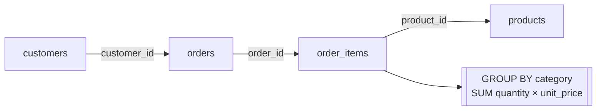

# 2.2 Joins & aggregations

## Concept
Real questions rarely fit in one table. ShopFlow's revenue lives across four tables (the
[schema](../unit0/schema.md)): an **order** (`orders`) has many line items (`order_items`),
each line item points at a **product** (`products`), and each order belongs to a
**customer** (`customers`). **Joins** stitch these together; **aggregations** roll them up
into numbers the business cares about.

- An **`INNER JOIN`** keeps only rows that match on *both* sides — perfect when you need
  line items that *have* a product.
- A **`LEFT JOIN`** keeps **all** rows from the left table even when the right side has no
  match — essential when you don't want to silently drop customers who never ordered.

Aggregations collapse many rows into summary values with **`GROUP BY`** plus functions like
`SUM`, `COUNT`, and `AVG`. Filter **groups** (not rows) with **`HAVING`**. By the end you'll
build **revenue by category** — a classic Gold-layer metric.



### How a join actually works
A **join** matches each row of one table to rows in another using a **key** — a column they
share. `orders.customer_id` points at `customers.customer_id`; that link is the *join key*. You
tell SQL the rule in the **`ON`** clause (`ON o.customer_id = c.customer_id`), and it stitches the
matching rows together into one wider row.

Two ideas to hold onto before we start:

- **Aliases** — writing `orders AS o` lets you refer to columns as `o.order_id` instead of the
  full table name. With four tables in a query it keeps things short and unambiguous (both
  `orders` and `order_items` have an `order_id`, so you *must* say which one you mean).
- **Fan-out (one-to-many)** — one order has *many* line items. So when you join `orders` to
  `order_items`, a single order becomes **several rows** — one per item. That's exactly what you
  want *before* aggregating, but it's why you'll need `COUNT(DISTINCT …)` later to avoid
  counting the same order many times.

## Lab
These labs run on the raw ShopFlow source via the `shopflow` catalog. (After Unit 4, the
same SQL works on `iceberg.silver.*` — just change the schema.)

> Run these in the **Trino CLI** or **Superset SQL Lab** (see [2.1](intro.md)). In Superset,
> pick the **shopflow / public** schema and skip the `USE` line below.

```sql
USE shopflow.public;
```

`USE` sets the default catalog + schema so you can write `orders` instead of the full
`shopflow.public.orders` every time.

### 1 · Your first join — attach a product to each line item
An `order_items` row only stores a `product_id` (a number). To see the product's *name* and
*category*, join to the `products` table:

```sql
SELECT oi.order_id,
       p.name        AS product,
       p.category,
       oi.quantity,
       oi.unit_price,
       oi.quantity * oi.unit_price AS line_revenue
FROM order_items AS oi
INNER JOIN products AS p
       ON oi.product_id = p.product_id
LIMIT 20;
```

**Read it clause by clause:**

- **`FROM order_items AS oi`** — start from the line items, nicknamed `oi`.
- **`INNER JOIN products AS p ON oi.product_id = p.product_id`** — for each line item, find the
  product whose `product_id` matches, and glue that product's columns onto the row.
- **`INNER JOIN`** keeps a row **only if the match succeeds**. Every line item here has a valid
  product, so none are dropped — but the word matters (see the `LEFT JOIN` at the end).
- **`oi.quantity * oi.unit_price AS line_revenue`** — you can *compute* new columns with
  arithmetic. **`AS line_revenue`** just gives that column a readable name (an **alias**).
- **`LIMIT 20`** — return only the first 20 rows. Always sample a big table before running the
  full thing.

### 2 · Chain all four tables
Revenue lives across four tables, so chain the joins — each one adds a table matched on its key:

```sql
SELECT o.order_id,
       o.order_ts,
       c.full_name   AS customer,
       c.country,
       p.category,
       p.name        AS product,
       oi.quantity * oi.unit_price AS line_revenue
FROM orders       AS o
JOIN order_items  AS oi ON oi.order_id   = o.order_id
JOIN products     AS p  ON p.product_id  = oi.product_id
JOIN customers    AS c  ON c.customer_id = o.customer_id
WHERE o.status = 'delivered'
LIMIT 20;
```

- **`JOIN`** with no keyword **means `INNER JOIN`** — they're the same thing.
- The chain reads like a sentence: each **order** → its **line items** → each item's **product**
  → the order's **customer**.
- **`WHERE o.status = 'delivered'`** filters *rows* — keep only delivered orders. (`WHERE` runs
  **before** any grouping; more on that next.)
- Every output row is now **one enriched line item** — that's the **grain** of this result.

!!! info "The order SQL *really* runs in"
    You write `SELECT` first, but the engine evaluates clauses in this order:

    **`FROM` / `JOIN`** → **`WHERE`** → **`GROUP BY`** → **`HAVING`** → **`SELECT`** →
    **`ORDER BY`** → **`LIMIT`**

    That's why `WHERE` can filter raw rows but can't use a `SELECT` alias yet, and why `HAVING`
    (which comes after grouping) is the one that can filter on a `SUM`.

### 3 · Aggregate — revenue & orders per country
`GROUP BY` **collapses** many rows into one summary row per group, and **aggregate functions**
compute a single value for each group:

```sql
SELECT c.country,
       COUNT(DISTINCT o.order_id)          AS orders,
       SUM(oi.quantity * oi.unit_price)    AS revenue,
       AVG(oi.quantity * oi.unit_price)    AS avg_line_value
FROM orders      AS o
JOIN order_items AS oi ON oi.order_id   = o.order_id
JOIN customers   AS c  ON c.customer_id = o.customer_id
WHERE o.status = 'delivered'
GROUP BY c.country
ORDER BY revenue DESC;
```

- **`GROUP BY c.country`** — put every line-item row into a bucket by country. The result has
  **one row per country** (that's the new grain).
- **`SUM(oi.quantity * oi.unit_price)`** — add up line revenue across all rows in the bucket.
- **`AVG(…)`** — the average line value in the bucket.
- **`COUNT(DISTINCT o.order_id)`** — count the **unique** orders. This is the crucial one: because
  the join fanned out to line items, one order appears on *several* rows. Plain
  `COUNT(o.order_id)` would count line items, not orders — **`DISTINCT`** de-duplicates so you
  count each order once.
- **`ORDER BY revenue DESC`** — sort the result, biggest revenue first (`DESC` = descending).

!!! note "The three faces of COUNT"
    - **`COUNT(*)`** — how many rows are in the group (counts everything).
    - **`COUNT(col)`** — how many rows where `col` is **not NULL**.
    - **`COUNT(DISTINCT col)`** — how many **different** values of `col`.

### 4 · The headline metric — revenue by category
Same recipe, grouped by `category` instead — this *is* a Gold-layer business metric:

```sql
SELECT p.category,
       SUM(oi.quantity * oi.unit_price)    AS revenue,
       SUM(oi.quantity)                    AS units_sold,
       COUNT(DISTINCT o.order_id)          AS orders
FROM orders      AS o
JOIN order_items AS oi ON oi.order_id  = o.order_id
JOIN products    AS p  ON p.product_id = oi.product_id
WHERE o.status = 'delivered'
GROUP BY p.category
ORDER BY revenue DESC;
```

Three different aggregates over the same group: **`SUM(revenue)`** = money earned,
**`SUM(quantity)`** = units sold, **`COUNT(DISTINCT order_id)`** = how many orders touched the
category. Change the `GROUP BY` column and you get the same metric sliced a different way — that's
the whole power of aggregation.

### 5 · LEFT JOIN — find customers who *never* ordered
An `INNER JOIN` would silently drop customers with no orders — but "who never buys?" is often the
question. A **`LEFT JOIN`** keeps **every** row of the left table (`customers`); where there's no
match, the right-side columns come back **`NULL`**:

```sql
SELECT c.customer_id, c.full_name, COUNT(o.order_id) AS delivered_orders
FROM customers AS c
LEFT JOIN orders AS o
       ON o.customer_id = c.customer_id
      AND o.status = 'delivered'      -- join condition, NOT WHERE, to keep the LEFT rows
GROUP BY c.customer_id, c.full_name
HAVING COUNT(o.order_id) = 0
ORDER BY c.customer_id
LIMIT 20;
```

- **`LEFT JOIN`** — keep all customers, matched or not.
- **`COUNT(o.order_id)`** — remember `COUNT(col)` **ignores NULLs**. A customer with no delivered
  order has only NULL `o.order_id`, so their count is **0**. (Using `COUNT(*)` here would wrongly
  return 1, because the customer's own row still exists.)
- **`HAVING COUNT(o.order_id) = 0`** — **`HAVING`** filters *groups* after aggregation, the way
  `WHERE` filters rows before it. Here it keeps only customers whose delivered-order count is zero.
- **`AND o.status = 'delivered'` lives in the `ON`**, on purpose — see the warning.

!!! warning "The classic LEFT JOIN trap: `ON` vs `WHERE`"
    Put `o.status = 'delivered'` in a **`WHERE`** clause instead, and you silently turn the
    `LEFT JOIN` back into an `INNER JOIN`: the unmatched customers have `status = NULL`, `NULL`
    fails the filter, and they vanish — the exact rows you were trying to find. **Rule of thumb:**
    conditions that decide *how tables match* go in **`ON`**; conditions that filter the *final
    rows* go in **`WHERE`**.

## Challenge
Produce a **top-spending customers** report: for each customer show name, country, number
of delivered orders, and total revenue — but only customers whose total delivered revenue
exceeds **5000**. Sort by revenue descending, top 10.

!!! tip "Which clauses do you need?"
    Join `customers × orders × order_items`, filter delivered rows with **`WHERE`**, roll up with
    **`GROUP BY`** the customer, keep only big spenders with **`HAVING SUM(…) > 5000`** (a group
    filter, not a row filter), then **`ORDER BY revenue DESC`** and **`LIMIT 10`**.

??? note "Solution"
    ```sql
    SELECT c.full_name,
           c.country,
           COUNT(DISTINCT o.order_id)        AS orders,
           SUM(oi.quantity * oi.unit_price)  AS revenue
    FROM customers   AS c
    JOIN orders      AS o  ON o.customer_id = c.customer_id
    JOIN order_items AS oi ON oi.order_id   = o.order_id
    WHERE o.status = 'delivered'
    GROUP BY c.full_name, c.country
    HAVING SUM(oi.quantity * oi.unit_price) > 5000
    ORDER BY revenue DESC
    LIMIT 10;
    ```

!!! tip "🎯 This runs unchanged on Azure, Databricks, Snowflake & Fabric"
    **What you just did:** joined `orders × order_items × products × customers` and rolled
    them up with `GROUP BY` + `SUM/COUNT/AVG` to get revenue by category.

    - **Azure Databricks** / **Snowflake** — this exact `JOIN` / `GROUP BY` / `HAVING`
      ANSI SQL is copy-paste portable to a SQL Warehouse / Virtual Warehouse.
    - **Microsoft Fabric** — identical ANSI SQL in the Lakehouse SQL endpoint or Warehouse
      over OneLake Delta.
    - **Azure Data Factory** — build it no-code in a Mapping Data Flow: the **Join**
      transformation stitches the tables, **Aggregate** does the `GROUP BY` + `SUM/COUNT/AVG`.

    Joins and aggregations are 100% portable SQL — the most reused skill in the course, and
    the definition of every Gold-layer metric you'll ship.

## Key terms, at a glance
| Term | Plain meaning |
|---|---|
| **Join key** | The shared column two tables match on (e.g. `customer_id`) |
| **`ON`** | The rule that decides which rows match in a join |
| **Alias (`AS`)** | A short nickname for a table or a renamed output column |
| **INNER JOIN** (`JOIN`) | Keep only rows that match on both sides |
| **LEFT JOIN** | Keep all left rows; right side is `NULL` when unmatched |
| **Fan-out** | One-to-many join → one order becomes many line-item rows |
| **`WHERE`** | Filter *rows* — runs **before** grouping |
| **GROUP BY** | Collapse rows into one summary row per group |
| **SUM / AVG** | Aggregate functions — add up / average a group |
| **COUNT(*) / COUNT(col) / COUNT(DISTINCT col)** | Count rows / non-NULL values / unique values |
| **HAVING** | Filter *groups* **after** aggregation (vs `WHERE` on rows) |
| **ORDER BY … DESC / LIMIT** | Sort the result / cap how many rows come back |
| **Grain** | What one output row represents (per country, per category…) |
| **Execution order** | `FROM`→`WHERE`→`GROUP BY`→`HAVING`→`SELECT`→`ORDER BY`→`LIMIT` |

## You can now…
- Join `orders × order_items × products × customers` with INNER and LEFT joins
- Roll up with `GROUP BY` + `SUM/COUNT/AVG` and filter groups with `HAVING`
- Build the "revenue by category" Gold metric and reason about when rows get dropped
