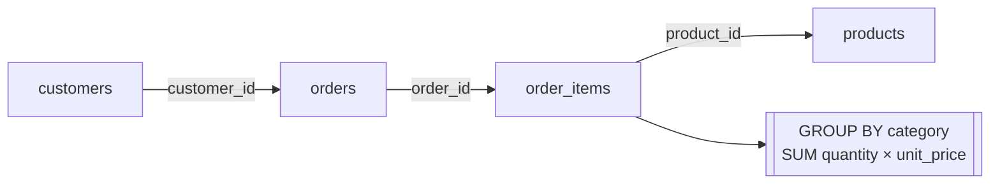

# 2.2 Joins & aggregations

## Concept
Real questions rarely fit in one table. ShopFlow's revenue lives across four tables (the
[schema](../unit0/schema.md)): an **order** (`orders`) has many line items (`order_items`),
each line item points at a **product** (`products`), and each order belongs to a
**customer** (`customers`). **Joins** stitch these together; **aggregations** roll them up
into numbers the business cares about.

- An **`INNER JOIN`** keeps only rows that match on *both* sides — perfect when you need
  line items that *have* a product.
- A **`LEFT JOIN`** keeps **all** rows from the left table even when the right side has no
  match — essential when you don't want to silently drop customers who never ordered.

Aggregations collapse many rows into summary values with **`GROUP BY`** plus functions like
`SUM`, `COUNT`, and `AVG`. Filter **groups** (not rows) with **`HAVING`**. By the end you'll
build **revenue by category** — a classic Gold-layer metric.



## Lab
These labs run on the raw ShopFlow source via the `shopflow` catalog. (After Unit 4, the
same SQL works on `iceberg.silver.*` — just change the schema.)

> Run these in the **Trino CLI** or **Superset SQL Lab** (see [2.1](intro.md)). In Superset,
> pick the **shopflow / public** schema and skip the `USE` line below.

```sql
USE shopflow.public;
```

Start with a two-table `INNER JOIN` — attach product info to each line item:

```sql
SELECT oi.order_id,
       p.name        AS product,
       p.category,
       oi.quantity,
       oi.unit_price,
       oi.quantity * oi.unit_price AS line_revenue
FROM order_items AS oi
INNER JOIN products AS p
       ON oi.product_id = p.product_id
LIMIT 20;
```

Now chain all four tables for a fully enriched line-item view:

```sql
SELECT o.order_id,
       o.order_ts,
       c.full_name   AS customer,
       c.country,
       p.category,
       p.name        AS product,
       oi.quantity * oi.unit_price AS line_revenue
FROM orders       AS o
JOIN order_items  AS oi ON oi.order_id   = o.order_id
JOIN products     AS p  ON p.product_id  = oi.product_id
JOIN customers    AS c  ON c.customer_id = o.customer_id
WHERE o.status = 'delivered'
LIMIT 20;
```

**Aggregate** it — total revenue and order count per country:

```sql
SELECT c.country,
       COUNT(DISTINCT o.order_id)          AS orders,
       SUM(oi.quantity * oi.unit_price)    AS revenue,
       AVG(oi.quantity * oi.unit_price)    AS avg_line_value
FROM orders      AS o
JOIN order_items AS oi ON oi.order_id   = o.order_id
JOIN customers   AS c  ON c.customer_id = o.customer_id
WHERE o.status = 'delivered'
GROUP BY c.country
ORDER BY revenue DESC;
```

**The headline metric — revenue by category:**

```sql
SELECT p.category,
       SUM(oi.quantity * oi.unit_price)    AS revenue,
       SUM(oi.quantity)                    AS units_sold,
       COUNT(DISTINCT o.order_id)          AS orders
FROM orders      AS o
JOIN order_items AS oi ON oi.order_id  = o.order_id
JOIN products    AS p  ON p.product_id = oi.product_id
WHERE o.status = 'delivered'
GROUP BY p.category
ORDER BY revenue DESC;
```

Use `LEFT JOIN` + `HAVING` to find **customers who have never had a delivered order** —
notice the left table (customers) is preserved and unmatched rows show `NULL`:

```sql
SELECT c.customer_id, c.full_name, COUNT(o.order_id) AS delivered_orders
FROM customers AS c
LEFT JOIN orders AS o
       ON o.customer_id = c.customer_id
      AND o.status = 'delivered'      -- join condition, NOT WHERE, to keep the LEFT rows
GROUP BY c.customer_id, c.full_name
HAVING COUNT(o.order_id) = 0
ORDER BY c.customer_id
LIMIT 20;
```

!!! warning "INNER vs LEFT and dropped rows"
    Putting `o.status = 'delivered'` in a `WHERE` clause on a `LEFT JOIN` silently turns it
    back into an `INNER JOIN` (the `NULL` rows fail the filter). Keep such conditions in the
    `ON` clause when you want to preserve unmatched left rows.

## Challenge
Produce a **top-spending customers** report: for each customer show name, country, number
of delivered orders, and total revenue — but only customers whose total delivered revenue
exceeds **5000**. Sort by revenue descending, top 10.

??? note "Solution"
    ```sql
    SELECT c.full_name,
           c.country,
           COUNT(DISTINCT o.order_id)        AS orders,
           SUM(oi.quantity * oi.unit_price)  AS revenue
    FROM customers   AS c
    JOIN orders      AS o  ON o.customer_id = c.customer_id
    JOIN order_items AS oi ON oi.order_id   = o.order_id
    WHERE o.status = 'delivered'
    GROUP BY c.full_name, c.country
    HAVING SUM(oi.quantity * oi.unit_price) > 5000
    ORDER BY revenue DESC
    LIMIT 10;
    ```

!!! tip "🎯 This runs unchanged on Azure, Databricks, Snowflake & Fabric"
    **What you just did:** joined `orders × order_items × products × customers` and rolled
    them up with `GROUP BY` + `SUM/COUNT/AVG` to get revenue by category.

    - **Azure Databricks** / **Snowflake** — this exact `JOIN` / `GROUP BY` / `HAVING`
      ANSI SQL is copy-paste portable to a SQL Warehouse / Virtual Warehouse.
    - **Microsoft Fabric** — identical ANSI SQL in the Lakehouse SQL endpoint or Warehouse
      over OneLake Delta.
    - **Azure Data Factory** — build it no-code in a Mapping Data Flow: the **Join**
      transformation stitches the tables, **Aggregate** does the `GROUP BY` + `SUM/COUNT/AVG`.

    Joins and aggregations are 100% portable SQL — the most reused skill in the course, and
    the definition of every Gold-layer metric you'll ship.

## Key terms, at a glance
| Term | Plain meaning |
|---|---|
| **INNER JOIN** | Keep only rows that match on both sides |
| **LEFT JOIN** | Keep all left rows; right side is `NULL` when unmatched |
| **GROUP BY** | Collapse rows into one summary row per group |
| **SUM / COUNT / AVG** | Aggregate functions over each group |
| **COUNT(DISTINCT …)** | Count unique values (e.g. distinct orders) |
| **HAVING** | Filter *groups* after aggregation (vs `WHERE` on rows) |
| **Grain** | What one output row represents (per country, per category…) |

## You can now…
- Join `orders × order_items × products × customers` with INNER and LEFT joins
- Roll up with `GROUP BY` + `SUM/COUNT/AVG` and filter groups with `HAVING`
- Build the "revenue by category" Gold metric and reason about when rows get dropped
