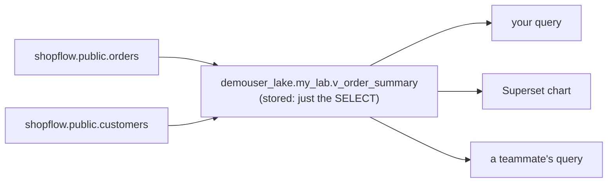

# 2.5 Views: saved queries in the lakehouse

## Concept
In [2.4](ctes.md) you named a step of a query with a **CTE**, but that name disappears when the
query ends. A **view** is the same idea **saved in the catalog**: a named `SELECT` that anyone can
query like a table, from any tool, for as long as it exists.



A view stores **no data**, only the query. Every time someone reads it, the engine runs the
`SELECT` fresh, so a view is **always up to date** and costs nothing to store.

| | CTE (`WITH`) | View | Table |
|---|---|---|---|
| Lives… | inside one query | in the catalog | in the catalog |
| Stores data? | ✗ | ✗ only the query | ✓ |
| Always current? | ✓ | ✓ re-runs on every read | ✗ only as fresh as the last write |
| Reusable by others? | ✗ | ✓ | ✓ |

**Why teams use views:**

- **One definition of a business rule.** "Revenue = delivered orders only" is written once, in a
  view. Not copied (and subtly changed) in fifty dashboards.
- **Hide complexity.** Analysts query `v_order_summary`; the joins live inside the view.
- **A stable interface.** You can change the tables behind a view, and queries against the view
  keep working.
- **Limit what people see.** Expose only some columns or rows through a view (e.g. no emails).

## Lab
> Run these in **SQLPad**, the **Trino CLI**, or **Superset SQL Lab** (see [2.1](intro.md)).
> Views are saved in your own lakehouse schema, `demouser_lake.my_lab` from
> [2.1](intro.md#make-your-own-space-in-the-lakehouse). Create it if you dropped it:

!!! note "Signed in with your own account?"
    The examples use the default lab account **`demouser`** — its catalog is `demouser_lake`. If you
    registered your own account, replace `demouser` with your username (SQLPad: find & replace,
    `Ctrl/Cmd + H`), e.g. `ravi_lake`.


```sql
CREATE SCHEMA IF NOT EXISTS demouser_lake.my_lab;
```

### 1 · Create a view
One row per order, with the customer's country and the order's value, joined and aggregated once:

```sql
CREATE OR REPLACE VIEW demouser_lake.my_lab.v_order_summary AS
SELECT o.order_id,
       CAST(o.order_ts AS date)          AS order_date,
       o.channel,
       o.status,
       c.country,
       SUM(i.quantity * i.unit_price)    AS order_value
FROM shopflow.public.orders o
JOIN shopflow.public.customers   c ON c.customer_id = o.customer_id
JOIN shopflow.public.order_items i ON i.order_id    = o.order_id
GROUP BY o.order_id, CAST(o.order_ts AS date), o.channel, o.status, c.country;
```

**Read it step by step:**

- **`CREATE OR REPLACE VIEW … AS`**: save the `SELECT` below under that name. `OR REPLACE` lets you
  re-run it after editing the query.
- **The view lives in `iceberg`, the data in `shopflow`.** A Trino view can read **any** catalog.
  The view is just a saved query; it doesn't care where the tables are.
- Nothing is computed yet. Only the query text is saved.

### 2 · Query it like a table
```sql
SELECT country,
       count(*)                   AS orders,
       round(sum(order_value), 2) AS revenue
FROM demouser_lake.my_lab.v_order_summary
WHERE status = 'delivered'
GROUP BY country
ORDER BY revenue DESC;
```

The three-way join ran **inside** the view. Your query reads as if `v_order_summary` were a
simple table.

### 3 · Views on views: put the business rule in one place
Build a second view on top of the first, holding the "what counts as revenue" rule:

```sql
CREATE OR REPLACE VIEW demouser_lake.my_lab.v_delivered_revenue AS
SELECT order_date, channel, country, order_value
FROM demouser_lake.my_lab.v_order_summary
WHERE status = 'delivered';
```

```sql
SELECT channel, round(sum(order_value), 2) AS revenue
FROM demouser_lake.my_lab.v_delivered_revenue
GROUP BY channel
ORDER BY revenue DESC;
```

Change the rule once in `v_delivered_revenue` (say, also count `shipped`), and every query and
chart built on it changes with it.

### 4 · Always current: views re-run every time
A view has no stored rows that could go out of date. Prove it: run the same count twice, a moment
apart:

```sql
SELECT count(*) AS orders, max(order_date) AS latest FROM demouser_lake.my_lab.v_order_summary;
```

If the ShopFlow app writes new orders in between, the second run already includes them. The
price is that **the joins run on every read**. For a heavy query that thousands of dashboard
clicks hit, you'd store the result instead: a Gold table, or a **materialized view**
([4.5](../unit4/materialized-views.md)).

### 5 · Find and inspect views
```sql
SHOW TABLES FROM demouser_lake.my_lab;                     -- views are listed alongside tables
SHOW CREATE VIEW demouser_lake.my_lab.v_order_summary;     -- the saved SQL
COMMENT ON VIEW demouser_lake.my_lab.v_order_summary IS 'One row per order, with country and value';
```

```sql
SELECT table_name, view_definition
FROM demouser_lake.information_schema.views
WHERE table_schema = 'my_lab';
```

### 6 · Drop it
Dropping a view removes **only the saved query**. The tables underneath are untouched:

```sql
DROP VIEW demouser_lake.my_lab.v_delivered_revenue;
DROP VIEW demouser_lake.my_lab.v_order_summary;
```

Drop the top view first: `v_delivered_revenue` reads from `v_order_summary`.

## Where views can live (and who can read them)
| | Trino | Spark (Unit 3+) |
|---|---|---|
| Create a view in the lakehouse (`iceberg.…`) | ✓ | ✓ |
| Create a view in `shopflow` (Postgres) | ✗ the connector doesn't allow it | n/a |
| Read a view created by **Trino** | ✓ | ✓ |
| Read a view created by **Spark** | ✗ "unsupported dialect 'spark'" | ✓ |
| Temporary view (this session only) | n/a | ✓ `CREATE TEMP VIEW` |

!!! warning "A view is SQL text, and SQL dialects differ"
    The lakehouse stores a view as **its SQL text plus the engine that wrote it** (its *dialect*).
    Spark happily reads Trino's views here, but Trino refuses to run SQL written in Spark's
    dialect. **Rule of thumb:** create views that BI tools and analysts share **in Trino**.
    Spark-only views are fine for Spark-only work.

## Common mistakes
| Symptom | Cause | Fix |
|---|---|---|
| `This connector does not support creating views` | you tried `CREATE VIEW shopflow.…` | create it in your lakehouse schema: `demouser_lake.my_lab.…` |
| `Cannot read unsupported dialect 'spark'` | the view was created in Spark | re-create it from Trino |
| A view suddenly errors | a table or column it reads was renamed or dropped | `SHOW CREATE VIEW`, fix, `CREATE OR REPLACE` |
| Dashboard on a view is slow | the view's joins re-run on every chart refresh | store the result: a Gold table or a [materialized view](../unit4/materialized-views.md) |

## Key terms, at a glance
| Term | Plain meaning |
|---|---|
| **View** | a named, saved `SELECT`; stores no data, re-runs on every read |
| **`CREATE OR REPLACE VIEW`** | create the view, or update its query if it already exists |
| **`SHOW CREATE VIEW`** | print the SQL a view runs |
| **Dialect** | the SQL flavour of the engine that created the view (Trino, Spark, …) |
| **Temporary view** | a view that lives only for your session (Spark) |
| **Materialized view** | a view whose **result** is stored and refreshed on demand ([4.5](../unit4/materialized-views.md)) |

## You can now…
- Explain view vs CTE vs table, and why teams put business rules in views
- **Create**, query, stack, inspect and drop views in the lakehouse from Trino
- Say why a view is **always current**, and when to store the result instead
- Know which engine can read which views (create shared views in Trino)

## 🎯 This runs unchanged on Azure, Databricks, Snowflake & Fabric
- **Databricks**: `CREATE OR REPLACE VIEW catalog.schema.v AS …` is identical; views are governed
  in the catalog like tables.
- **Snowflake**: same `CREATE OR REPLACE VIEW`, plus **secure views** that hide the definition.
- **Microsoft Fabric**: views in the Lakehouse **SQL analytics endpoint** and the Warehouse use
  the same syntax.
- **Azure Synapse / SQL**: standard T-SQL `CREATE VIEW` (T-SQL has no `OR REPLACE`; it uses
  `CREATE OR ALTER VIEW`).
