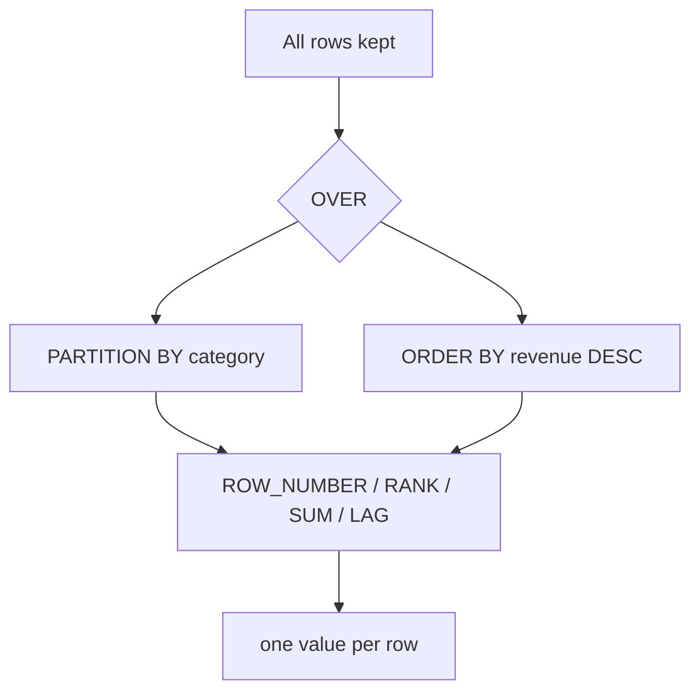

# 2.3 Window functions

## Concept
`GROUP BY` collapses rows. **Window functions** do something more powerful: they compute
across a set of related rows **while keeping every original row**. That lets you answer
questions like *"rank each product within its category"* or *"what's the running total of
revenue up to this day"* — where you need both the detail row **and** an aggregate beside it.

Every window function has an `OVER (…)` clause with three optional parts:

- **`PARTITION BY`** — split rows into groups the function resets on (a mini `GROUP BY` that
  doesn't collapse). E.g. rank products *within each category*.
- **`ORDER BY`** — the order the function walks rows in (needed for ranking, running totals,
  `LAG`/`LEAD`).
- **frame** (e.g. `ROWS BETWEEN …`) — which rows around the current one to include.

Common functions: **`ROW_NUMBER()`** (unique 1,2,3…), **`RANK()`** (ties share a rank, gaps
after), **`SUM() OVER`** (running / partitioned totals), and **`LAG()`/`LEAD()`** (reach to
the previous/next row — perfect for day-over-day change).



### How a window function actually works
Hold onto one contrast before we start. In [2.2](joins-aggregations.md), **`GROUP BY category`**
took many rows and **collapsed** them into *one* summary row per category — you got the total, but
you lost the individual products. A **window function** does the opposite: it computes the same kind
of aggregate, but **hands the answer back on every original row**. Ten products in a category go in,
ten rows come out — each now carrying its category's rank, running total, or share alongside it.

The magic word is **`OVER (…)`**. Any aggregate you already know (`SUM`, `AVG`, `COUNT`) becomes a
window function the moment you write `OVER` after it instead of `GROUP BY` beside it. Inside the
parentheses you describe the *window* — the set of related rows this row's answer is computed from —
using up to three parts:

- **`PARTITION BY col`** — split rows into groups the function **resets on**. Think of it as *"a
  `GROUP BY` that doesn't collapse."* `PARTITION BY category` means "rank/total *within each
  category*, starting fresh at each new category." Leave it out and the whole result is one big
  partition.
- **`ORDER BY col`** — the **walk order**: the sequence the function steps through rows in. It's what
  makes ranking meaningful (rank *by* revenue) and running totals possible (accumulate *in date
  order*). `LAG`/`LEAD` need it too — "previous row" only means something once rows have an order.
- **frame** (e.g. `ROWS BETWEEN … PRECEDING AND CURRENT ROW`) — *which* rows around the current one
  to fold in. `ROWS BETWEEN UNBOUNDED PRECEDING AND CURRENT ROW` means "everything from the start up
  to and including me" (a running total). `ROWS BETWEEN 6 PRECEDING AND CURRENT ROW` means "me plus
  the 6 rows before me" (a 7-row moving window). Omit the frame and, with an `ORDER BY`, most engines
  default to "start of partition through the current row."

!!! info "The one-line mental model"
    `GROUP BY` = **collapse** rows into groups. `OVER (…)` = **keep** every row, but let each one
    *see* its group. Same aggregates, opposite effect on row count.

## Lab
Work against the ShopFlow source. We build a small base with a **CTE** (`WITH …` — covered
in [2.4](ctes.md)), then apply windows.

> Run these in the **Trino CLI** or **Superset SQL Lab** (see [2.1](intro.md)). In Superset,
> pick the **shopflow / public** schema and skip the `USE` line below.

```sql
USE shopflow.public;
```

`USE` sets the default catalog + schema so you can write `orders` instead of the full
`shopflow.public.orders` every time.

!!! note "What's a CTE?"
    Every query below opens with **`WITH name AS ( … )`** — a **Common Table Expression** (CTE). It's
    a named, throwaway result you build first, then query from as if it were a table. Here we use it to
    do the ordinary join-and-aggregate work (compute `revenue` per product, per day, per customer)
    *first*, and then apply the window function to that clean base. CTEs get their own lesson in
    [2.4](ctes.md) — for now just read `WITH product_rev AS (…)` as "let `product_rev` mean this
    sub-result."

### 1 · Rank products within each category
**Business question:** *within each category, which products earn the most — and what are the top 3?*
This is the headline window pattern: rank the detail rows **without collapsing** them.

**Rank products within each category by revenue** — keep only each category's top 3:

```sql
WITH product_rev AS (
  SELECT p.category,
         p.name AS product,
         SUM(oi.quantity * oi.unit_price) AS revenue
  FROM orders      AS o
  JOIN order_items AS oi ON oi.order_id  = o.order_id
  JOIN products    AS p  ON p.product_id = oi.product_id
  WHERE o.status = 'delivered'
  GROUP BY p.category, p.name
)
SELECT category, product, revenue, rnk
FROM (
  SELECT category, product, revenue,
         RANK() OVER (PARTITION BY category ORDER BY revenue DESC) AS rnk
  FROM product_rev
)
WHERE rnk <= 3
ORDER BY category, rnk;
```

**Read it clause by clause:**

- **`WITH product_rev AS (…)`** — the CTE first builds the plain base: join `orders × order_items ×
  products`, keep only `delivered` rows, and `GROUP BY p.category, p.name` to get **one revenue number
  per product**. This is exactly the aggregation from [2.2](joins-aggregations.md) — nothing new yet.
- **`RANK() OVER (PARTITION BY category ORDER BY revenue DESC) AS rnk`** — the window function.
  - **`RANK()`** hands out positions 1, 2, 3, … *by* the order you give it.
  - **`PARTITION BY category`** resets the ranking at every new category — so each category has its
    own `#1`. (Drop it and you'd get a single global ranking across all products.)
  - **`ORDER BY revenue DESC`** is the walk order: highest revenue gets rank 1. Note this `ORDER BY`
    lives *inside* the `OVER (…)` and only steers the ranking — it is **not** the query's final sort.
- **The nested subquery** — you can't filter on a window result in the same `SELECT` that computes it
  (window functions are evaluated *after* `WHERE`). So we compute `rnk` in an inner query, then the
  **outer `WHERE rnk <= 3`** keeps only each category's top three.
- **`ORDER BY category, rnk`** — the *final* sort of the output: group the rows by category, and within
  each category show rank 1, then 2, then 3.

Conceptually the result is a tidy leaderboard — every category block looks like:

| category | product | revenue | rnk |
|---|---|---|---|
| Books | Atlas of… | 9 120 | 1 |
| Books | Field Guide… | 7 400 | 2 |
| Books | Pocket Ref… | 6 010 | 3 |
| Electronics | … | … | 1 |

!!! note "Why `RANK()` here and not `ROW_NUMBER()`?"
    If two products in a category tie on revenue, **`RANK()`** gives them the *same* position (say two
    `#2`s) and then **skips** to `#4` — so `rnk <= 3` can legitimately return four rows. **`ROW_NUMBER()`**
    would force an arbitrary 1-2-3 with no ties, quietly dropping one of the tied products. Pick the tie
    behaviour you actually want.

### 2 · Running daily revenue
**Business question:** *how does cumulative revenue build up over time — the total "so far" on each day?*
That's a **running total**: `SUM` walked forward one day at a time, kept on every row.

**Running daily revenue** — a cumulative total that grows day by day:

```sql
WITH daily AS (
  SELECT CAST(o.order_ts AS date)          AS sales_date,
         SUM(oi.quantity * oi.unit_price)  AS revenue
  FROM orders      AS o
  JOIN order_items AS oi ON oi.order_id = o.order_id
  WHERE o.status = 'delivered'
  GROUP BY CAST(o.order_ts AS date)
)
SELECT sales_date,
       revenue,
       SUM(revenue) OVER (ORDER BY sales_date
                          ROWS BETWEEN UNBOUNDED PRECEDING AND CURRENT ROW)
         AS running_total
FROM daily
ORDER BY sales_date
LIMIT 30;
```

**Read it clause by clause:**

- **`WITH daily AS (…)`** — the CTE rolls the raw line items up to **one row per calendar day**.
  **`CAST(o.order_ts AS date)`** chops the timestamp down to just the date (so all of a day's orders
  land in the same bucket), and `SUM(quantity * unit_price)` totals that day's revenue.
- **`revenue`** — the plain per-day total, shown as-is (the original row is kept).
- **`SUM(revenue) OVER (ORDER BY sales_date ROWS BETWEEN UNBOUNDED PRECEDING AND CURRENT ROW)`** — the
  running total.
  - **`SUM(revenue) OVER (…)`** — same `SUM` you know, but `OVER` makes it a window aggregate: it adds
    up a *range* of rows and reports the answer on **each** row instead of collapsing them.
  - **`ORDER BY sales_date`** — walk the days in date order (earliest first). Order matters: "so far"
    only means something once time flows one way.
  - **`ROWS BETWEEN UNBOUNDED PRECEDING AND CURRENT ROW`** — the **frame**. `UNBOUNDED PRECEDING` = the
    very first day; `CURRENT ROW` = today. So on any given day the sum covers *every day from the
    start up to and including this one* — the definition of a running total.
- **`ORDER BY sales_date` / `LIMIT 30`** (the outer ones) — sort the output chronologically and show
  the first 30 days.

Conceptually `revenue` is the daily bar and `running_total` is the ever-climbing line above it:

| sales_date | revenue | running_total |
|---|---|---|
| 2024-01-01 | 1 200 | 1 200 |
| 2024-01-02 | 800 | 2 000 |
| 2024-01-03 | 1 500 | 3 500 |

### 3 · Day-over-day change with `LAG`
**Business question:** *did revenue go up or down versus yesterday, and by what percent?* To compare a
row to the row *before* it, you need to reach back one row — that's **`LAG`**.

**Day-over-day change** with `LAG` — compare each day to the day before:

```sql
WITH daily AS (
  SELECT CAST(o.order_ts AS date)          AS sales_date,
         SUM(oi.quantity * oi.unit_price)  AS revenue
  FROM orders      AS o
  JOIN order_items AS oi ON oi.order_id = o.order_id
  WHERE o.status = 'delivered'
  GROUP BY CAST(o.order_ts AS date)
)
SELECT sales_date,
       revenue,
       LAG(revenue) OVER (ORDER BY sales_date)                       AS prev_day,
       revenue - LAG(revenue) OVER (ORDER BY sales_date)             AS delta,
       ROUND(100.0 * (revenue - LAG(revenue) OVER (ORDER BY sales_date))
             / NULLIF(LAG(revenue) OVER (ORDER BY sales_date), 0), 1) AS pct_change
FROM daily
ORDER BY sales_date
LIMIT 30;
```

**Read it clause by clause:**

- **`WITH daily AS (…)`** — the same per-day base as before (one revenue total per date).
- **`LAG(revenue) OVER (ORDER BY sales_date) AS prev_day`** — **`LAG`** reaches **backward one row** and
  returns *that* row's `revenue`. With `ORDER BY sales_date`, "one row back" = **yesterday's** revenue,
  placed beside today's. (On the very first day there is no previous row, so `prev_day` is **`NULL`**.)
- **`revenue - LAG(revenue) OVER (…) AS delta`** — today minus yesterday: the raw up/down amount.
- **The `pct_change` expression** — the same delta as a percentage of yesterday:
  - **`100.0 * (revenue - prev) / prev`** — percent change; the `100.0` (a decimal) forces
    **decimal division** so you don't lose the fraction to integer math.
  - **`NULLIF(prev, 0)`** — a safety valve: if yesterday's revenue was `0`, `NULLIF` turns the divisor
    into `NULL` so the database returns `NULL` instead of erroring on **divide-by-zero**.
  - **`ROUND(…, 1)`** — round the percentage to one decimal place.
- **`ORDER BY sales_date` / `LIMIT 30`** — chronological output, first 30 days.

The payoff is a trend row you can read at a glance:

| sales_date | revenue | prev_day | delta | pct_change |
|---|---|---|---|---|
| 2024-01-01 | 1 200 | *NULL* | *NULL* | *NULL* |
| 2024-01-02 | 800 | 1 200 | −400 | −33.3 |
| 2024-01-03 | 1 500 | 800 | 700 | 87.5 |

#### Understanding `LAG` in full
`LAG` lets you read a **neighbouring row without a self-join** — its whole reason to exist. The
complete shape is:

```text
LAG(expression [, offset [, default]]) OVER (PARTITION BY … ORDER BY …)
```

- **`expression`** — the column (or expression) to fetch from the earlier row, e.g. `revenue`.
- **`offset`** — *how many* rows back to reach. Defaults to `1` (the row immediately before);
  `LAG(revenue, 7)` reaches back **7** rows — handy for week-over-week comparisons.
- **`default`** — what to return when **no such row exists** (instead of `NULL`).
  `LAG(revenue, 1, 0)` gives `0` on the first row rather than `NULL` — useful so downstream maths
  doesn't break on the edge.
- **`ORDER BY`** defines what *"previous"* even means — `LAG` walks the rows in that order, so here
  "one row back" is literally "yesterday".
- **`PARTITION BY`** makes "previous" **reset inside each group**. Without it, `LAG` reaches across
  the whole result; with `PARTITION BY customer_id ORDER BY order_ts` it returns each **customer's
  own** previous order — it never bleeds from one customer into the next, and the *first* order of
  every customer comes back `NULL`.

!!! note "`LAG` looks back, `LEAD` looks forward"
    **`LAG(col)`** = the previous row's value; **`LEAD(col)`** = the *next* row's value — same
    mechanics, opposite direction. Reach for them whenever you compare a row to its neighbour:
    day-over-day or week-over-week change, the gap between consecutive events, or *"did this
    customer's status change since last time?"*

### 4 · 7-day moving average
**Business question:** *what's the smoothed revenue trend, ignoring day-to-day noise?* A **moving
average** averages each day together with a fixed window of recent days — done with a **rows frame**.

**7-day moving average** using a rows frame:

```sql
WITH daily AS (
  SELECT CAST(o.order_ts AS date)          AS sales_date,
         SUM(oi.quantity * oi.unit_price)  AS revenue
  FROM orders      AS o
  JOIN order_items AS oi ON oi.order_id = o.order_id
  WHERE o.status = 'delivered'
  GROUP BY CAST(o.order_ts AS date)
)
SELECT sales_date, revenue,
       AVG(revenue) OVER (ORDER BY sales_date
                          ROWS BETWEEN 6 PRECEDING AND CURRENT ROW) AS ma_7d
FROM daily
ORDER BY sales_date
LIMIT 30;
```

**Read it clause by clause:**

- **`WITH daily AS (…)`** — the familiar per-day revenue base.
- **`AVG(revenue) OVER (ORDER BY sales_date ROWS BETWEEN 6 PRECEDING AND CURRENT ROW) AS ma_7d`** — the
  moving average.
  - **`AVG(revenue) OVER (…)`** — average revenue across the framed rows, reported on every day.
  - **`ORDER BY sales_date`** — walk in date order so "the 6 days before" is meaningful.
  - **`ROWS BETWEEN 6 PRECEDING AND CURRENT ROW`** — the frame is **today plus the 6 days before it**
    = a 7-row sliding window. Contrast this with the running total's `UNBOUNDED PRECEDING`: there the
    window *grew* forever; here it stays a **fixed width of 7** and slides forward one day at a time.
- The first few days have fewer than 6 days behind them, so `ma_7d` averages whatever rows exist so
  far — the window is simply shorter at the very start.

!!! tip "Running total vs moving average — it's all in the frame"
    Same `OVER (ORDER BY …)`, one word different in the frame:
    `UNBOUNDED PRECEDING → CURRENT ROW` = *cumulative* (grows without bound);
    `6 PRECEDING → CURRENT ROW` = *sliding* (fixed 7-row width). The frame is the dial that turns one
    into the other.

!!! tip "ROW_NUMBER vs RANK vs DENSE_RANK"
    Use `ROW_NUMBER()` when you need exactly one row per group (e.g. *the* single top
    product). Use `RANK()` when ties should share a position (leaving gaps after).
    `DENSE_RANK()` is like `RANK()` but without the gaps.

**The rest of the window family** — same `OVER (…)` mechanics, different question:

- **`LEAD(col)`** — the *next* row's value (the mirror of `LAG`): "what did the customer buy
  *after* this order?"
- **`FIRST_VALUE(col)` / `LAST_VALUE(col)`** — the first/last value in the window: "revenue on
  this customer's *very first* active day."
- **`NTILE(n)`** — split rows into `n` equal buckets: "which **quartile** of spend is this
  customer in?"

**Business question:** *split customers into four equal spend tiers — who are the top 25%?* That's what
**`NTILE(4)`** does: it slices the ordered rows into 4 same-sized groups and labels each row 1–4.

```sql
-- Rank customers into 4 spend quartiles (1 = top spenders)
WITH cust_rev AS (
  SELECT o.customer_id, SUM(oi.quantity * oi.unit_price) AS revenue
  FROM orders o JOIN order_items oi ON oi.order_id = o.order_id
  WHERE o.status = 'delivered'
  GROUP BY o.customer_id
)
SELECT customer_id, revenue,
       NTILE(4) OVER (ORDER BY revenue DESC) AS spend_quartile
FROM cust_rev
ORDER BY revenue DESC
LIMIT 20;
```

**Read it clause by clause:**

- **`WITH cust_rev AS (…)`** — total revenue **per customer** (one row each), delivered orders only.
- **`NTILE(4) OVER (ORDER BY revenue DESC) AS spend_quartile`** — order customers by revenue (biggest
  first), then divide them into **4 equal-sized buckets**. Bucket **1** is the top-spending quarter,
  bucket **4** the bottom quarter. No `PARTITION BY` here, so the quartiles span all customers at once.
- **`ORDER BY revenue DESC` / `LIMIT 20`** — show the biggest spenders first; they'll all carry
  `spend_quartile = 1`. Segments like these feed straight into marketing and Gold-layer dashboards.

## Challenge
For each customer, find their **first delivered order** (earliest `order_ts`) and show
customer name, order id, and order timestamp — exactly one row per customer.

!!! tip "Which window pattern do you need?"
    "Exactly one row per customer" is the giveaway for **`ROW_NUMBER()`**: `PARTITION BY customer_id`
    (restart per customer) `ORDER BY order_ts ASC` (earliest order first) numbers each customer's orders
    `1, 2, 3…`. Compute that in a CTE, then keep only **`seq = 1`** — the earliest. `ROW_NUMBER` (not
    `RANK`) guarantees a single winner even if two orders share the same timestamp.

??? note "Solution"
    ```sql
    WITH ranked AS (
      SELECT c.full_name,
             o.order_id,
             o.order_ts,
             ROW_NUMBER() OVER (PARTITION BY o.customer_id
                                ORDER BY o.order_ts ASC) AS seq
      FROM orders    AS o
      JOIN customers AS c ON c.customer_id = o.customer_id
      WHERE o.status = 'delivered'
    )
    SELECT full_name, order_id, order_ts
    FROM ranked
    WHERE seq = 1
    ORDER BY order_ts
    LIMIT 20;
    ```

!!! tip "🎯 This runs unchanged on Azure, Databricks, Snowflake & Fabric"
    **What you just did:** used window functions (`OVER` / `PARTITION BY`, `ROW_NUMBER`/
    `RANK`, running `SUM`, `LAG`, moving averages) to rank and trend without collapsing rows.

    - **Azure Databricks** / **Snowflake** — `OVER / PARTITION BY / ROW_NUMBER / RANK /
      SUM OVER / LAG / LEAD`, including `ROWS BETWEEN …` frames, are standard ANSI SQL and
      run unchanged.
    - **Microsoft Fabric** — identical window functions in the SQL endpoint over OneLake Delta.
    - **Azure Data Factory** — build them no-code with the **Window transformation** in a
      Mapping Data Flow (set partition, sort, and frame).

    Window functions are one of the most valued (and 100% portable) SQL skills — the code
    here runs unchanged on every cloud warehouse.

## Key terms, at a glance
| Term | Plain meaning |
|---|---|
| **Window function** | Computes across related rows *without* collapsing them (contrast `GROUP BY`) |
| **`OVER (…)`** | Turns an aggregate into a window function; defines the window (partition, order, frame) |
| **`PARTITION BY`** | A "`GROUP BY` that doesn't collapse" — resets the calculation per group |
| **`ORDER BY` (inside `OVER`)** | The walk order: makes ranking, running totals, and `LAG`/`LEAD` meaningful |
| **Frame (`ROWS BETWEEN`)** | Which nearby rows to include around the current row |
| **`UNBOUNDED PRECEDING … CURRENT ROW`** | Frame for a *cumulative* running total (start → now) |
| **`n PRECEDING … CURRENT ROW`** | Fixed-width sliding frame for a *moving average* (e.g. `6` = 7-row window) |
| **`ROW_NUMBER()`** | Unique 1,2,3… — one winner per group, no ties |
| **`RANK()`** | Ties share a rank, then a **gap** follows (1,1,3…) |
| **`DENSE_RANK()`** | Like `RANK` but **no gap** after ties (1,1,2…) |
| **`SUM() OVER (…)`** | Running / partitioned total kept on every row |
| **`AVG() OVER (…)`** | Windowed average — e.g. a moving average over a rows frame |
| **`LAG(col)` / `LEAD(col)`** | Read the previous / next row's value |
| **`NTILE(n)`** | Split ordered rows into `n` equal buckets (e.g. quartiles) |
| **`NULLIF(x, 0)`** | Return `NULL` instead of dividing by zero |
| **Running total** | Cumulative sum via `SUM() OVER (ORDER BY … ROWS UNBOUNDED PRECEDING …)` |
| **CTE (`WITH … AS`)** | A named, throwaway sub-result you query from (see [2.4](ctes.md)) |

## You can now…
- Explain `OVER`, `PARTITION BY`, `ORDER BY`, and row frames
- Rank within groups (`ROW_NUMBER`/`RANK`) and build running totals & moving averages
- Compare rows over time with `LAG`/`LEAD` for day-over-day metrics
