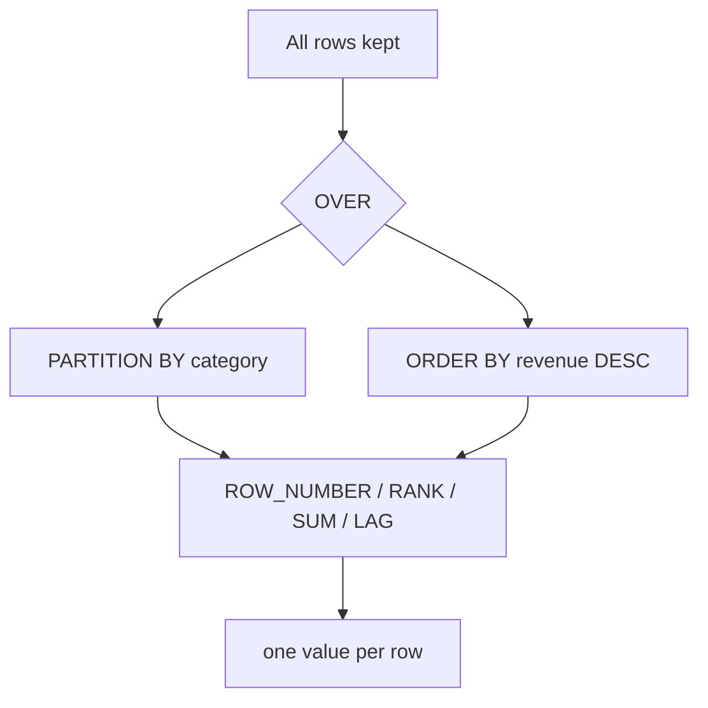

# 2.3 Window functions

## Concept
`GROUP BY` collapses rows. **Window functions** do something more powerful: they compute
across a set of related rows **while keeping every original row**. That lets you answer
questions like *"rank each product within its category"* or *"what's the running total of
revenue up to this day"* — where you need both the detail row **and** an aggregate beside it.

Every window function has an `OVER (…)` clause with three optional parts:

- **`PARTITION BY`** — split rows into groups the function resets on (a mini `GROUP BY` that
  doesn't collapse). E.g. rank products *within each category*.
- **`ORDER BY`** — the order the function walks rows in (needed for ranking, running totals,
  `LAG`/`LEAD`).
- **frame** (e.g. `ROWS BETWEEN …`) — which rows around the current one to include.

Common functions: **`ROW_NUMBER()`** (unique 1,2,3…), **`RANK()`** (ties share a rank, gaps
after), **`SUM() OVER`** (running / partitioned totals), and **`LAG()`/`LEAD()`** (reach to
the previous/next row — perfect for day-over-day change).



## Lab
Work against the ShopFlow source. We build a small base with a **CTE** (`WITH …` — covered
in [2.4](ctes.md)), then apply windows.

> Run these in the **Trino CLI** or **Superset SQL Lab** (see [2.1](intro.md)). In Superset,
> pick the **shopflow / public** schema and skip the `USE` line below.

```sql
USE shopflow.public;
```

**Rank products within each category by revenue** — keep only each category's top 3:

```sql
WITH product_rev AS (
  SELECT p.category,
         p.name AS product,
         SUM(oi.quantity * oi.unit_price) AS revenue
  FROM orders      AS o
  JOIN order_items AS oi ON oi.order_id  = o.order_id
  JOIN products    AS p  ON p.product_id = oi.product_id
  WHERE o.status = 'delivered'
  GROUP BY p.category, p.name
)
SELECT category, product, revenue, rnk
FROM (
  SELECT category, product, revenue,
         RANK() OVER (PARTITION BY category ORDER BY revenue DESC) AS rnk
  FROM product_rev
)
WHERE rnk <= 3
ORDER BY category, rnk;
```

**Running daily revenue** — a cumulative total that grows day by day:

```sql
WITH daily AS (
  SELECT CAST(o.order_ts AS date)          AS sales_date,
         SUM(oi.quantity * oi.unit_price)  AS revenue
  FROM orders      AS o
  JOIN order_items AS oi ON oi.order_id = o.order_id
  WHERE o.status = 'delivered'
  GROUP BY CAST(o.order_ts AS date)
)
SELECT sales_date,
       revenue,
       SUM(revenue) OVER (ORDER BY sales_date
                          ROWS BETWEEN UNBOUNDED PRECEDING AND CURRENT ROW)
         AS running_total
FROM daily
ORDER BY sales_date
LIMIT 30;
```

**Day-over-day change** with `LAG` — compare each day to the day before:

```sql
WITH daily AS (
  SELECT CAST(o.order_ts AS date)          AS sales_date,
         SUM(oi.quantity * oi.unit_price)  AS revenue
  FROM orders      AS o
  JOIN order_items AS oi ON oi.order_id = o.order_id
  WHERE o.status = 'delivered'
  GROUP BY CAST(o.order_ts AS date)
)
SELECT sales_date,
       revenue,
       LAG(revenue) OVER (ORDER BY sales_date)                       AS prev_day,
       revenue - LAG(revenue) OVER (ORDER BY sales_date)             AS delta,
       ROUND(100.0 * (revenue - LAG(revenue) OVER (ORDER BY sales_date))
             / NULLIF(LAG(revenue) OVER (ORDER BY sales_date), 0), 1) AS pct_change
FROM daily
ORDER BY sales_date
LIMIT 30;
```

**7-day moving average** using a rows frame:

```sql
WITH daily AS (
  SELECT CAST(o.order_ts AS date)          AS sales_date,
         SUM(oi.quantity * oi.unit_price)  AS revenue
  FROM orders      AS o
  JOIN order_items AS oi ON oi.order_id = o.order_id
  WHERE o.status = 'delivered'
  GROUP BY CAST(o.order_ts AS date)
)
SELECT sales_date, revenue,
       AVG(revenue) OVER (ORDER BY sales_date
                          ROWS BETWEEN 6 PRECEDING AND CURRENT ROW) AS ma_7d
FROM daily
ORDER BY sales_date
LIMIT 30;
```

!!! tip "ROW_NUMBER vs RANK vs DENSE_RANK"
    Use `ROW_NUMBER()` when you need exactly one row per group (e.g. *the* single top
    product). Use `RANK()` when ties should share a position (leaving gaps after).
    `DENSE_RANK()` is like `RANK()` but without the gaps.

**The rest of the window family** — same `OVER (…)` mechanics, different question:

- **`LEAD(col)`** — the *next* row's value (the mirror of `LAG`): "what did the customer buy
  *after* this order?"
- **`FIRST_VALUE(col)` / `LAST_VALUE(col)`** — the first/last value in the window: "revenue on
  this customer's *very first* active day."
- **`NTILE(n)`** — split rows into `n` equal buckets: "which **quartile** of spend is this
  customer in?"

```sql
-- Rank customers into 4 spend quartiles (1 = top spenders)
WITH cust_rev AS (
  SELECT o.customer_id, SUM(oi.quantity * oi.unit_price) AS revenue
  FROM orders o JOIN order_items oi ON oi.order_id = o.order_id
  WHERE o.status = 'delivered'
  GROUP BY o.customer_id
)
SELECT customer_id, revenue,
       NTILE(4) OVER (ORDER BY revenue DESC) AS spend_quartile
FROM cust_rev
ORDER BY revenue DESC
LIMIT 20;
```

## Challenge
For each customer, find their **first delivered order** (earliest `order_ts`) and show
customer name, order id, and order timestamp — exactly one row per customer.

??? note "Solution"
    ```sql
    WITH ranked AS (
      SELECT c.full_name,
             o.order_id,
             o.order_ts,
             ROW_NUMBER() OVER (PARTITION BY o.customer_id
                                ORDER BY o.order_ts ASC) AS seq
      FROM orders    AS o
      JOIN customers AS c ON c.customer_id = o.customer_id
      WHERE o.status = 'delivered'
    )
    SELECT full_name, order_id, order_ts
    FROM ranked
    WHERE seq = 1
    ORDER BY order_ts
    LIMIT 20;
    ```

!!! tip "🎯 This runs unchanged on Azure, Databricks, Snowflake & Fabric"
    **What you just did:** used window functions (`OVER` / `PARTITION BY`, `ROW_NUMBER`/
    `RANK`, running `SUM`, `LAG`, moving averages) to rank and trend without collapsing rows.

    - **Azure Databricks** / **Snowflake** — `OVER / PARTITION BY / ROW_NUMBER / RANK /
      SUM OVER / LAG / LEAD`, including `ROWS BETWEEN …` frames, are standard ANSI SQL and
      run unchanged.
    - **Microsoft Fabric** — identical window functions in the SQL endpoint over OneLake Delta.
    - **Azure Data Factory** — build them no-code with the **Window transformation** in a
      Mapping Data Flow (set partition, sort, and frame).

    Window functions are one of the most valued (and 100% portable) SQL skills — the code
    here runs unchanged on every cloud warehouse.

## Key terms, at a glance
| Term | Plain meaning |
|---|---|
| **Window function** | Computes across related rows *without* collapsing them |
| **`OVER (…)`** | Defines the window (partition, order, frame) |
| **`PARTITION BY`** | Reset the calculation per group |
| **Frame (`ROWS BETWEEN`)** | Which nearby rows to include (running total, moving avg) |
| **`ROW_NUMBER` / `RANK` / `DENSE_RANK`** | Ranking, differing only in tie handling |
| **`LAG` / `LEAD`** | Read the previous / next row's value |
| **Running total** | Cumulative sum via `SUM() OVER (ORDER BY …)` |

## You can now…
- Explain `OVER`, `PARTITION BY`, `ORDER BY`, and row frames
- Rank within groups (`ROW_NUMBER`/`RANK`) and build running totals & moving averages
- Compare rows over time with `LAG`/`LEAD` for day-over-day metrics
