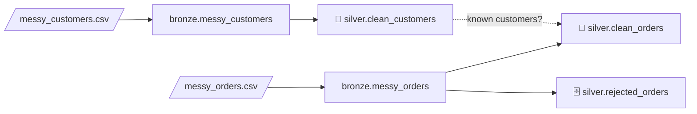

# 3.9.1 Data cleaning — from messy Bronze to clean Silver

## Concept
Files and feeds almost never arrive clean. Before anyone can trust a number, a data engineer
**cleans** the data: same spelling for the same thing, real types instead of text, no duplicates,
and bad rows set aside — not silently lost.

The usual order of work:

| # | Step | Question it answers |
|---|---|---|
| 1 | **Profile** | What's actually in here? |
| 2 | **Tidy text** | Stray spaces? `""`, `N/A`, `null` written as text? |
| 3 | **Standardize** | `Web` / ` web ` / `WEB` — one spelling? `UK` / `United Kingdom` — one code? |
| 4 | **Fix types** | Numbers and dates stored as text? Several date formats? |
| 5 | **Remove duplicates** | Same row twice? Two versions of the same order? |
| 6 | **Validate & quarantine** | Negative amounts, future dates, unknown customers → a **reject table** |
| 7 | **Write Silver** | Save the clean result as a governed table |

`bronze.sample_orders` (your starter table, [0.3](../setup/workspace.md)) is a clean copy of the
shop database — there's nothing to fix in it. So in this lab you work like on a real job: someone
hands you **two messy CSV files**. You **upload** them to your bucket, **load** them into Bronze
with SQL, and then **clean** them into Silver.



> Work in a notebook ([3.7](spark.md)): `%%sql` cells for SQL ([3.8](sql-magic.md)), Python cells
> for the cleaning. Everything lands in **your own** lakehouse (`iceberg` = `<username>_lake`).

## Lab

### 1 · Download the two files
Click each link — the file downloads to your computer:

- [:material-download: **messy_customers.csv**](../assets/data/messy_customers.csv){: download="messy_customers.csv" } — 10 customers
- [:material-download: **messy_orders.csv**](../assets/data/messy_orders.csv){: download="messy_orders.csv" } — 13 orders

Open one in a text editor and have a look — a few lines of `messy_orders.csv`:

```
order_id,customer_id,order_ts,channel,status,amount,currency
101,1,2024-11-04 17:42:17,web,delivered,120.50,USD
102,2,2024-11-05 09:10:00, Web ,Delivered,$45.00,usd
103,3,05/11/2024 14:30,APP,DELIVERED ,"1,250.00",GBP
...
110,2,,N/A,placed,,USD
```

The value `"1,250.00"` has **quotes** because it contains a comma — the comma that separates
columns in a CSV. Without the quotes it would split into two columns.

### 2 · Upload them to My files
On the lab home page open **📁 My files** (your bucket, `<username>-lake`):

1. Go into **`files`** → **`source`**.
2. Click **＋ New folder**, name it **`cleaning`**, and open it.
3. Click **⬆ Upload** (or drag the files in) and pick both CSVs.

Click a file to check it — My files shows a CSV as a table. The files are now at:

```
s3a://demouser-lake/files/source/cleaning/messy_customers.csv
s3a://demouser-lake/files/source/cleaning/messy_orders.csv
```

Signed in with your own account? Use **your** bucket instead of `demouser-lake` (shown at the top
of My files, e.g. `ravi-lake`) — in the SQL below too.

### 3 · Create the Bronze tables with SQL
The same two-step pattern as [3.9](upload-register.md): a **temporary view** over the file, then
a **table** from the view. One statement per `%%sql` cell — four cells:

```sql
%%sql
CREATE OR REPLACE TEMPORARY VIEW messy_customers_csv USING csv
OPTIONS (path 's3a://demouser-lake/files/source/cleaning/messy_customers.csv', header 'true')
```

```sql
%%sql
CREATE OR REPLACE TABLE iceberg.bronze.messy_customers USING iceberg AS
SELECT * FROM messy_customers_csv
```

```sql
%%sql
CREATE OR REPLACE TEMPORARY VIEW messy_orders_csv USING csv
OPTIONS (path 's3a://demouser-lake/files/source/cleaning/messy_orders.csv', header 'true')
```

```sql
%%sql
CREATE OR REPLACE TABLE iceberg.bronze.messy_orders USING iceberg AS
SELECT * FROM messy_orders_csv
```

**Read it step by step:**

- **`CREATE OR REPLACE TEMPORARY VIEW … USING csv OPTIONS (path …, header 'true')`** — a view
  that reads the CSV file; **`header 'true'`** takes the column names from row 1. **`OR REPLACE`**
  lets you re-run the cell.
- **No `inferSchema`** — on purpose. Every column stays **`string`**, exactly as written in the
  file. Bronze keeps the data **as it arrived**; turning text into numbers and dates is the
  cleaning job (step 6), where *you* decide what to do with `'abc'`.
- **`CREATE OR REPLACE TABLE iceberg.bronze.… USING iceberg AS SELECT * FROM …_csv`** — copy the
  view into a real Iceberg table in your `bronze` namespace (re-running replaces it).
- **Empty fields become `NULL` already** — the CSV reader turns an empty value (`,,`) into a
  real `NULL`. But text like `N/A` or `null` stays **text**: the reader can't know it means "empty".

Check that both arrived:

```sql
%%sql
SELECT 'messy_customers' AS tbl, count(*) AS n FROM iceberg.bronze.messy_customers
UNION ALL SELECT 'messy_orders', count(*) FROM iceberg.bronze.messy_orders
```

```
+---------------+---+
|            tbl|  n|
+---------------+---+
|messy_customers| 10|
|   messy_orders| 13|
+---------------+---+
```

- **`UNION ALL`** — stack the results of two queries on top of each other (same columns), so
  both counts show in one result. `'messy_customers' AS tbl` is a fixed text column that labels
  each row.

The problems hidden in the files:

| Problem | Example |
|---|---|
| Stray spaces, mixed case | `'  anna SCHMIDT '`, `' Web '`, `'DELIVERED '` |
| "Empty" written as text | `'N/A'`, `'null'` (and truly empty fields → `NULL`) |
| Many spellings, one meaning | `UK` / `gb` / `United Kingdom`; `USA` / `U.S.`; `canceled` / `cancelled` |
| Numbers as formatted text | `'$45.00'`, `'1,250.00'`, `'abc'` |
| Several date formats, bad dates | `'15/03/2024'`, `'05/11/2024 14:30'`, `'not a date'` |
| Impossible values | amount `-30.00`, order in `2030`, sign-up in `2099`, currency `XXX`, email `tom@shopflow` |
| Duplicates | Sara twice (exact); Anna twice (different formatting); order 101 twice; order 104 in two versions |
| Missing key | a customer and an order with no id |
| Broken link | order 105 belongs to customer `99`, who doesn't exist |

### 4 · Profile — look before you touch
```python
from pyspark.sql import functions as F

raw_c = spark.table("iceberg.bronze.messy_customers")
raw_o = spark.table("iceberg.bronze.messy_orders")

raw_c.count()                                      # 10
raw_c.printSchema()                                # every column: string
raw_c.select("country").distinct().show()
raw_o.groupBy("channel", "status").count().orderBy("channel").show()
raw_o.groupBy("order_id").count().filter(F.col("count") > 1).show()
```

- **`spark.table("…")`** — load a catalog table as a DataFrame (same as `spark.sql("SELECT * FROM …")`).
- **`printSchema()`** — list the columns and their types. Here all are `string` — nothing is a
  real number or date yet.
- **`.select("country").distinct()`** — keep one column, then **`distinct()`** drops repeated rows
  → every **different** spelling, once each:

    ```
    +--------------+
    |       country|
    +--------------+
    |            gb|
    |            DE|
    |            de|
    |            IN|
    |           USA|
    |          U.S.|
    |            UK|
    |United Kingdom|
    +--------------+
    ```

    Eight spellings for **four** countries.
- **`.groupBy("channel", "status").count()`** — how many rows per combination; **`.orderBy("channel")`**
  sorts the result. You'll spot `' Web '`, `'APP'`, `'N/A'`, `'canceled'` next to `'cancelled'`.
- **`.groupBy("order_id").count().filter(F.col("count") > 1)`** — the classic **duplicate-key
  check**: any id that appears more than once. Here **101** and **104** (2 each).

!!! tip "Profile every new dataset"
    `distinct()` on text columns and a duplicate-key check catch most problems in seconds — always
    run them before writing any cleaning code, so you clean what's *really* there.

### 5 · Tidy text: trim spaces, turn "empty" text into real `NULL`
The same fix applies to **every** column, so write it once as a small function:

```python
NULL_LIKE = ["", "N/A", "n/a", "null", "NULL", "none"]

def tidy(df):
    for c in df.columns:
        v = F.trim(F.col(c))
        df = df.withColumn(c, F.when(v.isin(NULL_LIKE), None).otherwise(v))
    return df

c = tidy(raw_c)
o = tidy(raw_o)
o.select([F.count_if(F.col(x).isNull()).alias(x) for x in o.columns]).show()
```

```
+--------+-----------+--------+-------+------+------+--------+
|order_id|customer_id|order_ts|channel|status|amount|currency|
+--------+-----------+--------+-------+------+------+--------+
|       1|          0|       1|      1|     0|     1|       0|
+--------+-----------+--------+-------+------+------+--------+
```

**Read it step by step:**

- **`NULL_LIKE = [...]`** — a Python **list** of the texts that really mean "no value".
- **`def tidy(df): … return df`** — define a **function** named `tidy` that takes a DataFrame and
  returns the cleaned one; reuse it for both tables.
- **`for c in df.columns:`** — **`df.columns`** is the list of column names; the `for` loop runs
  the indented lines once per column, with `c` holding the current name.
- **`F.trim(F.col(c))`** — **`trim`** removes spaces at the start and end: `'  anna SCHMIDT '` →
  `'anna SCHMIDT'`.
- **`F.when(cond, value).otherwise(other)`** — Spark's **if / else** (SQL `CASE WHEN`): where
  `cond` is true use `value`, else `other`.
- **`v.isin(NULL_LIKE)`** — true when the trimmed text is one of the list's values.
- **`None`** — Python's "nothing"; Spark stores it as a real **`NULL`**.
- **`df.withColumn(c, …)`** — replace column `c` with the new expression (same name = overwrite).
- **`[F.count_if(F.col(x).isNull()).alias(x) for x in o.columns]`** — a **list comprehension**
  (build a list in one line): one expression per column. **`isNull()`** is true for `NULL`;
  **`F.count_if(cond)`** counts the rows where it's true; **`.alias(x)`** names the result after
  the column. So the output is the **number of missing values per column** — one each in
  `order_id`, `order_ts` and `amount` (empty in the file), and `channel` — the `'N/A'` that
  `tidy()` just turned into a real `NULL`.

### 6 · Standardize and fix types — customers
```python
country = F.upper(F.regexp_replace("country", r"\.", ""))

c = (c
     .withColumn("customer_id", F.col("customer_id").try_cast("int"))
     .withColumn("full_name",   F.initcap("full_name"))
     .withColumn("email",       F.lower("email"))
     .withColumn("email",       F.when(F.col("email").rlike(r"^[^@\s]+@[^@\s]+\.[a-z]+$"),
                                       F.col("email")))
     .withColumn("country",
                 F.when(country.isin("UK", "GB", "UNITED KINGDOM"), "GB")
                  .when(country.isin("US", "USA"), "US")
                  .otherwise(country))
     .withColumn("signup_date",
                 F.coalesce(F.try_to_date("signup_date", F.lit("yyyy-MM-dd")),
                            F.try_to_date("signup_date", F.lit("dd/MM/yyyy"))))
     .withColumn("signup_date",
                 F.when(F.col("signup_date") <= F.current_date(), F.col("signup_date")))
    )
```

**Read it step by step:**

- **`F.regexp_replace("country", r"\.", "")`** — replace every match of a **regular expression**
  (a text pattern) with `""`. **`\.`** means "a literal dot", so `'U.S.'` → `'US'`. The **`r"…"`**
  (raw string) stops Python from treating `\` specially.
- **`F.upper(...)`** — to capitals, so `de` and `DE` become one value. We keep this expression in
  a Python variable, `country`, to reuse it below.
- **`.try_cast("int")`** — convert text to a number. **`try_`** means: if it can't convert, give
  `NULL` instead of failing. (A plain `.cast("int")` on `'abc'` **stops the whole job** with
  `CAST_INVALID_INPUT` — Spark 4 is strict.)
- **`F.initcap("full_name")`** — first letter of each word capital, rest lower:
  `'anna SCHMIDT'` → `'Anna Schmidt'`.
- **`F.lower("email")`** — emails aren't case-sensitive; store them lower-case.
- **`.rlike(pattern)`** — true when the text **matches a regular expression**. The pattern reads:
  some characters without `@` or spaces (**`[^@\s]+`**), an **`@`**, more of those, a **`.`** and
  letters at the end (**`[a-z]+$`**; **`^`** = start, **`$`** = end). `tom@shopflow` has no `.xx`
  ending → fails.
- **`F.when(valid, F.col("email"))`** with **no `otherwise`** — keep the email when valid,
  otherwise **`NULL`**. A business choice: the customer is fine, only their email is unusable.
- **`.when(…).when(…).otherwise(country)`** — several `when`s chained: the **first** true one
  wins. Three UK spellings → `GB` (the ISO country code), two US spellings → `US`, anything else
  stays as is (`DE`, `IN`).
- **`F.try_to_date(col, F.lit("yyyy-MM-dd"))`** — read text as a **date** in the given format
  (`yyyy` year, `MM` month, `dd` day); `NULL` if it doesn't fit. **`F.lit(...)`** wraps a fixed
  value (here the format text) so Spark can use it in an expression.
- **`F.coalesce(a, b)`** — the **first non-`NULL`** of its arguments. Try format 1; if that gave
  `NULL`, try format 2 → both `'2024-01-15'` and `'15/03/2024'` become real dates.
- **`F.current_date()`** — today's date. A sign-up date **after today** is impossible, so the last
  `withColumn` keeps it only when `<= today` (else `NULL`) → Ken's `2099-01-01` is cleared.

### 7 · Remove duplicates — customers
```python
c = c.filter(F.col("customer_id").isNotNull())   # 9 rows (ghost row gone)
c = c.dropDuplicates()                           # 7 rows
c = c.dropDuplicates(["customer_id"])            # 7 rows — one per id, guaranteed
c.orderBy("customer_id").show(truncate=False)
```

```
+-----------+------------+-----------------+-------+-----------+
|customer_id|full_name   |email            |country|signup_date|
+-----------+------------+-----------------+-------+-----------+
|1          |Ravi Kumar  |ravi@shopflow.com|IN     |2024-01-15 |
|2          |Anna Schmidt|anna@shopflow.com|DE     |2024-02-03 |
|3          |Tom Baker   |NULL             |GB     |2024-03-15 |
|4          |Maria Lopez |NULL             |US     |2024-04-01 |
|5          |Li Wei      |NULL             |US     |NULL       |
|6          |Sara Ali    |sara@shopflow.com|GB     |2024-05-20 |
|7          |Ken Sato    |ken@shopflow.com |GB     |NULL       |
+-----------+------------+-----------------+-------+-----------+
```

- **`.isNotNull()`** — true when there **is** a value; the filter drops the row with no id (a row
  you can't identify can't be cleaned or joined).
- **`.dropDuplicates()`** — with no arguments: remove rows that are identical in **every** column.
  It removes Sara's copy — and **Anna's** too, because after step 6 her two messy rows became
  identical.
- **`.dropDuplicates(["customer_id"])`** — keep **one row per `customer_id`** (whichever Spark
  meets first). A safety net: the id must be unique in Silver.
- **`show(truncate=False)`** — print full values instead of cutting long text at 20 characters.

!!! warning "Standardize *before* you de-duplicate"
    On the raw table, `dropDuplicates()` finds only Sara (10 → 9 rows): `'  anna SCHMIDT '` and
    `'Anna Schmidt'` look different. Clean first, and duplicates that were hiding become
    identical.

### 8 · Standardize, fix types, remove duplicates — orders
```python
o = (o
     .withColumn("order_id",    F.col("order_id").try_cast("int"))
     .withColumn("customer_id", F.col("customer_id").try_cast("int"))
     .withColumn("channel",     F.lower("channel"))
     .withColumn("status",      F.lower("status"))
     .withColumn("status",      F.when(F.col("status") == "canceled", "cancelled")
                                 .otherwise(F.col("status")))
     .withColumn("currency",    F.upper("currency"))
     .withColumn("amount",      F.regexp_replace("amount", r"[$,]", "")
                                 .try_cast("decimal(10,2)"))
     .withColumn("order_ts",
                 F.coalesce(F.try_to_timestamp("order_ts", F.lit("yyyy-MM-dd HH:mm:ss")),
                            F.try_to_timestamp("order_ts", F.lit("dd/MM/yyyy HH:mm"))))
    )
o = o.dropDuplicates()                           # 13 → 12: exact copy of order 101 gone
```

- **`F.when(F.col("status") == "canceled", "cancelled")`** — one spelling for one meaning (US vs
  UK English).
- **`r"[$,]"`** — **`[…]`** in a regular expression means "any **one** of these characters", so
  every `$` and `,` is removed: `'$45.00'` → `'45.00'`, `'1,250.00'` → `'1250.00'`.
- **`.try_cast("decimal(10,2)")`** — to an exact **decimal** number with up to 10 digits, 2 after
  the point. Use decimal (not `double`) for **money** — no rounding surprises. `'abc'` → `NULL`.
- **`F.try_to_timestamp(col, format)`** — like `try_to_date`, but date **and time**: `HH` hour
  (00–23), `mm` minutes, `ss` seconds. `'05/11/2024 14:30'` → `2024-11-05 14:30:00`;
  `'not a date'` → `NULL`.

Order **104** is still there **twice** — two different versions (sent on the 6th, corrected on the
8th). `dropDuplicates(["order_id"])` would keep a **random** one. To keep the **latest**, number
each order's versions, newest first, and keep number 1:

```python
from pyspark.sql import Window

latest = Window.partitionBy("order_id").orderBy(F.col("order_ts").desc())
o = (o.withColumn("rn", F.row_number().over(latest))
      .filter(F.col("rn") == 1)
      .drop("rn"))                              # 12 → 11 rows
```

- **`Window.partitionBy("order_id")`** — a **window**: look at the rows **in groups** of the same
  `order_id`, without collapsing them like `groupBy` would (window functions: [2.3](../unit2/window-functions.md)).
- **`.orderBy(F.col("order_ts").desc())`** — inside each group, newest first (**`desc()`** =
  descending).
- **`F.row_number().over(latest)`** — number the rows in each group 1, 2, 3, … in that order;
  **`.over(...)`** says which window to use.
- **`.filter(F.col("rn") == 1)`** — keep only the newest version; **`.drop("rn")`** removes the
  helper column. Order 104 is now the `2024-11-08 16:00:00` version.

### 9 · Validate — and quarantine what fails
Bad rows don't get deleted: they get a **reason** and go to a **reject table**, so someone can fix
the source. First, can each order find its customer?

```python
known = c.select("customer_id").withColumn("known_customer", F.lit(True))
o = o.join(known, on="customer_id", how="left")
```

- **`known`** — the clean customer ids, plus a column that is always `True`.
- **`.join(known, on="customer_id", how="left")`** — a **left join**: keep **every** order, and
  attach `known_customer` where the id matches. No match (customer `99`) → `known_customer` is
  `NULL`.

Now give every row its **first** failing rule (or `NULL` if it passes all):

```python
o = o.withColumn("reject_reason",
    F.when(F.col("order_id").isNull(),                "missing order_id")
     .when(F.col("order_ts").isNull(),                "bad order_ts")
     .when(F.col("order_ts") > F.current_timestamp(), "order_ts in the future")
     .when(F.col("amount").isNull(),                  "bad amount")
     .when(F.col("amount") < 0,                       "negative amount")
     .when(F.col("channel").isNull() |
           ~F.col("channel").isin("web", "app", "marketplace", "wholesale"), "unknown channel")
     .when(~F.col("status").isin("placed", "shipped", "delivered", "cancelled"), "unknown status")
     .when(~F.col("currency").isin("USD", "EUR", "GBP", "INR"),  "unknown currency")
     .when(F.col("known_customer").isNull(),          "unknown customer"))

good = (o.filter(F.col("reject_reason").isNull())
         .select("order_id", "customer_id", "order_ts", "channel", "status", "amount", "currency"))
bad  = o.filter(F.col("reject_reason").isNotNull()).drop("known_customer")

good.orderBy("order_id").show(truncate=False)
bad.select("order_id", "customer_id", "order_ts", "amount", "reject_reason") \
   .orderBy("order_id").show(truncate=False)
```

```
+--------+-----------+-------------------+-------+---------+-------+--------+
|order_id|customer_id|order_ts           |channel|status   |amount |currency|
+--------+-----------+-------------------+-------+---------+-------+--------+
|101     |1          |2024-11-04 17:42:17|web    |delivered|120.50 |USD     |
|102     |2          |2024-11-05 09:10:00|web    |delivered|45.00  |USD     |
|103     |3          |2024-11-05 14:30:00|app    |delivered|1250.00|GBP     |
|104     |4          |2024-11-08 16:00:00|app    |cancelled|80.00  |EUR     |
+--------+-----------+-------------------+-------+---------+-------+--------+

+--------+-----------+-------------------+------+----------------------+
|order_id|customer_id|order_ts           |amount|reject_reason         |
+--------+-----------+-------------------+------+----------------------+
|NULL    |2          |2024-11-09 10:00:00|15.00 |missing order_id      |
|105     |99         |2024-11-06 12:00:00|60.00 |unknown customer      |
|106     |5          |2024-11-07 08:00:00|NULL  |bad amount            |
|107     |6          |2024-11-07 10:00:00|-30.00|negative amount       |
|108     |7          |NULL               |25.00 |bad order_ts          |
|109     |1          |2030-01-01 00:00:00|10.00 |order_ts in the future|
|110     |2          |NULL               |NULL  |bad order_ts          |
+--------+-----------+-------------------+------+----------------------+
```

- **`F.current_timestamp()`** — now (date and time); an order placed after "now" is impossible.
- **`|`** = **or**, **`~`** = **not** — the same rules as pandas masks ([3.2](pandas.md)): use
  them, not Python's `or`/`not`. `~…isin(...)` means "**not** one of the allowed values".
- Why `F.col("channel").isNull() | …` first? `isin` on a `NULL` gives `NULL` — not `True` — so a
  missing channel would slip past `~isin(...)` without the explicit `isNull()` check.
- Only the **first** failing rule is recorded: order 109 is in the future **and** has currency
  `XXX`, but it's reported as `order_ts in the future`. Fix that, and the next run shows the next
  problem.
- **`.select(...)`** on `good` — keep the Silver columns in a fixed order, without the helper
  columns.

### 10 · Write Silver — and check it
```python
spark.sql("CREATE NAMESPACE IF NOT EXISTS iceberg.silver")

c.writeTo("iceberg.silver.clean_customers").using("iceberg").createOrReplace()
good.writeTo("iceberg.silver.clean_orders").using("iceberg").createOrReplace()
(bad.withColumn("rejected_at", F.current_timestamp())
    .writeTo("iceberg.silver.rejected_orders").using("iceberg").createOrReplace())
```

- **`writeTo(...).createOrReplace()`** — write a DataFrame as a catalog table ([3.9](upload-register.md)).
- **`withColumn("rejected_at", F.current_timestamp())`** — stamp **when** each row was rejected,
  so you can follow up later.

```sql
%%sql
SELECT 'clean_customers' AS tbl, count(*) AS n FROM iceberg.silver.clean_customers
UNION ALL SELECT 'clean_orders',    count(*) FROM iceberg.silver.clean_orders
UNION ALL SELECT 'rejected_orders', count(*) FROM iceberg.silver.rejected_orders
```

```
+---------------+---+
|            tbl|  n|
+---------------+---+
|clean_customers|  7|
|   clean_orders|  4|
|rejected_orders|  7|
+---------------+---+
```

```sql
%%sql
SELECT reject_reason, count(*) AS n
FROM iceberg.silver.rejected_orders
GROUP BY reject_reason
ORDER BY n DESC, reject_reason
```

```
+----------------------+---+
|reject_reason         |n  |
+----------------------+---+
|bad order_ts          |2  |
|bad amount            |1  |
|missing order_id      |1  |
|negative amount       |1  |
|order_ts in the future|1  |
|unknown customer      |1  |
+----------------------+---+
```

**The books balance:** 13 raw orders = 4 clean + 7 rejected + 2 duplicates removed (101's copy,
104's old version). Nothing vanished without a trace.

!!! check "Check your work"
    `spark.table("iceberg.silver.clean_orders").printSchema()` shows real types now —
    `order_id: integer`, `order_ts: timestamp`, `amount: decimal(10,2)` — instead of all `string`.

## Challenge
1. Add a rule: an order is rejected when its customer has **no valid email** (hint: also bring
   `email` into `known`). Which orders move to the reject table?
2. Fix order **109** in `messy_orders.csv` (set its date to `2024-11-10 10:00:00`), upload it
   again to the same folder (it replaces the old file), re-run steps 3–10, and see which reason it
   gets now.
3. Profile `bronze.sample_orders`: count the `NULL`s per column with the `count_if` line from
   step 5. Which column has them, and is that a problem or does it mean something?

## 🎯 This runs unchanged on Azure, Databricks, Snowflake & Fabric
`trim`, `when`, `try_cast`, `try_to_timestamp`, `dropDuplicates`, `row_number` over a window and a
reject table are the same in **Databricks** and **Fabric** notebooks (PySpark), and the SQL
versions (`TRIM`, `CASE WHEN`, `TRY_CAST`, `QUALIFY ROW_NUMBER() …`) work in **Snowflake**. At
scale you'd run these rules as a pipeline step — see [4.3 Transform to Silver](../unit4/transform-silver.md)
and [8.4 Data quality checks & quarantine](../recipes/data-quality.md).

## You can now…
- **Profile** a table: types, distinct values, duplicate keys, missing values per column
- **Load** downloaded files into Bronze: upload to My files, then a CSV view + `CREATE TABLE … AS` in SQL
- **Tidy** text: trim spaces and turn `N/A` / `null` text into real `NULL`
- **Standardize** spellings and codes with `lower`/`upper`/`initcap`, `regexp_replace`, `when`
- **Fix types** safely with `try_cast`, `try_to_date`, `try_to_timestamp` and `coalesce` over formats
- **De-duplicate** — exact copies with `dropDuplicates()`, latest version with `row_number()` over a window
- **Validate** with clear reasons and **quarantine** bad rows instead of dropping them
