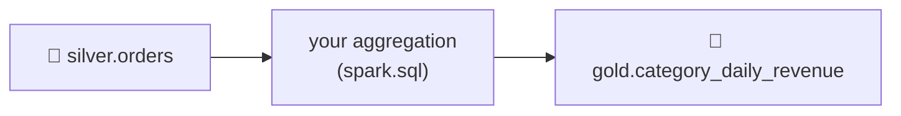

# 4.5 Challenge: build a Gold mart

## Concept
You've walked the full medallion with Spark: read the lake into **Bronze** (4.2),
cleaned and joined into **Silver** (4.3), and aggregated into **Gold** (4.4). Now you
own the pattern end to end. This unit's challenge asks you to design and ship a **new
Gold mart** yourself — the kind of ticket a data engineer picks up on any real team.



A good Gold mart is: built **only** from Silver (never re-reading raw sources),
**business-meaningful**, written to the shared **`iceberg`** catalog (so Trino can read it), and
**partitioned** if it's naturally sliced by date.

## Lab
### The brief
Build **`gold.category_daily_revenue`**: for each **product category** and **day**,
report revenue, units sold, and number of distinct orders — delivered orders only. Then add
one analytical column that requires a **window function** (Unit 2 skill): each row's
**share of that day's total revenue**, so the business can see which categories
dominate on any given day.

### Requirements
1. Source **only** from `iceberg.silver.orders`.
2. Grain: one row per `(category, order_date)`.
3. Columns: `order_date`, `category`, `revenue`, `units`, `orders`,
   `pct_of_day` (this category's revenue ÷ that day's total revenue).
4. Write as an **Iceberg** table, **partitioned by month of `order_date`**.
5. Create it as `iceberg.gold.category_daily_revenue` and verify with a query.

### Starter scaffold

```python
from pyspark.sql import functions as F
spark.sql("CREATE SCHEMA IF NOT EXISTS iceberg.gold")
# TODO: aggregate, add pct_of_day via a window, write the Iceberg table.
```

Think first: which Unit 2 tools apply? A `GROUP BY` for the grain, and a
`sum(...) OVER (PARTITION BY order_date)` window to get the daily total without a
second pass.

## Challenge
Ship `gold.category_daily_revenue` meeting all five requirements above. Bonus: after
building it, confirm the **same** table is readable from Trino (it should be — same catalog).

??? note "Solution"
    ```python
    from pyspark.sql import functions as F

    cat_daily = spark.sql("""
        WITH agg AS (
            SELECT
                order_date,
                category,
                sum(line_amount)          AS revenue,
                sum(quantity)             AS units,
                count(DISTINCT order_id)  AS orders
            FROM iceberg.silver.orders
            WHERE status = 'delivered'
            GROUP BY order_date, category
        )
        SELECT
            order_date,
            category,
            revenue,
            units,
            orders,
            round(
                revenue / sum(revenue) OVER (PARTITION BY order_date) * 100, 2
            ) AS pct_of_day
        FROM agg
        ORDER BY order_date, revenue DESC
    """)

    (cat_daily.writeTo("iceberg.gold.category_daily_revenue")
        .using("iceberg")
        .partitionedBy(F.months("order_date"))
        .createOrReplace())

    # verify
    spark.sql("""
        SELECT * FROM iceberg.gold.category_daily_revenue
        ORDER BY order_date DESC, revenue DESC
        LIMIT 15
    """).show()
    ```
    The window `sum(revenue) OVER (PARTITION BY order_date)` computes each day's total
    alongside the per-category rows — no self-join needed. Because it's the shared `iceberg`
    catalog, the identical table opens in Trino:
    ```sql
    SELECT order_date, category, pct_of_day
    FROM iceberg.gold.category_daily_revenue
    ORDER BY order_date DESC LIMIT 10;
    ```

!!! tip "🎯 This runs unchanged on Azure, Databricks, Snowflake & Fabric"
    **What you just did:** designed and shipped a brand-new Gold mart from Silver alone,
    combining `GROUP BY` with a window function and writing a partitioned Iceberg table.

    - **Azure Databricks** — this exact PySpark/`spark.sql` runs unchanged, scheduled as a Job;
      you can also express Bronze→Silver→Gold declaratively with **Delta Live Tables (DLT)**,
      governed by **Unity Catalog** (the same product as this course).
    - **Microsoft Fabric** — Fabric Spark notebooks build the same mart and store it as Delta in
      a Lakehouse on OneLake.
    - **Snowflake** — build the same `GROUP BY` + window mart in SQL/Snowpark, or as a declarative
      **Dynamic Table**, governed by **RBAC roles**.
    - **Azure Data Factory** — rebuild it no-code with a Mapping Data Flow (Aggregate + Window),
      scheduled in a pipeline.

    The medallion + governed-catalog pattern you just executed is the industry standard.

## Key terms, at a glance
| Term | Plain meaning |
|---|---|
| **Gold mart** | A focused, business-ready aggregate table |
| **Built from Silver only** | Never re-read raw sources for Gold |
| **`… OVER (PARTITION BY …)`** | Window: per-group total alongside detail rows, no self-join |
| **`partitionBy`** | Split output files by a column for pruned reads |
| **Shared catalog** | One Iceberg table, written by Spark and read by Trino |

## You can now…
- Design and build a new business-meaningful Gold mart from Silver alone
- Combine `GROUP BY` with a window function to compute shares in one pass
- Ship a partitioned Iceberg table readable by both Spark and Trino (same catalog)
