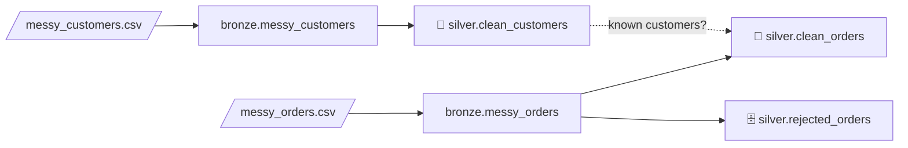

# 4.2.1 Data cleaning — from messy Bronze to clean Silver

## Concept
Files and feeds almost never arrive clean. Before anyone can trust a number, a data engineer
**cleans** the data: same spelling for the same thing, real types instead of text, no duplicates,
and bad rows set aside — not silently lost.

The usual order of work:

| # | Step | Question it answers |
|---|---|---|
| 1 | **Fix column names** | `Customer ID`, ` Full Name `, `EMAIL` — one naming style? |
| 2 | **Profile** | What's actually in here? |
| 3 | **Tidy text** | Stray spaces? `""`, `N/A`, `null` written as text? |
| 4 | **Standardize** | `Web` / ` web ` / `WEB` — one spelling? `UK` / `United Kingdom` — one code? |
| 5 | **Fix types** | Numbers and dates stored as text? Several date formats? |
| 6 | **Fill missing values** | Which gaps get a default, which stay `NULL`? |
| 7 | **Remove duplicates** | Same row twice? Two versions of the same order? |
| 8 | **Split & extract** | First and last name in one field? The domain hidden in an email? |
| 9 | **Validate & quarantine** | Negative amounts, future dates, unknown customers → a **reject table** |
| 10 | **Flag outliers** | Valid, but suspiciously large or small? |
| 11 | **Write Silver** | Save the clean result as a governed table |

`bronze.sample_orders` (your starter table, [0.3](../setup/workspace.md)) is a clean copy of the
shop database — there's nothing to fix in it. So in this lab you work like on a real job: someone
hands you **two messy CSV files**. You **upload** them to your bucket, **load** them into Bronze
with SQL, and then **clean** them into Silver.



> Work in a notebook ([3.7](../unit3/spark.md)): `%%sql` cells for SQL ([3.8](../unit3/sql-magic.md)), Python cells
> for the cleaning. Everything lands in **your own** lakehouse (`iceberg` = `<username>_lake`).
> Steps 1–3 use the upload-and-register flow from [3.9](../unit3/upload-register.md).

## Lab

### 1 · Download the two files
Click each link — the file downloads to your computer:

- [:material-download: **messy_customers.csv**](../assets/data/messy_customers.csv){: download="messy_customers.csv" } — 10 customers
- [:material-download: **messy_orders.csv**](../assets/data/messy_orders.csv){: download="messy_orders.csv" } — 13 orders

Open one in a text editor and have a look — a few lines of `messy_orders.csv`:

```
order_id,customer_id,order_ts,channel,status,amount,currency
101,1,2024-11-04 17:42:17,web,delivered,120.50,USD
102,2,2024-11-05 09:10:00, Web ,Delivered,$45.00,usd
103,3,05/11/2024 14:30,APP,DELIVERED ,"1,250.00",GBP
...
110,2,,N/A,placed,,USD
```

The value `"1,250.00"` has **quotes** because it contains a comma — the comma that separates
columns in a CSV. Without the quotes it would split into two columns.

### 2 · Upload them to My files
On the lab home page open **📁 My files** (your bucket, `<username>-lake`):

1. Go into **`files`** → **`source`**.
2. Click **＋ New folder**, name it **`cleaning`**, and open it.
3. Click **⬆ Upload** (or drag the files in) and pick both CSVs.

Click a file to check it — My files shows a CSV as a table. The files are now at:

```
s3a://demouser-lake/files/source/cleaning/messy_customers.csv
s3a://demouser-lake/files/source/cleaning/messy_orders.csv
```

Signed in with your own account? Use **your** bucket instead of `demouser-lake` (shown at the top
of My files, e.g. `ravi-lake`) — in the SQL below too.

### 3 · Create the Bronze tables with SQL
The same two-step pattern as [3.9](../unit3/upload-register.md): a **temporary view** over the file, then
a **table** from the view. One statement per `%%sql` cell — four cells:

```sql
%%sql
CREATE OR REPLACE TEMPORARY VIEW messy_customers_csv USING csv
OPTIONS (path 's3a://demouser-lake/files/source/cleaning/messy_customers.csv', header 'true')
```

```sql
%%sql
CREATE OR REPLACE TABLE iceberg.bronze.messy_customers USING iceberg AS
SELECT * FROM messy_customers_csv
```

```sql
%%sql
CREATE OR REPLACE TEMPORARY VIEW messy_orders_csv USING csv
OPTIONS (path 's3a://demouser-lake/files/source/cleaning/messy_orders.csv', header 'true')
```

```sql
%%sql
CREATE OR REPLACE TABLE iceberg.bronze.messy_orders USING iceberg AS
SELECT * FROM messy_orders_csv
```

**Read it step by step:**

- **`CREATE OR REPLACE TEMPORARY VIEW … USING csv OPTIONS (path …, header 'true')`** — a view
  that reads the CSV file; **`header 'true'`** takes the column names from row 1. **`OR REPLACE`**
  lets you re-run the cell.
- **No `inferSchema`** — on purpose. Every column stays **`string`**, exactly as written in the
  file. Bronze keeps the data **as it arrived**; turning text into numbers and dates is the
  cleaning job (step 7), where *you* decide what to do with `'abc'`.
- **`CREATE OR REPLACE TABLE iceberg.bronze.… USING iceberg AS SELECT * FROM …_csv`** — copy the
  view into a real Iceberg table in your `bronze` namespace (re-running replaces it).
- **Column names are copied as they are** — `Customer ID`, ` Full Name `, `EMAIL`, spaces and
  all. Iceberg allows that, but such names are awkward to type in every query; you'll fix them in
  step 4.
- **Empty fields become `NULL` already** — the CSV reader turns an empty value (`,,`) into a
  real `NULL`. But text like `N/A` or `null` stays **text**: the reader can't know it means "empty".

Check that both arrived:

```sql
%%sql
SELECT 'messy_customers' AS tbl, count(*) AS n FROM iceberg.bronze.messy_customers
UNION ALL SELECT 'messy_orders', count(*) FROM iceberg.bronze.messy_orders
```

```
+---------------+---+
|            tbl|  n|
+---------------+---+
|messy_customers| 10|
|   messy_orders| 13|
+---------------+---+
```

- **`UNION ALL`** — stack the results of two queries on top of each other (same columns), so
  both counts show in one result. `'messy_customers' AS tbl` is a fixed text column that labels
  each row.

The problems hidden in the files:

| Problem | Example |
|---|---|
| Messy column names | `Customer ID`, ` Full Name `, `EMAIL`, `Signup Date` |
| Stray spaces, mixed case | `'  anna SCHMIDT '`, `' Web '`, `'DELIVERED '` |
| "Empty" written as text | `'N/A'`, `'null'` (and truly empty fields → `NULL`) |
| Many spellings, one meaning | `UK` / `gb` / `United Kingdom`; `U.S.`; `canceled` / `cancelled` |
| Numbers as formatted text | `'$45.00'`, `'1,250.00'`, `'abc'` |
| Several date formats, bad dates | `'15/03/2024'`, `'05/11/2024 14:30'`, `'not a date'` |
| Impossible values | amount `-30.00`, order in `2030`, sign-up in `2099`, currency `XXX`, email `tom@shopflow` |
| Duplicates | Sara twice (exact); Anna twice (different formatting); order 101 twice; order 104 in two versions |
| Missing values | Li Wei has no country and no email |
| Two facts in one field | first + last name in `full_name`; the company domain inside `email` |
| Outlier | order 103 at `1,250.00` — valid, but ten times the others |
| Missing key | a customer and an order with no id |
| Broken link | order 105 belongs to customer `99`, who doesn't exist |

### 4 · Fix column names
Load the two tables and look at the column names first:

```python
from pyspark.sql import functions as F
import re

raw_c = spark.table("iceberg.bronze.messy_customers")
raw_o = spark.table("iceberg.bronze.messy_orders")
raw_c.columns
```

```
['Customer ID', ' Full Name ', 'EMAIL', 'Country', 'Signup Date']
```

Spaces, capitals, a stray space at both ends of ` Full Name `. Every query would need
`` `Customer ID` `` in backticks. The usual convention is **snake_case**: lower-case words joined
by `_`. Write it once as a function and apply it to **every** column:

```python
def snake_case(name):
    return re.sub(r"[^a-z0-9]+", "_", name.strip().lower()).strip("_")

raw_c = raw_c.toDF(*[snake_case(c) for c in raw_c.columns])
raw_o = raw_o.toDF(*[snake_case(c) for c in raw_o.columns])
raw_c.columns
```

```
['customer_id', 'full_name', 'email', 'country', 'signup_date']
```

**Read it step by step:**

- **`spark.table("…")`** — load a catalog table as a DataFrame (same as `spark.sql("SELECT * FROM …")`).
- **`.columns`** — the DataFrame's column names, as a Python list.
- **`import re`** — Python's built-in **regular expression** module (text patterns).
- **`name.strip().lower()`** — Python string methods: **`strip()`** cuts spaces at both ends,
  **`lower()`** makes it lower-case → `' Full Name '` → `'full name'`.
- **`re.sub(r"[^a-z0-9]+", "_", …)`** — replace every run of characters that are **not** a
  letter or digit (**`[^…]`** = "none of these", **`+`** = "one or more") with `_` →
  `'full name'` → `'full_name'`.
- **`.strip("_")`** — remove any `_` left at the start or end.
- **`raw_c.toDF(*[...])`** — **`toDF`** gives the DataFrame **new column names**, in order. The
  list comprehension builds one new name per old one, and the **`*`** unpacks the list into
  separate arguments (`toDF("customer_id", "full_name", …)`).
- The orders file already had clean names — applying the same function there is harmless, and
  means the code still works if the next file arrives with messy headers.

!!! tip "Rename in Silver, not in Bronze"
    Bronze keeps the names exactly as the file had them; the rename happens on the way to
    Silver. If the source changes a header next month, you'll see it in Bronze.

### 5 · Profile — look before you touch
```python
raw_c.count()                                      # 10
raw_c.printSchema()                                # every column: string
raw_c.select("country").distinct().show()
raw_o.groupBy("channel", "status").count().orderBy("channel").show()
raw_o.groupBy("order_id").count().filter(F.col("count") > 1).show()
```

- **`printSchema()`** — list the columns and their types. Here all are `string` — nothing is a
  real number or date yet.
- **`.select("country").distinct()`** — keep one column, then **`distinct()`** drops repeated rows
  → every **different** spelling, once each:

    ```
    +--------------+
    |       country|
    +--------------+
    |            gb|
    |            DE|
    |            de|
    |            IN|
    |          U.S.|
    |            UK|
    |United Kingdom|
    |          NULL|
    +--------------+
    ```

    Seven spellings for **four** countries — plus a `NULL`: Li Wei has no country.
- **`.groupBy("channel", "status").count()`** — how many rows per combination; **`.orderBy("channel")`**
  sorts the result. You'll spot `' Web '`, `'APP'`, `'N/A'`, `'canceled'` next to `'cancelled'`.
- **`.groupBy("order_id").count().filter(F.col("count") > 1)`** — the classic **duplicate-key
  check**: any id that appears more than once. Here **101** and **104** (2 each).

!!! tip "Profile every new dataset"
    `distinct()` on text columns and a duplicate-key check catch most problems in seconds — always
    run them before writing any cleaning code, so you clean what's *really* there.

### 6 · Tidy text: trim spaces, turn "empty" text into real `NULL`
The same fix applies to **every** column, so write it once as a small function:

```python
NULL_LIKE = ["", "N/A", "n/a", "null", "NULL", "none"]

def tidy(df):
    for c in df.columns:
        v = F.trim(F.col(c))
        df = df.withColumn(c, F.when(v.isin(NULL_LIKE), None).otherwise(v))
    return df

c = tidy(raw_c)
o = tidy(raw_o)
o.select([F.count_if(F.col(x).isNull()).alias(x) for x in o.columns]).show()
```

```
+--------+-----------+--------+-------+------+------+--------+
|order_id|customer_id|order_ts|channel|status|amount|currency|
+--------+-----------+--------+-------+------+------+--------+
|       1|          0|       1|      1|     0|     1|       0|
+--------+-----------+--------+-------+------+------+--------+
```

**Read it step by step:**

- **`NULL_LIKE = [...]`** — a Python **list** of the texts that really mean "no value".
- **`def tidy(df): … return df`** — define a **function** named `tidy` that takes a DataFrame and
  returns the cleaned one; reuse it for both tables.
- **`for c in df.columns:`** — **`df.columns`** is the list of column names; the `for` loop runs
  the indented lines once per column, with `c` holding the current name.
- **`F.trim(F.col(c))`** — **`trim`** removes spaces at the start and end: `'  anna SCHMIDT '` →
  `'anna SCHMIDT'`.
- **`F.when(cond, value).otherwise(other)`** — Spark's **if / else** (SQL `CASE WHEN`): where
  `cond` is true use `value`, else `other`.
- **`v.isin(NULL_LIKE)`** — true when the trimmed text is one of the list's values.
- **`None`** — Python's "nothing"; Spark stores it as a real **`NULL`**.
- **`df.withColumn(c, …)`** — replace column `c` with the new expression (same name = overwrite).
- **`[F.count_if(F.col(x).isNull()).alias(x) for x in o.columns]`** — a **list comprehension**
  (build a list in one line): one expression per column. **`isNull()`** is true for `NULL`;
  **`F.count_if(cond)`** counts the rows where it's true; **`.alias(x)`** names the result after
  the column. So the output is the **number of missing values per column** — one each in
  `order_id`, `order_ts` and `amount` (empty in the file), and `channel` — the `'N/A'` that
  `tidy()` just turned into a real `NULL`.

### 7 · Standardize and fix types — customers
```python
country = F.upper(F.regexp_replace("country", r"\.", ""))

c = (c
     .withColumn("customer_id", F.col("customer_id").try_cast("int"))
     .withColumn("full_name",   F.initcap("full_name"))
     .withColumn("email",       F.lower("email"))
     .withColumn("email",       F.when(F.col("email").rlike(r"^[^@\s]+@[^@\s]+\.[a-z]+$"),
                                       F.col("email")))
     .withColumn("country",
                 F.when(country.isin("UK", "GB", "UNITED KINGDOM"), "GB")
                  .when(country.isin("US", "USA"), "US")
                  .otherwise(country))
     .withColumn("signup_date",
                 F.coalesce(F.try_to_date("signup_date", F.lit("yyyy-MM-dd")),
                            F.try_to_date("signup_date", F.lit("dd/MM/yyyy"))))
     .withColumn("signup_date",
                 F.when(F.col("signup_date") <= F.current_date(), F.col("signup_date")))
    )
```

**Read it step by step:**

- **`F.regexp_replace("country", r"\.", "")`** — replace every match of a **regular expression**
  (a text pattern) with `""`. **`\.`** means "a literal dot", so `'U.S.'` → `'US'`. The **`r"…"`**
  (raw string) stops Python from treating `\` specially.
- **`F.upper(...)`** — to capitals, so `de` and `DE` become one value. We keep this expression in
  a Python variable, `country`, to reuse it below.
- **`.try_cast("int")`** — convert text to a number. **`try_`** means: if it can't convert, give
  `NULL` instead of failing. (A plain `.cast("int")` on `'abc'` **stops the whole job** with
  `CAST_INVALID_INPUT` — Spark 4 is strict.)
- **`F.initcap("full_name")`** — first letter of each word capital, rest lower:
  `'anna SCHMIDT'` → `'Anna Schmidt'`.
- **`F.lower("email")`** — emails aren't case-sensitive; store them lower-case.
- **`.rlike(pattern)`** — true when the text **matches a regular expression**. The pattern reads:
  some characters without `@` or spaces (**`[^@\s]+`**), an **`@`**, more of those, a **`.`** and
  letters at the end (**`[a-z]+$`**; **`^`** = start, **`$`** = end). `tom@shopflow` has no `.xx`
  ending → fails.
- **`F.when(valid, F.col("email"))`** with **no `otherwise`** — keep the email when valid,
  otherwise **`NULL`**. A business choice: the customer is fine, only their email is unusable.
- **`.when(…).when(…).otherwise(country)`** — several `when`s chained: the **first** true one
  wins. Three UK spellings → `GB` (the ISO country code), two US spellings → `US`, anything else
  stays as is (`DE`, `IN`).
- **`F.try_to_date(col, F.lit("yyyy-MM-dd"))`** — read text as a **date** in the given format
  (`yyyy` year, `MM` month, `dd` day); `NULL` if it doesn't fit. **`F.lit(...)`** wraps a fixed
  value (here the format text) so Spark can use it in an expression.
- **`F.coalesce(a, b)`** — the **first non-`NULL`** of its arguments. Try format 1; if that gave
  `NULL`, try format 2 → both `'2024-01-15'` and `'15/03/2024'` become real dates.
- **`F.current_date()`** — today's date. A sign-up date **after today** is impossible, so the last
  `withColumn` keeps it only when `<= today` (else `NULL`) → Ken's `2099-01-01` is cleared.

### 8 · Fill missing values — or decide not to
Count what's still missing after standardizing:

```python
c.select([F.count_if(F.col(x).isNull()).alias(x) for x in c.columns]).show()
```

```
+-----------+---------+-----+-------+-----------+
|customer_id|full_name|email|country|signup_date|
+-----------+---------+-----+-------+-----------+
|          1|        0|    3|      1|          2|
+-----------+---------+-----+-------+-----------+
```

For each gap there are three choices: **fill** it with a default, **keep** the `NULL`, or
**reject** the row. It's a business decision per column:

| Column | Missing | Decision | Why |
|---|---|---|---|
| `customer_id` | 1 | **reject** (step 9) | a customer you can't identify is useless |
| `country` | 1 | **fill** with `'UNKNOWN'` | reports group by country; a visible `UNKNOWN` group beats rows silently missing from a `GROUP BY` |
| `email` | 3 | **keep** `NULL` + add a flag | inventing an email would be wrong; a `has_email` flag makes it easy to filter |
| `signup_date` | 2 | **keep** `NULL` | a made-up date would distort "customers per month" |

```python
c = c.fillna({"country": "UNKNOWN"})
c = c.withColumn("has_email", F.col("email").isNotNull())
```

- **`fillna({"country": "UNKNOWN"})`** — replace `NULL` with a value, per column. The **dict**
  (`{column: value}`) says which columns to fill and with what; columns not in it are left alone.
  Li Wei's country is now `UNKNOWN`.
- **`F.col("email").isNotNull()`** as a new column — a **boolean** (`true`/`false`) per row:
  `has_email` is `false` for Tom, Maria and Li.

!!! info "Other ways to fill"
    - **`F.coalesce(F.col("country"), F.lit("UNKNOWN"))`** — the same fill as an expression,
      handy inside a longer `withColumn` chain.
    - Numbers: fill with `0` only when *missing really means zero* (e.g. no discount). A missing
      **price** is not zero — keep it `NULL` or reject the row.

### 9 · Remove duplicates — customers
```python
c = c.filter(F.col("customer_id").isNotNull())   # 9 rows (ghost row gone)
c = c.dropDuplicates()                           # 7 rows
c = c.dropDuplicates(["customer_id"])            # 7 rows — one per id, guaranteed
c.orderBy("customer_id").show(truncate=False)
```

```
+-----------+------------+-----------------+-------+-----------+---------+
|customer_id|full_name   |email            |country|signup_date|has_email|
+-----------+------------+-----------------+-------+-----------+---------+
|1          |Ravi Kumar  |ravi@shopflow.com|IN     |2024-01-15 |true     |
|2          |Anna Schmidt|anna@shopflow.com|DE     |2024-02-03 |true     |
|3          |Tom Baker   |NULL             |GB     |2024-03-15 |false    |
|4          |Maria Lopez |NULL             |US     |2024-04-01 |false    |
|5          |Li Wei      |NULL             |UNKNOWN|NULL       |false    |
|6          |Sara Ali    |sara@shopflow.com|GB     |2024-05-20 |true     |
|7          |Ken Sato    |ken@shopflow.com |GB     |NULL       |true     |
+-----------+------------+-----------------+-------+-----------+---------+
```

- **`.isNotNull()`** — true when there **is** a value; the filter drops the row with no id (a row
  you can't identify can't be cleaned or joined).
- **`.dropDuplicates()`** — with no arguments: remove rows that are identical in **every** column.
  It removes Sara's copy — and **Anna's** too, because after step 7 her two messy rows became
  identical.
- **`.dropDuplicates(["customer_id"])`** — keep **one row per `customer_id`** (whichever Spark
  meets first). A safety net: the id must be unique in Silver.
- **`show(truncate=False)`** — print full values instead of cutting long text at 20 characters.

!!! warning "Standardize *before* you de-duplicate"
    On the raw table, `dropDuplicates()` finds only Sara (10 → 9 rows): `'  anna SCHMIDT '` and
    `'Anna Schmidt'` look different. Clean first, and duplicates that were hiding become
    identical.

### 10 · Split & extract — one fact per column
`full_name` holds two facts (first and last name), and `email` hides a third (the company
domain). Pull them out into their own columns so they can be filtered and grouped:

```python
c = (c
     .withColumn("first_name",   F.split("full_name", " ").getItem(0))
     .withColumn("last_name",    F.element_at(F.split("full_name", " "), -1))
     .withColumn("email_domain", F.regexp_extract("email", r"@(.+)$", 1)))

c.select("customer_id", "full_name", "first_name", "last_name", "email", "email_domain") \
 .orderBy("customer_id").show(truncate=False)
```

```
+-----------+------------+----------+---------+-----------------+------------+
|customer_id|full_name   |first_name|last_name|email            |email_domain|
+-----------+------------+----------+---------+-----------------+------------+
|1          |Ravi Kumar  |Ravi      |Kumar    |ravi@shopflow.com|shopflow.com|
|2          |Anna Schmidt|Anna      |Schmidt  |anna@shopflow.com|shopflow.com|
|3          |Tom Baker   |Tom       |Baker    |NULL             |NULL        |
|4          |Maria Lopez |Maria     |Lopez    |NULL             |NULL        |
|5          |Li Wei      |Li        |Wei      |NULL             |NULL        |
|6          |Sara Ali    |Sara      |Ali      |sara@shopflow.com|shopflow.com|
|7          |Ken Sato    |Ken       |Sato     |ken@shopflow.com |shopflow.com|
+-----------+------------+----------+---------+-----------------+------------+
```

- **`F.split("full_name", " ")`** — cut the text at every space into an **array** (a list
  inside one cell): `'Ravi Kumar'` → `["Ravi", "Kumar"]`.
- **`.getItem(0)`** — the array's **first** element (counting starts at 0) → `Ravi`.
- **`F.element_at(array, -1)`** — an element by position; **`-1`** means "the **last** one". Using
  the last word (not the second) means a middle name won't end up as the surname.
- **`F.regexp_extract("email", r"@(.+)$", 1)`** — find a pattern and return a **piece** of it.
  The pattern: **`@`**, then **`(.+)`** = "one or more of any character", up to **`$`** (the end).
  The **round brackets** mark the piece you want — **group 1** (the last argument) → everything
  after the `@`. No email → `NULL`.
- **`\`** at the end of a Python line — the statement **continues on the next line**.

!!! tip "Keep the original column"
    `full_name` stays next to the new columns. Name splitting is a best guess (two-word last
    names, names without spaces), so keep the source value to check against and to fix later.

### 11 · Standardize, fix types, remove duplicates — orders
```python
o = (o
     .withColumn("order_id",    F.col("order_id").try_cast("int"))
     .withColumn("customer_id", F.col("customer_id").try_cast("int"))
     .withColumn("channel",     F.lower("channel"))
     .withColumn("status",      F.lower("status"))
     .withColumn("status",      F.when(F.col("status") == "canceled", "cancelled")
                                 .otherwise(F.col("status")))
     .withColumn("currency",    F.upper("currency"))
     .withColumn("amount",      F.regexp_replace("amount", r"[$,]", "")
                                 .try_cast("decimal(10,2)"))
     .withColumn("order_ts",
                 F.coalesce(F.try_to_timestamp("order_ts", F.lit("yyyy-MM-dd HH:mm:ss")),
                            F.try_to_timestamp("order_ts", F.lit("dd/MM/yyyy HH:mm"))))
    )
o = o.dropDuplicates()                           # 13 → 12: exact copy of order 101 gone
```

- **`F.when(F.col("status") == "canceled", "cancelled")`** — one spelling for one meaning (US vs
  UK English).
- **`r"[$,]"`** — **`[…]`** in a regular expression means "any **one** of these characters", so
  every `$` and `,` is removed: `'$45.00'` → `'45.00'`, `'1,250.00'` → `'1250.00'`.
- **`.try_cast("decimal(10,2)")`** — to an exact **decimal** number with up to 10 digits, 2 after
  the point. Use decimal (not `double`) for **money** — no rounding surprises. `'abc'` → `NULL`.
- **`F.try_to_timestamp(col, format)`** — like `try_to_date`, but date **and time**: `HH` hour
  (00–23), `mm` minutes, `ss` seconds. `'05/11/2024 14:30'` → `2024-11-05 14:30:00`;
  `'not a date'` → `NULL`.

Order **104** is still there **twice** — two different versions (sent on the 6th, corrected on the
8th). `dropDuplicates(["order_id"])` would keep a **random** one. To keep the **latest**, number
each order's versions, newest first, and keep number 1:

```python
from pyspark.sql import Window

latest = Window.partitionBy("order_id").orderBy(F.col("order_ts").desc())
o = (o.withColumn("rn", F.row_number().over(latest))
      .filter(F.col("rn") == 1)
      .drop("rn"))                              # 12 → 11 rows
```

- **`Window.partitionBy("order_id")`** — a **window**: look at the rows **in groups** of the same
  `order_id`, without collapsing them like `groupBy` would (window functions: [2.3](../unit2/window-functions.md)).
- **`.orderBy(F.col("order_ts").desc())`** — inside each group, newest first (**`desc()`** =
  descending).
- **`F.row_number().over(latest)`** — number the rows in each group 1, 2, 3, … in that order;
  **`.over(...)`** says which window to use.
- **`.filter(F.col("rn") == 1)`** — keep only the newest version; **`.drop("rn")`** removes the
  helper column. Order 104 is now the `2024-11-08 16:00:00` version.

### 12 · Validate — and quarantine what fails
Bad rows don't get deleted: they get a **reason** and go to a **reject table**, so someone can fix
the source. First, can each order find its customer?

```python
known = c.select("customer_id").withColumn("known_customer", F.lit(True))
o = o.join(known, on="customer_id", how="left")
```

- **`known`** — the clean customer ids, plus a column that is always `True`.
- **`.join(known, on="customer_id", how="left")`** — a **left join**: keep **every** order, and
  attach `known_customer` where the id matches. No match (customer `99`) → `known_customer` is
  `NULL`.

Now give every row its **first** failing rule (or `NULL` if it passes all):

```python
o = o.withColumn("reject_reason",
    F.when(F.col("order_id").isNull(),                "missing order_id")
     .when(F.col("order_ts").isNull(),                "bad order_ts")
     .when(F.col("order_ts") > F.current_timestamp(), "order_ts in the future")
     .when(F.col("amount").isNull(),                  "bad amount")
     .when(F.col("amount") < 0,                       "negative amount")
     .when(F.col("channel").isNull() |
           ~F.col("channel").isin("web", "app", "marketplace", "wholesale"), "unknown channel")
     .when(~F.col("status").isin("placed", "shipped", "delivered", "cancelled"), "unknown status")
     .when(~F.col("currency").isin("USD", "EUR", "GBP", "INR"),  "unknown currency")
     .when(F.col("known_customer").isNull(),          "unknown customer"))

good = (o.filter(F.col("reject_reason").isNull())
         .select("order_id", "customer_id", "order_ts", "channel", "status", "amount", "currency"))
bad  = o.filter(F.col("reject_reason").isNotNull()).drop("known_customer")

good.orderBy("order_id").show(truncate=False)
bad.select("order_id", "customer_id", "order_ts", "amount", "reject_reason") \
   .orderBy("order_id").show(truncate=False)
```

```
+--------+-----------+-------------------+-------+---------+-------+--------+
|order_id|customer_id|order_ts           |channel|status   |amount |currency|
+--------+-----------+-------------------+-------+---------+-------+--------+
|101     |1          |2024-11-04 17:42:17|web    |delivered|120.50 |USD     |
|102     |2          |2024-11-05 09:10:00|web    |delivered|45.00  |USD     |
|103     |3          |2024-11-05 14:30:00|app    |delivered|1250.00|GBP     |
|104     |4          |2024-11-08 16:00:00|app    |cancelled|80.00  |EUR     |
+--------+-----------+-------------------+-------+---------+-------+--------+

+--------+-----------+-------------------+------+----------------------+
|order_id|customer_id|order_ts           |amount|reject_reason         |
+--------+-----------+-------------------+------+----------------------+
|NULL    |2          |2024-11-09 10:00:00|15.00 |missing order_id      |
|105     |99         |2024-11-06 12:00:00|60.00 |unknown customer      |
|106     |5          |2024-11-07 08:00:00|NULL  |bad amount            |
|107     |6          |2024-11-07 10:00:00|-30.00|negative amount       |
|108     |7          |NULL               |25.00 |bad order_ts          |
|109     |1          |2030-01-01 00:00:00|10.00 |order_ts in the future|
|110     |2          |NULL               |NULL  |bad order_ts          |
+--------+-----------+-------------------+------+----------------------+
```

- **`F.current_timestamp()`** — now (date and time); an order placed after "now" is impossible.
- **`|`** = **or**, **`~`** = **not** — the same rules as pandas masks ([3.2](../unit3/pandas.md)): use
  them, not Python's `or`/`not`. `~…isin(...)` means "**not** one of the allowed values".
- Why `F.col("channel").isNull() | …` first? `isin` on a `NULL` gives `NULL` — not `True` — so a
  missing channel would slip past `~isin(...)` without the explicit `isNull()` check.
- Only the **first** failing rule is recorded: order 109 is in the future **and** has currency
  `XXX`, but it's reported as `order_ts in the future`. Fix that, and the next run shows the next
  problem.
- **`.select(...)`** on `good` — keep the Silver columns in a fixed order, without the helper
  columns.

### 13 · Flag outliers
An outlier is a value that's **valid but unusual** — order 103 at 1,250.00 next to orders of
45 to 120. It may be a real big order, or a typo (125.00 with an extra zero). Don't delete it —
**flag** it so someone can check.

A common rule is the **IQR rule** (interquartile range):

1. **Q1** = the value a quarter of the way up the sorted amounts; **Q3** = three quarters up.
2. **IQR** = `Q3 − Q1` — the spread of the middle half.
3. Anything below `Q1 − 1.5 × IQR` or above `Q3 + 1.5 × IQR` is an outlier.

```python
q1, q3 = good.select(F.percentile_approx("amount", [0.25, 0.75]).alias("q")).first()["q"]
iqr = float(q3) - float(q1)
low, high = float(q1) - 1.5 * iqr, float(q3) + 1.5 * iqr
print(q1, q3, iqr, low, high)       # 45.00 120.50 75.5 -68.25 233.75

good = good.withColumn("is_outlier", (F.col("amount") < low) | (F.col("amount") > high))
good.select("order_id", "amount", "is_outlier").orderBy("order_id").show()
```

```
+--------+-------+----------+
|order_id| amount|is_outlier|
+--------+-------+----------+
|     101| 120.50|     false|
|     102|  45.00|     false|
|     103|1250.00|      true|
|     104|  80.00|     false|
+--------+-------+----------+
```

<figure markdown>
<svg viewBox="0 0 800 200" width="100%" role="img" aria-label="Order amounts on a number line from 0 to 1,250: orders 101, 102 and 104 lie between 45 and 120.50, inside the normal range that ends at 233.75; order 103 at 1,250 lies far outside and is flagged as an outlier" style="max-width:800px;font-family:inherit;font-size:13px">
  <rect x="40" y="40" width="129.4" height="95" fill="currentColor" opacity="0.08"/>
  <text x="40" y="32" fill="currentColor">normal range</text>
  <rect x="64.9" y="106" width="41.8" height="28" fill="none" stroke="currentColor" stroke-width="2"/>
  <text x="64.9" y="99" fill="currentColor" text-anchor="middle">Q1</text>
  <text x="106.7" y="99" fill="currentColor" text-anchor="middle">Q3</text>
  <line x1="169.4" y1="40" x2="169.4" y2="135" stroke="currentColor" stroke-width="1.5" stroke-dasharray="5 4"/>
  <text x="176" y="72" fill="currentColor">upper limit = Q3 + 1.5 × IQR = 233.75</text>
  <line x1="40" y1="120" x2="760" y2="120" stroke="currentColor" stroke-width="1.5"/>
  <circle cx="64.9" cy="120" r="6" fill="currentColor"/>
  <circle cx="84.3" cy="120" r="6" fill="currentColor"/>
  <circle cx="106.7" cy="120" r="6" fill="currentColor"/>
  <text x="85" y="150" fill="currentColor" text-anchor="middle">orders 102, 104, 101</text>
  <circle cx="732.3" cy="120" r="7" fill="#e53935"/>
  <text x="732.3" y="100" fill="#e53935" text-anchor="end" font-weight="bold">order 103 · 1,250.00 → is_outlier = true</text>
  <g fill="currentColor" opacity="0.7" text-anchor="middle">
    <text x="40" y="180">0</text>
    <text x="178.5" y="180">250</text>
    <text x="316.9" y="180">500</text>
    <text x="455.4" y="180">750</text>
    <text x="593.8" y="180">1,000</text>
    <text x="732.3" y="180">1,250</text>
  </g>
</svg>
<figcaption>The four clean orders on a number line. The box is the middle half (Q1 = 45 to Q3 = 120.50); everything up to 233.75 is normal. Order 103 is far beyond that, so it gets flagged.</figcaption>
</figure>

- **`F.percentile_approx("amount", [0.25, 0.75])`** — the values at 25 % and 75 % of the sorted
  `amount` column, returned as an array `[Q1, Q3]`. *Approx* because on billions of rows an exact
  answer is expensive; on small data it's exact.
- **`.first()["q"]`** — **`first()`** brings the first (only) result row back to Python;
  **`["q"]`** picks its `q` field. **`q1, q3 = …`** unpacks the two-element array into two
  variables.
- **`float(...)`** — the amounts are `decimal` values; turning them into ordinary Python numbers
  lets us multiply by `1.5`.
- **`print(...)`** — show the numbers: anything above **233.75** is unusual here.
- **`(… < low) | (… > high)`** — a boolean column: `true` when the amount is outside the range.
  Only order 103 is flagged; it **stays** in `clean_orders`.

!!! info "Why compute it on the clean orders?"
    The rule runs on `good`, after validation. With the `-30.00` and the unparseable amounts
    still in, Q1 and Q3 would shift and the limits would be wrong.

### 14 · Write Silver — and check it
```python
spark.sql("CREATE NAMESPACE IF NOT EXISTS iceberg.silver")

c.writeTo("iceberg.silver.clean_customers").using("iceberg").createOrReplace()
good.writeTo("iceberg.silver.clean_orders").using("iceberg").createOrReplace()
(bad.withColumn("rejected_at", F.current_timestamp())
    .writeTo("iceberg.silver.rejected_orders").using("iceberg").createOrReplace())
```

- **`writeTo(...).createOrReplace()`** — write a DataFrame as a catalog table ([3.9](../unit3/upload-register.md)).
- **`withColumn("rejected_at", F.current_timestamp())`** — stamp **when** each row was rejected,
  so you can follow up later.

```sql
%%sql
SELECT 'clean_customers' AS tbl, count(*) AS n FROM iceberg.silver.clean_customers
UNION ALL SELECT 'clean_orders',    count(*) FROM iceberg.silver.clean_orders
UNION ALL SELECT 'rejected_orders', count(*) FROM iceberg.silver.rejected_orders
```

```
+---------------+---+
|            tbl|  n|
+---------------+---+
|clean_customers|  7|
|   clean_orders|  4|
|rejected_orders|  7|
+---------------+---+
```

```sql
%%sql
SELECT reject_reason, count(*) AS n
FROM iceberg.silver.rejected_orders
GROUP BY reject_reason
ORDER BY n DESC, reject_reason
```

```
+----------------------+---+
|reject_reason         |n  |
+----------------------+---+
|bad order_ts          |2  |
|bad amount            |1  |
|missing order_id      |1  |
|negative amount       |1  |
|order_ts in the future|1  |
|unknown customer      |1  |
+----------------------+---+
```

**The books balance:** 13 raw orders = 4 clean + 7 rejected + 2 duplicates removed (101's copy,
104's old version). Nothing vanished without a trace.

!!! check "Check your work"
    `spark.table("iceberg.silver.clean_orders").printSchema()` shows real types now —
    `order_id: integer`, `order_ts: timestamp`, `amount: decimal(10,2)`, `is_outlier: boolean` —
    instead of all `string`. `clean_customers` has the new `has_email`, `first_name`,
    `last_name` and `email_domain` columns.

## At scale — millions of rows
Same cleaning rules — the code above is already Spark, so `trim`, `when`, `try_cast`, the window
and the join run spread over the cluster. What changes is **how** you run them. Each point below
shows what to avoid and what to do instead.

### 1 · Keep the data in Spark — look at samples
❌ **Avoid** — pulling the whole table into the notebook:

```python
pdf  = raw_o.toPandas()     # every row into notebook memory → crash at millions of rows
rows = raw_o.collect()      # same problem, as a Python list
```

✅ **Do** — look at a **sample**, and limit what comes back:

```python
raw_o.sample(fraction=0.01, seed=42).limit(1000).toPandas()   # ~1 % of rows, max 1,000
raw_o.select("channel").distinct().limit(50).show()           # at most 50 spellings
```

- **`toPandas()`** / **`collect()`** — copy **all** rows from the cluster into the notebook. Fine
  for a few thousand rows, fatal for millions.
- **`sample(fraction=0.01, seed=42)`** — a random ~1 % of the rows; the **`seed`** makes the "random"
  pick the same every run, so results are repeatable.
- **`limit(n)`** — never return more than `n` rows. `show()`, `count()` and `first()` are always
  safe — they return very little.

### 2 · Clean only the new data — then `MERGE`
❌ **Avoid** — rebuilding Silver from **all** of Bronze every day:

```python
good.writeTo("iceberg.silver.clean_orders").using("iceberg").createOrReplace()   # every day, all rows
```

At millions of rows that's hours of work to change a few thousand.

✅ **Do** — clean just the **new batch**, then **merge** it into Silver:

```python
# 1) only rows that arrived since the last run (needs an ingested_at column in Bronze)
batch = spark.table("iceberg.bronze.messy_orders").filter(F.col("ingested_at") > last_run)

# 2) … run the same cleaning steps on `batch` → `good` …

# 3) upsert into Silver
good.localCheckpoint().createOrReplaceTempView("orders_batch")
spark.sql("""
MERGE INTO iceberg.silver.clean_orders AS t
USING orders_batch AS s
ON t.order_id = s.order_id
WHEN MATCHED AND s.order_ts > t.order_ts THEN UPDATE SET *
WHEN NOT MATCHED THEN INSERT *
""")
```

- **`ingested_at`** / **`last_run`** — a load timestamp that Bronze gets when a file is loaded, and
  the time of the previous successful run. (Our lab files have no `ingested_at`; this line shows the
  pattern.)
- **`MERGE INTO … USING …`** — the upsert from [2.8](../unit2/merge.md) / [4.3](transform-silver.md):
  **update** orders that already exist, **insert** new ones, in one transaction.
- **`WHEN MATCHED AND s.order_ts > t.order_ts`** — only overwrite when the incoming version is
  **newer** — the same "keep the latest" rule as step 11, now across days.
- **`localCheckpoint()`** — freeze the batch before the merge. Spark 4.1 can't plan a `MERGE` whose
  source still points back at tables (*"No plan for TableReference…"*); see [4.3](transform-silver.md).

### 3 · Cut down the expensive steps (shuffles)
`dropDuplicates`, windows and joins **shuffle** — move rows between machines so matching rows
meet. Shuffles are the slow part of a big job.

❌ **Avoid** — two de-duplications and a big join:

```python
o = o.dropDuplicates()                                    # compares EVERY column — shuffle 1
o = o.withColumn("rn", F.row_number().over(latest)) ...   # shuffle 2
o = o.join(known, on="customer_id", how="left")           # shuffles the big orders table too
```

✅ **Do** — one de-duplication on the **key**, and **broadcast** the small table:

```python
o = (o.withColumn("rn", F.row_number().over(latest))      # also removes exact copies
      .filter(F.col("rn") == 1).drop("rn"))
o = o.join(F.broadcast(known), on="customer_id", how="left")
```

- The **window** on `order_id` keeps one row per order — exact copies included — so the extra
  `dropDuplicates()` only cost a shuffle.
- **`F.broadcast(known)`** — send a full copy of the **small** table (customers) to every machine,
  so the **big** table (orders) can be joined where it already is — no shuffle of orders. Use it
  when one side is small (up to a few hundred MB). More in [4.8](performance.md) and
  [4.10](skew.md).

### 4 · Do the column fixes in one pass — and cache what you reuse
❌ **Avoid** — one `withColumn` per column in a loop (our `tidy()` from step 6):

```python
for c in df.columns:
    df = df.withColumn(c, ...)      # 200 columns → 200 nested steps in Spark's plan
```

✅ **Do** — build **all** columns in a single `select`:

```python
def tidy(df):
    return df.select([
        F.when(F.trim(F.col(c)).isin(NULL_LIKE), None).otherwise(F.trim(F.col(c))).alias(c)
        for c in df.columns])
```

Same result (we checked: identical rows), but Spark gets one step instead of one per column —
much faster to plan when a table has hundreds of columns.

❌ **Avoid** — re-computing a DataFrame you use several times:

```python
good.select(F.percentile_approx(...))   # computes `good` from Bronze …
good.writeTo(...)                       # … and again from Bronze
```

✅ **Do** — **cache** it once, and release it when done:

```python
good = good.cache()        # keep `good` in cluster memory after its first use
q1, q3 = good.select(F.percentile_approx("amount", [0.25, 0.75]).alias("q")).first()["q"]
good.writeTo("iceberg.silver.clean_orders").using("iceberg").createOrReplace()
good.unpersist()           # free the memory
```

- **`cache()`** — the first action computes `good` and keeps the result in memory; later actions
  reuse it instead of re-reading and re-cleaning Bronze. **`unpersist()`** gives the memory back.

### 5 · Turn the reject count into an alarm
❌ **Avoid** — writing whatever comes out, no matter how much was rejected:

```python
good.writeTo("iceberg.silver.clean_orders").using("iceberg").createOrReplace()
```

If the source suddenly sends broken dates, half the rows go to the reject table and nobody notices
that Silver is half empty.

✅ **Do** — check the **reject rate** first, and **stop** when it's too high:

```python
total, rejected = o.count(), bad.count()
rate = rejected / total
print(f"rejected {rejected} of {total} rows ({rate:.1%})")
if rate > 0.05:
    raise ValueError(f"Reject rate {rate:.1%} is above 5 % — stopping before loading Silver")
```

On our lab files (messy on purpose) this stops the run:

```
rejected 7 of 11 rows (63.6%)
ValueError: Reject rate 63.6% is above 5 % — stopping before loading Silver
```

- **`f"…{rate:.1%}"`** — an **f-string**: Python fills in the values between `{ }`; **`:.1%`**
  shows a fraction as a percentage with one decimal (`0.636` → `63.6%`).
- **`raise ValueError(...)`** — stop the program with an error. In an Airflow task
  ([Unit 5](../unit5/basics.md)) this fails the run and alerts you — **before** bad data lands in
  Silver. The 5 % limit is a business choice; more checks like this in [8.4](../recipes/data-quality.md).

### 6 · Outliers — limits per group
❌ **Avoid** — one limit for everything when groups differ a lot:

```python
q1, q3 = good.select(F.percentile_approx("amount", [0.25, 0.75]).alias("q")).first()["q"]
```

An order of 5,000 is normal in INR (about €50) but huge in EUR — one shared limit flags the
wrong orders.

✅ **Do** — compute the limits **per currency** (or per country, product…):

```python
limits = (good.groupBy("currency")
              .agg(F.percentile_approx("amount", 0.25).alias("q1"),
                   F.percentile_approx("amount", 0.75).alias("q3"))
              .withColumn("iqr",  F.col("q3") - F.col("q1"))
              .withColumn("low",  F.col("q1") - 1.5 * F.col("iqr"))
              .withColumn("high", F.col("q3") + 1.5 * F.col("iqr")))

good = (good.join(F.broadcast(limits.select("currency", "low", "high")), on="currency")
            .withColumn("is_outlier",
                        (F.col("amount") < F.col("low")) | (F.col("amount") > F.col("high")))
            .drop("low", "high"))
```

```
+--------+-------+-------+-----+------+------+
|currency|     q1|     q3|  iqr|   low|  high|
+--------+-------+-------+-----+------+------+
|     GBP|1250.00|1250.00| 0.00|1250.0|1250.0|
|     EUR|  80.00|  80.00| 0.00|  80.0|  80.0|
|     USD|  45.00| 120.50|75.50|-68.25|233.75|
+--------+-------+-------+-----+------+------+
```

- **`groupBy("currency").agg(...)`** — one row of Q1/Q3 **per currency**; then **`low`** and
  **`high`** are computed per row.
- **`.join(F.broadcast(limits…), on="currency")`** — attach each order's own limits (the limits
  table is tiny → broadcast), flag, then drop the helper columns.
- Look at **GBP**: order 103 is the **only** GBP order, so its Q1 = Q3 = 1,250 and it is
  **not** flagged any more. Per-group limits need **enough rows per group** — at millions of rows
  they have them; on 4 orders they don't.

### 7 · Write for the queries that come next
❌ **Avoid** — one big unpartitioned table:

```python
good.writeTo("iceberg.silver.clean_orders").using("iceberg").createOrReplace()
```

Every query for "last week" then reads **all** files.

✅ **Do** — **partition** by date, and compact the files from time to time:

```python
from pyspark.sql.functions.partitioning import days

(good.writeTo("iceberg.silver.clean_orders")
     .using("iceberg")
     .partitionedBy(days("order_ts"))
     .createOrReplace())
```

```sql
%%sql
SELECT partition, record_count FROM iceberg.silver.clean_orders.partitions ORDER BY 1
```

```
+------------+------------+
|partition   |record_count|
+------------+------------+
|{2024-11-04}|1           |
|{2024-11-05}|2           |
|{2024-11-08}|1           |
+------------+------------+
```

```sql
%%sql
CALL iceberg.system.rewrite_data_files(table => 'silver.clean_orders')
```

- **`partitionedBy(days("order_ts"))`** — store the rows in folders **per day** of `order_ts`.
  A query with `WHERE order_ts >= '2024-11-08'` then skips every other day's files. Iceberg
  derives the day itself ("hidden partitioning") — no extra `order_date` column needed.
- **`….partitions`** — an Iceberg **metadata table**: one row per partition, with its row count.
- **`CALL iceberg.system.rewrite_data_files(...)`** — merge many small files into fewer big
  ones (daily batches leave lots of small files). Run it now and then — see
  [4.7 Table maintenance](table-maintenance.md).

!!! info "In one line"
    Same cleaning rules — run on **new data only**, keep the work **inside Spark** (samples,
    broadcast, one pass, cache), **alert** on the reject rate, and **partition** what you write.

## Challenge
1. Add a rule: an order is rejected when its customer has **no valid email** (hint: also bring
   `email` into `known`). Which orders move to the reject table?
2. Fix order **109** in `messy_orders.csv` (set its date to `2024-11-10 10:00:00`), upload it
   again to the same folder (it replaces the old file), re-run steps 3–14, and see which reason it
   gets now.
3. Profile `bronze.sample_orders`: count the `NULL`s per column with the `count_if` line from
   step 6. Which column has them, and is that a problem or does it mean something?

## 🎯 This runs unchanged on Azure, Databricks, Snowflake & Fabric
`trim`, `when`, `try_cast`, `try_to_timestamp`, `dropDuplicates`, `row_number` over a window and a
reject table are the same in **Databricks** and **Fabric** notebooks (PySpark), and the SQL
versions (`TRIM`, `CASE WHEN`, `TRY_CAST`, `QUALIFY ROW_NUMBER() …`) work in **Snowflake**. At
scale you'd run these rules as a pipeline step — see [4.3 Transform to Silver](transform-silver.md)
and [8.4 Data quality checks & quarantine](../recipes/data-quality.md).

## You can now…
- **Profile** a table: types, distinct values, duplicate keys, missing values per column
- **Load** downloaded files into Bronze: upload to My files, then a CSV view + `CREATE TABLE … AS` in SQL
- **Fix column names** to snake_case with one small function and `toDF`
- **Tidy** text: trim spaces and turn `N/A` / `null` text into real `NULL`
- **Standardize** spellings and codes with `lower`/`upper`/`initcap`, `regexp_replace`, `when`
- **Fix types** safely with `try_cast`, `try_to_date`, `try_to_timestamp` and `coalesce` over formats
- **Fill** missing values with `fillna` — or deliberately keep `NULL` and add a flag
- **Split & extract** text with `split`, `element_at` and `regexp_extract`
- **Flag outliers** with the IQR rule and `percentile_approx`
- **Scale it up**: samples instead of `toPandas()`, new data + `MERGE`, `broadcast`, one-pass `select`, `cache`, a reject-rate alarm, per-group limits, date partitions
- **De-duplicate** — exact copies with `dropDuplicates()`, latest version with `row_number()` over a window
- **Validate** with clear reasons and **quarantine** bad rows instead of dropping them
