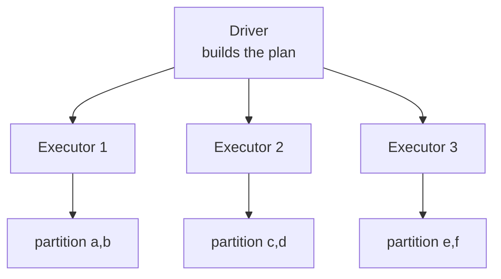
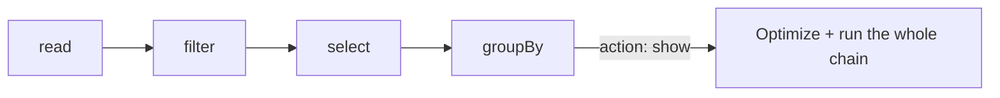

# 4.1 Spark fundamentals

## Concept
In [Unit 2](../unit2/intro.md) you queried the lake with **SQL** through Trino. Now you meet
**Apache Spark** — a distributed compute engine that runs SQL *and* Python (and Scala/Java)
over the same lakehouse. Spark is what you'll use to **build** the tables (Bronze → Silver →
Gold from the [medallion](../unit1/medallion.md)), where Trino was mostly for **reading** them.

### What "distributed" means
Spark splits your data into **partitions** and processes them in parallel. A cluster has one
**driver** (plans the work) and many **executors** (do the work). You write one program;
Spark fans it out.



### DataFrames
A **DataFrame** is a distributed table: named, typed columns, split into partitions. Same
mental model as a SQL table or a pandas DataFrame — but it can be terabytes and lives across
the cluster. You transform it with method chains (`.filter()`, `.select()`, `.groupBy()`) *or*
with SQL via `spark.sql(...)`.

### Transformations vs actions (lazy evaluation)
The single most important Spark idea:

- **Transformations** (`filter`, `select`, `withColumn`, `join`, `groupBy`) are **lazy** —
  they only build up a *plan*. Nothing runs yet.
- **Actions** (`show`, `count`, `collect`, `write`) **trigger** execution — Spark optimizes
  the whole plan, then runs it.



Because Spark sees the *entire* plan before running, it can push filters down, prune columns,
and avoid reading data you don't need — warehouse-grade optimization on lake files.

### Partitions
Partitions are the unit of parallelism. More partitions = more parallelism (up to a point);
too many tiny partitions = overhead. You'll rarely tune this early, but knowing
`df.rdd.getNumPartitions()` exists helps you reason about performance later.

## Lab
Connect to Spark from **Jupyter** at [http://localhost:8008](http://localhost:8008) (token
`123456`). The notebook is a lightweight **Spark Connect** client: it's pre-wired to the cluster's
Connect server (`sc://spark-connect:15002`), and the **`iceberg`** lakehouse catalog is already
configured on the server. So the whole connection is a single line — the equivalent of Unit 2's
`USE …`:

```python
from pyspark.sql import SparkSession

spark = SparkSession.builder.getOrCreate()   # Connect client → the cluster; iceberg catalog ready
print(spark.version)
```

!!! note "Where's all the config?"
    In Unit 2 you saw catalogs are **admin-configured**, not created by you. Same here: the
    cluster's Connect server already knows the **`iceberg`** catalog (object storage + Iceberg
    REST) and the S3 credentials, so your notebook doesn't repeat any of it. You'll build the
    lakehouse under `iceberg.bronze/silver/gold` — the *same* catalog Trino reads in Unit 2.

Build a first DataFrame from a small in-memory sample and *feel* lazy evaluation. (This is a
tiny synthetic sample, using ShopFlow's real `status` values — real revenue comes from
`order_items`, which you'll join in 4.3.)

```python
orders = spark.createDataFrame(
    [
        (1, 101, "2024-09-01", "delivered"),
        (2, 102, "2024-09-01", "delivered"),
        (3, 101, "2024-09-02", "cancelled"),
        (4, 103, "2024-09-02", "delivered"),
    ],
    ["order_id", "customer_id", "order_date", "status"],
)

# Transformations — still lazy, nothing has executed:
delivered = orders.filter("status = 'delivered'").select("customer_id", "order_date")

# Action — NOW Spark plans, optimizes and runs:
delivered.show()

# Another action:
print("delivered orders:", delivered.count())

# Inspect the physical plan Spark will run (no execution of data):
delivered.explain()
```

Peek at partitioning and a first aggregation:

```python
print("partitions:", orders.rdd.getNumPartitions())
orders.groupBy("status").count().show()
```

## Challenge
Using the `orders` sample above, produce the **count of delivered orders per order_date**,
sorted by date — with **DataFrame methods only** (no SQL). Then print the plan and identify
which steps are transformations vs the action.

??? note "Solution"
    ```python
    from pyspark.sql import functions as F

    result = (
        orders
        .filter(F.col("status") == "delivered")   # transformation
        .groupBy("order_date")                     # transformation
        .agg(F.count("*").alias("delivered"))      # transformation
        .orderBy("order_date")                     # transformation
    )
    result.explain()   # inspect plan — still nothing computed
    result.show()      # ACTION — triggers the whole chain
    ```
    Only `show()` (and `explain`) force execution; every `.filter/.groupBy/.agg/.orderBy`
    just extended the lazy plan.

!!! tip "🎯 This runs unchanged on Azure, Databricks, Snowflake & Fabric"
    **What you just did:** connected to a Spark cluster and ran lazy DataFrame transformations
    vs. actions across partitions.

    - **Azure Databricks** — this *is* Apache Spark: the DataFrame API, lazy evaluation, the
      driver/executor/partition model, and `spark.sql()` are the same product; this code lifts
      straight into a Databricks notebook.
    - **Microsoft Fabric** — Fabric Spark notebooks run this same PySpark, one-to-one.
    - **Snowflake** — **Snowpark** gives the same lazy DataFrame style (execute-on-action) on a
      virtual warehouse; deliberately Spark-like, though not byte-identical.
    - **Azure Data Factory** — Mapping Data Flows run on managed Spark under the hood; you build
      the same transformations visually instead of in code.

    Learn Spark once here, use it on every platform.

## Key terms, at a glance
| Term | Plain meaning |
|---|---|
| **Driver / executor** | Plans the work / does the work in parallel |
| **Partition** | A slice of the data — the unit of parallelism |
| **DataFrame** | A distributed, typed table you transform |
| **Transformation** | A lazy step that only builds the plan (`filter`, `join`…) |
| **Action** | Triggers execution (`show`, `count`, `write`) |
| **Lazy evaluation** | Nothing runs until an action; Spark optimizes the whole plan |
| **Spark Connect** | Lightweight client protocol to a remote Spark cluster |

## You can now…
- Explain distributed compute: driver, executors, partitions
- Distinguish transformations (lazy) from actions (trigger execution)
- Connect to Spark via Jupyter / Spark Connect and run first DataFrame ops
