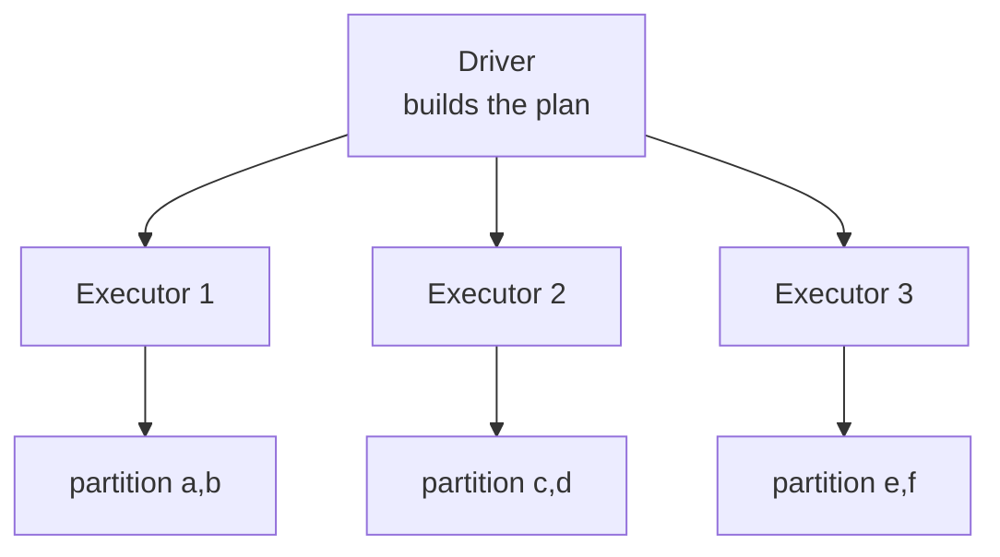
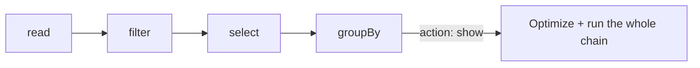

# 4.1 Spark fundamentals

## Concept
In [Unit 2](../unit2/intro.md) you queried the lake with **SQL** through Trino. Now you meet
**Apache Spark** — a distributed compute engine that runs SQL *and* Python (and Scala/Java)
over the same lakehouse. Spark is what you'll use to **build** the tables (Bronze → Silver →
Gold from the [medallion](../unit1/medallion.md)), where Trino was mostly for **reading** them.

### What "distributed" means
Spark splits your data into **partitions** and processes them in parallel. A cluster has one
**driver** (plans the work) and many **executors** (do the work). You write one program;
Spark fans it out.



### DataFrames
A **DataFrame** is a distributed table: named, typed columns, split into partitions. Same
mental model as a SQL table or a pandas DataFrame — but it can be terabytes and lives across
the cluster. You transform it with method chains (`.filter()`, `.select()`, `.groupBy()`) *or*
with SQL via `spark.sql(...)`.

### Transformations vs actions (lazy evaluation)
The single most important Spark idea:

- **Transformations** (`filter`, `select`, `withColumn`, `join`, `groupBy`) are **lazy** —
  they only build up a *plan*. Nothing runs yet.
- **Actions** (`show`, `count`, `collect`, `write`) **trigger** execution — Spark optimizes
  the whole plan, then runs it.



Because Spark sees the *entire* plan before running, it can push filters down, prune columns,
and avoid reading data you don't need — warehouse-grade optimization on lake files.

### Partitions
Partitions are the unit of parallelism. More partitions = more parallelism (up to a point);
too many tiny partitions = overhead. You'll rarely tune this early, but knowing
`df.rdd.getNumPartitions()` exists helps you reason about performance later.

## Lab
Connect to Spark from **Jupyter** at [http://localhost:8008](http://localhost:8008) (token
`123456`). The notebook is a lightweight **Spark Connect** client: it's pre-wired to the cluster's
Connect server (`sc://spark-connect:15002`), and the **`iceberg`** lakehouse catalog is already
configured on the server. So the whole connection is a single line — the equivalent of Unit 2's
`USE …`:

```python
from pyspark.sql import SparkSession

spark = SparkSession.builder.getOrCreate()   # Connect client → the cluster; iceberg catalog ready
print(spark.version)
```

**Read it step by step:**

- **`from pyspark.sql import SparkSession`** — imports the entry-point class. A
  **`SparkSession`** is your handle to the cluster: every DataFrame, every `spark.sql(...)`,
  every read and write goes through it. Think of it as the "connection object" for Spark.
- **`SparkSession.builder.getOrCreate()`** — `.builder` starts configuring a session;
  `.getOrCreate()` reuses one if it already exists, otherwise makes a new one. Normally you'd
  pass a `.master(...)` or `.remote(...)` here to say *which* cluster — but this notebook is a
  pre-wired **Spark Connect** client (a thin client that talks to a remote Spark cluster over
  the `sc://spark-connect:15002` address the environment already set). So the address, the
  `iceberg` catalog, and the storage credentials are all supplied by the server, and one line
  is enough. Nothing is computed on the cluster yet — you've only opened the connection.
- **`print(spark.version)`** — asks the cluster which Spark version it's running and prints it.
  A quick "am I really connected?" check.

!!! info "Driver, executors, partitions — the words behind the diagram"
    When you call an action later, Spark runs your program in two roles. The **driver** is the
    process holding `spark` — it builds the plan and hands out work. The **executors** are the
    worker processes that actually crunch data, in parallel. Each executor works on
    **partitions** — slices of your DataFrame. You write one script; Spark fans it across the
    cluster so data far bigger than one machine's RAM still fits.

!!! note "Where's all the config?"
    In Unit 2 you saw catalogs are **admin-configured**, not created by you. Same here: the
    cluster's Connect server already knows the **`iceberg`** catalog (object storage + Iceberg
    REST) and the S3 credentials, so your notebook doesn't repeat any of it. You'll build the
    lakehouse under `iceberg.bronze/silver/gold` — the *same* catalog Trino reads in Unit 2.

Build a first DataFrame from a small in-memory sample and *feel* lazy evaluation. (This is a
tiny synthetic sample, using ShopFlow's real `status` values — real revenue comes from
`order_items`, which you'll join in 4.3.)

```python
orders = spark.createDataFrame(
    [
        (1, 101, "2024-09-01", "delivered"),
        (2, 102, "2024-09-01", "delivered"),
        (3, 101, "2024-09-02", "cancelled"),
        (4, 103, "2024-09-02", "delivered"),
    ],
    ["order_id", "customer_id", "order_date", "status"],
)

# Transformations — still lazy, nothing has executed:
delivered = orders.filter("status = 'delivered'").select("customer_id", "order_date")

# Action — NOW Spark plans, optimizes and runs:
delivered.show()

# Another action:
print("delivered orders:", delivered.count())

# Inspect the physical plan Spark will run (no execution of data):
delivered.explain()
```

**Read it step by step:**

- **`spark.createDataFrame([...], [...])`** — builds a **DataFrame** (a distributed, typed
  table) from a Python list of rows plus a list of column names. Here four rows and the columns
  `order_id, customer_id, order_date, status`. A DataFrame looks like a pandas table, but it's
  split into partitions and lives on the cluster, so the *same* code works whether it's 4 rows
  or 4 billion. Building it is cheap — no data is scanned yet.
- **`orders.filter("status = 'delivered'")`** — a **transformation** (lazy). It says "keep only
  rows where `status` is `delivered`", but runs **nothing** — it just adds a step to the plan.
  The filter is written as a SQL-like string here; you'll also see the column-object form
  `F.col("status") == "delivered"` in the Challenge.
- **`.select("customer_id", "order_date")`** — another **transformation** (lazy). It prunes the
  DataFrame down to just those two columns. Still no execution; `delivered` is now a *recipe*
  (read → filter → select), not a computed result.
- **`delivered.show()`** — the first **action**. An action is what forces Spark to actually
  run: it optimizes the whole chain, ships the work to executors, and — for `show()` — prints
  the first ~20 rows as a table. This is the moment the lazy plan finally executes.
- **`delivered.count()`** — another **action**. It re-runs the plan to count the rows and
  returns a single number. (Each action triggers its own run; Spark doesn't cache results
  unless you ask it to.)
- **`delivered.explain()`** — prints the **physical plan** — the steps Spark *would* run — but
  **without touching the data**. Great for seeing the optimizer at work (e.g. the filter pushed
  down before the projection). Treat it as "show me the plan", not an action on the data.

!!! info "Why lazy? Because Spark optimizes the *whole* plan"
    Because transformations only build a plan, Spark sees the entire chain before running a
    single row. That lets it push the `filter` down, drop columns you didn't `select`, and skip
    reading data it doesn't need — the same warehouse-grade optimization Trino did in Unit 2,
    now applied to your Python. The rule to memorize: **transformations are lazy; an action
    (`show`, `count`, `collect`, `write`) triggers execution.**

Peek at partitioning and a first aggregation:

```python
print("partitions:", orders.rdd.getNumPartitions())
orders.groupBy("status").count().show()
```

**Read it step by step:**

- **`orders.rdd.getNumPartitions()`** — reports how many **partitions** this DataFrame is split
  into (its slices of parallelism). For a tiny in-memory sample it'll be small; on real lake
  files Spark chooses this from the data size. You rarely tune it early — this is just to *see*
  that a DataFrame is physically chunked.
- **`orders.groupBy("status")`** — a **transformation** (lazy). It buckets rows by `status`,
  the DataFrame equivalent of SQL's `GROUP BY`. Nothing runs yet.
- **`.count()`** — here `count()` chained after `groupBy` is a **transformation**: it declares
  "count the rows in each bucket" and returns a new DataFrame (one row per status). (Contrast
  with the earlier `delivered.count()`, which was called on a plain DataFrame and returned a
  number — *that* one is an action. Same word, two behaviours: on a grouping it's lazy; on a
  DataFrame it's an action.)
- **`.show()`** — the **action** that triggers the whole `groupBy → count` plan and prints the
  per-status counts.

## Challenge
Using the `orders` sample above, produce the **count of delivered orders per order_date**,
sorted by date — with **DataFrame methods only** (no SQL). Then print the plan and identify
which steps are transformations vs the action.

??? note "Solution"
    ```python
    from pyspark.sql import functions as F

    result = (
        orders
        .filter(F.col("status") == "delivered")   # transformation
        .groupBy("order_date")                     # transformation
        .agg(F.count("*").alias("delivered"))      # transformation
        .orderBy("order_date")                     # transformation
    )
    result.explain()   # inspect plan — still nothing computed
    result.show()      # ACTION — triggers the whole chain
    ```
    Only `show()` (and `explain`) force execution; every `.filter/.groupBy/.agg/.orderBy`
    just extended the lazy plan.

    **Read it step by step:**

    - **`from pyspark.sql import functions as F`** — imports Spark's column-function library
      under the short alias `F`. This is where `F.col`, `F.count`, `F.sum`, etc. live — the
      building blocks for expressing columns and aggregates in the DataFrame API.
    - **`F.col("status") == "delivered"`** — the column-object way to write a filter. `F.col`
      names a column; `==` builds a comparison expression. Same effect as the string
      `"status = 'delivered'"` you used in the Lab — just typed rather than parsed. Still a
      lazy **transformation**.
    - **`.groupBy("order_date")`** — buckets rows by date. **Transformation** (lazy).
    - **`.agg(F.count("*").alias("delivered"))`** — computes one aggregate per bucket:
      `F.count("*")` counts rows in the group, and `.alias("delivered")` names the output
      column. **Transformation** (lazy) — it describes the aggregation, runs nothing.
    - **`.orderBy("order_date")`** — sorts the result by date. **Transformation** (lazy).
    - **`result.explain()`** — prints the plan; no data computed.
    - **`result.show()`** — the single **action** that finally runs the whole chain.

!!! tip "🎯 This runs unchanged on Azure, Databricks, Snowflake & Fabric"
    **What you just did:** connected to a Spark cluster and ran lazy DataFrame transformations
    vs. actions across partitions.

    - **Azure Databricks** — this *is* Apache Spark: the DataFrame API, lazy evaluation, the
      driver/executor/partition model, and `spark.sql()` are the same product; this code lifts
      straight into a Databricks notebook.
    - **Microsoft Fabric** — Fabric Spark notebooks run this same PySpark, one-to-one.
    - **Snowflake** — **Snowpark** gives the same lazy DataFrame style (execute-on-action) on a
      virtual warehouse; deliberately Spark-like, though not byte-identical.
    - **Azure Data Factory** — Mapping Data Flows run on managed Spark under the hood; you build
      the same transformations visually instead of in code.

    Learn Spark once here, use it on every platform.

## Key terms, at a glance
| Term | Plain meaning |
|---|---|
| **Spark** | A distributed compute engine — splits work across a cluster to process data bigger than one machine's RAM |
| **Cluster** | The set of machines Spark runs on: one driver + many executors |
| **Driver / executor** | Plans the work / does the work in parallel |
| **Partition** | A slice of the data — the unit of parallelism |
| **DataFrame** | A distributed, typed table you transform (like pandas, but scales out) |
| **Transformation** | A lazy step that only builds the plan (`filter`, `select`, `groupBy`, `join`…) |
| **Action** | Triggers execution (`show`, `count`, `collect`, `write`) |
| **Lazy evaluation** | Nothing runs until an action; Spark optimizes the whole plan first |
| **SparkSession** (`spark`) | Your entry point / handle to the cluster — every DataFrame and query goes through it |
| **Spark Connect** (`sc://…`) | Lightweight client protocol to a remote Spark cluster |

## You can now…
- Explain distributed compute: driver, executors, partitions
- Distinguish transformations (lazy) from actions (trigger execution)
- Connect to Spark via Jupyter / Spark Connect and run first DataFrame ops
