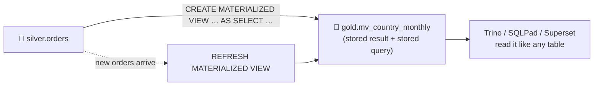

# 4.5 Materialized views

## Concept
In [4.4](spark-sql-gold.md) you built Gold marts by running a query and **saving the result as a
table**, with code you wrote yourself (`createOrReplace()`). A **materialized view** (MV) gives that
same pattern a name: you hand the engine **the query**, it stores the result as a table, and it
**remembers the query** so you can recompute it later with one statement.

| | View | Gold table you write | Materialized view |
|---|---|---|---|
| Stores the result? | ✗ re-runs the query on every read | ✓ | ✓ |
| Remembers the query? | ✓ | ✗ it lives in your notebook / job | ✓ it's stored with the table |
| Read speed | as slow as the query | fast | fast |
| Freshness | always current | whenever your job runs | whenever you **refresh** it |



**Why it matters.** Dashboards ask the same question over and over. An MV does the heavy
`GROUP BY` **once per refresh**, not once per dashboard click. And because the query is stored with
the table, nobody has to dig up the notebook that built it.

## Create one
In a notebook, `%%sql` understands MV statements ([3.8](../unit3/sql-magic.md)). Monthly revenue
per country, straight from Silver:

```sql
%%sql
CREATE MATERIALIZED VIEW iceberg.gold.mv_country_monthly AS
SELECT country,
       date_trunc('MONTH', order_date) AS month,
       COUNT(DISTINCT order_id)        AS orders,
       SUM(line_amount)                AS revenue
FROM iceberg.silver.orders
WHERE status = 'delivered'
GROUP BY country, date_trunc('MONTH', order_date)
```

The result shows the action and the row count. The MV is now an ordinary Iceberg table in the
governed catalog, so read it like one:

```sql
%%sql
SELECT * FROM iceberg.gold.mv_country_monthly ORDER BY month DESC, revenue DESC LIMIT 10
```

The same query works in **Trino / SQLPad** (`SELECT * FROM iceberg.gold.mv_country_monthly`) and in
**Superset**. Point a chart at it and the chart never runs the `GROUP BY` itself.

## Refresh it: freshness is your choice
An MV does **not** update on its own. Prove it: add a fake order to Silver, then compare.

```sql
%%sql
INSERT INTO iceberg.silver.orders
SELECT 999999001, DATE '2099-01-15', 1, 'Test Customer', 'Atlantis', 'web',
       1, 'Test Product', 'Test', 1, 100.00, 100.00, 'delivered'
```

```sql
%%sql
SELECT * FROM iceberg.gold.mv_country_monthly WHERE country = 'Atlantis'
```

Nothing shows up: the MV still holds the result from when it was created. Now refresh it:

```sql
%%sql
REFRESH MATERIALIZED VIEW iceberg.gold.mv_country_monthly
```

```sql
%%sql
SELECT * FROM iceberg.gold.mv_country_monthly WHERE country = 'Atlantis'
```

Atlantis now appears. Clean up the test row and refresh once more:

```sql
%%sql
DELETE FROM iceberg.silver.orders WHERE order_id = 999999001
```

```sql
%%sql
REFRESH MATERIALIZED VIEW iceberg.gold.mv_country_monthly
```

!!! info "Stale is a feature, not a bug"
    Between refreshes, every reader sees the **same consistent snapshot**, and nobody pays the
    query cost. The trade-off is that the data is only as fresh as the last refresh. In production
    you refresh on a schedule, e.g. an Airflow task right after the Silver load
    ([Unit 5](../unit5/basics.md)).

## How it works under the hood
Spark 4.1 runs `CREATE MATERIALIZED VIEW` only inside a **Spark Declarative Pipeline**: a small
project where you declare the tables you want and Spark builds them. `%%sql` writes a one-view
pipeline for you, runs it, and saves your query on the table as the `mv.definition` property:

```sql
%%sql
SHOW TBLPROPERTIES iceberg.gold.mv_country_monthly ('mv.definition')
```

That's your `SELECT`. `REFRESH` reads this property and runs the pipeline again.

Rules that follow from this:

- Use a **fully qualified name**: `catalog.namespace.view`.
- A refresh **recomputes the whole view**. It is not incremental.
- MV statements work **in `%%sql` only**. Trino and SQLPad can *read* MVs, but they can't *create*
  them on our Polaris (REST) catalog.

## Change, list, and drop
| Statement | What it does |
|---|---|
| `CREATE OR REPLACE MATERIALIZED VIEW … AS …` | change the query (recomputes the MV) |
| `CREATE MATERIALIZED VIEW IF NOT EXISTS … AS …` | create only if it isn't there yet (safe to re-run) |
| `SHOW MATERIALIZED VIEWS IN iceberg.gold` | list the MVs in a namespace, with their stored SQL |
| `DROP MATERIALIZED VIEW [IF EXISTS] …` | remove the MV |

```sql
%%sql
SHOW MATERIALIZED VIEWS IN iceberg.gold
```

```sql
%%sql
DROP MATERIALIZED VIEW iceberg.gold.mv_country_monthly
```

`DROP MATERIALIZED VIEW` refuses to drop a normal table, and `REFRESH` refuses to refresh one.
That way a typo can't wipe out `gold.daily_sales`.

## MV or a Gold job?
| Choose a **materialized view** when… | Choose a **Gold job** (4.4 style) when… |
|---|---|
| the logic is **one SQL query** | you need several steps, Python, or `MERGE` |
| a full recompute is affordable | the table is huge and needs incremental loads |
| you want the definition stored **with the table** | you want partitioning, writes, and history under your control |

## Key terms, at a glance
| Term | Plain meaning |
|---|---|
| **View** | a saved query, re-run on every read |
| **Materialized view (MV)** | a saved query **plus** its stored result, recomputed on refresh |
| **Refresh** | re-run the MV's query and replace its stored result |
| **Stale** | the MV's result is older than its source data (normal between refreshes) |
| **Declarative pipeline** | declare *what* tables should exist; the engine works out how to build them |
| **`mv.definition`** | the table property where our MVs keep their SQL |

## You can now…
- Explain view vs Gold table vs **materialized view**, and the freshness trade-off
- **Create**, query, **refresh**, list and drop an MV from a notebook with `%%sql`
- Show that an MV is **stale until refreshed**, and say where the refresh belongs (a scheduled job)
- Decide between an **MV** and a hand-written **Gold job**

## 🎯 Same idea on Azure, Databricks, Snowflake & Fabric
- **Microsoft Fabric**: *materialized lake views* (`CREATE MATERIALIZED LAKE VIEW … AS SELECT …`)
  on a Lakehouse, refreshed on a schedule.
- **Databricks**: materialized views in Databricks SQL and **Lakeflow Declarative Pipelines**, the
  managed version of the pipeline idea that Spark 4.1 open-sourced.
- **Snowflake**: materialized views, and **Dynamic Tables** (declare the query plus a target lag,
  and Snowflake keeps the table refreshed).

The SQL shape is the same everywhere. What differs is **who triggers the refresh** and whether it
can be incremental.
