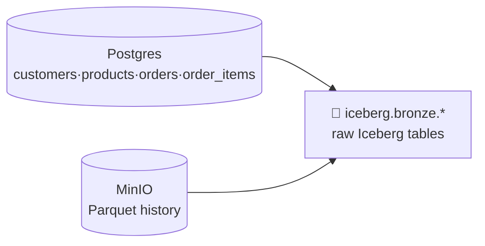

# 4.2 Read the lake (Bronze)

## Concept
**Bronze** is the raw landing zone: faithful copies of the sources, minimally touched, append-
friendly. You keep everything so you can always reprocess ([1.4](../unit1/medallion.md)).
ShopFlow has two kinds of source, and Spark reads both:

- **Postgres OLTP** (`shopflow` db) — the live tables `customers`, `products`, `orders`,
  `order_items` (the [schema](../unit0/schema.md)) — read over **JDBC**. The same data you
  queried directly in Unit 2, now *ingested* into the lake.
- **Object-storage history** — older orders archived as date-partitioned **Parquet** — read as
  files.



The rule for Bronze: **land, don't transform.** Cleaning happens in Silver (4.3).

!!! info "Why Bronze keeps everything as-is"
    Back in [1.4](../unit1/medallion.md) you learned the medallion layers. **Bronze** is the
    bottom rung: a raw, append-friendly *copy* of each source, with the columns, types, and even
    the mess exactly as they arrived. You deliberately **do not** clean, dedupe, rename, or drop
    anything here. Why? Because a raw copy is your safety net — if a Silver rule turns out to be
    wrong, you can always **reprocess from Bronze** without going back to the live source (which
    may have changed or gone offline). Fix-it-later is only possible if you kept the original.

### Writing Iceberg tables — one shared catalog
You write Bronze into the **`iceberg`** catalog — the *same* catalog Trino reads in Unit 2. So a
table you build here as `iceberg.bronze.orders` is immediately queryable in Trino as
`iceberg.bronze.orders`: **one write, two engines, no copying.** The write pattern is a one-liner:

```python
df.writeTo("iceberg.bronze.<table>").using("iceberg").createOrReplace()
```

!!! note "Anatomy of the write — read it left to right"
    - **`df`** — a Spark **DataFrame**: a table-shaped, lazily-evaluated dataset (rows and typed
      columns) that Spark hasn't computed yet. You build one by *reading* a source (next section).
    - **`.writeTo("iceberg.bronze.<table>")`** — names the **target table** using a **three-part
      name**: `catalog.schema.table`. `iceberg` is the *catalog* (the shared metastore Trino also
      reads), `bronze` is the *schema* (a namespace, like a folder for tables), and `<table>` is
      the table itself. All three parts together point at exactly one table.
    - **`.using("iceberg")`** — store it in the **Iceberg** table format (open columnar files plus
      a metadata layer that tracks snapshots, schema, and partitions).
    - **`.createOrReplace()`** — the *action* that actually runs the write: create the table if
      it's new, or **fully replace** its contents if it already exists. (Later you'll meet
      **`.append()`**, which *adds* rows instead of replacing.)

## Lab
Assume the `spark` session from [4.1](fundamentals.md) — the object named `spark` is your handle
to the cluster. First you need a *place* to put Bronze tables. Create the Bronze **schema** (the
`bronze` namespace inside the `iceberg` catalog):

```python
spark.sql("CREATE SCHEMA IF NOT EXISTS iceberg.bronze")
```

**Read it step by step:**

- **`spark.sql(...)`** — hand a raw SQL string to Spark to execute. Anything you'd type in
  Trino/SQL you can run this way from Python.
- **`CREATE SCHEMA`** — make a **schema**: a namespace that holds tables. It's the middle part of
  the three-part `iceberg.bronze.<table>` name. Without it, there's nowhere for the tables to live.
- **`IF NOT EXISTS`** — don't error if it's already there. That makes this notebook safe to re-run
  from the top (**idempotent**).

*Produces:* no data — just an empty container, `iceberg.bronze`, ready to hold tables.

### Read Postgres over JDBC
Now pull the four live OLTP tables out of Postgres and into Spark. **JDBC** (Java Database
Connectivity) is the standard driver protocol Spark uses to talk to a relational database. We wrap
the read in a small helper so we don't repeat the connection details four times:

```python
def read_pg(table):
    return (
        spark.read.format("jdbc")
        .option("url", "jdbc:postgresql://postgres:5432/shopflow")
        .option("dbtable", table)
        .option("user", "postgres")
        .option("password", "postgres")
        .option("driver", "org.postgresql.Driver")
        .load()
    )

customers = read_pg("customers")
products  = read_pg("products")
orders    = read_pg("orders")
items     = read_pg("order_items")

customers.show(5)
```

**Read it step by step:**

- **`spark.read`** — the entry point for *loading* data into a DataFrame. Everything you ingest
  starts here; the options that follow tell it *where from* and *how*.
- **`.format("jdbc")`** — read over a database driver rather than from files. (Later you'll see
  `spark.read.parquet(...)` for the file source.)
- **`.option("url", "jdbc:postgresql://postgres:5432/shopflow")`** — the connection string:
  connect to the `shopflow` database on host `postgres`, port `5432`.
- **`.option("dbtable", table)`** — *which* table to pull. You pass in `"customers"`, `"orders"`,
  etc. (A later trick: this can also be a `(SELECT …)` subquery — see the Challenge.)
- **`.option("user"/"password"/"driver", …)`** — credentials plus the exact Java driver class
  (`org.postgresql.Driver`) Spark loads to speak Postgres.
- **`.load()`** — the *action* that runs the read and returns a **DataFrame**.
- The four calls build four DataFrames — `customers`, `products`, `orders`, `items` — each mirroring
  its Postgres table one-for-one. This is the *same* data you queried in Unit 2, now inside Spark.
- **`customers.show(5)`** — print the first 5 rows so you can eyeball what came back.

*Produces:* four DataFrames, one per source table. Grain (what one row means): one customer, one
product, one order, one order line-item, respectively — unchanged from Postgres.

### Prepare & read the Parquet history from object storage
Our stack ships without the archival files, so **create a small export once** (this simulates
ShopFlow's nightly "archive old orders" job), then ingest it like any file source:

```python
from pyspark.sql import functions as F

# One-time: write "archived" orders (older than 2024) as date-partitioned Parquet
(read_pg("orders")
    .withColumn("dt", F.to_date("order_ts"))
    .filter(F.col("dt") < F.lit("2024-01-01"))
    .write.mode("overwrite").partitionBy("dt")
    .parquet("s3a://demo-bucket/shopflow/history/orders/"))

# Now read it back — exactly how you'd ingest any file source
hist = spark.read.parquet("s3a://demo-bucket/shopflow/history/orders/")
hist.printSchema()
print("history rows:", hist.count())
```

**Read it step by step — the one-time export:**

- **`from pyspark.sql import functions as F`** — import Spark's column-function library under the
  short alias `F`. You call functions on *columns* (not Python values) through it, e.g.
  `F.to_date`, `F.col`, `F.lit`.
- **`read_pg("orders")`** — reuse the helper to pull `orders` again as a DataFrame to export.
- **`.withColumn("dt", F.to_date("order_ts"))`** — **`withColumn`** adds (or replaces) a column.
  Here it derives a new `dt` column by converting the `order_ts` timestamp to a plain **date** with
  **`F.to_date`**. This becomes the partition key.
- **`.filter(F.col("dt") < F.lit("2024-01-01"))`** — keep only the "archived" older rows.
  **`F.col("dt")`** refers to the `dt` column; **`F.lit("2024-01-01")`** wraps the string as a
  *literal* column value so Spark compares column-to-column.
- **`.write.mode("overwrite").partitionBy("dt").parquet(...)`** — write the DataFrame out as
  **Parquet** files, `overwrite` any prior export, and **`partitionBy("dt")`** split them into one
  folder *per date* (`dt=2023-11-30/…`). The path uses `s3a://` — Spark's connector for
  S3-compatible object storage (here, MinIO).

**Read it step by step — the read-back:**

- **`spark.read.parquet("s3a://…")`** — load those Parquet files straight into a DataFrame. This is
  the file-source counterpart to the JDBC read: same `spark.read`, different `.parquet(...)` source.
- **`hist.printSchema()`** — print the inferred column names and types (Parquet carries its own
  schema, so Spark reads it back without you re-declaring anything).
- **`hist.count()`** — force Spark to actually scan the files and count the rows.

*Produces:* `hist`, a DataFrame of archived orders. Grain: one row per historical order, plus the
extra `dt` partition column.

Spark auto-discovers the `dt=YYYY-MM-DD` partition column from the folder layout, so `dt` shows
up as a real column you can filter on cheaply (**partition pruning** — skip whole folders a filter
can't match, so Spark never even opens them).

### Land raw copies into Bronze
Write each source as an Iceberg table — raw, no cleaning yet:

```python
for df, table in [(customers, "customers"), (products, "products"),
                  (orders, "orders"), (items, "order_items")]:
    df.writeTo(f"iceberg.bronze.{table}").using("iceberg").createOrReplace()
    print("wrote iceberg.bronze." + table)

# Historical Parquet → its own Bronze table (keep it distinct from live orders)
hist.writeTo("iceberg.bronze.orders_history").using("iceberg").createOrReplace()
```

**Read it step by step:**

- **`for df, table in [(customers, "customers"), …]`** — loop over each (DataFrame, name) pair so
  you write all four with one block instead of repeating the same line.
- **`df.writeTo(f"iceberg.bronze.{table}")`** — the write pattern from the Concept: target the
  three-part name `iceberg.bronze.<table>` (`iceberg` catalog → `bronze` schema → the table).
- **`.using("iceberg").createOrReplace()`** — store it as an **Iceberg** table, creating it or
  fully replacing it. Because it's the *shared* catalog, the table is instantly visible to Trino.
- **`hist.writeTo("iceberg.bronze.orders_history")…`** — land the archived orders as a **separate**
  Bronze table. Keeping history distinct from the live `orders` honours the Bronze rule: land each
  source *as-is*, don't merge or transform.

*Produces:* five raw Iceberg tables in Bronze — `customers`, `products`, `orders`, `order_items`,
and `orders_history` — each a faithful, uncleaned copy of its source. Nothing was renamed, deduped,
or filtered: that's Bronze doing its job.

Verify — this is exactly the SQL from Unit 2, now over the lakehouse via Spark:

```python
spark.sql("SHOW TABLES IN iceberg.bronze").show()
spark.sql("SELECT count(*) AS n FROM iceberg.bronze.orders").show()
```

**Read it step by step:**

- **`SHOW TABLES IN iceberg.bronze`** — list every table now living in the `bronze` schema. You
  should see the five you just wrote.
- **`SELECT count(*) AS n FROM iceberg.bronze.orders`** — count the rows in the Bronze `orders`
  table, referenced by its full three-part name, to confirm the data actually landed.

Because it's the same catalog, you can **also** open these in Trino right now
(`SELECT count(*) FROM iceberg.bronze.orders;`) — Spark wrote them, Trino reads them.

### Load a flat file with pure SQL (Spark SQL)
Prefer SQL to the DataFrame API? You can read a file **straight from object storage by its path** and
land it in the lakehouse in a **single statement** — no `spark.read`, no `.writeTo`. This is
**Spark SQL** (run it through `spark.sql(…)` in a notebook, or the `spark-sql` shell).

**Parquet** — read the S3 path *as a table*, then `CREATE TABLE … AS SELECT` (CTAS) into Bronze:

```python
spark.sql("""
  CREATE TABLE iceberg.bronze.orders_history_sql AS
  SELECT * FROM parquet.`s3a://demo-bucket/shopflow/history/orders/`
""")
```

**Read it step by step:**

- **``parquet.`s3a://…` ``** — Spark SQL's **path-based table** syntax: treat the Parquet files at
  that S3 path as if they were a table. Parquet carries its own schema, so you declare nothing.
  (**`json.`** works the same way.)
- **`CREATE TABLE … AS SELECT` (CTAS)** — create the Iceberg table **and** fill it from that `SELECT`
  in one shot. To top up an *existing* table instead, use `INSERT INTO iceberg.bronze.<t> SELECT …`.

**CSV** needs its header and types declared, so read it through a **temporary view** first, then load:

```python
spark.sql("""
  CREATE TEMPORARY VIEW customers_csv USING csv
  OPTIONS (path 's3a://demo-bucket/shopflow/exports/customers/', header true, inferSchema true)
""")
spark.sql("CREATE TABLE iceberg.bronze.customers_csv AS SELECT * FROM customers_csv")
```

A **temporary view** is a query-able name that lives only for your session — perfect for pointing at
raw files with the right read options before landing them.

!!! warning "Loose files need Spark — not Trino"
    This path-based file load is a **Spark SQL** feature. **Trino cannot read loose files** on this
    stack (no file connector is configured), so the division of labour is: **Spark loads files** into
    the lakehouse; **Trino queries** the resulting Iceberg tables. Trino *can* still load in pure SQL
    from a **connected database** — `CREATE TABLE iceberg.bronze.orders AS SELECT * FROM
    shopflow.public.orders` — it just can't read a bare `s3://…` file.

## Challenge
The generator keeps adding rows to Postgres `orders`. Instead of overwriting Bronze every run,
ingest **only orders newer than what Bronze already has** and **append** them. Write a snippet
that (1) finds the max `order_id` in `iceberg.bronze.orders`, and (2) reads just the newer rows
from Postgres and appends them.

!!! tip "The idea: a high-water mark"
    A **high-water mark** is the latest key you've already loaded — here, the biggest `order_id`
    sitting in Bronze. Read only rows *above* it, then **`.append()`** (add rows) instead of
    **`.createOrReplace()`** (wipe and rewrite). That turns a full reload into a cheap incremental
    top-up.

??? note "Solution"
    ```python
    # 1. high-water mark already in Bronze
    hwm = spark.sql(
        "SELECT coalesce(max(order_id), 0) AS m FROM iceberg.bronze.orders"
    ).collect()[0]["m"]

    # 2. read only newer rows from Postgres via a pushdown query
    new_orders = (
        spark.read.format("jdbc")
        .option("url", "jdbc:postgresql://postgres:5432/shopflow")
        .option("dbtable", f"(SELECT * FROM orders WHERE order_id > {hwm}) AS t")
        .option("user", "postgres").option("password", "postgres")
        .option("driver", "org.postgresql.Driver")
        .load()
    )

    # 3. append into the existing Iceberg table
    if new_orders.take(1):
        new_orders.writeTo("iceberg.bronze.orders").append()
        print("appended", new_orders.count(), "new orders")
    else:
        print("bronze already up to date")
    ```
    **Read it step by step:**

    - **`spark.sql("SELECT coalesce(max(order_id), 0) …").collect()[0]["m"]`** — ask Bronze for its
      highest `order_id`. **`coalesce(…, 0)`** returns `0` if the table is empty (first run).
      **`.collect()`** pulls the tiny result to the Python driver as a list of rows;
      **`[0]["m"]`** grabs column `m` of the first row into the plain integer `hwm`.
    - **`.option("dbtable", f"(SELECT * FROM orders WHERE order_id > {hwm}) AS t")`** — instead of a
      table name, pass a **subquery**. Postgres runs the `WHERE` filter itself and hands Spark only
      the new rows.
    - **`if new_orders.take(1):`** — **`.take(1)`** returns the first row (or nothing). This cheaply
      checks "is there anything new?" before writing.
    - **`new_orders.writeTo("iceberg.bronze.orders").append()`** — **`.append()`** *adds* the new
      rows to the existing Bronze table, leaving what's already there untouched.

    Using a `(SELECT … WHERE …)` subquery as `dbtable` pushes the filter into Postgres, so Spark
    transfers only the new rows (**predicate pushdown**, like Trino in Unit 2).

!!! tip "🎯 This runs unchanged on Azure, Databricks, Snowflake & Fabric"
    **What you just did:** ingested raw sources into Bronze — Postgres over JDBC and Parquet from
    object storage — landing them as lakehouse tables.

    - **Azure Databricks** — `spark.read.parquet(...)` and `spark.read.format("jdbc")` run
      unchanged; use **Auto Loader** for incremental file ingestion and write Bronze tables the
      same way (Delta there; Iceberg here — same idea).
    - **Microsoft Fabric** — a Copy activity or **Dataflows Gen2** ingests into a Lakehouse, or a
      **Shortcut** references files in place in OneLake without copying.
    - **Snowflake** — land raw with **COPY INTO** / **Snowpipe** from an external **Stage**, and
      pull the Postgres tables via a connector; "land everything, transform later" is the same.
    - **Azure Data Factory** — the **Copy activity** does the ingestion; a **Self-hosted
      Integration Runtime** reaches an on-prem Postgres, like your JDBC read here.

    Only the object-store path changes (`abfss://` / `s3://` instead of `s3a://minio`).

## Key terms, at a glance
| Term | Plain meaning |
|---|---|
| **Bronze** | Raw, as-ingested copy of the sources — keep everything, don't transform |
| **DataFrame** | Spark's table-shaped, lazily-computed dataset (typed rows + columns) |
| **`spark.read`** | Entry point for loading a source into a DataFrame (JDBC, Parquet, …) |
| **JDBC read** | Pull relational tables into Spark over a database driver |
| **Schema** | A namespace that holds tables — the `bronze` in `iceberg.bronze.<table>` |
| **Three-part name** | `catalog.schema.table` — e.g. `iceberg.bronze.orders` |
| **Iceberg table** | Open table format: columnar files + metadata (snapshots, schema, partitions) |
| **`writeTo(...).using("iceberg").createOrReplace()`** | Create, or fully replace, an Iceberg table |
| **`.append()`** | Add rows to an existing table instead of replacing it |
| **`withColumn` / `F.lit`** | Add/replace a column / wrap a constant as a column value |
| **Partition discovery** | Spark reads `dt=…` folders as a real column |
| **Partition pruning** | Skip folders a filter can't match |
| **Shared catalog** | Spark writes `iceberg.*`; Trino reads the same `iceberg.*` |
| **High-water mark** | The latest key already loaded — basis of incremental loads |

## You can now…
- Read relational tables via JDBC and date-partitioned Parquet from object storage
- Land raw copies into `iceberg.bronze.*` with no premature cleaning
- Write Iceberg tables that Trino can read immediately (same catalog)
- Ingest incrementally with a high-water mark instead of full overwrites
