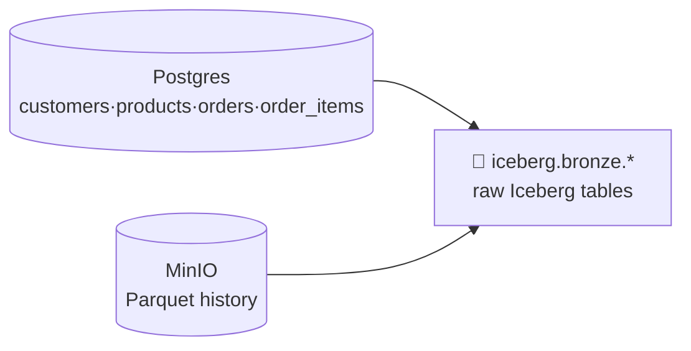

# 4.2 Read the lake (Bronze)

## Concept
**Bronze** is the raw landing zone: faithful copies of the sources, minimally touched, append-
friendly. You keep everything so you can always reprocess ([1.4](../unit1/medallion.md)).
ShopFlow has two kinds of source, and Spark reads both:

- **Postgres OLTP** (`shopflow` db) — the live tables `customers`, `products`, `orders`,
  `order_items` (the [schema](../unit0/schema.md)) — read over **JDBC**. The same data you
  queried directly in Unit 2, now *ingested* into the lake.
- **Object-storage history** — older orders archived as date-partitioned **Parquet** — read as
  files.



The rule for Bronze: **land, don't transform.** Cleaning happens in Silver (4.3).

### Writing Iceberg tables — one shared catalog
You write Bronze into the **`iceberg`** catalog — the *same* catalog Trino reads in Unit 2. So a
table you build here as `iceberg.bronze.orders` is immediately queryable in Trino as
`iceberg.bronze.orders`: **one write, two engines, no copying.** The write pattern is a one-liner:

```python
df.writeTo("iceberg.bronze.<table>").using("iceberg").createOrReplace()
```

## Lab
Assume the `spark` session from [4.1](fundamentals.md). Create the Bronze schema:

```python
spark.sql("CREATE SCHEMA IF NOT EXISTS iceberg.bronze")
```

### Read Postgres over JDBC

```python
def read_pg(table):
    return (
        spark.read.format("jdbc")
        .option("url", "jdbc:postgresql://postgres:5432/shopflow")
        .option("dbtable", table)
        .option("user", "postgres")
        .option("password", "postgres")
        .option("driver", "org.postgresql.Driver")
        .load()
    )

customers = read_pg("customers")
products  = read_pg("products")
orders    = read_pg("orders")
items     = read_pg("order_items")

customers.show(5)
```

### Prepare & read the Parquet history from object storage
Our stack ships without the archival files, so **create a small export once** (this simulates
ShopFlow's nightly "archive old orders" job), then ingest it like any file source:

```python
from pyspark.sql import functions as F

# One-time: write "archived" orders (older than 2024) as date-partitioned Parquet
(read_pg("orders")
    .withColumn("dt", F.to_date("order_ts"))
    .filter(F.col("dt") < F.lit("2024-01-01"))
    .write.mode("overwrite").partitionBy("dt")
    .parquet("s3a://demo-bucket/shopflow/history/orders/"))

# Now read it back — exactly how you'd ingest any file source
hist = spark.read.parquet("s3a://demo-bucket/shopflow/history/orders/")
hist.printSchema()
print("history rows:", hist.count())
```

Spark auto-discovers the `dt=YYYY-MM-DD` partition column from the folder layout, so `dt` shows
up as a real column you can filter on cheaply (**partition pruning**).

### Land raw copies into Bronze
Write each source as an Iceberg table — raw, no cleaning yet:

```python
for df, table in [(customers, "customers"), (products, "products"),
                  (orders, "orders"), (items, "order_items")]:
    df.writeTo(f"iceberg.bronze.{table}").using("iceberg").createOrReplace()
    print("wrote iceberg.bronze." + table)

# Historical Parquet → its own Bronze table (keep it distinct from live orders)
hist.writeTo("iceberg.bronze.orders_history").using("iceberg").createOrReplace()
```

Verify — this is exactly the SQL from Unit 2, now over the lakehouse via Spark:

```python
spark.sql("SHOW TABLES IN iceberg.bronze").show()
spark.sql("SELECT count(*) AS n FROM iceberg.bronze.orders").show()
```

Because it's the same catalog, you can **also** open these in Trino right now
(`SELECT count(*) FROM iceberg.bronze.orders;`) — Spark wrote them, Trino reads them.

## Challenge
The generator keeps adding rows to Postgres `orders`. Instead of overwriting Bronze every run,
ingest **only orders newer than what Bronze already has** and **append** them. Write a snippet
that (1) finds the max `order_id` in `iceberg.bronze.orders`, and (2) reads just the newer rows
from Postgres and appends them.

??? note "Solution"
    ```python
    # 1. high-water mark already in Bronze
    hwm = spark.sql(
        "SELECT coalesce(max(order_id), 0) AS m FROM iceberg.bronze.orders"
    ).collect()[0]["m"]

    # 2. read only newer rows from Postgres via a pushdown query
    new_orders = (
        spark.read.format("jdbc")
        .option("url", "jdbc:postgresql://postgres:5432/shopflow")
        .option("dbtable", f"(SELECT * FROM orders WHERE order_id > {hwm}) AS t")
        .option("user", "postgres").option("password", "postgres")
        .option("driver", "org.postgresql.Driver")
        .load()
    )

    # 3. append into the existing Iceberg table
    if new_orders.take(1):
        new_orders.writeTo("iceberg.bronze.orders").append()
        print("appended", new_orders.count(), "new orders")
    else:
        print("bronze already up to date")
    ```
    Using a `(SELECT … WHERE …)` subquery as `dbtable` pushes the filter into Postgres, so Spark
    transfers only the new rows (**predicate pushdown**, like Trino in Unit 2).

!!! tip "🎯 This runs unchanged on Azure, Databricks, Snowflake & Fabric"
    **What you just did:** ingested raw sources into Bronze — Postgres over JDBC and Parquet from
    object storage — landing them as lakehouse tables.

    - **Azure Databricks** — `spark.read.parquet(...)` and `spark.read.format("jdbc")` run
      unchanged; use **Auto Loader** for incremental file ingestion and write Bronze tables the
      same way (Delta there; Iceberg here — same idea).
    - **Microsoft Fabric** — a Copy activity or **Dataflows Gen2** ingests into a Lakehouse, or a
      **Shortcut** references files in place in OneLake without copying.
    - **Snowflake** — land raw with **COPY INTO** / **Snowpipe** from an external **Stage**, and
      pull the Postgres tables via a connector; "land everything, transform later" is the same.
    - **Azure Data Factory** — the **Copy activity** does the ingestion; a **Self-hosted
      Integration Runtime** reaches an on-prem Postgres, like your JDBC read here.

    Only the object-store path changes (`abfss://` / `s3://` instead of `s3a://minio`).

## Key terms, at a glance
| Term | Plain meaning |
|---|---|
| **Bronze** | Raw, as-ingested copy of the sources — keep everything |
| **JDBC read** | Pull relational tables into Spark over a database driver |
| **Partition discovery** | Spark reads `dt=…` folders as a real column |
| **Partition pruning** | Skip folders a filter can't match |
| **`writeTo(...).using("iceberg").createOrReplace()`** | Create/replace an Iceberg table |
| **Shared catalog** | Spark writes `iceberg.*`; Trino reads the same `iceberg.*` |
| **High-water mark** | The latest key already loaded — basis of incremental loads |

## You can now…
- Read relational tables via JDBC and date-partitioned Parquet from object storage
- Land raw copies into `iceberg.bronze.*` with no premature cleaning
- Write Iceberg tables that Trino can read immediately (same catalog)
- Ingest incrementally with a high-water mark instead of full overwrites
