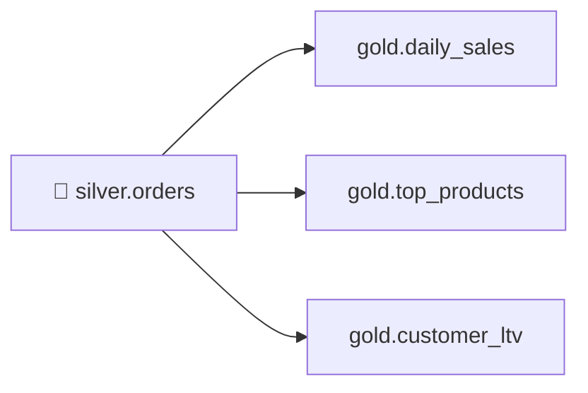

# 4.4 Spark SQL & aggregates (Gold)

## Concept
**Gold** holds business-ready aggregates — the tables a dashboard or analyst queries directly.
The beautiful part: **the SQL you learned in [Unit 2](../unit2/intro.md) works unchanged inside
Spark.** `spark.sql("…")` runs the exact same `GROUP BY`, joins, and window functions you wrote
for Trino — same `iceberg` catalog, same `silver.orders`, different engine.



You'll build three marts from `silver.orders`:

- **`gold.daily_sales`** — revenue and order counts per day.
- **`gold.top_products`** — best-selling products by revenue.
- **`gold.customer_ltv`** — lifetime value per customer.

### Tie back to Unit 1.4 — what "Gold" means
In [Unit 1.4](../unit1/medallion.md) you learned the medallion layers: **Bronze** is raw, **Silver**
is cleaned and conformed, and **Gold** is **aggregated, business-ready marts**. Gold is where raw
line items become the handful of numbers a dashboard actually shows — revenue per day, best-selling
products, lifetime value per customer. This lesson does exactly that: it reads the clean
`silver.orders` from [4.3](transform-silver.md) and rolls it up into three persistent Gold tables.

!!! info "The one idea to carry from Unit 2"
    The `GROUP BY … SUM/COUNT/AVG` you wrote by hand in [Unit 2.2](../unit2/joins-aggregations.md) is
    **the same SQL** you'll run here — only now it runs inside Spark and its result is **saved as a
    table**, not just printed. Unit 2 answered a question once; Gold *persists* the answer so a BI
    tool can query it a thousand times without recomputing.

### DataFrame API vs `spark.sql()`
Spark gives you two ways to express the same logic: the **DataFrame API** (chained Python methods
like `df.groupBy("order_date").agg(F.sum("line_amount"))`) and **`spark.sql("…")`** (a plain SQL
string). Both compile to the *same* optimized plan — Spark doesn't care which door you walked
through — so pick whichever reads clearer. For aggregation-heavy Gold logic, SQL is usually the most
readable, so we lean on `spark.sql()` and reuse Unit 2's skills verbatim.

!!! note "`spark.sql()` — run SQL over the lakehouse from Python"
    `spark.sql("SELECT …")` hands a SQL string to Spark, which resolves table names against the
    catalog (here `iceberg`), runs the query on the cluster, and hands back a **DataFrame** — a lazy
    table you can keep chaining on or write out. It sees every table already registered in the
    catalog, so `iceberg.silver.orders` is addressable with no extra setup. It is the exact same
    query text you'd paste into Trino; only the engine differs.

### Partitioning on write
Gold tables always sliced by date benefit from **partitioning** the physical files by that column
so queries prune to just the periods they need. Iceberg does this with a *transform* like
`F.months("order_date")` — you keep the daily grain, but files are grouped by month.

## Lab
Assume the `spark` session and a populated `iceberg.silver.orders` from
[4.3](transform-silver.md). Recall we treat **`status = 'delivered'`** as a completed sale.

This first cell sets up the Gold schema and a small helper we'll reuse for every mart, so we only
write the "save it as an Iceberg table" logic once.

```python
from pyspark.sql import functions as F

spark.sql("CREATE SCHEMA IF NOT EXISTS iceberg.gold")

def write_gold(df, table, partition=None):
    w = df.writeTo(f"iceberg.gold.{table}").using("iceberg")
    if partition is not None:
        w = w.partitionedBy(partition)
    w.createOrReplace()
    print("wrote iceberg.gold." + table)
```

**Read it step by step:**

- **`from pyspark.sql import functions as F`** — imports Spark's function library under the short
  name `F`. We use it here only for the partition transform `F.months(...)`; everything else is done
  in SQL strings.
- **`spark.sql("CREATE SCHEMA IF NOT EXISTS iceberg.gold")`** — creates the `gold` schema (a
  namespace for tables) inside the `iceberg` catalog. `IF NOT EXISTS` makes it safe to re-run.
- **`def write_gold(df, table, partition=None)`** — a helper that takes a DataFrame `df`, a target
  `table` name, and an optional `partition` transform.
- **`df.writeTo(f"iceberg.gold.{table}").using("iceberg")`** — the DataFrame *writer*: it targets a
  fully-qualified table name in the Gold schema and declares Iceberg as the table format.
- **`w.partitionedBy(partition)`** — only when a partition is given, tells Iceberg how to group the
  physical files on disk (see the partitioning note below).
- **`w.createOrReplace()`** — actually runs the write, creating the Gold table (or fully replacing
  it if it already exists). Re-running a mart cell rebuilds it cleanly rather than appending.
- **`print(...)`** — a small confirmation so you can see each mart land.

!!! tip "`createOrReplace()` = idempotent Gold builds"
    Because every mart uses `createOrReplace()`, you can rerun the whole notebook top to bottom and
    get the same Gold tables — no duplicate rows, no leftover state. That's the behaviour you want
    for a batch that rebuilds marts on a schedule.

### gold.daily_sales — the same GROUP BY from Unit 2

Our first mart answers "how much did we sell each day?" Its **grain is one row per day** — collapse
every delivered line item into a single summary row per `order_date`.

```python
daily = spark.sql("""
    SELECT
        order_date,
        count(DISTINCT order_id)  AS orders,
        sum(line_amount)          AS revenue,
        sum(quantity)             AS units
    FROM iceberg.silver.orders
    WHERE status = 'delivered'
    GROUP BY order_date
    ORDER BY order_date
""")
write_gold(daily, "daily_sales", partition=F.months("order_date"))
```

**Read it step by step:**

- **`spark.sql("""…""")`** — the triple-quoted string is a multi-line SQL query; `spark.sql` runs it
  and returns the result as the `daily` DataFrame.
- **`FROM iceberg.silver.orders`** — read the clean Silver table you built in [4.3](transform-silver.md).
- **`WHERE status = 'delivered'`** — filter *rows* first: only completed sales count toward revenue.
- **`GROUP BY order_date`** — bucket the surviving rows by day. This is what sets the grain: **one
  output row per date**.
- **`sum(line_amount) AS revenue`** — add up the money for that day. `sum` is the classic aggregate
  from Unit 2 — it's the day's total revenue, a **business metric**.
- **`sum(quantity) AS units`** — total items sold that day.
- **`count(DISTINCT order_id) AS orders`** — count the **unique** orders. As in Unit 2, `DISTINCT`
  matters: a single order can span several line-item rows, so plain `count(order_id)` would over-count.
- **`ORDER BY order_date`** — sort the mart chronologically.
- **`write_gold(daily, "daily_sales", partition=F.months("order_date"))`** — save it as
  `iceberg.gold.daily_sales`, partitioned by month.

!!! note "`partition=F.months("order_date")` — keep the grain, group the files"
    The table still has one row per *day*, but Iceberg physically groups the files by *month*. When a
    dashboard asks for "last March," Spark reads only March's files and skips the rest — that's
    **partition pruning**. `F.months(...)` is an Iceberg *transform*: you partition by a derived value
    (the month) without adding a month column to your data.

### gold.top_products — ranked with a window function

This mart answers "which products earn the most?" Its **grain is one row per product**, plus a rank
column so a dashboard can show a leaderboard without re-sorting.

```python
top = spark.sql("""
    WITH product_rev AS (
        SELECT
            product_id,
            product_name,
            category,
            sum(line_amount) AS revenue,
            sum(quantity)    AS units
        FROM iceberg.silver.orders
        WHERE status = 'delivered'
        GROUP BY product_id, product_name, category
    )
    SELECT *, rank() OVER (ORDER BY revenue DESC) AS revenue_rank
    FROM product_rev
""")
write_gold(top, "top_products")
```

**Read it step by step:**

- **`WITH product_rev AS (…)`** — a **CTE** (common table expression): a named sub-query you can
  reference by name in the main query. It just makes the two-step logic readable — first aggregate,
  then rank.
- **Inside the CTE** — the familiar Unit 2 pattern: `GROUP BY product_id, product_name, category`
  gives **one row per product**, with `sum(line_amount)` as its total revenue and `sum(quantity)` as
  its units.
- **`rank() OVER (ORDER BY revenue DESC) AS revenue_rank`** — a **window function** (from
  [2.3](../unit2/window-functions.md)). Unlike `GROUP BY`, it does **not** collapse rows: it looks
  across all the product rows, orders them by revenue high-to-low, and stamps each one with its
  position (1 = top seller). The grain stays one row per product.
- **`SELECT *`** — carry every column of `product_rev` through, then add the rank alongside.
- **`write_gold(top, "top_products")`** — save as `iceberg.gold.top_products` (no partition — it's a
  small ranked list, so partitioning wouldn't help).

!!! info "`GROUP BY` vs a window function"
    `GROUP BY` **collapses** many rows into one summary per group. A window function
    (`… OVER (…)`) **keeps every row** and adds a value computed across related rows. Here we need
    both: `GROUP BY` to get per-product totals, then `rank()` to order those totals — without losing
    any product.

### gold.customer_ltv — lifetime value per customer

The last mart answers "what is each customer worth to us?" Its **grain is one row per customer**,
summarising their whole history of delivered orders.

```python
ltv = spark.sql("""
    SELECT
        customer_id,
        customer_name,
        country,
        count(DISTINCT order_id)  AS lifetime_orders,
        sum(line_amount)          AS lifetime_value,
        min(order_date)           AS first_order,
        max(order_date)           AS last_order
    FROM iceberg.silver.orders
    WHERE status = 'delivered'
    GROUP BY customer_id, customer_name, country
""")
write_gold(ltv, "customer_ltv")
```

**Read it step by step:**

- **`GROUP BY customer_id, customer_name, country`** — bucket by customer, giving **one row per
  customer**. (The name and country are grouped alongside the id so they can appear in the output.)
- **`count(DISTINCT order_id) AS lifetime_orders`** — how many separate orders they've placed
  (again `DISTINCT` to count orders, not line items).
- **`sum(line_amount) AS lifetime_value`** — total money they've ever spent — the **LTV** business
  metric that names this mart.
- **`min(order_date) AS first_order`** and **`max(order_date) AS last_order`** — `min`/`max` are
  aggregates too: the earliest and latest dates in the group tell you when they joined and whether
  they're still active.
- **`write_gold(ltv, "customer_ltv")`** — save as `iceberg.gold.customer_ltv`.

Verify the marts — again, plain SQL over the lakehouse:

```python
spark.sql("SELECT * FROM iceberg.gold.daily_sales ORDER BY order_date DESC LIMIT 7").show()
spark.sql("SELECT * FROM iceberg.gold.top_products WHERE revenue_rank <= 10").show()
spark.sql("SELECT * FROM iceberg.gold.customer_ltv ORDER BY lifetime_value DESC LIMIT 10").show()
```

**Read it step by step:**

- Each line queries a mart you just wrote, proving it persisted as a real table in the catalog.
- **`daily_sales … ORDER BY order_date DESC LIMIT 7`** — the 7 most recent days of revenue.
- **`top_products WHERE revenue_rank <= 10`** — the top-10 leaderboard, using the `revenue_rank`
  column so no re-sorting is needed.
- **`customer_ltv ORDER BY lifetime_value DESC LIMIT 10`** — your 10 highest-value customers.
- **`.show()`** — prints the DataFrame as a table in the notebook. (`spark.sql` returns a DataFrame;
  `.show()` is what actually displays it.)

Because it's the shared `iceberg` catalog, the **same** `gold.*` tables are now readable from
**Trino** (Unit 2) as `iceberg.gold.*` — one write, two query engines.

## Challenge
Build **`gold.monthly_country_sales`**: revenue and distinct-customer count **per month per
country**, for delivered orders only, sorted by month then revenue. Use `spark.sql()` and
`date_format`.

??? note "Solution"
    ```python
    monthly = spark.sql("""
        SELECT
            date_format(order_date, 'yyyy-MM')  AS month,
            country,
            sum(line_amount)                    AS revenue,
            count(DISTINCT customer_id)         AS customers,
            count(DISTINCT order_id)            AS orders
        FROM iceberg.silver.orders
        WHERE status = 'delivered'
        GROUP BY date_format(order_date, 'yyyy-MM'), country
        ORDER BY month, revenue DESC
    """)
    write_gold(monthly, "monthly_country_sales")
    monthly.show()
    ```
    (Optional: partition it with `partition=F.col("month")` for cheap per-period reads.)

!!! tip "🎯 This runs unchanged on Azure, Databricks, Snowflake & Fabric"
    **What you just did:** used `spark.sql()` with `GROUP BY` and window functions to aggregate
    Silver into Gold marts, partitioned on write.

    - **Azure Databricks** — this exact `spark.sql()` ANSI SQL, window syntax, and partitioning
      run unchanged; you'd typically also serve Gold through a **SQL Warehouse**.
    - **Microsoft Fabric** — Fabric Spark notebooks run the same aggregates and store Gold tables
      in a Lakehouse on OneLake.
    - **Snowflake** — the same ANSI `GROUP BY`/window SQL runs natively (or via Snowpark); define
      these rollups as declarative **Dynamic Tables** that refresh automatically.
    - **Azure Data Factory** — a Mapping Data Flow with **Aggregate** + **Window** builds the same
      daily/product/customer rollups no-code.

    `spark.sql()` and this ANSI SQL are portable; Gold logic lifts straight to any platform.

## Key terms, at a glance
| Term | Plain meaning |
|---|---|
| **Gold** | Aggregated, business-ready marts for BI/ML (medallion layer from [1.4](../unit1/medallion.md)) |
| **Mart** | A focused Gold dataset for one team/subject/question (e.g. `daily_sales`) |
| **`spark.sql()`** | Run a SQL string over the lakehouse catalog from Spark; returns a DataFrame |
| **`groupBy(...).agg(...)`** | The DataFrame-API equivalent of SQL `GROUP BY … SUM/COUNT/AVG` |
| **Business metric** | A number the business acts on — revenue, orders, units, lifetime value |
| **Grain** | What one output row represents (per day / per product / per customer) |
| **CTE (`WITH …`)** | A named sub-query that makes multi-step SQL readable |
| **`createOrReplace()`** | Write the DataFrame as an Iceberg table, replacing any prior version (idempotent) |
| **`partitionedBy(F.months(…))`** | Iceberg transform partitioning for pruned reads |
| **Window function** | Compute across related rows without collapsing (from [2.3](../unit2/window-functions.md)) |
| **Shared catalog** | Spark writes `iceberg.gold.*`; Trino reads the same tables |

## You can now…
- Reuse Unit 2 SQL inside Spark via `spark.sql()` over the lakehouse catalog
- Aggregate `silver.orders` into `daily_sales`, `top_products`, `customer_ltv`
- Partition Gold tables with Iceberg transforms for efficient, pruned queries
