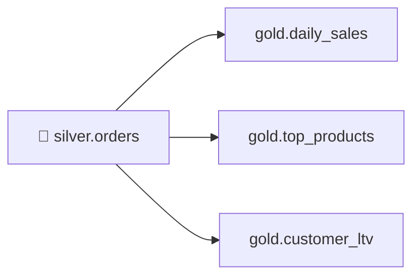

# 4.4 Spark SQL & aggregates (Gold)

## Concept
**Gold** holds business-ready aggregates — the tables a dashboard or analyst queries directly.
The beautiful part: **the SQL you learned in [Unit 2](../unit2/intro.md) works unchanged inside
Spark.** `spark.sql("…")` runs the exact same `GROUP BY`, joins, and window functions you wrote
for Trino — same `iceberg` catalog, same `silver.orders`, different engine.



You'll build three marts from `silver.orders`:

- **`gold.daily_sales`** — revenue and order counts per day.
- **`gold.top_products`** — best-selling products by revenue.
- **`gold.customer_ltv`** — lifetime value per customer.

### DataFrame API vs `spark.sql()`
Both compile to the same optimized plan — pick whichever reads clearer. For aggregation-heavy
Gold logic, SQL is usually the most readable, so we lean on `spark.sql()` and reuse Unit 2's skills.

### Partitioning on write
Gold tables always sliced by date benefit from **partitioning** the physical files by that column
so queries prune to just the periods they need. Iceberg does this with a *transform* like
`F.months("order_date")` — you keep the daily grain, but files are grouped by month.

## Lab
Assume the `spark` session and a populated `iceberg.silver.orders` from
[4.3](transform-silver.md). Recall we treat **`status = 'delivered'`** as a completed sale.

```python
from pyspark.sql import functions as F

spark.sql("CREATE SCHEMA IF NOT EXISTS iceberg.gold")

def write_gold(df, table, partition=None):
    w = df.writeTo(f"iceberg.gold.{table}").using("iceberg")
    if partition is not None:
        w = w.partitionedBy(partition)
    w.createOrReplace()
    print("wrote iceberg.gold." + table)
```

### gold.daily_sales — the same GROUP BY from Unit 2

```python
daily = spark.sql("""
    SELECT
        order_date,
        count(DISTINCT order_id)  AS orders,
        sum(line_amount)          AS revenue,
        sum(quantity)             AS units
    FROM iceberg.silver.orders
    WHERE status = 'delivered'
    GROUP BY order_date
    ORDER BY order_date
""")
write_gold(daily, "daily_sales", partition=F.months("order_date"))
```

### gold.top_products — ranked with a window function

```python
top = spark.sql("""
    WITH product_rev AS (
        SELECT
            product_id,
            product_name,
            category,
            sum(line_amount) AS revenue,
            sum(quantity)    AS units
        FROM iceberg.silver.orders
        WHERE status = 'delivered'
        GROUP BY product_id, product_name, category
    )
    SELECT *, rank() OVER (ORDER BY revenue DESC) AS revenue_rank
    FROM product_rev
""")
write_gold(top, "top_products")
```

### gold.customer_ltv — lifetime value per customer

```python
ltv = spark.sql("""
    SELECT
        customer_id,
        customer_name,
        country,
        count(DISTINCT order_id)  AS lifetime_orders,
        sum(line_amount)          AS lifetime_value,
        min(order_date)           AS first_order,
        max(order_date)           AS last_order
    FROM iceberg.silver.orders
    WHERE status = 'delivered'
    GROUP BY customer_id, customer_name, country
""")
write_gold(ltv, "customer_ltv")
```

Verify the marts — again, plain SQL over the lakehouse:

```python
spark.sql("SELECT * FROM iceberg.gold.daily_sales ORDER BY order_date DESC LIMIT 7").show()
spark.sql("SELECT * FROM iceberg.gold.top_products WHERE revenue_rank <= 10").show()
spark.sql("SELECT * FROM iceberg.gold.customer_ltv ORDER BY lifetime_value DESC LIMIT 10").show()
```

Because it's the shared `iceberg` catalog, the **same** `gold.*` tables are now readable from
**Trino** (Unit 2) as `iceberg.gold.*` — one write, two query engines.

## Challenge
Build **`gold.monthly_country_sales`**: revenue and distinct-customer count **per month per
country**, for delivered orders only, sorted by month then revenue. Use `spark.sql()` and
`date_format`.

??? note "Solution"
    ```python
    monthly = spark.sql("""
        SELECT
            date_format(order_date, 'yyyy-MM')  AS month,
            country,
            sum(line_amount)                    AS revenue,
            count(DISTINCT customer_id)         AS customers,
            count(DISTINCT order_id)            AS orders
        FROM iceberg.silver.orders
        WHERE status = 'delivered'
        GROUP BY date_format(order_date, 'yyyy-MM'), country
        ORDER BY month, revenue DESC
    """)
    write_gold(monthly, "monthly_country_sales")
    monthly.show()
    ```
    (Optional: partition it with `partition=F.col("month")` for cheap per-period reads.)

!!! tip "🎯 This runs unchanged on Azure, Databricks, Snowflake & Fabric"
    **What you just did:** used `spark.sql()` with `GROUP BY` and window functions to aggregate
    Silver into Gold marts, partitioned on write.

    - **Azure Databricks** — this exact `spark.sql()` ANSI SQL, window syntax, and partitioning
      run unchanged; you'd typically also serve Gold through a **SQL Warehouse**.
    - **Microsoft Fabric** — Fabric Spark notebooks run the same aggregates and store Gold tables
      in a Lakehouse on OneLake.
    - **Snowflake** — the same ANSI `GROUP BY`/window SQL runs natively (or via Snowpark); define
      these rollups as declarative **Dynamic Tables** that refresh automatically.
    - **Azure Data Factory** — a Mapping Data Flow with **Aggregate** + **Window** builds the same
      daily/product/customer rollups no-code.

    `spark.sql()` and this ANSI SQL are portable; Gold logic lifts straight to any platform.

## Key terms, at a glance
| Term | Plain meaning |
|---|---|
| **Gold** | Aggregated, business-ready marts for BI/ML |
| **Mart** | A focused Gold dataset for one team/subject |
| **`spark.sql()`** | Run SQL over the lakehouse catalog from Spark |
| **`partitionedBy(F.months(…))`** | Iceberg transform partitioning for pruned reads |
| **Window function** | Compute across related rows without collapsing (from [2.3](../unit2/window-functions.md)) |
| **Shared catalog** | Spark writes `iceberg.gold.*`; Trino reads the same tables |

## You can now…
- Reuse Unit 2 SQL inside Spark via `spark.sql()` over the lakehouse catalog
- Aggregate `silver.orders` into `daily_sales`, `top_products`, `customer_ltv`
- Partition Gold tables with Iceberg transforms for efficient, pruned queries
