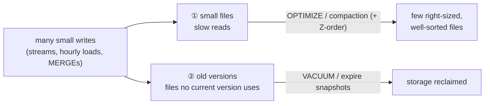

# 4.7 Table maintenance: OPTIMIZE, Z-order, VACUUM

## Concept
Lakehouse tables are **files plus a log of versions**. Every write adds new files and a new
version; nothing is ever edited in place. That gives you time travel and safe concurrent reads,
but over time two kinds of junk pile up:



1. **Small files.** Ten appends of 1,000 rows each produce at least ten files. Every query has to
   open each file and read its footer, so a table made of thousands of tiny files reads slowly
   even when it's small. ([4.8](performance.md) shows the same "small files problem" from the
   Spark side.)
2. **Old versions.** After an overwrite or a compaction, the old files are still on storage so
   time travel keeps working. If nobody cleans up, storage only ever grows.

**Table maintenance** is the routine that fixes both. Every lakehouse platform has it. The names
differ by table format:

| Job | Delta Lake | Apache Iceberg (Spark) | Iceberg (Trino) |
|---|---|---|---|
| compact small files | `OPTIMIZE t` | `CALL …system.rewrite_data_files(…)` | `ALTER TABLE t EXECUTE optimize` |
| co-locate related rows | `OPTIMIZE t ZORDER BY (a, b)` | `rewrite_data_files(…, strategy => 'sort', sort_order => 'zorder(a,b)')` | n/a |
| keep **new** writes sorted | n/a | `ALTER TABLE t WRITE ORDERED BY (a, b)` | n/a |
| delete old versions' files | `VACUUM t` | `CALL …system.expire_snapshots(…)` | `ALTER TABLE t EXECUTE expire_snapshots(…)` |
| delete files no version references | (part of `VACUUM`) | `CALL …system.remove_orphan_files(…)` | `ALTER TABLE t EXECUTE remove_orphan_files(…)` |
| see the versions | `DESCRIBE HISTORY t` | `SELECT * FROM t.snapshots` | `SELECT * FROM "t$snapshots"` |

Our governed tables are **Iceberg**, so start there. Delta follows.

## Part 1: Iceberg

### Make a table with a small-files problem
Simulate an hourly load: ten small appends into a sandbox copy of Silver.

```python
spark.sql("CREATE NAMESPACE IF NOT EXISTS iceberg.sandbox")
spark.sql("DROP TABLE IF EXISTS iceberg.sandbox.orders_maint PURGE")
spark.sql("CREATE TABLE iceberg.sandbox.orders_maint USING iceberg AS "
          "SELECT * FROM iceberg.silver.orders WHERE 1 = 0")

orders = spark.table("iceberg.silver.orders")
for hour in range(10):  # 10 "hourly" loads, each split into 4 files
    orders.where(f"order_id % 10 = {hour}").repartition(4) \
          .writeTo("iceberg.sandbox.orders_maint").append()
```

Iceberg exposes its own bookkeeping as **metadata tables**. Look at the files and versions
(snapshots):

```sql
%%sql
SELECT count(*) AS data_files, round(avg(file_size_in_bytes) / 1024) AS avg_kb
FROM iceberg.sandbox.orders_maint.files
```

```sql
%%sql
SELECT snapshot_id, committed_at, operation FROM iceberg.sandbox.orders_maint.snapshots
```

You should see about **40 small files** and one **snapshot per load**.

### Compact: `rewrite_data_files`
Rewrite the small files into a few right-sized ones. Readers are never blocked: the rewrite is just
a new snapshot.

```sql
%%sql
CALL iceberg.system.rewrite_data_files(table => 'sandbox.orders_maint')
```

Run the `.files` query again: **40 files → 1**. Same rows, far fewer files to open.

!!! info "Inside the CALL, the table name has no catalog"
    The procedure belongs to a catalog (`iceberg.system.…`), so the `table =>` argument is just
    `namespace.table`.

### Z-order: put related rows in the same files
Compaction fixes the **number** of files. Z-ordering fixes **what's in them**: rows with similar
values in the chosen columns end up in the same files. Each file records the min/max of every
column, so a filter like `country = 'UK' AND category = 'Books'` can **skip** whole files whose
ranges can't match.

```sql
%%sql
CALL iceberg.system.rewrite_data_files(
  table      => 'sandbox.orders_maint',
  strategy   => 'sort',
  sort_order => 'zorder(country, category)',
  options    => map('rewrite-all', 'true'))
```

Z-order balances **several** columns at once. To keep **future** writes sorted (no rewrite needed),
declare a write order on the table:

```sql
%%sql
ALTER TABLE iceberg.sandbox.orders_maint WRITE ORDERED BY (country, category)
```

```sql
%%sql
SHOW TBLPROPERTIES iceberg.sandbox.orders_maint ('sort-order')
```

### Clean up: `expire_snapshots` + `remove_orphan_files`
Time travel still works, because every old snapshot's files are still on storage. **Expiring**
snapshots gives up that history and deletes the files only they used:

```sql
%%sql
CALL iceberg.system.expire_snapshots(
  table       => 'sandbox.orders_maint',
  older_than  => current_timestamp(),
  retain_last => 1)
```

```sql
%%sql
SELECT count(*) AS snapshots FROM iceberg.sandbox.orders_maint.snapshots
```

One snapshot is left, and the row count is unchanged.

**Orphan files** are files that no snapshot references at all, e.g. leftovers from a job that
crashed mid-write. Do a dry run first:

```sql
%%sql
CALL iceberg.system.remove_orphan_files(
  table          => 'sandbox.orders_maint',
  dry_run        => true,
  prefix_listing => true)
```

!!! warning "Retention is a safety setting, not a formality"
    `older_than => current_timestamp()` deletes **all** history. That's fine for a demo, but in
    production a running query or a time-travel read may still need yesterday's files. Keep a
    window, e.g. 7 days: `older_than => current_timestamp() - INTERVAL 7 DAYS`.
    `remove_orphan_files` defaults to files older than **3 days** for the same reason: a file
    written seconds ago may belong to a commit that hasn't finished yet.
    (`prefix_listing => true` lists the files through Iceberg itself; it's required on our stack.)

### The same from Trino (and SQLPad)
Trino runs the same maintenance with `ALTER TABLE … EXECUTE` — in Trino your notebook's `iceberg` is
`<you>_lake` (replace `<you>` with your username):

```sql
ALTER TABLE <you>_lake.sandbox.orders_maint EXECUTE optimize;
ALTER TABLE <you>_lake.sandbox.orders_maint EXECUTE expire_snapshots(retention_threshold => '7d');
ALTER TABLE <you>_lake.sandbox.orders_maint EXECUTE remove_orphan_files(retention_threshold => '7d');
SELECT count(*) FROM <you>_lake.sandbox."orders_maint$files";
```

Trino **refuses** retention under 7 days by default. That's the same safety idea, enforced by
the server.

## Part 2: Delta Lake
Delta tables get the same treatment with shorter commands. Write a small-files Delta table to the
lake:

```python
import os
path = f"s3a://{os.environ['LAKE_BUCKET']}/delta/orders_maint"     # in your own bucket
orders = spark.table("iceberg.silver.orders")
for hour in range(10):
    orders.where(f"order_id % 10 = {hour}").repartition(4) \
          .write.format("delta").mode("overwrite" if hour == 0 else "append").save(path)
```

A Delta table is addressed by its path as `` delta.`<path>` ``. In `%%sql`, `${LAKE_BUCKET}`
stands for your bucket's name (`%%sql` fills in `${name}` from your notebook variables or the
environment):

```sql
%%sql
DESCRIBE DETAIL delta.`s3a://${LAKE_BUCKET}/delta/orders_maint`
```

`numFiles` should be about **40**. Compact, then Z-order:

```sql
%%sql
OPTIMIZE delta.`s3a://${LAKE_BUCKET}/delta/orders_maint`
```

```sql
%%sql
OPTIMIZE delta.`s3a://${LAKE_BUCKET}/delta/orders_maint` ZORDER BY (country, category)
```

Every operation is in the history (Delta's version of `.snapshots`):

```sql
%%sql
DESCRIBE HISTORY delta.`s3a://${LAKE_BUCKET}/delta/orders_maint`
```

### `VACUUM`
`VACUUM` deletes files that the current version no longer uses and that are older than the
retention period (**7 days** by default):

```sql
%%sql
VACUUM delta.`s3a://${LAKE_BUCKET}/delta/orders_maint`
```

Our files are only minutes old, so that deletes nothing. Delta also **refuses** a retention under
7 days, just like Trino. For this demo **only**, turn the check off, preview with `DRY RUN`, then
vacuum for real:

```python
spark.conf.set("spark.databricks.delta.retentionDurationCheck.enabled", "false")
```

```sql
%%sql
VACUUM delta.`s3a://${LAKE_BUCKET}/delta/orders_maint` RETAIN 0 HOURS DRY RUN
```

```sql
%%sql
VACUUM delta.`s3a://${LAKE_BUCKET}/delta/orders_maint` RETAIN 0 HOURS
```

Now try to time-travel to the first version:

```sql
%%sql
SELECT sum(line_amount) FROM delta.`s3a://${LAKE_BUCKET}/delta/orders_maint` VERSION AS OF 0
```

It **fails**: its files are gone. That's the trade VACUUM makes: **storage back, history
gone**. (A plain `count(*)` may still answer, because Delta reads it from the log's statistics
without opening any data files.)

## Clean up
```python
spark.sql("DROP TABLE iceberg.sandbox.orders_maint PURGE")
spark.conf.set("spark.databricks.delta.retentionDurationCheck.enabled", "true")
```
(The Delta files stay in your bucket under `delta/orders_maint/` — delete the folder in
**📁 My files** when you no longer need it; it counts toward your 100 MB.)

## How often?
| Task | Typical schedule |
|---|---|
| compaction (`OPTIMIZE` / `rewrite_data_files`) | after heavy write periods: daily, or hourly for streaming tables |
| Z-order | occasionally (weekly), on columns that dashboards filter by |
| `VACUUM` / `expire_snapshots` | daily or weekly, keeping a 7+ day window |
| `remove_orphan_files` | weekly or monthly |

Put them in an **Airflow** DAG after the loads ([Unit 5](../unit5/basics.md)), just as you would in
production.

!!! info "What about V-Order?"
    In Microsoft Fabric you'll also see **V-Order**: a Microsoft-only way of writing Parquet that
    makes Fabric's engines read faster. It isn't open source, so no other engine can write it.
    The open equivalent of its benefit (better compression, more files skipped) is what you just
    did: **compaction + sort/Z-order**.

## Key terms, at a glance
| Term | Plain meaning |
|---|---|
| **Small files problem** | too many tiny files → slow reads from per-file overhead |
| **Compaction** (`OPTIMIZE`, `rewrite_data_files`) | rewrite many small files into a few right-sized ones |
| **Z-order** | lay out rows so similar values of several columns share files → more files skipped |
| **Data skipping** | using each file's min/max statistics to avoid reading it |
| **Snapshot / version** | one committed state of the table (what time travel reads) |
| **Expire snapshots / VACUUM** | delete old versions' files → reclaim storage, lose that history |
| **Orphan file** | a file no snapshot references (e.g. from a crashed write) |
| **Retention** | how much history you keep; the guard against deleting files still in use |

## You can now…
- Explain **why** lakehouse tables need maintenance (small files + old versions)
- **Compact** and **Z-order** Iceberg tables (Spark + Trino) and Delta tables
- **Expire** old snapshots, **VACUUM** Delta, and clean up orphan files safely
- Read a table's files and history with `.files` / `.snapshots` / `DESCRIBE HISTORY`
- Choose sensible **retention** and a maintenance schedule

## 🎯 This runs unchanged on Azure, Databricks, Snowflake & Fabric
- **Databricks**: exactly these Delta commands (`OPTIMIZE`, `ZORDER BY`, `VACUUM`,
  `DESCRIBE HISTORY`), plus *predictive optimization* that can schedule them for you.
- **Microsoft Fabric**: Lakehouse tables are Delta, so the same `OPTIMIZE` / `VACUUM` work in
  notebooks, along with the **Maintenance** option on a table in the UI. V-Order is applied on top.
- **Snowflake**: storage is managed for you; for Iceberg tables the same compaction and snapshot
  expiry ideas apply.
- **AWS / Athena / EMR**: Iceberg tables use these same `rewrite_data_files` /
  `expire_snapshots` procedures.
