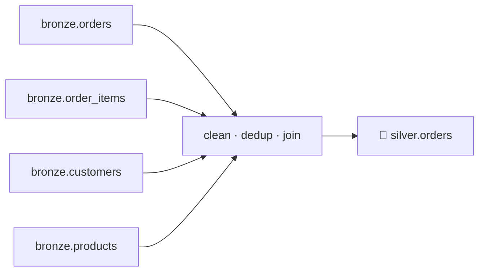
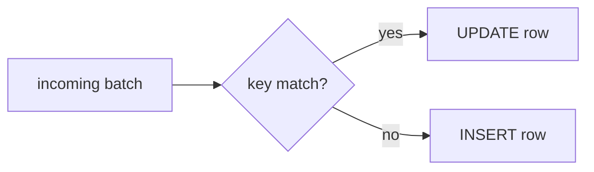

# 4.3 Transform to Silver

## Concept
**Silver** is the trusted, business-ready model: types are correct, duplicates are gone, nulls
are handled, and the source tables are **joined** into a coherent shape ([1.4](../unit1/medallion.md)).
For ShopFlow, Silver's centerpiece is `silver.orders` — **one row per order line**, enriched
with customer and product context.



### The four cleaning jobs
1. **Fix types** — derive a clean `order_date` from the `order_ts` timestamp; cast numerics.
2. **Drop duplicates** — the generator can re-send rows; dedup on the natural key.
3. **Handle nulls** — drop rows missing a key.
4. **Join** — combine `orders` + `order_items` + `customers` + `products`.

### MERGE — updates and late-arriving data
Real sources do more than append: **price changes** and **late-arriving orders** (a row for a
past day shows up today). A plain overwrite loses history; a plain append creates duplicates.
The lakehouse answer is **`MERGE`** (upsert) — the skill from [2.6](../unit2/merge.md), now
applied to build Silver.



## Lab
Assume the `spark` session and populated `iceberg.bronze.*` from [4.2](read-bronze.md).

```python
from pyspark.sql import functions as F

spark.sql("CREATE SCHEMA IF NOT EXISTS iceberg.silver")
```

### 1–3: clean types, nulls, duplicates
Remember the real schema (from the [schema page](../unit0/schema.md)): `orders` has `order_ts`
(a timestamp) and **no** amount — revenue comes from `order_items.quantity * unit_price`.

```python
orders = (
    spark.table("iceberg.bronze.orders")
    .withColumn("order_date", F.to_date("order_ts"))              # derive a clean date
    .filter(F.col("order_id").isNotNull() & F.col("customer_id").isNotNull())
    .dropDuplicates(["order_id"])                                 # dedup on key
)

items = (
    spark.table("iceberg.bronze.order_items")
    .withColumn("quantity", F.col("quantity").cast("int"))
    .withColumn("unit_price", F.col("unit_price").cast("decimal(12,2)"))
    .filter(F.col("order_id").isNotNull() & F.col("product_id").isNotNull())
    .dropDuplicates(["order_id", "product_id"])
)

customers = spark.table("iceberg.bronze.customers").dropDuplicates(["customer_id"])
products  = spark.table("iceberg.bronze.products").dropDuplicates(["product_id"])
```

### 4: join into one enriched order-line grain

```python
silver = (
    items.alias("i")
    .join(orders.alias("o"), "order_id", "inner")
    .join(customers.alias("c"), "customer_id", "left")
    .join(products.alias("p"), "product_id", "left")
    .select(
        F.col("o.order_id"),
        F.col("o.order_date"),
        F.col("o.customer_id"),
        F.col("c.full_name").alias("customer_name"),
        F.col("c.country"),
        F.col("o.channel"),
        F.col("i.product_id"),
        F.col("p.name").alias("product_name"),
        F.col("p.category"),
        F.col("i.quantity"),
        F.col("i.unit_price"),
        (F.col("i.quantity") * F.col("i.unit_price")).cast("decimal(12,2)").alias("line_amount"),
        F.col("o.status"),
    )
)
silver.show(5)
```

### Write Silver as an Iceberg table

```python
silver.writeTo("iceberg.silver.orders").using("iceberg").createOrReplace()
print("rows:", spark.table("iceberg.silver.orders").count())
```

### Apply updates & late arrivals with MERGE
When a batch of changes arrives, **upsert** it instead of rewriting. Here's a concrete example:
simulate a 10% price correction on two existing lines, register it as a temp view, and MERGE on
the grain key `(order_id, product_id)`:

```python
incoming = (
    silver.limit(2)
    .withColumn("unit_price", (F.col("unit_price") * 1.10).cast("decimal(12,2)"))
    .withColumn("line_amount", (F.col("quantity") * F.col("unit_price")).cast("decimal(12,2)"))
)
incoming.createOrReplaceTempView("incoming_orders")

spark.sql("""
MERGE INTO iceberg.silver.orders AS t
USING incoming_orders AS s
ON t.order_id = s.order_id AND t.product_id = s.product_id
WHEN MATCHED THEN UPDATE SET *
WHEN NOT MATCHED THEN INSERT *
""")
```

`WHEN MATCHED … UPDATE SET *` applies the price change to an existing line;
`WHEN NOT MATCHED … INSERT *` adds a late-arriving order line — one transactional statement, no
duplicates. (This is the incremental pattern; in Unit 5 Airflow runs it on a schedule.)

## Challenge
Add a **data-quality flag** to Silver: mark any order line where `quantity <= 0` or
`unit_price <= 0` as suspect, **keep it** (don't drop it), and count how many are flagged per
country. Rebuild `silver.orders` with the new `is_suspect` column.

??? note "Solution"
    ```python
    from pyspark.sql import functions as F

    silver_q = silver.withColumn(
        "is_suspect",
        (F.col("quantity") <= 0) | (F.col("unit_price") <= 0),
    )

    # report
    (silver_q.filter("is_suspect")
        .groupBy("country").count()
        .orderBy(F.desc("count")).show())

    # rewrite Silver with the new column (createOrReplace handles the schema change)
    silver_q.writeTo("iceberg.silver.orders").using("iceberg").createOrReplace()
    ```
    Keeping suspect rows with a flag (rather than dropping) preserves auditability — Gold can
    filter them out later. (Our seed is clean, so the count may be zero — the *pattern* is the point.)

!!! tip "🎯 This runs unchanged on Azure, Databricks, Snowflake & Fabric"
    **What you just did:** cleaned types, deduped, joined the four Bronze tables into Silver, then
    used `MERGE` to apply updates and late-arriving orders without duplicates.

    - **Azure Databricks** — this exact `.join`/`.dropDuplicates`/`.withColumn` chain and the
      `MERGE INTO` SQL run unchanged; `MERGE` is native (this *is* the Databricks Silver build).
    - **Microsoft Fabric** — Fabric Spark notebooks run the same cleaning code and `MERGE`
      against Lakehouse tables in OneLake.
    - **Snowflake** — the same casts, dedupe, and four-way join in SQL/Snowpark, and the identical
      `MERGE`; **Streams + Tasks** drive the incremental/late-arriving merges.
    - **Azure Data Factory** — a Mapping Data Flow does it no-code: Derived Column (casts), Join
      (four-way), and **Alter Row** for the upsert.

    Silver-as-cleaned-conformed-layer is a cross-platform convention, not a local quirk.

## Key terms, at a glance
| Term | Plain meaning |
|---|---|
| **Silver** | Cleaned, deduped, conformed, joined — the single source of truth |
| **Conform** | Reshape many sources into one shared model |
| **Grain** | What one row represents (here: one order *line*) |
| **`dropDuplicates`** | Remove repeated rows on a key |
| **`MERGE INTO`** | Upsert — update matches, insert new (from [2.6](../unit2/merge.md)) |
| **`UPDATE SET *` / `INSERT *`** | Apply all columns from the incoming batch |
| **Late-arriving data** | Records that show up out of order — MERGE handles them |

## You can now…
- Clean types, drop duplicates, and handle nulls with the DataFrame API
- Join the four Bronze tables into an enriched `silver.orders` at the order-line grain
- Use `MERGE` to apply updates and late-arriving records without duplicates
