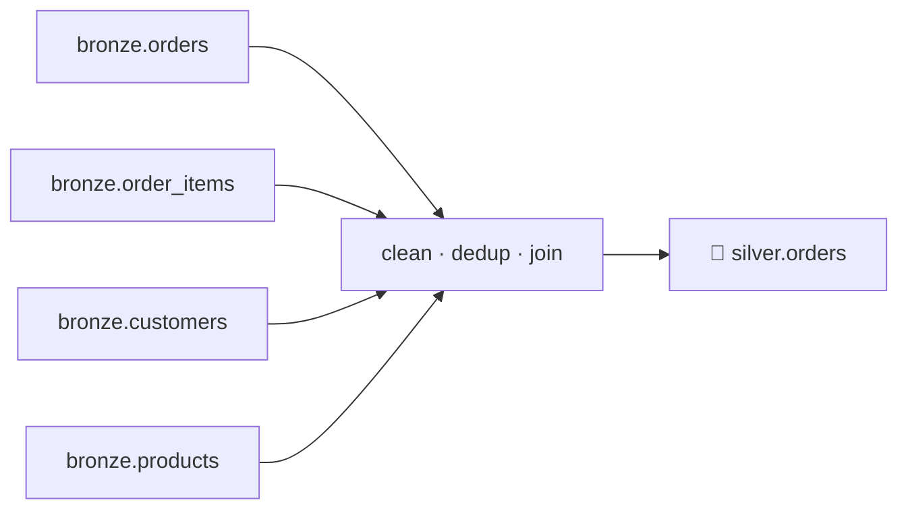
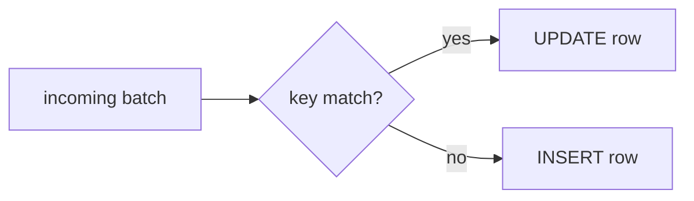

# 4.3 Transform to Silver

## Concept
**Silver** is the trusted, business-ready model: types are correct, duplicates are gone, nulls
are handled, and the source tables are **joined** into a coherent shape ([1.4](../unit1/medallion.md)).
For ShopFlow, Silver's centerpiece is `silver.orders` — **one row per order line**, enriched
with customer and product context.



Back in [1.4](../unit1/medallion.md) we defined Silver as **clean, typed, deduped, conformed,
and joined** — the *single source of truth* every downstream query trusts. Bronze was a faithful
copy of the raw feed (warts and all); Silver is where we actually fix it. This lesson does that
in four jobs, then writes the result as a governed Iceberg table.

### The four cleaning jobs
1. **Fix types** — derive a clean `order_date` from the `order_ts` timestamp; cast numerics.
2. **Drop duplicates** — the generator can re-send rows; dedup on the natural key.
3. **Handle nulls** — drop rows missing a key.
4. **Join** — combine `orders` + `order_items` + `customers` + `products`.

!!! info "What is the *grain* of Silver?"
    **Grain** = what one row represents. Here the answer is **one clean row per order *line***
    (one product on one order). Getting the grain right *before* you build Gold is the whole
    point of Silver: every metric later on — revenue by category, orders per country — is just a
    `GROUP BY` over these rows. Pick the wrong grain and every downstream number is wrong.

### MERGE — updates and late-arriving data
Real sources do more than append: **price changes** and **late-arriving orders** (a row for a
past day shows up today). A plain overwrite loses history; a plain append creates duplicates.
The lakehouse answer is **`MERGE`** (upsert) — the skill from [2.6](../unit2/merge.md), now
applied to build Silver.



## Lab
Assume the `spark` session and populated `iceberg.bronze.*` from [4.2](read-bronze.md).

```python
from pyspark.sql import functions as F

spark.sql("CREATE SCHEMA IF NOT EXISTS iceberg.silver")
```

**Read it step by step:**

- **`from pyspark.sql import functions as F`** — imports Spark's column-function library under
  the short alias `F`. Everything like `F.col(...)`, `F.to_date(...)`, `F.desc(...)` comes from
  here. Importing it as `F` is the universal PySpark convention.
- **`spark.sql("CREATE SCHEMA IF NOT EXISTS iceberg.silver")`** — makes the `silver` schema
  (namespace) inside the `iceberg` catalog if it doesn't already exist, so our tables have a home.
  `IF NOT EXISTS` makes the cell safe to re-run.

### 1–3: clean types, nulls, duplicates
Remember the real schema (from the [schema page](../unit0/schema.md)): `orders` has `order_ts`
(a timestamp) and **no** amount — revenue comes from `order_items.quantity * unit_price`.

```python
orders = (
    spark.table("iceberg.bronze.orders")
    .withColumn("order_date", F.to_date("order_ts"))              # derive a clean date
    .filter(F.col("order_id").isNotNull() & F.col("customer_id").isNotNull())
    .dropDuplicates(["order_id"])                                 # dedup on key
)

items = (
    spark.table("iceberg.bronze.order_items")
    .withColumn("quantity", F.col("quantity").cast("int"))
    .withColumn("unit_price", F.col("unit_price").cast("decimal(12,2)"))
    .filter(F.col("order_id").isNotNull() & F.col("product_id").isNotNull())
    .dropDuplicates(["order_id", "product_id"])
)

customers = spark.table("iceberg.bronze.customers").dropDuplicates(["customer_id"])
products  = spark.table("iceberg.bronze.products").dropDuplicates(["product_id"])
```

This one cell does cleaning jobs 1–3 on all four Bronze tables. Notice the shape: each table is
a chain of small transformations. Spark's DataFrame API is **lazy** — none of this reads data
yet; it just builds a recipe that runs when we finally `show`/`write`. Let's meet each function
on the way.

**Read it step by step — `orders`:**

- **`spark.table("iceberg.bronze.orders")`** — loads the Bronze `orders` table as a DataFrame
  (a table-shaped, distributed dataset) to transform.
- **`.withColumn("order_date", F.to_date("order_ts"))`** — **`withColumn`** adds (or replaces) a
  column. **`F.to_date`** strips the time-of-day off the `order_ts` *timestamp*, leaving a clean
  calendar `date`. This is cleaning job 1, *fix types*: downstream code should group by a real
  date, not slice a string.
- **`.filter(F.col("order_id").isNotNull() & F.col("customer_id").isNotNull())`** — **`filter`**
  (identical to `where`) keeps only rows that pass a condition. **`F.col("order_id")`** refers to
  a column *by name* so you can test it; **`.isNotNull()`** is true when the value is present.
  `&` means "and" (each side needs parentheses in PySpark). This is job 3, *handle nulls*: a row
  with no `order_id` or `customer_id` can't be joined or trusted, so we drop it here rather than
  fill it.
- **`.dropDuplicates(["order_id"])`** — **`dropDuplicates`** removes repeated rows, keeping one
  per distinct value of the listed key. The generator can re-send an order, so we collapse on the
  **natural key** `order_id`. This is job 2, *drop duplicates*.
- **Grain after this block:** one row per `order_id` (one clean order header).

**Read it step by step — `items`:**

- **`.withColumn("quantity", F.col("quantity").cast("int"))`** — **`cast`** converts a column's
  data type. Bronze may hold `quantity` as text; casting to `int` makes arithmetic reliable.
- **`.withColumn("unit_price", F.col("unit_price").cast("decimal(12,2)"))`** — casts price to a
  fixed-precision **`decimal`** (12 total digits, 2 after the point). Decimals avoid the rounding
  errors floating-point money is famous for. Together these two `cast`s are cleaning job 1 for
  items.
- **`.filter(...)`** — drop line items missing `order_id` or `product_id` (they'd have nothing to
  join to). Job 3 again.
- **`.dropDuplicates(["order_id", "product_id"])`** — dedup on the **composite** natural key: a
  line item is uniquely one product on one order, so both columns together are the key. Job 2.
- **Grain after this block:** one row per `(order_id, product_id)` — one clean order *line*.

**Read it step by step — `customers` and `products`:**

- Each is loaded and **`dropDuplicates`**'d on its own primary key (`customer_id`, `product_id`)
  so the upcoming join can't accidentally multiply rows by matching one line to two copies of the
  same customer or product. These are our clean **dimension** tables (the descriptive context).

### 4: join into one enriched order-line grain

Cleaning is done; now we **conform** — reshape the four separate tables into one coherent model.
A **`join`** matches rows across tables on a shared **key** column and glues them into wider rows.
We start from `items` (the finest grain, one row per line) and attach the order header, then the
customer, then the product. This is the same four-table stitch from [2.2](../unit2/joins-aggregations.md),
now in the DataFrame API instead of SQL.

```python
silver = (
    items.alias("i")
    .join(orders.alias("o"), "order_id", "inner")
    .join(customers.alias("c"), "customer_id", "left")
    .join(products.alias("p"), "product_id", "left")
    .select(
        F.col("o.order_id"),
        F.col("o.order_date"),
        F.col("o.customer_id"),
        F.col("c.full_name").alias("customer_name"),
        F.col("c.country"),
        F.col("o.channel"),
        F.col("i.product_id"),
        F.col("p.name").alias("product_name"),
        F.col("p.category"),
        F.col("i.quantity"),
        F.col("i.unit_price"),
        (F.col("i.quantity") * F.col("i.unit_price")).cast("decimal(12,2)").alias("line_amount"),
        F.col("o.status"),
    )
)
silver.show(5)
```

**Read it step by step:**

- **`items.alias("i")`** — **`alias`** gives a DataFrame a short nickname. Because several tables
  share column names (`order_id` is in both `orders` and `items`), the alias lets us say exactly
  which one we mean later, e.g. `F.col("o.order_id")`.
- **`.join(orders.alias("o"), "order_id", "inner")`** — join on the shared key `order_id`. Passing
  the key as a plain string means "the column named `order_id` on both sides"; Spark keeps just
  **one** merged `order_id` column (no duplicate). The third argument is the **join type**:
    - **`"inner"`** keeps a row only if the match succeeds on *both* sides. Here every valid line
      must belong to a real order, so inner is correct — an orphan line with no matching order is
      dropped.
    - **`"left"`** (used next) keeps *every* row from the left side even when the right has no
      match, filling the missing columns with `NULL`.
- **`.join(customers.alias("c"), "customer_id", "left")`** — a **left** join: keep every order
  line even if its customer somehow isn't in the `customers` table. We never want to silently lose
  a sale just because a dimension row is missing; the customer columns come back `NULL` instead.
- **`.join(products.alias("p"), "product_id", "left")`** — same reasoning for the product lookup.
- **`.select(...)`** — **`select`** chooses and orders the exact columns Silver should expose,
  pulling each from the right table via its alias (`o.`, `c.`, `i.`, `p.`). This is where we
  decide the final, tidy schema.
- **`F.col("c.full_name").alias("customer_name")`** — here **`.alias()` renames a column** in the
  output (`full_name` → `customer_name`). Renaming as we conform gives Silver clear, consistent
  business names.
- **`(F.col("i.quantity") * F.col("i.unit_price")).cast("decimal(12,2)").alias("line_amount")`** —
  a **derived column**: multiply quantity by price to get line revenue, cast to money-decimal, and
  name it `line_amount`. As the schema note above reminds us, `orders` carries *no* amount —
  revenue is *computed* here, once, so every consumer agrees.
- **`silver.show(5)`** — force the lazy recipe to actually run and print the first 5 rows to eyeball.
- **Grain of `silver`:** one enriched row **per order line** — exactly the Silver grain we set out
  to build.

!!! warning "Why dedup the dimensions *before* joining"
    A left join to `customers` fans out if `customers` has two rows for the same `customer_id` —
    one order line would become two. That's why we `dropDuplicates` on each dimension's key *first*.
    Clean the inputs, and the join can only preserve the line grain, never inflate it.

### Write Silver as an Iceberg table

Silver is only a *recipe* until we persist it. We now materialize it as a real, queryable Iceberg
table so Gold, Trino, and every other tool can read the single source of truth.

```python
silver.writeTo("iceberg.silver.orders").using("iceberg").createOrReplace()
print("rows:", spark.table("iceberg.silver.orders").count())
```

**Read it step by step:**

- **`silver.writeTo("iceberg.silver.orders")`** — **`writeTo`** is the DataFrameWriterV2 entry
  point that targets a catalog table by name (`catalog.schema.table`).
- **`.using("iceberg")`** — store it in the **Iceberg** table format (the governed lakehouse
  format that gives us schema tracking, snapshots, and `MERGE` support).
- **`.createOrReplace()`** — create the table, or fully replace it if it already exists. This is
  *idempotent*: re-running the whole notebook rebuilds `silver.orders` cleanly instead of erroring
  or appending duplicates.
- **`print("rows:", spark.table(...).count())`** — read the table back and count its rows to
  confirm the write landed.

### Apply updates & late arrivals with MERGE
When a batch of changes arrives, **upsert** it instead of rewriting. Here's a concrete example:
simulate a 10% price correction on two existing lines, register it as a temp view, and MERGE on
the grain key `(order_id, product_id)`:

```python
incoming = (
    silver.limit(2)
    .withColumn("unit_price", (F.col("unit_price") * 1.10).cast("decimal(12,2)"))
    .withColumn("line_amount", (F.col("quantity") * F.col("unit_price")).cast("decimal(12,2)"))
)
incoming.createOrReplaceTempView("incoming_orders")

spark.sql("""
MERGE INTO iceberg.silver.orders AS t
USING incoming_orders AS s
ON t.order_id = s.order_id AND t.product_id = s.product_id
WHEN MATCHED THEN UPDATE SET *
WHEN NOT MATCHED THEN INSERT *
""")
```

**Read it step by step:**

- **`silver.limit(2).withColumn("unit_price", (F.col("unit_price") * 1.10).cast(...))`** — take two
  existing lines and bump their price 10% to *simulate* a correction coming from the source. The
  second `withColumn` recomputes `line_amount` so the derived column stays consistent — the same
  fix-and-derive pattern as the main build.
- **`incoming.createOrReplaceTempView("incoming_orders")`** — register the small batch as a named
  temporary view so we can name it inside SQL. A temp view is a query-able alias that lives only in
  this Spark session; nothing is written to disk.
- **`MERGE INTO iceberg.silver.orders AS t USING incoming_orders AS s`** — **`MERGE`** (the upsert
  from [2.6](../unit2/merge.md)) compares a **target** table `t` against a **source** batch `s` and
  applies inserts/updates in *one* transaction.
- **`ON t.order_id = s.order_id AND t.product_id = s.product_id`** — match on the Silver **grain
  key** `(order_id, product_id)`. Matching on the exact grain is what guarantees one incoming line
  touches at most one existing line.
- **`WHEN MATCHED THEN UPDATE SET *`** / **`WHEN NOT MATCHED THEN INSERT *`** — see below.

`WHEN MATCHED … UPDATE SET *` applies the price change to an existing line;
`WHEN NOT MATCHED … INSERT *` adds a late-arriving order line — one transactional statement, no
duplicates. (This is the incremental pattern; in Unit 5 Airflow runs it on a schedule.)

## Challenge
Add a **data-quality flag** to Silver: mark any order line where `quantity <= 0` or
`unit_price <= 0` as suspect, **keep it** (don't drop it), and count how many are flagged per
country. Rebuild `silver.orders` with the new `is_suspect` column.

??? note "Solution"
    ```python
    from pyspark.sql import functions as F

    silver_q = silver.withColumn(
        "is_suspect",
        (F.col("quantity") <= 0) | (F.col("unit_price") <= 0),
    )

    # report
    (silver_q.filter("is_suspect")
        .groupBy("country").count()
        .orderBy(F.desc("count")).show())

    # rewrite Silver with the new column (createOrReplace handles the schema change)
    silver_q.writeTo("iceberg.silver.orders").using("iceberg").createOrReplace()
    ```
    **Read it step by step:**

    - **`silver.withColumn("is_suspect", (F.col("quantity") <= 0) | (F.col("unit_price") <= 0))`** —
      add a boolean column that is `True` when either value is non-positive (`|` = "or"). Note we
      *flag* rather than `filter`-drop, so nothing is lost.
    - **`silver_q.filter("is_suspect").groupBy("country").count().orderBy(F.desc("count")).show()`** —
      keep only flagged rows, count them per `country`, and sort worst-first (`F.desc`).
    - **`silver_q.writeTo(...).createOrReplace()`** — rewrite `silver.orders` with the new column;
      `createOrReplace` absorbs the schema change automatically.

    Keeping suspect rows with a flag (rather than dropping) preserves auditability — Gold can
    filter them out later. (Our seed is clean, so the count may be zero — the *pattern* is the point.)

!!! tip "🎯 This runs unchanged on Azure, Databricks, Snowflake & Fabric"
    **What you just did:** cleaned types, deduped, joined the four Bronze tables into Silver, then
    used `MERGE` to apply updates and late-arriving orders without duplicates.

    - **Azure Databricks** — this exact `.join`/`.dropDuplicates`/`.withColumn` chain and the
      `MERGE INTO` SQL run unchanged; `MERGE` is native (this *is* the Databricks Silver build).
    - **Microsoft Fabric** — Fabric Spark notebooks run the same cleaning code and `MERGE`
      against Lakehouse tables in OneLake.
    - **Snowflake** — the same casts, dedupe, and four-way join in SQL/Snowpark, and the identical
      `MERGE`; **Streams + Tasks** drive the incremental/late-arriving merges.
    - **Azure Data Factory** — a Mapping Data Flow does it no-code: Derived Column (casts), Join
      (four-way), and **Alter Row** for the upsert.

    Silver-as-cleaned-conformed-layer is a cross-platform convention, not a local quirk.

## Key terms, at a glance
| Term | Plain meaning |
|---|---|
| **Silver** | Cleaned, deduped, conformed, joined — the single source of truth |
| **Single source of truth** | The one trusted table everyone reads, so numbers can't disagree |
| **Conform** | Reshape many sources into one shared model |
| **Grain** | What one row represents (here: one order *line*) |
| **`withColumn`** | Add or replace a column on a DataFrame |
| **`F.col`** | Reference a column by name so you can test or transform it |
| **`cast`** | Convert a column's data type (text → `int`, `decimal(12,2)`, `date`…) |
| **`filter` / `where`** | Keep only rows that pass a condition (used here to drop null keys) |
| **`dropDuplicates`** | Remove repeated rows on a key (natural or composite) |
| **`alias`** | Nickname a DataFrame *or* rename an output column |
| **`join` (inner / left)** | Match rows on a key; inner keeps matches only, left keeps all left rows |
| **`select`** | Pick and order the exact output columns / final schema |
| **`writeTo` … `createOrReplace`** | Persist a DataFrame as an Iceberg table, idempotently |
| **`MERGE INTO`** | Upsert — update matches, insert new (from [2.6](../unit2/merge.md)) |
| **`UPDATE SET *` / `INSERT *`** | Apply all columns from the incoming batch |
| **Late-arriving data** | Records that show up out of order — MERGE handles them |

## You can now…
- Clean types, drop duplicates, and handle nulls with the DataFrame API
- Join the four Bronze tables into an enriched `silver.orders` at the order-line grain
- Use `MERGE` to apply updates and late-arriving records without duplicates
