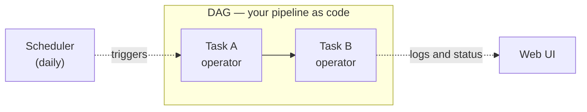
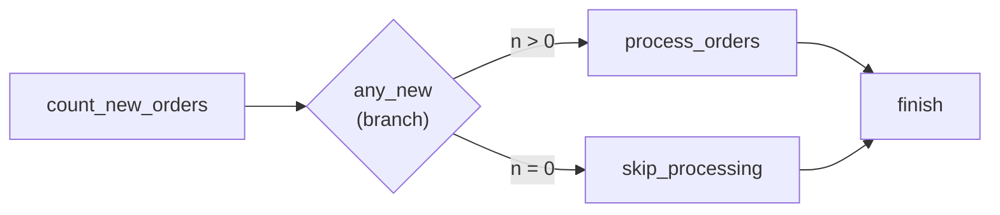

# 5.1 Airflow basics

## Concept
So far you've run each ShopFlow Spark job by hand: ingest Bronze, build Silver, build Gold
([Unit 4](../unit4/fundamentals.md)). That's fine for learning, but in production nobody sits at
a terminal at 6 a.m. to run three commands in the right order. **Orchestration** is the practice
of running data jobs *automatically*, in the *right order*, on a *schedule*, with *retries* when
things fail and *visibility* into what happened.

**Apache Airflow** is the most widely used open-source orchestrator. You describe your pipeline
**as code** and it runs it for you. The four problems it solves:

- **Dependencies** — Silver must not start until Bronze finished. Airflow enforces the order.
- **Retries** — a flaky Postgres connection shouldn't fail the whole night; Airflow retries a task.
- **Scheduling** — "run every day at 06:00" is one line, not a cron file you forget.
- **Observability** — a web UI shows every run, task, log, timing, and success/failure at a glance.

### What an orchestrator does
Back in [Unit 1.1](../unit1/what-is-de.md) we said a pipeline is just "steps that turn raw data into
useful data." An **orchestrator** is the thing that *runs those steps for you* so you don't have to
babysit them. Concretely it does four jobs:

- **Runs steps in the right order** — Bronze, then Silver, then Gold. You declare the order once;
  the orchestrator never runs Silver before Bronze finishes.
- **On a schedule** — "every day at 06:00", or "every hour", declared in one line. No human at a
  terminal, no crontab to hand-maintain.
- **With retries** — if a step fails on a transient hiccup (a dropped connection), the orchestrator
  can automatically try it again a few times before giving up and alerting you.
- **With backfills** — if the pipeline was down for three days, an orchestrator can *catch up* by
  running the missed days one by one. (We'll meet this as **catchup** below and use it for real in
  [5.3](schedule.md).)

Everything in this lesson is a concrete instance of one of those four jobs. Keep them in mind as
the vocabulary below gives each one a name.

### The vocabulary
Five words carry this whole lesson. Read them once here; you'll see each one appear in real code in
the Lab.

- **DAG** (Directed Acyclic Graph) — your pipeline. It's a set of **tasks** with a defined order.
  *Directed* = the arrows point one way (Bronze → Silver, never back). *Acyclic* = no loops, so the
  pipeline always finishes. In Airflow, **one Python file defines one (or more) DAGs** — the file
  *is* the pipeline.
- **Task** — a single unit of work, one box in the graph (e.g. "run the Bronze Spark job", or here,
  "echo a message").
- **Operator** — the *type* of a task, i.e. *what kind of work* it does. `BashOperator` runs a shell
  command, `PythonOperator` runs a Python function, `SparkSubmitOperator` submits a Spark job. You
  pick an operator, give it parameters, and that becomes a task.
- **Schedule** — how often the DAG runs (`@daily`, a cron string, or `None` for "manual only, I'll
  press the button myself").
- **DAG run** — **one execution of the whole DAG** — one pass through all its tasks for one point in
  time. Inside a run, each task becomes a **task instance** that succeeds or fails *independently*,
  so you can retry just the one that broke instead of rerunning everything.

!!! info "How the UI shows a run: colored squares"
    Airflow's **Grid** view is a table: **each DAG run is a column**, **each task is a row**, and
    every cell is a colored square showing that task instance's **state** — green = success, red =
    failed, yellow = running or retrying, grey = not started yet. One glance tells you which run,
    and which task inside it, went wrong. Click a square to jump to that task's **Logs**.



## In the lab: your DAGs live in Jupyter's `dags/` folder
You don't need to install anything to do the labs. Every DAG you write goes into the **`dags/`**
folder in Jupyter's file browser (your bucket's `files/src/dags/`); the lab's Airflow loads it
from there within about **30 seconds**. One Airflow is shared by the whole class, so one rule
keeps names apart: **every `dag_id` starts with your username and `_`** — `demouser_…` for the
default account. (A DAG that breaks the rule shows up under Airflow's **import errors** with the
name it expects.) In the Airflow UI you see **your own DAGs** (you can run, edit and delete them)
and the platform's DAGs (read-only) — other members' DAGs and runs stay private to them.
Your `dags/` folder already holds one example: `load_sample_orders.py`.

## Optional: Airflow on your own machine
The professional workflow is: **write a DAG, test it locally on your own machine, and only *then*
ship it** to the shared Airflow (in companies: push it to the Git repo the Airflow git-syncs). This
section sets up a Docker-free local Airflow so you never ship a broken DAG — handy, but **not
needed for the labs** (skip ahead to [the lab](#lab) if you like).

!!! danger "Match the stack's version — Airflow **3.3.2**"
    This stack runs **Airflow 3**, whose DAGs import `from airflow.sdk import DAG`. That module does
    **not exist in Airflow 2**, so a 2.x local install (e.g. `2.10.5`) can't even parse these DAGs.
    Always install the **same version as the deployment** — here, `3.3.2`.

=== "macOS / Linux"
    You just need **Python 3.10+** (`python3 --version`). Continue with the install below.

=== "Windows"
    Airflow is **not supported on native Windows** — run it inside **WSL 2** (Ubuntu). Open your WSL
    shell and follow the macOS/Linux steps there.

### 1. Install the matching version
In a clean virtualenv, pinned with Airflow's official *constraints* file (so providers resolve to
compatible versions):

```bash
python -m venv .airflow && source .airflow/bin/activate

AIRFLOW_VERSION=3.3.2
PY=$(python -c 'import sys; print(f"{sys.version_info.major}.{sys.version_info.minor}")')
pip install "apache-airflow==${AIRFLOW_VERSION}" apache-airflow-providers-standard \
  --constraint "https://raw.githubusercontent.com/apache/airflow/constraints-${AIRFLOW_VERSION}/constraints-${PY}.txt"

airflow version                          # → 3.3.2
python -c "import airflow.sdk; print('sdk OK')"
```

### 2. Point it at a local home + your DAGs
These are **environment variables — set them in every new shell** (they don't persist; a new shell
without `AIRFLOW_HOME` silently uses a *different, empty* database):

```bash
export AIRFLOW_HOME=~/airflow-local              # your own metadata DB + logs
export AIRFLOW__CORE__LOAD_EXAMPLES=False         # skip Airflow's bundled example DAGs (they error without extra deps)
airflow db migrate                                # one-time: build the local SQLite DB (no server)
export AIRFLOW__CORE__DAGS_FOLDER="$PWD/tmp"      # the folder holding the DAG(s) you're working on
airflow dags list                                 # your DAGs, no examples
```

!!! tip "Use a scratch folder while developing"
    Point `DAGS_FOLDER` at a throwaway folder (e.g. `tmp/`) for the DAG you're writing — that keeps
    your work-in-progress away from the shared Airflow until it passes. Once it's green, ship it.

### 3. Test the DAG — three levels
```bash
# 1) parse-check only — does it import? (nothing runs)
python tmp/my_dag.py

# 2) run ONE task — LIVE output on your console (reads the file directly, always fresh)
airflow tasks test <dag_id> <task_id> 2024-01-01

# 3) run the WHOLE DAG (respects task order)
airflow dags reserialize                 # FIRST: parse files -> serialize them into the DB
airflow dags test <dag_id> 2024-01-01    # quiet on success
echo $?                                   # 0 = the run succeeded
```

`<dag_id>` is the name inside the file (`DAG("my_first_dag", …)`), **not** the filename. Re-run
`airflow dags reserialize` after each edit before `airflow dags test`. The **`<date>` must be on or
after the DAG's `start_date`** — test with a date *before* `start_date` and Airflow runs **no tasks**
yet still reports the run "successful" (a common surprise — pick any date between `start_date` and today).

!!! tip "Why you might see *no* output"
    - **`airflow tasks test`** streams the task's output (your `echo`, `print`, etc.) to the console
      — as long as logging is at the default **INFO**. If you earlier ran
      `export AIRFLOW__LOGGING__LOGGING_LEVEL=WARNING`, it mutes that output — `unset` it to see results.
    - **`airflow dags test`** is *quiet by design*: it runs a real DAG run and writes task output to
      **log files**, not the console. Success = `echo $?` is `0`; inspect it with
      `airflow dags list-runs --dag-id <dag_id>` or read `~/airflow-local/logs/…`.

!!! note "Local = *authoring & testing*; the stack = *running the real jobs*"
    These commands **execute** the operators. Pure-Python / Bash tasks run offline, but tasks that
    reach services (Spark, or `postgres:5432` / `storage:9000` / `trino:8080`) need those
    services reachable — that's the running stack's job. So **validate the DAG's shape locally, run
    the heavy pipeline on the stack.** These same checks are what you put in **CI** to gate a DAG
    before it's merged and git-synced to a remote cluster.

??? bug "Common local-Airflow errors & fixes (the ones everyone hits)"
    | Symptom | Cause | Fix |
    |---|---|---|
    | `ModuleNotFoundError: airflow.sdk` / DAG won't parse | local Airflow is **v2** | install `apache-airflow==3.3.2` |
    | `Dag '<id>' could not be found in DagBag read from database` | `dags test` reads the **DB**; DAG not serialized | run `airflow dags reserialize` first |
    | Import tracebacks under `example_dags/` (kubernetes / pandas / s3) | Airflow's **bundled examples** need extra deps | `export AIRFLOW__CORE__LOAD_EXAMPLES=False` |
    | `No data found` / `no such table` from `dags list` | new/empty or unmigrated DB — usually `AIRFLOW_HOME` changed between shells | set `AIRFLOW_HOME` consistently, then `airflow db migrate` |
    | Ran, but **no output** on the console | `dags test` logs to files, or logging is muted | use `airflow tasks test`; `unset AIRFLOW__LOGGING__LOGGING_LEVEL`; check `echo $?` |
    | `dags test` says **success** but **no tasks ran** | the test **date is before the DAG's `start_date`** | use a date **≥ `start_date`** (and ≤ today) |
    | `WARNING - cannot record queued_duration …` | harmless metric note on a one-off test run | ignore |

### 4. Ship it
Once the DAG passes locally, deploy it:

- **In the lab:** save the file in Jupyter's **`dags/`** folder — Airflow loads it within ~30 s.
- **In a company:** **commit + push** to the Git repo the shared Airflow **git-syncs** — never edit
  files on the server directly.

## Lab

### 1. Open the Airflow UI
ShopFlow's Airflow is already running on your stack (see the
[architecture](../unit0/architecture.md)).

- Local: <http://localhost:8001> (sign in with your lab account)
- On k8s: <http://airflow.de.lan>

Take the tour:

- **DAGs** list — every pipeline, its schedule, and last run status. The toggle on the left
  enables/disables (pauses) scheduling.
- Click a DAG → **Graph** shows tasks and dependencies; **Grid** shows every run as a column and
  every task as a row (green = success, red = failed, yellow = running/retry).
- Click any task square → **Logs** to see exactly what happened.
- The **▶ Trigger** button runs a DAG on demand.

### 2. Write your first DAG
Open Jupyter (<http://localhost:8008>), and in the file browser open the **`dags/`** folder →
right-click → **New File** → name it `hello_shopflow.py`:

This one file is a complete pipeline. It's short on purpose — two trivial tasks that just print
text — so you can see the *shape* of every DAG without any real logic in the way. Read the whole
thing first, then we'll walk it line by line.

```python
from airflow.sdk import DAG                                    # Airflow 3.x
from airflow.providers.standard.operators.bash import BashOperator
import pendulum

with DAG(
    dag_id="demouser_hello_shopflow",     # own account? use your username instead of demouser
    description="First tiny DAG — two tasks in order",
    schedule=None,                    # manual only for now
    start_date=pendulum.datetime(2026, 1, 1, tz="UTC"),
    catchup=False,
    tags=["unit5", "demo"],
) as dag:

    say_hello = BashOperator(
        task_id="say_hello",
        bash_command="echo 'ShopFlow pipeline starting…'",
    )

    show_run = BashOperator(
        task_id="show_run",
        bash_command="echo 'Run id is {{ run_id }}'",
    )

    # define the dependency: say_hello must finish before show_run
    say_hello >> show_run
```

**Read it step by step:**

- **`from airflow.sdk import DAG`** — imports the `DAG` class. In **Airflow 3.x** this lives in
  `airflow.sdk` (older tutorials import `from airflow import DAG` — that's the 2.x style; use the
  `sdk` one here).
- **`from airflow.providers.standard.operators.bash import BashOperator`** — imports the operator
  we'll use. `BashOperator` is a task that runs a shell command. Operators ship in *provider*
  packages; the Bash one lives in the `standard` provider.
- **`import pendulum`** — a date/time library Airflow uses. We only need it to build a proper
  timezone-aware `start_date` below.
- **`with DAG(...) as dag:`** — this **defines the DAG**. The `with … as dag:` block is a Python
  context manager: every task you create *inside* the indented block automatically belongs to this
  DAG. The arguments configure the pipeline:
    - **`dag_id="demouser_hello_shopflow"`** — the DAG's unique name. This is exactly what you'll
      see in the DAGs list in the UI, so make it descriptive. It starts with **your username + `_`**
      because one Airflow serves the whole class.
    - **`description=...`** — a one-line summary shown next to the DAG in the UI.
    - **`schedule=None`** — how often to run automatically. `None` means **manual only** — it never
      runs on its own; you press ▶ Trigger. (In [5.3](schedule.md) you'll change this to a real
      daily schedule.)
    - **`start_date=pendulum.datetime(2026, 1, 1, tz="UTC")`** — the date the DAG becomes
      "eligible" to run. Every DAG needs one, even a manual one. It's the *earliest* logical date
      Airflow will consider — think of it as the pipeline's birthday, not "run now."
    - **`catchup=False`** — when you *do* have a schedule, `catchup` controls **backfilling**: if
      the `start_date` is in the past, should Airflow run *every* missed interval to catch up?
      `False` says "no, don't run history, just go forward from now." Leaving it `True` on a DAG with
      an old `start_date` is the classic beginner surprise — it fires off dozens of runs at once. We
      keep it `False` here.
    - **`tags=["unit5", "demo"]`** — labels for filtering the DAGs list. Purely cosmetic.
- **`say_hello = BashOperator(task_id="say_hello", bash_command="echo …")`** — creates the **first
  task**. `task_id` is the task's name (what you see as a box in the Graph and a row in the Grid);
  `bash_command` is the shell command it runs. Because this is written inside the `with DAG` block,
  the task is automatically attached to the DAG.
- **`show_run = BashOperator(...)`** — the **second task**, same pattern. Its command prints
  `{{ run_id }}` (explained just below).
- **`say_hello >> show_run`** — this is the whole point: **`>>` defines the dependency (the order)**.
  Read it as "`say_hello` **then** `show_run`" — Airflow will not start `show_run` until
  `say_hello` has succeeded. The arrow you'll see between the two boxes in the Graph view *is* this
  line.

!!! note "Nothing here 'runs' when you save the file"
    Saving `hello_shopflow.py` doesn't execute any echo. This file is a **definition** — it *builds
    the graph* (which tasks exist, in what order). The commands only run later, inside a **DAG run**,
    when the scheduler or your ▶ Trigger click actually executes each task. Defining the pipeline
    and running it are two separate moments.

`{{ run_id }}` is a **template** — Airflow fills it in at run time. Templating is how tasks become
run-aware.

!!! note "`{{ run_id }}` vs `{{ ds }}` — the business date"
    You'll often want the run's **business date**, written `{{ ds }}` (`YYYY-MM-DD`). But that only
    exists for **scheduled** runs — it comes from the run's *logical date*. A **manual** trigger in
    Airflow 3 has no logical date, so `{{ ds }}` would be undefined here; that's why this first DAG
    uses `{{ run_id }}`. You'll use `{{ ds }}` for the real daily pipeline in [5.3](schedule.md).

### 3. Run it
You wrote the *definition*; now trigger an actual **DAG run** and watch the task instances turn
green. Airflow rescans the dags folder every ~30s, so give it a moment after saving to appear. In
the UI:

1. Find **demouser_hello_shopflow** in the DAGs list (type `demouser` in the search box) and
   toggle it **on** (unpause).
2. Click **▶ Trigger**.
3. Open **Grid** → you should see two green squares. Click `show_run` → **Logs** and confirm it
   printed the run id.

Everything here — authoring, triggering, watching, reading logs — happens in the **browser**
(the Airflow UI, and JupyterLab for the file). You never open a shell inside a container.

!!! tip "Why tasks should be idempotent"
    Because an orchestrator **retries** failed tasks and can **backfill** past days, the same task
    may run more than once for the same date. A task is **idempotent** when running it twice gives
    the same result as running it once — e.g. "overwrite today's Silver partition" rather than
    "append rows" (which would double them). Idempotent tasks are what make retries and backfills
    *safe*. Our echo tasks are trivially idempotent; you'll design the real Spark jobs this way in
    [5.3](schedule.md).

### 4. Pass data between tasks (XCom)
Tasks often need a value from an earlier task — a row count, a file name, a date. Each task may
run on a different machine, so they can't share Python variables. Airflow passes small values
through **XCom** (*cross-communication*): a task **pushes** a value, Airflow stores it in its
database, and a later task **pulls** it.

The easiest way is the **TaskFlow** style: write tasks as plain Python functions. Create
`dags/xcom_demo.py`:

```python
from airflow.sdk import dag, task
from airflow.providers.standard.operators.bash import BashOperator
import pendulum


@dag(
    dag_id="demouser_xcom_demo",          # own account? use your username instead of demouser
    schedule=None,
    start_date=pendulum.datetime(2026, 1, 1, tz="UTC"),
    catchup=False,
    tags=["unit5"],
)
def xcom_demo():

    @task
    def extract():
        amounts = [120.50, 45.00, 1250.00, 80.00]          # pretend we read today's orders
        return {"rows": len(amounts), "total": sum(amounts)}

    @task
    def report(stats: dict):
        print(f"{stats['rows']} orders, total {stats['total']:.2f}")

    stats = extract()
    report(stats)

    bash_report = BashOperator(
        task_id="bash_report",
        bash_command="echo 'rows from XCom: {{ ti.xcom_pull(task_ids=\"extract\")[\"rows\"] }}'",
    )
    stats >> bash_report


xcom_demo()
```

**Read it step by step:**

- **`@dag(...)` above `def xcom_demo():`** — the **TaskFlow** way to define a DAG: the same
  arguments as `with DAG(...)`, written as a **decorator** (a `@…` line that adds behaviour to the
  function below it). The last line, **`xcom_demo()`**, calls the function once so Airflow registers
  the DAG — don't forget it.
- **`@task` above `def extract():`** — turns a Python function into a **task**; its `task_id` is the
  function name (`extract`).
- **`return {...}`** — whatever a `@task` function **returns** is **pushed to XCom** automatically.
  Here a small dict: `{"rows": 4, "total": 1495.5}`.
- **`stats = extract()`** — in the DAG body this doesn't run the function; it **wires** the task
  and gives you a handle to its future result.
- **`report(stats)`** — passing that handle as an argument does two things: `report` runs **after**
  `extract` (no `>>` needed), and at run time Airflow **pulls** the value from XCom and hands it in
  as `stats`.
- **`{{ ti.xcom_pull(task_ids="extract")["rows"] }}`** — the same value in a **template**, for
  classic operators like `BashOperator`: **`ti`** is the running *task instance*,
  **`xcom_pull(task_ids="extract")`** fetches what `extract` returned, and **`["rows"]`** picks one
  field. **`stats >> bash_report`** makes sure `extract` has finished first.

Trigger it. The logs show:

```
report       →  4 orders, total 1495.50
bash_report  →  rows from XCom: 4
```

In the Grid, click the `extract` square → **XCom** tab to see the stored value.

!!! warning "XCom is for small values — never for data"
    XCom lives in Airflow's own database. Pass **small** things: a count, a date, a **table name**,
    a **file path**. Never a DataFrame or thousands of rows. For real data, the first task
    **writes a table** (e.g. `iceberg.bronze.orders`) and returns its **name**; the next task reads
    the table.

### 5. Conditional flow (branching)
Sometimes the next step depends on the data: *new orders arrived → process them; nothing new →
skip*. A **branch** task decides at run time which task(s) run next; the others are **skipped**.
Create `dags/branch_demo.py`:

```python
from airflow.sdk import dag, task
import pendulum


@dag(
    dag_id="demouser_branch_demo",
    schedule=None,
    start_date=pendulum.datetime(2026, 1, 1, tz="UTC"),
    catchup=False,
    tags=["unit5"],
)
def branch_demo():

    @task
    def count_new_orders():
        return 0                      # pretend: no new orders today (try 25 later)

    @task.branch
    def any_new(n: int):
        if n > 0:
            return "process_orders"
        return "skip_processing"

    @task
    def process_orders():
        print("processing the new orders")

    @task
    def skip_processing():
        print("nothing new today")

    @task(trigger_rule="none_failed_min_one_success")
    def finish():
        print("pipeline finished")

    decision = any_new(count_new_orders())
    decision >> [process_orders(), skip_processing()] >> finish()


branch_demo()
```



**Read it step by step:**

- **`count_new_orders()`** returns `0` → pushed to XCom (step 4).
- **`@task.branch`** — a special task that **returns the `task_id`** of the path to follow.
  **`any_new(count_new_orders())`** feeds it the count; `0` → it returns `"skip_processing"`.
- **`decision >> [process_orders(), skip_processing()]`** — both tasks come after the branch (a
  **list** in `>>` means "all of these"). At run time only the one the branch named runs; the other
  is marked **skipped** (pink in the Grid).
- **`>> finish()`** — both paths join again in `finish`.
- **`trigger_rule="none_failed_min_one_success"`** — **when** `finish` may run. By default a task
  runs only when **all** tasks before it **succeeded** (`all_success`). One of them is always
  *skipped* here, so with the default `finish` would be **skipped too** — we tried it. This rule
  says: *run if nothing failed and at least one task before me succeeded*.

Trigger it. The task states:

```
count_new_orders  success
any_new           success    → Following branch {'skip_processing'}
process_orders    skipped
skip_processing   success    → nothing new today
finish            success    → pipeline finished
```

Change `return 0` to `return 25`, save, wait ~30 s and trigger again — now `process_orders` runs
and `skip_processing` is skipped.

!!! info "Trigger rules you'll meet"
    | `trigger_rule=` | The task runs when the tasks before it… |
    |---|---|
    | `all_success` (default) | all succeeded |
    | `none_failed_min_one_success` | none failed, at least one succeeded — the usual rule **after a branch** |
    | `all_done` | all finished, whatever the result — e.g. a clean-up task |
    | `one_failed` | at least one failed — e.g. send an alert |

!!! tip "Stop the rest of the pipeline: `@task.short_circuit`"
    A simpler kind of condition: **`@task.short_circuit`** returns `True` (carry on) or `False`
    (skip **everything** after it). Handy for *"nothing new today → stop here"* when there's no
    other path to take.

### 6. Other important concepts: retries, parameters, one task per item
Three things almost every real DAG uses. Create `dags/concepts_demo.py`:

```python
from airflow.sdk import dag, task, Param, get_current_context
import pendulum


@dag(
    dag_id="demouser_concepts_demo",
    schedule=None,
    start_date=pendulum.datetime(2026, 1, 1, tz="UTC"),
    catchup=False,
    default_args={"retries": 2, "retry_delay": pendulum.duration(seconds=10)},
    params={"country": Param("GB", type="string", enum=["GB", "US", "DE", "IN"])},
    tags=["unit5"],
)
def concepts_demo():

    @task
    def flaky_download():
        ti = get_current_context()["ti"]
        print(f"attempt {ti.try_number}")
        if ti.try_number < 2:
            raise ConnectionError("simulated network hiccup")
        print("downloaded")

    @task(execution_timeout=pendulum.duration(minutes=5))
    def show_country():
        params = get_current_context()["params"]
        print(f"building the report for {params['country']}")

    @task
    def load(table: str):
        print(f"loading {table}")

    flaky_download() >> show_country() >> load.expand(table=["customers", "orders", "products"])


concepts_demo()
```

**Retries — survive a hiccup**

- **`default_args={...}`** — settings applied to **every** task in the DAG.
- **`"retries": 2`** — if a task fails, try it again up to 2 more times;
  **`"retry_delay": pendulum.duration(seconds=10)`** — wait 10 seconds before each retry.
- **`get_current_context()["ti"]`** — inside a task, **`get_current_context()`** gives the run's
  details; **`["ti"]`** is the task instance, and **`ti.try_number`** is the attempt (1, 2, …).
- **`raise ConnectionError(...)`** — fail on purpose on attempt 1, to see a retry. In the Grid the
  square turns **yellow** (*up for retry*), then **green**. The log has both attempts:

    ```
    attempt 1   → ConnectionError: simulated network hiccup
    attempt 2   → downloaded
    ```

- **`execution_timeout=pendulum.duration(minutes=5)`** — **fail** the task if it runs longer than
  5 minutes, instead of hanging forever. Set it on anything that talks to another system.

**Parameters — choose values when you trigger**

- **`params={"country": Param("GB", type="string", enum=[...])}`** — a **run parameter** with a
  default (`GB`), a type, and the allowed values (**`enum`**).
- When you click **▶ Trigger**, Airflow shows a form with a **country** drop-down. Pick `US` →
  the task reads it with **`get_current_context()["params"]`** and logs
  `building the report for US`.

**One task per item — `expand` (dynamic task mapping)**

- **`load.expand(table=[...])`** — run the `load` task **once per item** in the list: three
  **mapped** tasks, `[0]`, `[1]`, `[2]`, running in parallel. The logs say `loading customers`,
  `loading orders`, `loading products`.
- The list can also come from an earlier task (via XCom) — e.g. *"one load task per file that
  arrived today"*, however many there are.

!!! info "More concepts, and where you'll meet them"
    | Concept | What it is | Where |
    |---|---|---|
    | **Schedule & backfill** | cron schedules, `{{ ds }}`, running missed days | [5.3](schedule.md) |
    | **Sensor** | a task that **waits** for something (a file, a table) | [8.2](../recipes/file-trigger.md) |
    | **Task groups** | fold related tasks into one box in the Graph (`@task_group`) | Airflow docs |
    | **Assets** | start a DAG when **another DAG updates a table**, instead of on a clock | Airflow docs |
    | **Callbacks** | run a function on failure — e.g. send a Slack/e-mail alert (`on_failure_callback`) | Airflow docs |

!!! note "Clean up"
    Delete `xcom_demo.py`, `branch_demo.py` and `concepts_demo.py` from `dags/` when you're done —
    Airflow stops loading them within about a minute.

## Challenge
Add a third task `count_tasks` that runs *after* `show_run` and prints how many tasks the DAG has.
Wire the order `say_hello >> show_run >> count_tasks`. You're doing two things: making a third
`BashOperator`, and extending the dependency chain so the new task runs last.

??? note "Solution"
    ```python
    count_tasks = BashOperator(
        task_id="count_tasks",
        bash_command="echo 'This DAG has {{ dag.task_ids | length }} tasks'",
    )

    say_hello >> show_run >> count_tasks
    ```
    **Read it step by step:**

    - **`count_tasks = BashOperator(...)`** — a third task, same pattern as before. Its
      `bash_command` is a template: **`{{ dag.task_ids | length }}`** is filled in at run time with
      the number of tasks in this DAG (3) — templates can read the DAG itself, not just dates.
    - **`say_hello >> show_run >> count_tasks`** — chaining `>>` reads left to right as
      "`say_hello`, **then** `show_run`, **then** `count_tasks`." This one line replaces the earlier
      two-task version and wires all three in order.

    Chaining with `>>` scales to any number of tasks — in the Graph view you'll now see three boxes
    connected left to right, and `count_tasks`' log says *This DAG has 3 tasks*.

!!! tip "🎯 The same orchestration on Azure, Databricks, Snowflake & Fabric"
    **What you just did:** described a pipeline as a DAG of tasks wired with `>>`, then triggered
    and inspected it in the Airflow UI.

    - **Azure Data Factory** — a DAG is a **Pipeline**; tasks are **activities**; your `>>` is a
      success arrow; `schedule=` is a **Schedule trigger**; Grid/Graph is **ADF Monitor**.
    - **Azure Databricks** — a **Workflow/Job**: multiple tasks with dependencies, schedules,
      retries, and alerts built in.
    - **Snowflake** — chain **Tasks** with `AFTER` predecessors to form a task graph (DAG).
    - **Microsoft Fabric** — **Data Factory in Fabric** pipelines: the same activity-and-dependency
      model.

    The *concepts* — DAG, task, dependency, schedule, retry — are identical everywhere, and
    **Airflow itself runs managed on all of them** (ADF Managed Airflow, Amazon MWAA, Google Cloud
    Composer), so *this exact DAG* ports almost unchanged.

## Key terms, at a glance
| Term | Plain meaning |
|---|---|
| **Orchestration** | Run jobs automatically, in order, on a schedule, with retries & backfills |
| **DAG** | Your pipeline as code — tasks with a defined order, no cycles |
| **Task / task instance** | A unit of work / one run of it inside a DAG run |
| **Operator** | The *type* of task — *what work it does* (`BashOperator`, `SparkSubmitOperator`, …) |
| **`BashOperator`** | An operator whose task runs a shell command (`bash_command=…`) |
| **`schedule`** | `@daily` / cron / `None` — how often the DAG runs |
| **`start_date`** | The earliest logical date the DAG is eligible to run from |
| **`catchup`** | Whether to backfill every missed interval since `start_date` (usually `False`) |
| **Dependency (`>>`)** | "then" — defines task order; `a >> b` runs `a` before `b` |
| **DAG run** | One execution of the whole DAG — one pass through all its tasks |
| **Idempotent** | Re-running the same task/run gives the same result (safe to retry & backfill) |
| **Template (`{{ … }}`)** | Value filled in at run time (`run_id`, `ds`, …) |
| **`@dag` / `@task`** | TaskFlow: a Python function becomes the DAG / a task |
| **XCom** | Small values passed from one task to the next (a `@task`'s `return` value) |
| **`@task.branch`** | Returns the `task_id` to run next; the other paths are skipped |
| **Trigger rule** | When a task may run, based on the tasks before it (`all_success`, `none_failed_min_one_success`, …) |
| **Retries / `retry_delay`** | Try a failed task again, after a pause |
| **`execution_timeout`** | Fail a task that runs too long |
| **Params** | Values you choose when you trigger a run (`Param`) |
| **`.expand()`** | Dynamic task mapping — one task per item in a list |

## You can now…
- Explain what an orchestrator does — order, schedule, retries, backfills — and the four problems
  Airflow solves
- Name the core Airflow objects: DAG, task, operator (`BashOperator`), schedule, DAG run
- Define a DAG with `dag_id`, `schedule`, `start_date`, and `catchup`, and wire task order with `>>`
- Write, trigger, and inspect a multi-task DAG in the Airflow UI, reading task states in the Grid
- Use templating (`{{ run_id }}`) and know when `{{ ds }}` applies
- Pass small values between tasks with **XCom** — and know to pass table names, not data
- Build a **conditional flow** with `@task.branch`, and join the paths with a **trigger rule**
- Add **retries**, a **timeout**, **run parameters** and **one task per item** (`expand`)
