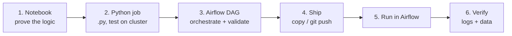

# 5.4 The development workflow: notebook → job → DAG

## Concept
How a data engineer actually **builds and ships** a pipeline. A pipeline is **two artifacts**, and
you develop and test them at **different levels**:

- the **job** — the *data logic* (a Spark transformation), and
- the **DAG** — the *orchestration* (order, schedule, retries).

Two rules that decide *where* you run things:

1. **Prove the logic before you orchestrate.** Get each job right on its own; only then wire it into a DAG.
2. **"Local" means the *stack*, not a bare venv.** A Spark job needs Spark + the cluster + the data,
   which live in the running stack. Your laptop's Python venv can only *author and parse-check* — it
   can't run `spark-submit`. And you **never edit code in the Airflow web portal**; code lives in files,
   in Git.



## The six steps

### 1 · Prototype the logic in a notebook
Open Jupyter ([http://localhost:8008](http://localhost:8008), token `123456`), connect to Spark
(Spark Connect), and write the transformation **interactively** — run a cell, see the result, adjust.
This is the fastest feedback loop for getting the *data logic* correct (it's exactly what you did in
[Unit 4](../unit4/read-bronze.md)):

```python
from pyspark.sql import SparkSession
spark = SparkSession.builder.getOrCreate()
# … read a source, transform, writeTo("iceberg.bronze.…"), verify with counts/samples …
```

### 2 · Package it as a `.py` job and test it **against the cluster**
Refactor the proven cells into a script with a `main()` + `argparse` and drop the scratch
(`printSchema`, exploratory counts). The result is a job like `code/shared/jobs/ingest_bronze.py` —
the same logic, packaged so `spark-submit` can run it. Now test the script **two ways**:

**a) Fast inner-loop — VS Code + Spark Connect** (develop from your editor, run on the cluster):

```bash
pip install "pyspark-client==4.0.0"          # once, in your project venv (match the cluster's Spark)
export SPARK_REMOTE=sc://localhost:15002      # the published Spark Connect port
python code/shared/jobs/ingest_bronze.py --catalog iceberg
```

Your laptop is a **thin client** — the Spark *driver* runs on the cluster, so `postgres:5432`,
`minio`, and the `iceberg` catalog all resolve **server-side**. You can even set breakpoints and
**debug** the job in VS Code while it runs remotely.

**b) Faithful check — `spark-submit`, exactly how Airflow will run it:**

```bash
docker compose exec airflow-scheduler spark-submit \
  --master spark://spark-master:7077 \
  --conf spark.sql.catalogImplementation=in-memory \
  --conf spark.cores.max=2 \
  /code/shared/jobs/ingest_bronze.py --catalog iceberg
```

!!! warning "Spark Connect ≠ `spark-submit` exactly"
    The `--conf` flags (`spark.cores.max`, `spark.sql.catalogImplementation`) are **`spark-submit`**
    options — they don't apply over Spark Connect, where the connect server's own config governs. So:
    **develop & debug fast with Spark Connect (a)**, then do **one final `spark-submit` run (b)** to
    confirm the job runs the way the scheduled task will.

Test the medallion jobs in dependency order — Silver reads Bronze, Gold reads Silver:

```bash
python code/shared/jobs/build_silver.py --catalog iceberg          # → SILVER_ROWS 100000
python code/shared/jobs/build_gold.py   --catalog iceberg --mart all # → GOLD_DAYS · TOP_PRODUCTS · CUSTOMER_LTV
```

### 3 · Wrap the jobs in a DAG and validate its structure locally
Write the DAG (a `BashOperator` per job that `spark-submit`s it, wired `bronze >> silver >> gold` —
see [5.2](medallion-dag.md)). Before shipping, **parse-check its structure** in your local Airflow
(installed per [the setup section](basics.md#set-up-airflow-on-your-machine) — the same version,
`3.0.1`):

```bash
export AIRFLOW__CORE__LOAD_EXAMPLES=False
export AIRFLOW__CORE__DAGS_FOLDER="$PWD/tmp"     # the folder with your DAG
airflow dags reserialize                          # parses the files; fails loudly on import errors
```

!!! note "The venv validates *structure*, not Spark tasks"
    This checks the DAG imports and the task graph. It **can't run** the `spark-submit` tasks (no
    Spark, no cluster in a bare venv) — that's expected. You're only proving the DAG is well-formed
    before it reaches Airflow.

### 4 · Ship the DAG to Airflow
Never edit in the portal — deploy the *file*:

- **Local (Compose):** copy it into the DAGs folder; the dag-processor picks it up in ~30–60s:
  ```bash
  cp tmp/shopflow_medallion.py local/code/airflow/dags/shopflow_medallion.py
  ```
- **Remote / production:** **`git push`** to the repo the remote Airflow **git-syncs** (see
  [5.1's remote note](basics.md)); git-sync pulls it in. Git is the single source of truth.

### 5 · Run it in Airflow
Open the UI at [http://localhost:8001](http://localhost:8001) (`airflow` / `airflow`):

1. Find **`shopflow_medallion`** → toggle it **on** (unpause).
2. Click **▶ Trigger**.
3. Watch the **Grid** — `bronze → silver → gold` turn green in order.

!!! tip "A triggered run uses *now* as its date"
    So it's after the DAG's `start_date` and the tasks actually run — unlike a CLI
    `airflow dags test <old-date>`, which runs no tasks if the date precedes `start_date`.

### 6 · Verify the results — in **two** places
**a) The Airflow task logs** (did the job run correctly?) — click a task → **Logs**:

```
wrote iceberg.bronze.orders
BRONZE_ROWS 40000
```

**b) The data itself** (did it land?) — query the output in Superset SQL Lab or the Trino CLI:

```sql
SELECT * FROM iceberg.gold.daily_sales ORDER BY order_date DESC LIMIT 5;
```

## Watch the job run on the Spark cluster
`spark-submit` jobs execute on the **standalone Spark cluster** — and you can watch them live in the
**Spark Master UI** at [http://localhost:8002](http://localhost:8002) (k8s: `spark.de.lan`):

- The header shows **`Spark Master at spark://spark-master:7077`** and the **Alive Workers**.
- Two tables: **Running Applications** and **Completed Applications**.
- While a DAG task runs, its job appears under **Running Applications** by its **`appName`** — you'll
  see **`shopflow_ingest_bronze`**, **`shopflow_build_silver`**, **`shopflow_build_gold`** — with the
  **cores** it's using (capped at 2 by `--conf spark.cores.max=2`), memory, duration, and state.
- **Click the application name** to open its **Application UI** — the **Jobs / Stages / SQL /
  Executors** tabs show exactly what Spark did (how the query ran, how many tasks, where time went).

!!! info "The always-present `Spark Connect server`"
    You'll also see a long-running **`Spark Connect server`** application in the list — that's the
    endpoint your **notebook** and **VS Code** (`SPARK_REMOTE`) connect through. Your interactive
    queries and Step-2(a) runs execute *under* that app, so they show there rather than as a new
    application each time.

!!! tip "If the cluster is out of cores, jobs sit in *WAITING*"
    The cluster is shared between notebooks (Spark Connect) and Airflow jobs. Each `spark-submit`
    passes `spark.cores.max=2` to leave room — if you still see an app stuck in **WAITING** on the
    master UI, another app is holding the cores; wait or free them.

!!! abstract "🎯 The same workflow on Databricks, Snowflake & Fabric"
    - **Databricks** — develop in a **Repo** (notebook or `.py`), run against a cluster with
      **Databricks Connect** (the direct analog of Spark Connect here), then schedule it as a
      **Workflow/Job**; watch it in the **Spark UI** on the cluster. Deploy via Git.
    - **Snowflake** — develop in Snowsight / Snowpark, run on a **Virtual Warehouse**, schedule with
      **Tasks**; inspect via **Query History / Query Profile**.
    - **Microsoft Fabric** — notebooks + Spark on OneLake, scheduled by **Data Factory pipelines**;
      the **Monitoring hub** is the run/logs view.

    Different tools, identical shape: **prove the logic → package → orchestrate → deploy via Git →
    run → verify in logs, data, and the engine UI.**

## Key terms, at a glance
| Term | Plain meaning |
|---|---|
| **Job vs DAG** | The data *logic* (a `.py`/notebook) vs the *orchestration* (the Airflow DAG) |
| **Spark Connect** | Thin-client protocol — run code from your laptop/IDE, driver executes on the cluster |
| **`spark-submit`** | Submit a `.py` job to the cluster (how the DAG runs each task) |
| **`SPARK_REMOTE`** | Env var pointing a client at the Connect server (`sc://localhost:15002`) |
| **Parse-check** | `airflow dags reserialize` — validate a DAG's structure without running tasks |
| **Ship** | Copy to the DAGs folder (Compose) / `git push` to the git-synced repo (remote) |
| **Spark Master UI** | `:8002` — cluster status + Running/Completed Applications by `appName` |
| **Application UI** | Per-app Jobs/Stages/SQL/Executors view (linked from the master UI) |

## You can now…
- Follow the full loop: **notebook → `.py` job → DAG → ship → run → verify**
- Test a `.py` job against the cluster two ways (Spark Connect from VS Code; `spark-submit` like Airflow)
- Validate a DAG's structure locally before shipping, and deploy it by copy (Compose) or `git push` (remote)
- Verify a run in **three** places: the Airflow task logs, the output data, and the **Spark Master UI**
