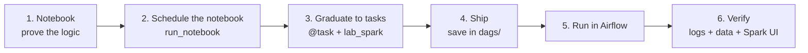

# 5.4 The development workflow: notebook → job → DAG

## Concept
How a data engineer actually **builds and ships** a pipeline. A pipeline is **two artifacts**, and
you develop and test them at **different levels**:

- the **job** — the *data logic* (a Spark transformation), and
- the **DAG** — the *orchestration* (order, schedule, retries).

Two rules decide *where* you work:

1. **Prove the logic before you orchestrate.** Get each step right interactively; only then wire it
   into a DAG.
2. **Code lives in files, never in the Airflow web portal.** You write notebooks and DAG files in
   Jupyter (your bucket); Airflow only *runs* them.


```mermaid
flowchart LR
  NB["1. Notebook<br/>prove the logic"] --> NBDAG["2. Schedule the notebook<br/>run_notebook"]
  NBDAG --> TASKS["3. Graduate to tasks<br/>@task + lab_spark"]
  TASKS --> SHIP["4. Ship<br/>save in dags/"]
  SHIP --> RUN["5. Run in Airflow"]
  RUN --> VERIFY["6. Verify<br/>logs + data + Spark UI"]
```

## The six steps

### 1 · Prototype the logic in a notebook
Open Jupyter ([http://localhost:8008](http://localhost:8008)) and write the transformation
**interactively** — run a cell, see the result, adjust. `spark` is already there, signed in as you
(`iceberg` = your lakehouse). This is the fastest feedback loop for getting the *data logic* right —
exactly what you did in [Unit 4](../unit4/read-bronze.md). Your `notebooks/` folder already has a
small, complete example: **`load_sample_orders.ipynb`** reads a CSV from your bucket and replaces
`bronze.sample_orders`. Open it and **Run All**.

### 2 · Schedule the notebook as it is
The quickest way to automate a working notebook is to run it from a DAG, unchanged. Your `dags/`
folder has one ready: **`load_sample_orders.py`**:

```python
from datetime import datetime

from airflow.sdk import dag, task


@dag(
    dag_id="demouser_load_sample_orders",   # must start with your username + "_"
    start_date=datetime(2026, 1, 1),
    schedule=None,                        # manual; try "@daily" to run it every day
    catchup=False,
    tags=["starter", "bronze"],
)
def load_sample_orders():

    @task
    def run_load_notebook():
        from lab_spark import run_notebook
        run_notebook("load_sample_orders.ipynb")

    run_load_notebook()


load_sample_orders()
```

**Read it step by step:**

- **`run_notebook("load_sample_orders.ipynb")`** — fetches the notebook from your `notebooks/`
  folder and runs its code cells **top to bottom**, the way Jupyter would: `spark` is a session
  signed in as you and `%%sql` works. If a cell fails, the task fails and its log names the cell.
- **One task** — the whole notebook is one box in the Graph. Fine for a small job; for a real
  pipeline you'll want one task per step (next).

Airflow runs the notebook **saved in your bucket**, so edit and save it in Jupyter, then trigger
the DAG again — the next run uses your latest version.

### 3 · Graduate the logic into tasks
When a pipeline has several steps (Bronze → Silver → Gold), give each step its own **`@task`** that
opens Spark with **`lab_spark()`** and does that step's work — exactly the
[5.2 medallion DAG](medallion-dag.md). Copy the proven cells from your notebook into the task
functions and drop the scratch (`show()`, exploratory counts). One task per layer makes failures
easy to pinpoint and lets you re-run just the broken step.

### 4 · Ship the DAG
Never edit in the portal — deploy the *file*: save it in Jupyter's **`dags/`** folder (your
bucket's `files/src/dags/`). Airflow picks it up within ~30 s. The `dag_id` must start with your
username + `_`; if it doesn't — or the file has an error — it shows up under **import errors** in
the Airflow UI.

!!! note "In a company: Git, not a folder"
    In a real team the DAGs folder is a **Git repository** that the shared Airflow **git-syncs**:
    you `git push`, review, merge — and the scheduler picks the change up. Same idea as your
    `dags/` folder, plus history and review.

### 5 · Run it in Airflow
Open the UI at [http://localhost:8001](http://localhost:8001) (sign in with your lab account):

1. Find **`demouser_load_sample_orders`** → toggle it **on** (unpause).
2. Click **▶ Trigger**.
3. Watch the **Grid** — the task turns green in about half a minute.

### 6 · Verify the results — in **three** places
**a) The Airflow task log** (did the job run correctly?) — click the task → **Logs**:

```
lab_spark: you are demouser · iceberg = demouser_lake · shared = polaris_lake
run_notebook: files/src/notebooks/load_sample_orders.ipynb — 4 code cells
1000 rows read from s3a://demouser-lake/files/source/shopflow/sample_orders.csv
bronze.sample_orders replaced
run_notebook: cell 4/4 ok
```

**b) The data itself** (did it land?) — every run replaces the table, so its history grows by one
snapshot per run:

```sql
%%sql
SELECT committed_at, operation FROM iceberg.bronze.sample_orders.snapshots ORDER BY committed_at DESC
```

**c) The Spark cluster** (how did it run?) — next section.

## Watch the job run on the Spark cluster
DAG tasks and notebooks run their Spark work on the lab's **standalone Spark cluster**, through one
long-running **Spark Connect server**. Watch it in the **Spark Master UI** at
[http://localhost:8002](http://localhost:8002) (k8s: `spark.de.lan`):

- The header shows **`Spark Master at spark://spark-master:7077`** and the **Alive Workers**.
- Under **Running Applications** you'll see **`Spark Connect server`** — every notebook and every
  `lab_spark()` task runs *inside* it, so they don't show up as separate applications.
- **Click `Spark Connect server`** to open its **Application UI** — the **Jobs / Stages / SQL /
  Executors** tabs show exactly what Spark did for each query (how many tasks, where the time went).
  While your DAG runs, its jobs appear at the top of **Jobs**.

!!! tip "If a query seems stuck"
    The cluster is shared by the whole class. If your job sits waiting, other work is holding the
    cores — it continues once they're free.

!!! abstract "🎯 The same workflow on Databricks, Snowflake & Fabric"
    - **Databricks** — develop in a **notebook**, then schedule it as a **Workflow/Job** (a notebook
      task is the direct analog of `run_notebook`); split it into tasks as it grows; watch it in
      the **Spark UI**. Deploy via Git (**Repos** / Asset Bundles).
    - **Snowflake** — develop in Snowsight / Snowpark notebooks, schedule with **Tasks**; inspect via
      **Query History / Query Profile**.
    - **Microsoft Fabric** — notebooks + Spark on OneLake, scheduled by **Data Factory pipelines**
      (Notebook activity); the **Monitoring hub** is the run/logs view.

    Different tools, identical shape: **prove the logic → schedule it → split into tasks → deploy
    via Git → run → verify in logs, data, and the engine UI.**

## Key terms, at a glance
| Term | Plain meaning |
|---|---|
| **Job vs DAG** | The data *logic* (a notebook / task code) vs the *orchestration* (the Airflow DAG) |
| **`run_notebook()`** | Run one of your notebooks from a DAG task, top to bottom, as you |
| **`lab_spark()`** | Open a Spark session on the cluster as you, inside a task |
| **Ship** | Save the DAG file in `dags/` (lab) / `git push` to the git-synced repo (company) |
| **Import errors** | Airflow's list of DAG files that failed to load — and why |
| **Spark Master UI** | `:8002` — cluster status, workers, and the running Spark Connect server |
| **Application UI** | Jobs / Stages / SQL / Executors for the Spark Connect server |

## You can now…
- Follow the full loop: **notebook → scheduled notebook → tasks → ship → run → verify**
- Schedule a notebook unchanged with `run_notebook`, and know when to split it into tasks
- Ship a DAG by saving it in `dags/`, and find the reason in **import errors** when it doesn't load
- Verify a run in **three** places: the task log, the output data, and the **Spark Master UI**
